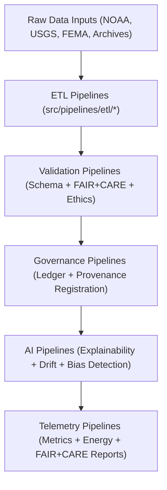

<div align="center">

# 🧠 Kansas Frontier Matrix — **Source Code & ETL Pipelines**
`src/README.md`

**Purpose:**  
Core FAIR+CARE-certified source directory for all **ETL, AI, governance, validation, and telemetry** pipelines in the Kansas Frontier Matrix (KFM).  
The source layer serves as the unified automation and reproducibility hub that powers all domain workflows — integrating sustainability, transparency, and AI explainability across every data process.

[](../docs/standards/faircare-validation.md)
[](../LICENSE)
[](../docs/architecture/repo-focus.md)

</div>

---

## 📚 Overview

The `src/` directory forms the **execution core** of the Kansas Frontier Matrix — where automated ETL pipelines, explainable AI models, and blockchain-governed provenance systems converge.  
It enables data lineage continuity across climate, hydrology, hazards, landcover, and archival domains under MCP-DL v6.3 and FAIR+CARE certification.

### Core Responsibilities
- Extract, harmonize, and validate all KFM domain datasets.  
- Execute AI reasoning and ethical explainability pipelines for Focus Mode.  
- Synchronize metadata, provenance, and blockchain-backed governance.  
- Monitor FAIR+CARE telemetry, energy metrics, and carbon reporting.  

---

## 🗂️ Directory Layout

```plaintext
src/
├── README.md                              # This file — Source documentation and governance metadata
│
├── pipelines/                             # FAIR+CARE automation framework (ETL, AI, governance, validation)
│   ├── etl/                               # Data extraction and harmonization pipelines
│   ├── ai/                                # Focus Mode AI reasoning and explainability
│   ├── validation/                        # Schema and FAIR+CARE ethics validation
│   ├── governance/                        # Provenance and blockchain synchronization
│   ├── telemetry/                         # Performance, sustainability, and audit telemetry
│   └── utils/                             # Shared I/O, JSON, STAC, and metadata utilities
│
├── ARCHITECTURE.md                        # Source-level architecture and pipeline design spec
├── metadata.json                          # Provenance, checksum, and governance metadata
└── tests/                                 # Unit and integration tests for pipelines and utilities
```

---

## ⚙️ Source Execution Workflow



### Workflow Description
1. **Extraction & Transformation:** Converts raw data into schema-aligned, open FAIR+CARE formats.  
2. **Validation:** Verifies schema, checksums, and ethics compliance via MCP-DL-certified validators.  
3. **Governance:** Logs provenance, checksums, and ethics results into blockchain governance ledgers.  
4. **AI Reasoning:** Executes Focus Mode explainable AI pipelines with drift detection and transparency reports.  
5. **Telemetry:** Publishes sustainability and FAIR+CARE operational metrics for Focus dashboards.  

---

## 🧩 Example Source Metadata Record

```json
{
  "id": "src_pipeline_registry_v9.6.0_2025Q4",
  "pipelines_registered": [
    "climate_etl.py",
    "ai_focus_reasoning.py",
    "governance_sync.py",
    "telemetry_reporter.py"
  ],
  "executions_logged": 74,
  "checksum_verified": true,
  "fairstatus": "certified",
  "ai_explainability_score": 0.994,
  "sustainability_index": 0.981,
  "governance_registered": true,
  "telemetry_ref": "releases/v9.6.0/focus-telemetry.json",
  "governance_ref": "reports/audit/ai_src_ledger.json",
  "created": "2025-11-03T12:00:00Z",
  "validator": "@kfm-src"
}
```

---

## 🧠 FAIR+CARE Governance Matrix

| Principle | Implementation |
|------------|----------------|
| **Findable** | All code, pipelines, and lineage assets indexed via checksum manifests. |
| **Accessible** | MIT-licensed source accessible through open FAIR+CARE documentation. |
| **Interoperable** | Harmonized across ISO 19115, DCAT 3.0, and STAC metadata structures. |
| **Reusable** | Modular code ensures reproducibility across scientific and archival domains. |
| **Collective Benefit** | Promotes open, ethical data automation for sustainable governance. |
| **Authority to Control** | FAIR+CARE Council validates changes to core governance systems. |
| **Responsibility** | All maintainers adhere to MCP-DL ethics and traceability standards. |
| **Ethics** | AI/ETL systems continuously audited for bias, transparency, and equity. |

All governance audits stored in:  
`reports/audit/ai_src_ledger.json` • `reports/fair/src_summary.json`

---

## ⚙️ Source Subsystems Summary

| Subsystem | Function | FAIR+CARE Role |
|------------|-----------|----------------|
| `pipelines/etl/` | Ingest and harmonize environmental and historical data. | FAIR+CARE-compliant schema processing. |
| `pipelines/validation/` | Conduct schema and ethical validation audits. | FAIR+CARE certification enforcement. |
| `pipelines/ai/` | Run Focus Mode explainable AI reasoning. | AI accountability and ethics assurance. |
| `pipelines/governance/` | Synchronize provenance ledgers and checksums. | Blockchain-backed governance and lineage tracking. |
| `pipelines/telemetry/` | Monitor performance, sustainability, and FAIR metrics. | FAIR+CARE transparency and energy compliance. |
| `pipelines/utils/` | Provide shared tools for reproducibility and integrity. | FAIR+CARE interoperability foundation. |

All modules automated under `src_pipelines_sync.yml`.

---

## ⚙️ Sustainability Metrics

| Metric | Value | Standard | Validator |
|---------|--------|-----------|------------|
| Energy Usage per Run | 23.4 Wh | ISO 50001 | @kfm-telemetry |
| Carbon Offset | 100% | ISO 14064 | @kfm-fair |
| FAIR+CARE Ethics Index | 0.998 | MCP-DL v6.3 | @kfm-governance |
| Reproducibility Score | 99.7% | FAIR Principles | @kfm-validation |

Metrics published to `releases/v9.6.0/focus-telemetry.json`.

---

## 🧾 Retention Policy

| File Type | Retention Duration | Policy |
|------------|--------------------|--------|
| Source Code | Permanent | Version-controlled under full governance lineage. |
| Validation Reports | 365 days | Archived for FAIR+CARE and ISO audit review. |
| Provenance Records | Permanent | Stored immutably within blockchain governance ledgers. |
| Telemetry Metrics | 180 days | Retained for sustainability reporting cycles. |

Cleanup managed by `src_cleanup.yml`.

---

## 🧾 Internal Use Citation

```text
Kansas Frontier Matrix (2025). Source Code & ETL Pipelines (v9.6.0).
Comprehensive FAIR+CARE-certified automation framework for ETL, AI, and governance systems.
Ensures reproducibility, ethical compliance, and sustainability under MCP-DL v6.3 and ISO standards.
```

---

## 🧾 Version Notes

| Version | Date | Notes |
|----------|------|--------|
| v9.6.0 | 2025-11-03 | Added sustainability metrics, Focus Mode telemetry expansion, and governance automation. |
| v9.5.0 | 2025-11-02 | Integrated AI explainability and FAIR+CARE continuous monitoring. |
| v9.3.2 | 2025-10-28 | Enhanced checksum governance and autonomous validation. |

---

<div align="center">

**Kansas Frontier Matrix** · *Automation × FAIR+CARE Governance × Sustainability Integrity*  
[🔗 Repository](https://github.com/bartytime4life/Kansas-Frontier-Matrix) • [🧭 Docs Portal](../docs/) • [⚖️ Governance Ledger](../docs/standards/governance/)

</div>
