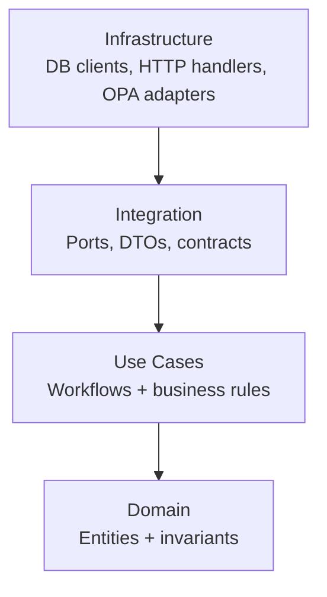
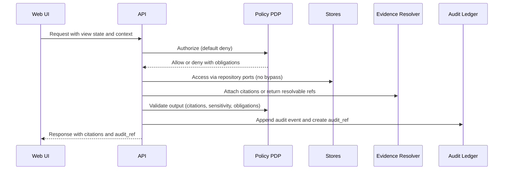
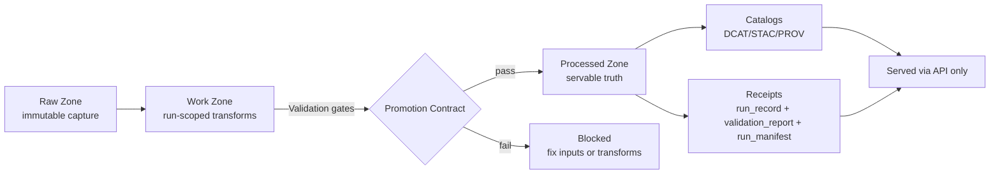
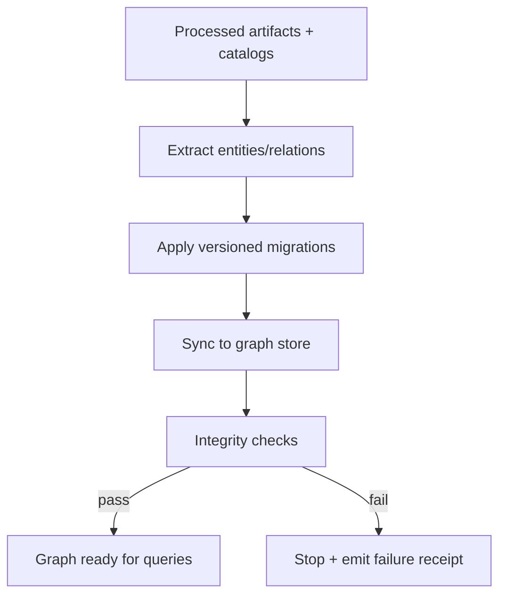

<!--
File: src/README.md
Purpose: Canonical “don’t leave anything out” README for all governed backend code under /src.
Governance: This README is a GOVERNED artifact. Treat changes as production changes because they can
alter trust guarantees, promotion gates, evidence behavior, and policy enforcement.
-->

<a id="top"></a>

# 🧭 KFM `src/` — Governed Backend: API, Pipelines, Knowledge Graph


`src/` is the canonical home for KFM’s governed server-side system:
- **Governed API** (data + evidence + Story Nodes + Focus Mode)
- **Data pipelines** (ingest → validate → promote → catalog → publish)
- **Knowledge graph** build/sync (derived from processed artifacts)
- **Shared governed libraries** (IDs, time model, provenance, receipts)

KFM’s credibility is not a vibe. It is enforced here—by **policy**, **validation gates**, **receipts**, and **auditable evidence resolution**.

> [!IMPORTANT]
> If you touch code in `src/` that weakens any invariant below, treat it as a **governance incident** until fixed.

---

## Quick navigation

- [Governance header](#governance-header)
- [Keywords and norms](#keywords-and-norms)
- [What `src/` is responsible for](#what-src-is-responsible-for)
- [Non-negotiables](#non-negotiables)
- [Repository context](#repository-context)
- [Canonical directory layout](#canonical-directory-layout)
- [Architecture contract](#architecture-contract)
- [Runtime flows](#runtime-flows)
- [Evidence, citations, receipts, and provenance](#evidence-citations-receipts-and-provenance)
- [Policy-as-code](#policy-as-code)
- [Testing strategy](#testing-strategy)
- [CI and governance gates](#ci-and-governance-gates)
- [Local development](#local-development)
- [Extension playbooks](#extension-playbooks)
- [Security and secrets](#security-and-secrets)
- [Operations and observability](#operations-and-observability)
- [Troubleshooting](#troubleshooting)
- [Glossary](#glossary)
- [Governed references](#governed-references)

---

## Governance header

| Field | Value |
|---|---|
| Document | `src/README.md` |
| Status | **Governed** |
| Scope | Backend trust membrane, policy enforcement, promotion gates, receipts/catalog emission, evidence & audit contracts |
| Version | `v3.0.0-draft` |
| Effective date | 2026-02-16 (America/Chicago) |
| Owners | `.github/CODEOWNERS` *(required; if missing → governance gap)* |
| Review triggers | Policy changes · Contract/schema changes · Promotion logic changes · Evidence/audit behavior changes · New stores/adapters |

> [!WARNING]
> **Fail-closed rule (always):** missing policy input / missing receipts / missing catalogs / missing citations must result in **deny or abstain**, not best-effort.

---

## Keywords and norms

This README uses RFC-style keywords:

- **MUST / MUST NOT**: non-negotiable governance requirements
- **SHOULD / SHOULD NOT**: strong defaults; exceptions require explicit rationale and tests
- **MAY**: optional or context-dependent behaviors

---

## What `src/` is responsible for

### The promise `src/` must keep

KFM’s backend is not “just an API.” It is a governed system that guarantees:

- **Trust membrane:** the UI and external clients never touch databases or object stores directly.
- **Fail-closed policy:** policy denial is the default; allow requires proof.
- **Evidence-first output:** any surfaced claim must resolve to evidence or the system abstains.
- **Auditability:** every governed path emits an `audit_ref` and stores the decision trace.
- **Promotion Contract:** only artifacts that pass gates can become “processed truth.”
- **Determinism:** specs/receipts have stable identities (`spec_hash`) to prevent “truth drift.”

### What belongs in `src/`

✅ **Belongs**
- Backend runtime (REST; optional GraphQL) including **contracts**, **policy middleware**, **evidence resolution**, and **audit hooks**
- Pipelines for acquisition, normalization, validation, promotion, catalog/provenance writing
- Graph build/sync logic and migrations
- Shared governed helpers used by server/pipelines/graph

❌ **Does not belong**
- UI code → `web/`
- Policy source (Rego/OPA bundles) → `policy/`
- Raw/work/processed data artifacts and catalogs → `data/`
- CI-only tooling (linters, validators not used at runtime) → `tools/` or `scripts/` (repo-dependent)
- Story Node content and narratives → `docs/**/story_nodes/**`

> [!TIP]
> If you’re about to add server logic outside `src/`, stop. `src/` is the canonical home for governed backend behavior.

---

## Non-negotiables

### System invariants enforced by `src/`

| Invariant | Meaning | Failure mode if violated | Primary enforcement surface |
|---|---|---|---|
| **No UI direct DB/object access** | Browser never connects to PostGIS/Neo4j/search/object store | bypass of policy + audit | network isolation + API-only exposure |
| **Default deny** | every governed request is authorized; missing inputs deny | silent data leaks | policy middleware + policy input schema validation |
| **Cite-or-abstain** | answers/narratives must include resolvable citations or abstain | hallucinated truth | response validator + policy output gate |
| **Processed-only truth** | the API serves only processed, cataloged artifacts | unverifiable “raw truth” | repository adapters + promotion gates |
| **Audit on hot path** | responses include `audit_ref`; audit ledger is append-only | no accountability | audit port/adapter + contract tests |
| **Promotion Contract gating** | raw→work→processed requires receipts + catalogs + checksums | untrusted artifacts promoted | pipeline promotion gate + CI |
| **Deterministic identity** | canonical spec hashing avoids drift (`spec_hash`) | same “spec” ≠ same hash | spec canonicalizer + receipt writer |
| **Evidence resolution** | returned citations must resolve via governed endpoints | broken trust UX | evidence resolver endpoints + link checks |

> [!CAUTION]
> A “temporary bypass” is still a bypass. If you need a bypass to debug, implement a **local-only dev flag** that cannot ship (CI-enforced).

---

## Repository context

KFM is organized so each plane has a canonical home:

```text
repo/
├─ data/        # raw/work/processed + catalogs + checksums + receipts
├─ docs/        # governed docs + templates + Story Nodes
├─ src/         # (you are here) server + pipelines + graph + shared
├─ web/         # UI (trust membrane: no direct DB access)
├─ policy/      # OPA/Rego policies (default deny)
├─ tools/       # validators & CI gates (verification tooling)
├─ scripts/     # orchestration glue (thin runners; fail-closed)
└─ .github/     # CI workflows enforcing governance gates
```

> [!NOTE]
> Exact folder names may evolve, but **ownership planes + canonical homes MUST remain stable**.

---

## Canonical directory layout

`src/` is split into four subsystems. This is the **one source of truth** for backend code placement.

```text
src/
├─ server/                       # governed API gateway + evidence/audit behavior
│  ├─ contracts/                 # OpenAPI + JSON Schemas (+ optional GraphQL SDL)
│  ├─ domain/                    # pure entities/value objects + invariants (no IO)
│  ├─ usecases/                  # workflows + business rules (ports only)
│  ├─ integration/               # ports/contracts + DTOs + schema-bound models
│  ├─ infrastructure/            # DB/HTTP/OPA adapters, repo implementations
│  ├─ tests/                     # unit/usecase/contract/integration tests
│  └─ README.md
│
├─ pipelines/                    # ingestion/validation/promotion/catalogs/receipts
│  ├─ connectors/                # per-source connectors (discover/acquire)
│  ├─ transforms/                # normalize/enrich/export steps (deterministic)
│  ├─ validation/                # schema/geo/time/license/policy gates
│  ├─ promotion/                 # Raw→Work→Processed promotion gate + publish logic
│  ├─ catalogs/                  # DCAT/STAC/PROV writers + link-check
│  ├─ receipts/                  # run_record/run_manifest emitters + spec hashing
│  ├─ registry/                  # dataset registry readers/helpers (if mirrored here)
│  ├─ tests/
│  └─ README.md
│
├─ graph/                        # graph build/sync/migrations (derived from processed artifacts)
│  ├─ ontology/
│  ├─ migrations/
│  ├─ sync/
│  ├─ tests/
│  └─ README.md
│
└─ shared/                       # cross-cutting governed helpers (keep small & stable)
   ├─ ids/                       # deterministic ids, hashing, stable identifiers
   ├─ time/                      # time model helpers (intervals, uncertainty)
   ├─ provenance/                # PROV helpers, evidence ref helpers, bundle helpers
   ├─ policy/                    # shared policy input/output models
   └─ README.md
```

### No duplicates rule (hard)

- API behavior lives in `src/server/` only (no parallel `src/api/`).
- ETL/promotion logic lives in `src/pipelines/` (not scattered across `tools/`).
- Graph schema changes are versioned in `src/graph/migrations/` (no hot patches).
- Shared helpers remain **minimal** (if it grows, split into subsystem-local libs).

---

## Architecture contract

KFM uses clean architecture + a strict trust membrane. Dependencies point inward.

### Clean layers (dependency rules)



Allowed dependencies:

| Layer | MAY import | MUST NOT import |
|---|---|---|
| Domain | Domain only | usecases/integration/infrastructure/frameworks |
| Usecases | Domain + Integration ports | DB/HTTP/OPA clients |
| Integration | Domain (when needed) | infrastructure implementations |
| Infrastructure | all above | (no business logic leakage; respect ports) |

### Trust membrane rule (non-negotiable)

Frontend and external clients **never** access databases or object stores directly. All access goes through:
1) **API** (governed contracts + validation), and  
2) **Policy boundary** (default deny), and  
3) **Evidence + audit** mechanisms.

---

## Runtime flows

### 1) Governed request (data/story/ai)



### 2) Pipeline promotion (raw → work → processed)



**Rule:** If the Promotion Contract can’t prove promotability, promotion MUST fail.

### 3) Graph build/sync (derived only)



---

## Evidence, citations, receipts, and provenance

### Evidence is first-class (not an afterthought)

KFM treats provenance as queryable data. Every user-visible claim should be traceable to:
- a **processed artifact**
- a **catalog entry** (DCAT/STAC) and **lineage** (PROV)
- a **receipt** (run_record/run_manifest) and **checksums**
- an **audit event** (`audit_ref`) tying the request to the served evidence

### Citation contract (minimum)

A citation is a resolvable reference—not a freeform string.

**Minimum fields (illustrative):**
```json
{
  "ref": "stac://kfm/catalog/collections/landsat/items/LC08_...#asset=visual",
  "label": "Landsat 8 scene (visual)",
  "locator": {
    "page": 3,
    "bbox": [-100.2, 38.6, -99.9, 38.8],
    "time": "1936-01-01/1936-12-31"
  },
  "confidence": "high"
}
```

### Evidence resolution requirement

Every `citation.ref` returned by the API **MUST** be resolvable through governed endpoints for supported schemes.

Recommended supported schemes (expand as needed):
- `prov://` — provenance bundles/entities
- `stac://` — STAC catalog objects
- `dcat://` — DCAT datasets/distributions
- `doc://` — governed documents & Story Nodes
- `graph://` — graph entities/paths (with provenance links)
- `oci://` — optional immutable bundles in OCI artifact stores

> [!IMPORTANT]
> If a citation cannot be resolved, the response is invalid and MUST be rejected (deny/abstain).

### Receipts (Promotion Contract proofs)

Pipelines MUST emit, at minimum:

- `run_record.json` — inputs/outputs, environment, code identity, refs
- `validation_report.json` — pass/fail for each gate with details
- `run_manifest.json` — promotion receipt; merge/publish blocker
- `checksums.*` — cryptographic digests for artifacts and catalogs

### Deterministic spec identity (`spec_hash`)

To prevent “same spec, different hash” drift:
- specs MUST be canonicalized deterministically (e.g., JSON canonicalization)
- hashes MUST be stable across environments
- receipts MUST include both spec and spec hash

---

## Policy-as-code

### Fail-closed expectations

- Default deny
- Enforce role-based access + sensitivity rules
- Enforce output obligations (redaction/generalization)
- Enforce cite-or-abstain for Focus Mode and Story Nodes
- Enforce evidence resolution (no “dangling citations”)

### Obligations pattern (recommended)

Policy decisions SHOULD return:
- allow/deny
- obligations (what the response MUST do)
- redaction directives (fields/geometries/time precision)
- audit metadata requirements

> [!NOTE]
> Treat obligations as part of the contract: ignoring them is a governance bug.

---

## Testing strategy

Minimum bar for changes under `src/`: **unit + usecase + contract + integration**.

| Area | Test type | Proves |
|---|---|---|
| Domain | unit tests | invariants hold without IO |
| Usecases | unit/usecase tests with mocked ports | business logic is correct and portable |
| Contracts | schema/contract tests | requests/responses are stable and validated |
| Infrastructure | integration tests | DB/OPA/audit wiring works; no bypass paths |
| Pipelines | validation + golden tests | promotion gates fail correctly; receipts/catalogs are correct |
| Evidence | resolver tests | citations resolve; broken links fail closed |

> [!TIP]
> Tests are part of governance. A missing negative test is a future leak.

---

## CI and governance gates

Any PR touching `src/` SHOULD be merge-blocked on:

- ✅ unit tests (domain + usecases)
- ✅ contract/schema validation (OpenAPI + JSON Schemas)
- ✅ policy regression suite (default deny, redactions, cite-or-abstain)
- ✅ pipeline validation (catalog/prov validity; receipts present)
- ✅ architecture lint (no forbidden imports; no layer violations)
- ✅ supply-chain hygiene (pinned actions; dependency scanning; secret scanning)
- ✅ integration smoke tests (DB + policy engine reachable)
- ✅ documentation lint/link-check when governed docs are touched (e.g., `src/README.md`)

> [!WARNING]
> If you can’t explain how your change preserves **fail-closed** and **cite-or-abstain**, you’re not done.

---

## Local development

The canonical local dev target is a containerized stack (e.g., Compose) that includes:
- API service
- UI (optional, for end-to-end testing)
- PostGIS
- Graph store (e.g., Neo4j)
- Policy PDP (OPA)
- Search/index service (optional)

Minimum workflow (illustrative):

1. `cp .env.example .env`  
2. `docker compose up --build`  
3. Verify:
   - API docs: `http://localhost:8000/docs`
   - UI: `http://localhost:3000`

> [!NOTE]
> If the repo does not provide a runnable compose baseline yet, treat that as a **P0 gap** and prioritize it.

---

## Extension playbooks

<details>
<summary><strong>Playbook A — Add a new dataset connector (pipelines)</strong></summary>

### Definition of Done

- [ ] Connector implemented + registered (registry-driven)
- [ ] Raw capture is immutable; filenames are deterministic
- [ ] Checksums computed and verified
- [ ] Normalization produces canonical schema (and STAC assets when spatial)
- [ ] Validation gates pass (schema/geo/time/license/sensitivity/policy labels)
- [ ] Receipts emitted (`run_record`, `validation_report`, `run_manifest`)
- [ ] Catalogs emitted (DCAT always; STAC conditional; PROV required)
- [ ] Link-check clean (no broken catalog/prov refs)
- [ ] Promotion gate enforces fail-closed (missing proof = blocked)
- [ ] Representative API contract test passes
- [ ] Backfill/refresh cadence documented + tested (at least a dry-run)

</details>

<details>
<summary><strong>Playbook B — Add/change an API endpoint (server)</strong></summary>

### Checklist

- [ ] Update contract in `src/server/contracts/` (OpenAPI/Schema-first)
- [ ] Validate request/response against schemas at runtime
- [ ] Implement port-driven use case (no direct DB calls)
- [ ] Implement infrastructure adapter behind ports
- [ ] Add/adjust policy rules + regression tests (default deny)
- [ ] Ensure response includes citations (or abstains) + `audit_ref`
- [ ] Add contract tests + integration tests
- [ ] Add observability hooks (metrics/traces) without leaking sensitive payloads

</details>

<details>
<summary><strong>Playbook C — Change graph schema (graph)</strong></summary>

### Checklist

- [ ] Create versioned migration in `src/graph/migrations/`
- [ ] Update ontology mappings and constraints
- [ ] Provide a rollback strategy (when feasible)
- [ ] Add integrity checks (no orphan nodes, required relationships)
- [ ] Validate in CI with a smoke dataset and receipts

</details>

---

## Security and secrets

### Repository + CI security expectations

- Branch protection + required reviews for governed paths
- Least privilege for CI tokens (read-only by default; elevate only per job)
- Secret scanning enabled; rotate immediately if leaked
- Pin third-party CI actions to commit SHAs (supply-chain hardening)
- Avoid dangerous CI triggers for untrusted code (e.g., treat `pull_request_target` with caution)

### Runtime security expectations

- Never log secrets or sensitive payloads
- Apply rate limits and abuse controls at the API boundary
- Treat all Focus Mode and “server action” inputs as untrusted; validate and authorize
- Redaction/generalization is a first-class transformation (not a UI concern)

---

## Operations and observability

Recommended signals to emit from `src/`:

- **Audit events**: append-only, queryable by `audit_ref`
- **Policy decisions**: allow/deny counts, obligation types, denial reasons (non-sensitive)
- **Promotion outcomes**: pass/fail by gate; time-to-promote; dataset freshness
- **Evidence resolution health**: broken refs, latency, cache hit rates
- **API health**: request latency, errors, SLOs by endpoint

> [!IMPORTANT]
> Observability MUST NOT become a data leak. Prefer structured, redacted logs and metrics.

---

## Troubleshooting

Common failure modes:

- **Policy denies everything**: verify PDP reachable; confirm required policy input keys; default deny is correct.
- **Focus Mode returns no citations**: response validator/policy should abstain; fix retrieval constraints and evidence packing.
- **Promotion blocked**: inspect `validation_report.json`; missing license/sensitivity/receipts/catalogs are hard stops.
- **Broken evidence links**: run link-check; any unresolved citation ref is a merge blocker.
- **Graph drift**: ensure a single migration path; never hot patch without a migration + provenance.

---

## Glossary

- **Trust membrane**: the governed boundary enforcing API+policy mediation for all access.
- **Fail-closed**: if proof is missing, deny/abstain rather than guessing.
- **Promotion Contract**: required proofs before artifacts become processed/servable.
- **Receipts**: run_record + validation report + run_manifest + checksums proving reproducibility.
- **`spec_hash`**: deterministic spec identity (stable hashing of canonicalized specs).
- **Cite-or-abstain**: rule that answers must cite resolvable evidence or abstain.
- **Audit ledger**: append-only log producing `audit_ref`.

---

## Governed references

These are design-authority sources for the contracts described above.

> [!IMPORTANT]
> Do not treat “good ideas” as authority. If it isn’t listed here (or otherwise designated as design authority),
> it MUST NOT silently override the Promotion Contract, policy behavior, or evidence rules.

| Reference | Design-authority role |
|---|---|
| **KFM Next-Generation Blueprint & Primary Guide** | Primary architecture + governance authority |
| **KFM Comprehensive Data Source Integration Blueprint** | Data source onboarding + pipeline rules |
| **Kansas Frontier Matrix Project Blueprint** | System scope, goals, and roadmap |
| **Kansas Frontier Matrix Companion Blueprint** | Supporting patterns + implementation notes |
| **KFM Cultivated Integration Ideas (thin slices + DoD packs)** | Incremental build steps + Definitions of Done |
| **KFM Master Corpus Consolidation & Build-Integration Specification** | Corpus strategy + integration boundaries |
| **Kansas Frontier Matrix System Audit and Expansion Report** | Audit findings + risk remediation targets |
| **Massive Gap-Filling Diagnosis for Kansas Frontier Matrix** | Known gaps + priority fixes |
| **Software Security Guide for Developers (2026 Edition) — Expanded Sections** | Security engineering baseline |
| **RESTful Web Services (Richardson & Ruby)** | REST design constraints + uniform interface norms |
| **Professional Markdown Guide for GitHub Documentation** | Documentation quality + formatting norms |

---

### Back to top

[⬆️ Back to top](#top)
