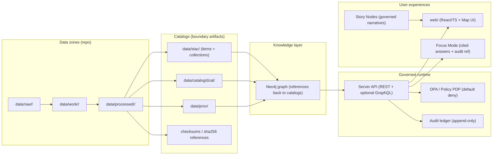

# `src/` — KFM Executable System Code (Pipelines · Graph · Server)

KFM is built as a governed pipeline and runtime system:

**data → catalogs → graph → API → UI → narrative**

`src/` contains the *executable code* that makes that chain real: ingestion/publishing pipelines, graph build/sync, and the governed server boundary that enforces policy and emits audit/provenance.

> [!IMPORTANT]
> This README documents **contracts and invariants** (some are “documented target behavior”).  
> If the codebase differs, treat this as the **north star** and open an implementation ticket rather than quietly drifting.

---

## Table of contents

- [Boss mode: non‑negotiables](#boss-mode-non-negotiables)
- [Canonical subsystem homes inside `src/`](#canonical-subsystem-homes-inside-src)
- [How the pieces connect](#how-the-pieces-connect)
- [Subsystem responsibilities](#subsystem-responsibilities)
  - [`src/pipelines/`](#srcpipelines)
  - [`src/graph/`](#srcgraph)
  - [`src/server/`](#srcserver)
- [Governance-critical runtime behaviors](#governance-critical-runtime-behaviors)
  - [Trust membrane](#trust-membrane)
  - [Policy-as-code (OPA/Rego)](#policy-as-code-oparego)
  - [Audit record expectations](#audit-record-expectations)
  - [Evidence resolver + “cite-or-abstain”](#evidence-resolver--cite-or-abstain)
  - [Sensitivity handling](#sensitivity-handling)
- [Local development](#local-development)
- [CI gates & Definition of Done](#ci-gates--definition-of-done)
- [Quick “where do I put this?” map](#quick-where-do-i-put-this-map)
- [Glossary](#glossary)

---

## Boss mode: non-negotiables

These are the invariants `src/` must enforce end-to-end:

1) **Trust membrane**  
   UI and external clients never access databases directly — all access goes through the governed API + policy boundary.

2) **Fail-closed policy on every request**  
   If policy is uncertain/unavailable/invalid → deny.

3) **Dataset promotion gates**  
   Data moves **Raw → Work → Processed**. Promotion requires **checksums** and **STAC/DCAT/PROV** catalogs.

4) **Focus Mode must cite or abstain**  
   Every answer produces an **audit reference**. If evidence is insufficient, abstain.

> [!WARNING]
> If a change “works” but violates any of the above, it’s a defect—regardless of performance or feature value.

---

## Canonical subsystem homes inside `src/`

KFM v13 guidance establishes **one canonical home per subsystem** (avoid duplicate/competing implementations).

```text
src/
├── pipelines/     # ETL + normalization + catalog emit + validation gates
├── graph/         # ontology application + cypher migrations + graph sync
└── server/        # REST/GraphQL API boundary + policy enforcement + audit emission
```

> [!NOTE]
> “Clean layers” still apply—especially inside `src/server/`—but **top-level ownership** is by subsystem:
> pipelines vs graph vs server.

---

## How the pieces connect



---

## Subsystem responsibilities

### `src/pipelines/`

**Purpose:** Turn raw sources into **published, validated, reproducible** processed artifacts, with catalogs and lineage.

Core responsibilities (documented expectations):
- Ingest raw sources into `data/raw/<domain>/`
- Transform into `data/work/<domain>/` and finalize into `data/processed/<domain>/`
- Emit **STAC**, **DCAT**, **PROV** boundary artifacts
- Enforce validation gates before promotion:
  - schema validation (required fields/types/null thresholds)
  - geospatial validation (geometry validity, CRS declared, bounds/topology checks)
  - temporal validation (time ranges parseable/consistent)
  - license validation (SPDX-like id or explicit license + attribution)
  - sensitivity validation (classify; flag restricted coordinates; require governance approval)
  - catalog validation (STAC/DCAT/PROV schemas + cross-link resolution)
  - hash validation (sha256 for every processed artifact referenced in catalogs)

**Pipeline Definition of Done (minimum)**
- [ ] Connector/ingest step is implemented + registered (where your registry lives)
- [ ] Raw acquisition produces a deterministic manifest + checksums
- [ ] Normalization emits a canonical schema and/or STAC assets
- [ ] Validation gates are implemented and enforced (local + CI)
- [ ] Policy labels exist; restricted fields/locations are redacted per rules
- [ ] Catalogs are emitted (DCAT always; STAC/PROV as applicable) and link-check clean
- [ ] API contract tests pass for at least one representative query
- [ ] Backfill strategy is documented (historical ranges and expected runtime)

> [!TIP]
> Pipelines are allowed to be “batchy,” but they must be **deterministic** and **idempotent**:
> same inputs + same config → same outputs (or versioned outputs), always emitting provenance.

---

### `src/graph/`

**Purpose:** Build and maintain the **knowledge graph** from canonical catalogs and ontology constraints.

Core responsibilities:
- Ontology application and evolution (labels, relationship types, required properties)
- Cypher migrations (schema + constraint changes)
- Graph sync/load routines
- Generation of static import files when needed (kept under `data/graph/`)

**Guardrails**
- Graph is *derived* from canonical artifacts (catalogs + processed outputs) → rebuildable
- Graph schema changes require migrations + integrity tests (fixture graph checks)

---

### `src/server/`

**Purpose:** The governed runtime boundary: **policy enforcement + audited evidence delivery**.

`src/server/` is the only place that should serve data to clients (REST and/or GraphQL) and must:
- enforce the **trust membrane**
- evaluate policy on **every** data/story/AI request
- serve only from **processed** catalogs/artifacts (never from unvalidated intermediates)
- emit audit/provenance on the normal request path
- provide evidence resolution endpoints so citations are inspectable

#### Internal layering (recommended)

Even when code is organized by subsystem, the server should still follow clean-layer ideas.
A common pattern:

```text
src/server/
├── domain/            # entities + value objects + invariants (no framework deps)
├── use_cases/         # workflows (depends only on ports)
├── ports/             # repository interfaces + policy/audit interfaces + DTOs
├── adapters/          # DB/graph/search/policy implementations of ports
├── infrastructure/    # wiring, config, concrete clients
├── contracts/         # OpenAPI / GraphQL SDL (contract-first)
└── transport/         # HTTP handlers/routes + request parsing (thin)
```

> [!IMPORTANT]
> Handlers/controllers stay thin. Business rules live in use-cases. Persistence goes through ports.

---

## Governance-critical runtime behaviors

### Trust membrane

The trust membrane is the boundary where governance is enforced. In practice:
- frontend never talks to databases directly
- policy evaluation occurs on every request (data/story/AI)
- backend logic uses repository interfaces (ports) and cannot bypass them
- audit and provenance are produced as part of the normal request path

---

### Policy-as-code (OPA/Rego)

**Baseline policy stance:** *default deny*.

Documented/patterned expectations include:
- Data access policy module (example): allow only if dataset is public or actor has elevated role
- Focus Mode output validation: allow only if answer has citations AND sensitivity is OK
- Optional extensions: require at least N citations for nontrivial answers
- Policy tests are first-class: regression suite blocks merges

**Operational requirement:** if policy input is missing required keys, the system must fail closed (deny).

---

### Audit record expectations

Audit is not “extra logging.” It is a governed record used for review, incident response, and accountability.

Documented schema elements include:
- required: `audit_ref`, `timestamp`, `event_type`, `subject`, `event_hash`
- optional but expected for chaining: `prev_hash`
- evidence traceability: `evidence_refs[]`

Example (shape only; consult the schema for exact requirements):

```json
{
  "audit_ref": "audit_2026_02_13T120102Z_000123",
  "timestamp": "2026-02-13T12:01:02Z",
  "event_type": "focus_mode_answer_served",
  "actor": { "role": "public" },
  "subject": { "kind": "focus_answer", "id": "fa_..." },
  "evidence_refs": ["dcat:dataset_x", "prov:bundle_y"],
  "prev_hash": "sha256:...",
  "event_hash": "sha256:..."
}
```

> [!NOTE]
> The hash chain is what makes “append-only” meaningful: tampering becomes detectable.

---

### Evidence resolver + cite-or-abstain

KFM UX and governance assume that citations aren’t decorative—they must resolve.

Documented expectations include:
- FocusAnswer includes `answer_markdown`, `citations[]`, `audit_ref`
- citations are required by policy (cite-or-abstain)
- UI must be able to resolve any citation reference to a human-readable evidence view quickly (target: <= 2 API calls)

A commonly documented evidence resolver pattern:

- `GET /api/v1/evidence/{kind}/{id}` where `kind ∈ { dcat, stac, prov, doc, graph }`

> [!WARNING]
> If evidence cannot be resolved, governance treats the output as untrustworthy.
> Fix the resolver path or abstain.

---

### Sensitivity handling

Sensitivity is a first-class concern:
- classify during ingestion/validation
- if a dataset contains sensitive locations or culturally restricted knowledge:
  - publish a generalized derivative for general audiences
  - store precise data under restricted access
  - both artifacts must have separate provenance chains documenting the transformation/redaction step

Operationally, incident response guidance includes:
- data leak risk → deny via policy toggle; rotate credentials; withdraw affected artifacts; publish redacted derivative
- AI unsafe output → disable `/ai/query` via policy; preserve audit logs; fix policy/validator/prompt; add regression test
- emergency deny switch must exist (disable public endpoints + Focus Mode without deploying code)

---

## Local development

This repo is commonly run as a Compose stack (services may include: API server, OPA, PostGIS, Neo4j, search, object store, workers).

Typical baseline flow:
- run compose
- use API docs UI if enabled
- verify policy is loaded
- run a smoke test: home map → toggle layer → open provenance panel → run one Focus Mode query

### Practical troubleshooting patterns (common issues)
- Compose dependency timing: sometimes rerun `docker-compose up` if services started in a bad order
- Port conflicts (examples): host has something using 5432 (Postgres) or 7474 (Neo4j) → change mappings or stop local services
- Volume permissions: if the API writes to `data/` and containers can’t, fix mounts/UID mapping
- Hot reload not updating: verify volume mount paths are correct

Example dev endpoints (if configured):
- REST docs UI: `http://localhost:8000/docs`
- GraphQL: `/graphql` (if enabled)

> [!TIP]
> Keep the stack running while developing and open a second terminal for one-off pipeline tasks/tests.

---

## CI gates & Definition of Done

KFM’s CI is part of governance. Expect these categories of gates (at minimum):

### Documentation & narrative gates
- Markdown protocol / required sections / (if enforced) front-matter validation
- Link/reference validation
- Story Node schema validation (required sections + citations + valid links)

### Data & catalog gates
- JSON Schema validation for STAC Items/Collections, DCAT entries, PROV bundles
- Cross-link resolution among catalogs
- Checksums/hashes present for promoted artifacts

### Graph gates
- Graph integrity tests on fixture datasets
- Ontology constraints and migration validity

### API gates
- Contract-first enforcement: OpenAPI/GraphQL schemas linted
- API contract tests must pass for known inputs/outputs
- Backwards compatibility enforced unless version bump declared

### Security & governance gates
- Secret scanning
- PII/sensitive data scanning
- Sensitive location checks (no protected coordinates leaking into public outputs)
- Classification consistency checks (no “downgrade to public” without approved redaction/provenance)

**PR Definition of Done (minimum)**
- [ ] Change respects trust membrane (no UI→DB shortcuts; no bypassing ports)
- [ ] Policy is updated (if needed) + tests added/updated
- [ ] Audit/provenance emitted for new runtime behavior
- [ ] Catalog + schema validations pass (when data artifacts touched)
- [ ] Contract tests pass (OpenAPI/GraphQL + endpoint behavior)
- [ ] Link checks pass (no broken internal references)
- [ ] Sensitive data risks assessed; redaction + provenance included where needed

---

## Quick “where do I put this?” map

| You’re trying to add… | Put code in… | Also update… |
|---|---|---|
| New dataset ingest / connector | `src/pipelines/` | `data/raw/…`, `data/work/…`, `data/processed/…`, STAC/DCAT/PROV outputs, policy labels, CI gates |
| New catalog validation tool | `src/pipelines/` (or `tools/` if truly standalone) | schema/profile docs; CI validation config |
| New ontology, node/edge types, graph migration | `src/graph/` | graph integrity tests; catalog↔graph linkage expectations |
| New API endpoint | `src/server/` | `src/server/contracts/` + contract tests + policy inputs + audit event |
| New Focus Mode behavior | `src/server/` | policy rules (cite-or-abstain), evidence resolver, audit emission |
| New Story Node content | `docs/reports/story_nodes/` | citations + link validation + template compliance |

---

## Glossary

- **Catalogs**: STAC (assets), DCAT (dataset discovery), PROV (lineage).
- **Contract artifact**: machine-validated interface spec (JSON Schema, OpenAPI, GraphQL SDL, UI config).
- **Evidence artifact**: derived product registered in catalogs with provenance before use in UI/narratives.
- **Story Node**: governed narrative artifact; machine-ingestible; provenance-linked; citations required.
- **Focus Mode**: interactive experience that must never introduce unsourced material; cite or abstain.

---

### If something feels slow, heavy, or “overkill”…
That’s usually governance doing its job. KFM optimizes for **traceability**, **reproducibility**, and **safe publication**—not just feature velocity.