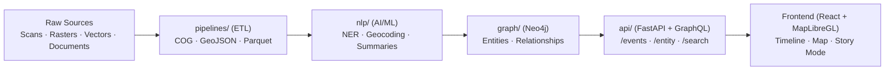

<div align="center">

# 🧩 Kansas Frontier Matrix — `src/` Codebase

**ETL · AI/ML · Knowledge Graph · API Services**  
_The beating heart of the Kansas Frontier Matrix stack._

[](https://github.com/bartytime4life/Kansas-Frontier-Matrix/actions/workflows/site.yml)  
[](https://github.com/bartytime4life/Kansas-Frontier-Matrix/actions/workflows/stac-validate.yml)  
[](https://github.com/bartytime4life/Kansas-Frontier-Matrix/actions/workflows/codeql.yml)  
[](https://github.com/bartytime4life/Kansas-Frontier-Matrix/actions/workflows/trivy.yml)  
[](https://pre-commit.com)  
[](../docs/)  
[](../LICENSE)

</div>

---

## 📚 Purpose
The `src/` directory contains all **core code** for the Kansas Frontier Matrix:

- ⚙️ **ETL Pipelines** → reproducible ingestion & transformation (COGs, GeoJSON, Parquet).  
- 🤖 **AI/ML Modules** → NLP, entity linking, summarization, confidence scoring.  
- 🕸 **Knowledge Graph** → Neo4j integration (CIDOC CRM, OWL-Time, PeriodO).  
- 🔌 **API Layer** → FastAPI/GraphQL endpoints powering the frontend & Google Earth exports.  

Think of `src/` as the **engine room** where raw data becomes structured knowledge.

---

## 🏗 Code Structure

```text
src/
├─ pipelines/      # ETL jobs: fetch, transform, load (scans, rasters, vectors, docs)
├─ nlp/            # NLP + AI/ML enrichment (NER, linking, summarization)
├─ graph/          # Graph schema + Neo4j integration (Cypher utils, entity upserts)
├─ api/            # FastAPI/GraphQL services (REST endpoints, resolvers)
├─ utils/          # Shared helpers (logging, config, checksum validation)
└─ __tests__/      # (Optional) inline tests close to modules
````

> 📝 For **full stack context**, see [`src/ARCHITECTURE.md`](./ARCHITECTURE.md).

---

## 🚀 Quickstart (Dev Setup)

```bash
# 1. Create and activate a virtual environment
python -m venv .venv
source .venv/bin/activate

# 2. Install dependencies
pip install -r requirements.txt

# 3. Run ETL (example: DEMs)
make fetch cogs stac

# 4. Launch API locally
uvicorn src.api.main:app --reload --port 8000
```

Visit **[http://localhost:8000/docs](http://localhost:8000/docs)** for interactive API docs (Swagger UI).

---

## 🧭 Data Flow (Mermaid)



---

## 🔬 Core Technologies

* **Python 3.11+** → primary language
* **FastAPI** → API framework
* **GraphQL (Strawberry)** → semantic querying
* **Neo4j** → graph DB backend
* **spaCy + Transformers** → NLP/NER & summarization
* **rasterio / rio-cogeo / GDAL** → geospatial raster ops
* **pystac** → STAC catalog builder

---

## 🧪 Testing

Run all tests (with coverage):

```bash
pytest --maxfail=1 --disable-warnings -q
```

---

## 🛡 Quality & Security

* ✅ **Pre-commit hooks** → linting, formatting, type checks (`ruff`, `black`, `mypy`).
* ✅ **CodeQL** → static analysis (GitHub Actions).
* ✅ **Trivy** → container + dependency scanning.
* ✅ **STAC Validation** → ensures geospatial metadata compliance.

---

## 🎯 Developer Workflows

### Adding a New Dataset

1. Add source manifest → `data/sources/{id}.json`
2. Run:

   ```bash
   make fetch && make cogs && make stac
   ```
3. Extend pipeline → `src/pipelines/{new_source}.py`
4. Add to Knowledge Graph → update `src/graph/schema.py`
5. Test + document in `docs/sop.md`

### Adding a New API Endpoint

* Add resolver → `src/api/routes/`
* Document with OpenAPI decorators
* Include test in `tests/api/test_{endpoint}.py`

---

## 📦 Example API Calls

```http
GET /events?start=1850-01-01&end=1870-12-31&bbox=-100,37,-94,40
```

Returns all events within Kansas in that range as GeoJSON + summaries.

```http
GET /entity/fort-larned
```

Returns linked data: events, documents, summaries, map references.

---

## 🎨 Layer & Timeline Integration

Color tokens and time windows for frontend are defined in [`web/config/layers.json`](../web/config/layers.json).
See **[Layer Timeline Legend](./ARCHITECTURE.md#-layer-timeline-legend)** for canonical styles.

---

## 🗂 Documentation

* 📖 [`ARCHITECTURE.md`](./ARCHITECTURE.md) → full-stack overview
* 🧭 [`../docs/`](../docs/) → SOPs, experiments, model cards
* 📑 CI/CD workflows: `.github/workflows/`

---

## 🤝 Contributing

We follow **MCP (Master Coder Protocol)**:

* 📝 Document before code (SOP, experiment, or architecture).
* 🔒 Reproducibility first (checksum, schema validation).
* 🧪 Add/extend tests with every change.
* 📤 Every PR includes updated docs + provenance metadata.

See [`CONTRIBUTING.md`](../CONTRIBUTING.md) for details.

---

## 📖 References

* **STAC 1.0.0** → geospatial catalog standard
* **CIDOC CRM + OWL-Time + PeriodO** → semantic/temporal ontologies
* **Kansas GIS Hub, USGS 3DEP, NOAA NCEI, FEMA OpenFEMA, Kansas Historical Society Archives** → core data sources

---

<div align="center">

> ✨ *“The `src/` directory is where Kansas history gets transformed into a living, queryable atlas.”*

</div>
```

---

✅ This gives `src/` its **own identity**: clear directory structure, setup guide, tech stack, workflows, diagrams, badges, and integration with docs/tests/UI.
