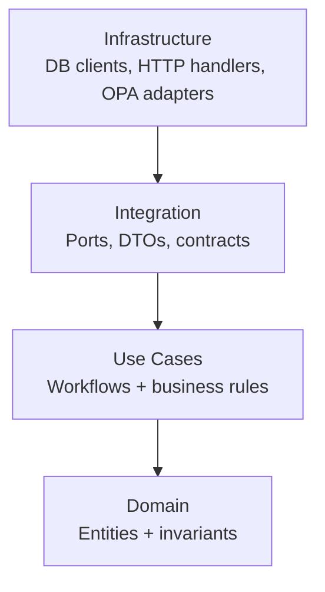

<!--
File: src/README.md
Purpose: Canonical “don’t leave anything out” README for all governed backend code under /src.
This README is a GOVERNED artifact: changes should be reviewed as production changes because they can alter trust guarantees.
-->

# 🧭 KFM `src/` — Governed Backend, Pipelines, and Graph


`src/` is the canonical home for KFM’s server-side code: the **API backend**, **data pipelines**, and **knowledge graph** build/sync logic.

This is where KFM’s credibility guarantees are enforced in code:
- **Trust membrane:** UI/external clients never hit databases directly; everything flows through the governed API + policy boundary.
- **Fail-closed policy:** every governed request is authorized; denials are the default.
- **Evidence-first:** outputs are grounded; Focus Mode answers must include citations or abstain.
- **Auditability:** governed request paths emit `audit_ref` and evidence references.

> [!IMPORTANT]
> If you change code in `src/` in a way that weakens any invariant below, treat it as a governance incident until fixed.

---

## Table of contents

- [Governance header](#governance-header)
- [Non-negotiables](#1-nonnegotiables-what-must-always-remain-true)
- [What belongs in `src/` and what does not](#2-what-belongs-in-src-and-what-does-not)
- [Repo context](#3-repo-context-how-src-fits-the-toplevel-layout)
- [Canonical directory layout](#4-canonical-directory-layout-the-one-source-of-truth)
- [Architecture contract](#5-architecture-contract-clean-layers--trust-membrane)
- [Subsystems](#6-subsystems)
  - [`src/server/` — Governed API](#61-srcserver--governed-api)
  - [`src/pipelines/` — Ingestion + promotion + catalogs](#62-srcpipelines--ingestion--promotion--catalogs)
  - [`src/graph/` — Knowledge graph build/sync](#63-srcgraph--knowledge-graph-buildsync)
  - [`src/shared/` — Cross-cutting governed helpers](#64-srcshared--crosstutting-governed-helpers)
- [Evidence, receipts, and provenance](#7-evidence-receipts-and-provenance-first-class)
- [Policy-as-code integration](#8-policy-as-code-integration-opa)
- [Testing strategy](#9-testing-strategy-required-test-types)
- [Local development](#10-local-development-minimum-supported-workflow)
- [Extension playbooks](#11-how-to-add-things-safely-extension-playbooks)
- [CI and governance gates](#12-ci--governance-gates-for-src-changes)
- [Security and secrets](#13-security--secrets-do-not-leak)
- [Troubleshooting](#14-troubleshooting)
- [Glossary](#15-glossary)

---

## Governance header

| Field | Value |
|---|---|
| Document | `src/README.md` |
| Status | **Governed** |
| Applies to | backend trust membrane, policy enforcement, receipts/catalog emission, evidence/audit contracts |
| Version | `v2.0.0-draft` |
| Effective date | 2026-02-15 |
| Owners | `.github/CODEOWNERS` *(required; if missing, treat as governance gap)* |
| Review triggers | policy changes, contract/schema changes, promotion logic changes, evidence/audit behavior changes |

> [!WARNING]
> **Fail-closed rule:** missing policy input / missing receipts / missing catalogs / missing citations must result in deny/abstain, not best-effort.

---

## 1. Non-negotiables (what must always remain true)

### System invariants enforced by `src/`

| Invariant | What it means in code | Primary enforcement surface |
|---|---|---|
| **No UI direct DB access** | frontend never connects to PostGIS/Neo4j/search/object store | network isolation + API-only exposure via `src/server/` |
| **Policy evaluates governed requests** | every data/story/AI/evidence request authorized; default deny | `src/server/` policy middleware + policy ports/adapters |
| **Focus Mode cite-or-abstain** | answer must include resolvable citations or abstain | Focus Mode pipeline + output validator + policy gate |
| **Audit on the hot path** | governed requests produce `audit_ref` and append audit events | audit port/adapter + ledger |
| **Promotion Contract gating** | Raw → Work → Processed denies without receipts/checksums/catalogs | `src/pipelines/` promotion gate + CI |
| **Deterministic spec identity** | governed specs have reproducible `spec_hash` | receipt writer + spec canonicalizer (RFC 8785 JCS) |
| **Evidence resolution** | citations resolve to evidence views (or deny safely) | evidence resolver endpoints + contract tests |

---

## 2. What belongs in `src/` (and what does not)

### ✅ Belongs in `src/`
- API backend (REST; optional GraphQL) including contract definitions and evidence/audit behavior.
- Pipelines/ETL/promotion logic, including catalog writing (DCAT/STAC/PROV), receipts, and validators.
- Graph build/sync logic (ontology, migrations, sync jobs).
- Shared governed libraries used by the above (IDs, time model, provenance/evidence helpers).

### ❌ Does not belong in `src/`
- UI code → `web/`
- OPA policies → `policy/`
- raw/work/processed data → `data/`
- Story Nodes and governed narratives → `docs/**/story_nodes/**`
- CI glue and validators that are not runtime code → `tools/` or `scripts/` (repo-dependent)

> If you’re about to add server logic outside `src/`, stop. This is the canonical home.

---

## 3. Repo context (how `src/` fits the top-level layout)

KFM is organized so each subsystem has one canonical home:

```text
repo/
├─ data/        # raw/work/processed + catalogs + checksums
├─ docs/        # governed docs + templates + Story Nodes
├─ src/         # (you are here) server + pipelines + graph + shared
├─ web/         # React UI (never direct DB access)
├─ policy/      # OPA/Rego policies (default deny)
├─ tools/       # validators and CI gates (verification tooling)
├─ scripts/     # orchestration glue (thin runners; fail-closed)
└─ .github/     # CI workflows enforcing governance gates
```

---

## 4. Canonical directory layout (the one source of truth)

> The exact file names may differ, but the roles and boundaries must hold.

```text
src/
├─ server/                       # governed API gateway + evidence/audit behavior
│  ├─ contracts/                 # OpenAPI + JSON Schemas (+ optional GraphQL SDL)
│  ├─ domain/                    # pure entities/value objects + invariants
│  ├─ usecases/                  # workflows + business rules (ports only)
│  ├─ integration/               # ports/contracts + DTOs + schema-bound models
│  ├─ infrastructure/            # DB clients, HTTP handlers, OPA adapters, repo implementations
│  ├─ tests/                     # unit/usecase/contract/integration tests
│  └─ README.md
│
├─ pipelines/                    # ingestion/validation/promotion/catalogs/receipts
│  ├─ connectors/                # per-source connectors (discover/acquire)
│  ├─ transforms/                # normalize/enrich/export steps (deterministic)
│  ├─ validation/                # schema/geo/time/license/policy gates
│  ├─ promotion/                 # Raw→Work→Processed promotion gate + publish logic
│  ├─ catalogs/                  # DCAT/STAC/PROV writers + link-check
│  ├─ receipts/                  # run_record/run_manifest emitters + spec hashing
│  ├─ registry/                  # dataset registry readers/helpers (if mirrored here)
│  ├─ tests/
│  └─ README.md
│
├─ graph/                        # graph build/sync/migrations (derived from processed catalogs)
│  ├─ ontology/
│  ├─ migrations/
│  ├─ sync/
│  ├─ tests/
│  └─ README.md
│
└─ shared/                       # cross-cutting governed helpers (keep small)
   ├─ ids/                       # deterministic ids, hashing, stable identifiers
   ├─ time/                      # time model helpers (intervals, uncertainty)
   ├─ provenance/                # PROV helpers, evidence ref helpers, bundle helpers
   └─ README.md
```

### No duplicates rule (hard)
- API code lives in `src/server/` only (no parallel `src/api/`).
- ETL/promotion logic lives in `src/pipelines/` (not scattered across tools/scripts).
- Graph schema changes are versioned in `src/graph/migrations/` (no hot patches).

---

## 5. Architecture contract (clean layers + trust membrane)

### 5.1 Trust membrane (runtime flow)

```mermaid
sequenceDiagram
  participant UI as Web UI (web/)
  participant API as API Gateway (src/server)
  participant PDP as Policy PDP (OPA)
  participant STORES as Stores (PostGIS/Neo4j/Search/Object)
  participant EV as Evidence Resolver
  participant AUDIT as Audit Ledger

  UI->>API: Request (data/story/ai) + ViewState
  API->>PDP: Authorize (default deny)
  PDP-->>API: allow/deny (+ obligations)
  API->>STORES: Read/write via repository ports (no bypass)
  API->>EV: Resolve/attach evidence refs (or return refs for UI)
  API->>PDP: Validate output (citations + sensitivity)
  API->>AUDIT: Append audit event; return audit_ref
  API-->>UI: Response + citations[] + audit_ref
```

### 5.2 Clean layers (dependency rules)

Dependencies point inward only:



Allowed dependencies:

| Layer | May import | Must NOT import |
|---|---|---|
| Domain | Domain only | usecases/integration/infrastructure/frameworks |
| Usecases | Domain + Integration ports/DTOs | DB/HTTP/OPA clients |
| Integration | Domain (when needed) | infrastructure implementations |
| Infrastructure | all above | (respect ports; no business logic leakage) |

---

## 6. Subsystems

## 6.1 `src/server/` — Governed API

### Responsibilities
- define and serve governed endpoints (REST; optional GraphQL)
- enforce policy on every governed request (default deny)
- expose evidence resolution endpoints (refs → human-readable views)
- emit audit events and return `audit_ref`
- ensure responses are attributable to processed artifacts + catalogs

### Contract-first (required)
Contracts live under `src/server/contracts/` and must be tested. Treat contracts as public law.

Minimum Focus Mode contract (illustrative):
- `POST /api/v1/ai/query`
  - request includes `question` + `context` (time range, bbox, active layers, story ids)
  - response includes `answer_markdown`, `citations[]`, `audit_ref`
  - if insufficient evidence: abstain + `audit_ref`

### Evidence resolution requirement
Any `citation.ref` returned by the API must be resolvable through governed endpoints for supported schemes:
- `prov://`, `stac://`, `dcat://`, `doc://`, `graph://` (+ optional `oci://` bundles)

---

## 6.2 `src/pipelines/` — Ingestion + promotion + catalogs

### Responsibilities
- discover/acquire sources (connectors)
- normalize/enrich deterministically
- validate schema/geo/time/license/policy prerequisites
- emit receipts (run_record + run_manifest) and checksums
- promote raw/work → processed only when Promotion Contract gates pass
- emit catalogs (DCAT always; STAC conditional; PROV required)
- drive downstream refresh triggers from canonical catalogs (search/graph/vector)

### Promotion gates (non-negotiable)
Promotion denies unless:
- license present
- sensitivity classification present
- schema/geo/time checks pass
- checksums computed and verified
- DCAT validates (required)
- STAC validates when spatial assets exist
- PROV validates (required lineage)
- audit event recorded (promotion event)

### Receipts
Pipelines must emit:
- `run_record.json` (inputs/outputs + code identity + refs)
- `validation_report.json` (pass/fail for gates)
- `run_manifest.json` (Promotion Contract receipt; merge/publish blocker)

---

## 6.3 `src/graph/` — Knowledge graph build/sync

### Responsibilities
- ontology and mappings
- versioned migrations (reviewable, repeatable)
- sync jobs driven by processed datasets and catalogs
- integrity checks (constraints, no orphan types, controlled schema evolution)

### Data placement rule
Static import data belongs under `data/graph/` (or another data zone), not in `src/graph/`.

---

## 6.4 `src/shared/` — Crosstutting governed helpers

Keep shared helpers small and stable:
- deterministic id generation and hashing
- time model utilities
- provenance helpers and evidence ref utilities
- receipt/canonicalization helpers (shared across pipelines/server)

---

## 7. Evidence, receipts, and provenance (first-class)

KFM treats provenance as queryable, first-class data.

### Catalog standards (pipelines emit; server serves)
- DCAT: discovery + licensing + restrictions + distributions
- STAC: spatial assets and extents (when applicable)
- PROV: lineage chain linking raw → processed outputs

### Audit ledger
Audit is append-only and supports `audit_ref` lookups for:
- API responses (data/story/ai/evidence)
- pipeline promotions
- policy denials (for regression tracking)

---

## 8. Policy-as-code integration (OPA)

### Fail-closed expectations
- default deny
- enforce role-based access, field-level redactions, sensitivity classes
- enforce sensitive-location precision suppression/generalization
- enforce cite-or-abstain for Focus Mode outputs

### Regression suite (non-negotiable)
Policy changes must include regression tests:
- prior leak patterns must fail forever
- negative tests for sensitive-location precision
- field-level redaction tests (owner names, small counts, exact coords)
- audit integrity expectations (`audit_ref` always; evidence refs attached)

---

## 9. Testing strategy (required test types)

Minimum bar for `src/` changes: unit + usecase + contract + integration coverage.

| Area | Test type | What it proves |
|---|---|---|
| Domain | unit | invariants hold |
| Usecases | unit/usecase with mocked ports | business rules without infra coupling |
| Contracts | contract/schema | request/response stability; governed DTOs |
| Infrastructure | integration + smoke | DB/OPA wiring works; audit/evidence emitted |

---

## 10. Local development (minimum supported workflow)

Canonical local dev workflow uses Docker Compose.

1) `cp .env.example .env`  
2) `docker compose up --build`  
3) verify:
   - API docs: `http://localhost:8000/docs`
   - UI: `http://localhost:3000`

Baseline services commonly include:
- `api`, `web`, `db` (PostGIS), `graph` (Neo4j), optional policy/search/vector services

---

## 11. How to add things safely (extension playbooks)

### 11.1 Add a new dataset connector (pipelines) — DoD
- connector implemented + registered (registry-driven)
- raw manifest + checksums deterministic
- normalization emits canonical schema and/or STAC assets
- validation gates enforced in CI
- receipts emitted (run_record + validation_report + run_manifest)
- catalogs emitted (DCAT always; STAC conditional; PROV required) and link-check clean
- policy labels applied; redaction/generalization where required
- representative API contract test passes
- backfill strategy documented

### 11.2 Add/change an API endpoint (server) — checklist
- update contract in `src/server/contracts/`
- add request/response schema validation
- implement a port-driven use case
- implement infrastructure adapters behind ports
- add/adjust policy rules + policy tests (default deny)
- ensure response includes evidence refs and `audit_ref`
- add/adjust contract + integration tests

### 11.3 Change the graph schema (graph) — checklist
- versioned migration in `src/graph/migrations/`
- update ontology mappings
- add integrity checks
- validate in CI/smoke environment

---

## 12. CI / governance gates for `src/` changes

Any PR touching `src/` should pass:
- unit tests (domain + usecases)
- contract/schema tests (OpenAPI/JSON Schemas)
- integration tests (DB + OPA + search/graph wiring)
- architecture lint (no forbidden imports/layer violations)
- policy regression suite (if policy-sensitive behavior changes)
- catalog/provenance validation (if pipelines emit catalogs)
- receipts validation (run_manifest + checksums + spec_hash semantics)

> [!WARNING]
> If you can’t explain how your change preserves cite-or-abstain and fail-closed behavior, you’re not done.

---

## 13. Security & secrets (do not leak)

Rules:
- never commit secrets (keys, tokens, upstream creds)
- inject secrets via secret manager / CI secrets
- do not log secrets or sensitive payloads
- respect provider rate limits; implement backoff; avoid scraping patterns that violate terms

---

## 14. Troubleshooting

Common failure modes:
- policy denies everything: confirm PDP reachable; ensure required input keys; deny-by-default is correct
- Focus Mode returns no citations: output validator/policy should deny; fix evidence pack and citations
- promotion blocked: open validation report; missing license/sensitivity/receipts/catalogs are hard stops
- graph migrations drift: ensure single migration path; never hot patch without provenance and versioning

---

## 15. Glossary

- Trust membrane: governed boundary enforcing API+policy mediation for all access.
- Promotion Contract: required proofs before artifacts become processed/servable.
- Receipts: run_record + run_manifest + validation report + checksums proving reproducibility.
- `spec_hash`: deterministic spec identity (`sha256(JCS(spec))` using RFC 8785).
- Cite-or-abstain: Focus Mode rule to cite resolvable evidence or abstain.
- Audit ledger: append-only log producing `audit_ref`.

---

### References (governed design sources)

- KFM Next-Gen Blueprint & Primary Guide (internal, 2026-02-12)
- KFM Comprehensive Data Source Integration Blueprint (internal, 2026-02-12)
- KFM Feb-2026 integration patterns (spec_hash, digest pinning, receipts, acceptance harness)
