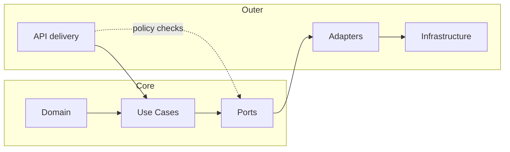
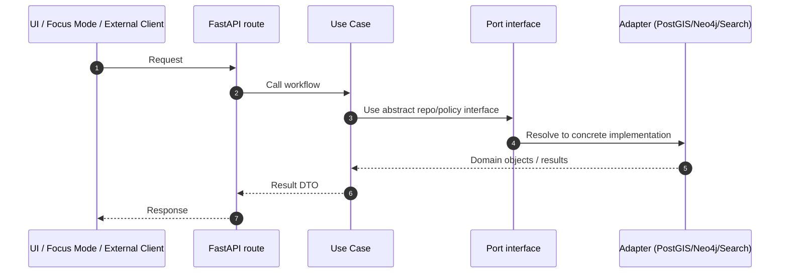

# src

`src/` is the **backend source** for the Kansas Frontier Matrix (KFM): core domain models, governed use-cases, adapters, and API delivery code.

🧱 **Clean Architecture** · 🔒 **Trust membrane** · 🧾 **Provenance-first** · ⚖️ **FAIR+CARE**

---

## What belongs in this folder

This folder holds backend code that powers KFM’s governed data path:

- **Domain layer**: pure entities and value objects that model KFM concepts (no DB/UI dependencies).
- **Use-case layer**: business workflows that orchestrate domain entities (DB/UI agnostic).
- **Integration layer**: repository interfaces (ports) and adapters (PostGIS/Neo4j/Search/etc.).
- **Infrastructure layer**: concrete implementations and environment-specific concerns.
- **API delivery**: FastAPI routes/presenters that expose governed services to clients (UI, Focus Mode, external tools).

> [!NOTE]
> KFM is designed as a pipeline → catalog/provenance → database → API → UI system. The backend’s job is to enforce that contract end-to-end.

---

## Non-negotiable invariants

> [!IMPORTANT]
> **Trust membrane**: clients must **never** bypass the API to access data stores.
> - Frontend and external clients **do not** connect to PostGIS/Neo4j/Search directly.
> - Core logic **does not** reach into infrastructure directly; it goes through repository interfaces.

> [!IMPORTANT]
> **Truth path**: data must follow the canonical flow and must not “skip” metadata/provenance steps.
>
> Raw → Work → Processed → STAC/DCAT/PROV → PostGIS/Neo4j/Search → API → UI → Story Nodes → Focus Mode

> [!WARNING]
> **Fail closed**: if a policy check fails, KFM blocks the action by default (security/governance first).
> This applies to sensitive data access, licensing checks, and AI/Focus Mode constraints.

> [!WARNING]
> **No secrets**: never commit API keys, passwords, tokens, or private URLs. Use placeholders like `<API_KEY>` and `.env` files.

---

## Directory layout

The repo’s canonical top-level layout includes `src/` as the backend folder:

```text
repo-root/
  data/       # raw/work/processed + catalogs
  docs/       # governed system docs, standards, templates
  src/        # backend: domain/usecases/adapters/infrastructure
  web/        # UI: React/TS + MapLibre
  policy/     # OPA Rego policies
  .github/    # CI workflows
```

Inside `src/`, this is the **recommended** structure (update to match the actual repo if different):

```text
src/
  domain/                  # core entities, value objects, enums
  use_cases/               # application workflows (ingestion, queries, timeline generation)
  ports/                   # abstract interfaces (repositories, policy checks, external services)
  adapters/                # implementations of ports (db/search/external APIs)
    db/
    graph/
    search/
    policy/
  infrastructure/          # concrete tech wiring (clients, config, persistence glue)
  api/                     # FastAPI app + delivery layer (REST and optional GraphQL)
    main.py
    routes/
    dependencies/
    schemas/
  tests/                   # unit + integration tests for backend behavior
```

> [!NOTE]
> Some project materials describe a `backend/` directory for API code. If the live repo still uses `backend/` (not confirmed in repo), either migrate to `src/` or update docs to keep a single source of truth.

---

## Clean Architecture map

| Layer | Owns | Can depend on | Must not depend on | Typical location |
|---|---|---|---|---|
| Domain | Entities, value objects, invariants | nothing (or stdlib) | DB, HTTP, UI, frameworks | `src/domain/` |
| Use cases | Workflows, orchestration, business rules | Domain + Ports | DB implementations, HTTP framework | `src/use_cases/` |
| Ports | Interfaces for persistence, policy, external services | Domain | concrete DB/search clients | `src/ports/` |
| Adapters | PostGIS/Neo4j/Search/API clients implementing Ports | Ports + Domain | frontend/UI | `src/adapters/`, `src/infrastructure/` |
| API delivery | FastAPI routers, request parsing, response shaping | Use cases + Ports | DB clients directly | `src/api/` |



---

## FastAPI delivery layer rules

- Keep route handlers **thin**: validate inputs, call a use case, return a response.
- Put business logic in **use cases**.
- Enforce authorization/policy checks centrally (dependency injection, middleware, or explicit `policy.check_access(...)` calls).
- Prefer returning domain-derived DTOs/schemas, not raw DB rows.



---

## Adding a new feature in `src/`

Use this sequence to keep layering clean and governance intact:

1. **Define or extend a domain model** in `src/domain/`.
2. **Add a port** (interface) in `src/ports/` for any new persistence/external capability.
3. **Write or update a use case** in `src/use_cases/` that implements the workflow.
4. **Implement adapters** in `src/adapters/` for PostGIS/Neo4j/Search/external services.
5. **Expose via API** by adding a route in `src/api/routes/`.
6. **Attach governance hooks** (authorization, sensitivity labels, license checks, provenance logging).
7. **Add tests** under `src/tests/` (unit tests for use cases, integration tests for routes/adapters).

> [!IMPORTANT]
> If a feature exposes data publicly, it must be traceable to catalogs/provenance and must respect sensitivity rules. When in doubt, **generalize/redact** and flag for governance review.

---

## Local development

### Recommended

Run the full stack with Docker Compose from the repo root:

```bash
cp .env.example .env
docker compose up --build
```

Then open:

- UI: `http://localhost:3000`
- API docs: `http://localhost:8000/docs`

### Backend from source

You can run the backend without rebuilding containers (useful for debugging):

```bash
python -m venv .venv
source .venv/bin/activate
pip install -r requirements.txt

# Replace with the actual module path where the FastAPI `app` is defined.
uvicorn <module_path>:app --reload
```

> [!NOTE]
> The exact module path for the FastAPI `app` is repo-specific (not confirmed in repo). Search for `FastAPI(` or `app = FastAPI(` in `src/api/`.

---

## Testing and quality gates

```bash
# Typical backend test runner
pytest
```

Definition-of-done for changes under `src/`:

- [ ] Unit tests cover new/changed use cases
- [ ] Integration tests cover new routes/adapters where applicable
- [ ] No policy bypass paths introduced
- [ ] No secrets or private URLs committed
- [ ] Any new public data output includes provenance pointers or IDs
- [ ] CI passes (lint, tests, link checks where applicable)

---

## Pointers

- Backend policies: `../policy/`
- System architecture: `../docs/architecture/` (path not confirmed in repo)
- Documentation standards and templates: `../docs/standards/` and `../docs/templates/`