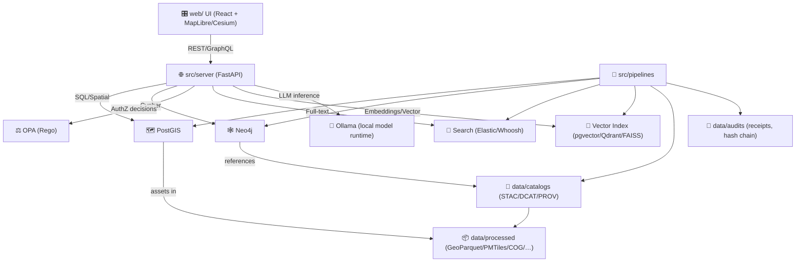
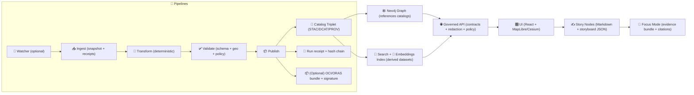

# 🧭 Kansas Frontier Matrix (KFM) — `src/` Core Code Guide


> **`src/` is KFM’s canonical home for core implementation**:  
> 🧪 deterministic pipelines • 🧾 catalog triplet writers (STAC/DCAT/PROV) • 🕸️ graph/ontology tooling • 🌐 governed API boundary • 🤖 Focus Mode orchestration (citations + refusals).  
> If you change code here, you’re changing **governed systems** — every change must produce **auditable evidence** (receipts, hashes, policy decisions, lineage).

---

## 🧭 Quick Navigation

- 🎯 [What `src/` owns](#-what-src-owns)
- 🚦 [Non-negotiables](#-non-negotiables-v13-invariants)
- 🗂️ [Repo context](#️-repo-context-v13-layout)
- 🧩 [Core runtime stack](#-core-runtime-stack)
- 🧾 [Contracts & boundary artifacts](#-contracts--boundary-artifacts)
- 🧪🕸️🌐 [`src/` layout](#️-src-layout-recommended)
- 🔁 [Canonical pipeline](#-the-canonical-pipeline)
- 🧪 [Pipelines playbook](#-pipelines-playbook-srcpipelines)
- 📦 [Data products & formats](#-data-products--formats)
- 🕸️ [Graph playbook](#️-graph-playbook-srcgraph)
- 🌐 [Server playbook](#-server-playbook-srcserver)
- 🤖 [Focus Mode contract](#-focus-mode-contract-srcserverai)
- 🧾 [Governance ledger & receipts](#-governance-ledger--receipts)
- ⚖️ [Policy pack & quality gates](#️-policy-pack--quality-gates)
- 🚀 [Golden paths](#-golden-paths)
- 🧪 [Testing & validation matrix](#-testing--validation-matrix-recommended)
- 🔐 [Security, privacy, and inference control](#-security-privacy-and-inference-control-dont-skip)
- ✅ [Definition of Done](#-definition-of-done-for-src-prs)
- 📚 [Reference library](#-reference-library)

---

## 🎯 What `src/` owns

| Area | `src/` owns it | Boundary notes |
|---|---:|---|
| 🧪 Deterministic ETL pipelines | ✅ | Replayable + idempotent; config-driven; no ad-hoc edits |
| 🧾 **Boundary artifacts** (STAC/DCAT/PROV) | ✅ | Must exist **before** graph/UI/story/focus use |
| 📦 Artifact packaging (optional) | ✅ | OCI/ORAS bundles + signatures (Cosign) for releases/seed |
| 🕸️ Knowledge graph integration + integrity | ✅ | Ontology stability + migrations; prevent orphan/drift |
| 🔎 Search + indexing hooks | ✅ | Full-text index + embeddings index are downstream of catalogs |
| 🌐 Governed API + redaction layer | ✅ | UI must not talk to Neo4j directly |
| 🤖 Focus Mode orchestration + citations | ✅ | Hybrid retrieval; citations required; refuse when missing |
| 🧾 Governance ledger / receipts emitters | ✅ | Append-only evidence for pipelines + AI answers |
| 🎛️ UI (React/MapLibre/Cesium) | ❌ | Canonical home: `web/` |
| ✍️ Story Nodes (narratives) | ❌ | Canonical home: `docs/reports/story_nodes/` |
| 🗃️ Data artifacts & catalogs | ❌ | Canonical home: `data/` (raw/work/processed + catalogs + audits) |
| 🧪 Notebooks / experiments | ❌ | Canonical home: `mcp/` (methods + computational experiments) |

---

## 🚦 Non-negotiables (v13 invariants)

> [!IMPORTANT]
> These are **hard gates** (design + CI). If you violate them, you’re not “almost done” — you’re blocked.

1) **Pipeline ordering is absolute** 🧱  
`ETL → Catalogs (STAC/DCAT/PROV) → Graph → API → UI → Story Nodes → Focus Mode`

2) **API boundary rule** 🚧  
Frontend **must never query Neo4j directly**. All graph access goes through `src/server/` for contracts + policy + redaction.

3) **Provenance-first publishing** 🧾  
No dataset is “published” until it has STAC + DCAT + PROV **and passes validation**.

4) **Evidence-first narrative + AI** 📌  
Story Nodes and Focus Mode must never introduce unsourced claims. If evidence is missing: **refuse**.

5) **Fail-closed policy gates** 🔒  
Missing license, missing CRS, missing provenance, schema drift, missing citations, secrets leakage → **block merge/publish**.

6) **Sovereignty & classification propagation** 🪶  
Outputs cannot be less restricted than inputs. Redaction + approvals propagate end-to-end (pipelines → graph → API → AI).

7) **“Performance artifacts” are still governed** ⚡  
PMTiles, caches, embeddings, summaries, indexes, thumbnails… are **derived datasets** → must be cataloged + traced (PROV) + policy-checked.

---

## 🗂️ Repo context (v13 layout)

`src/` lives inside a larger “contracts + data + narrative” repo:

```text
📁 schemas/                  # ✅ machine-validated contracts (data/api/story/ui/telemetry)
📁 src/                      # 🚀 code (pipelines/graph/server)
📁 tools/                    # 🧰 policy pack, validators, linters, helpers
📁 web/                      # 🎛️ UI (React + MapLibre + optional Cesium)
📁 data/                     # 🗃️ raw/work/processed + catalogs + audits
│  ├── raw/                  # immutable snapshots (may be DVC/LFS-backed)
│  ├── work/                 # intermediate work products
│  ├── processed/            # published artifacts (stable references)
│  ├── catalogs/             # ✅ boundary artifacts
│  │   ├── stac/
│  │   ├── dcat/
│  │   └── prov/
│  └── audits/               # run receipts, answer receipts, policy decisions, hash chains
📁 docs/                     # 📚 governance, standards, templates, story nodes, runbooks
📁 mcp/                      # 🧪 methods + computational experiments (not runtime)
📁 releases/                 # 🔏 immutable, signed build & artifact bundles (optional)
```

> [!TIP]
> **Contract-first** means: schemas/contracts change first, code follows.  
> If you’re editing code without a matching contract update, you’re likely drifting.

---

## 🧩 Core runtime stack

KFM is a **hybrid stack**: spatial DB + graph DB + search indices + policy engine + AI runtime — unified behind a governed API.



> [!NOTE]
> KFM’s philosophy: **modularity + traceability**. The API is the enforcement boundary; data stores are implementation details behind it.

---

## 🧾 Contracts & boundary artifacts

### 🧬 The “catalog triplet” is the boundary contract

KFM treats **STAC + DCAT + PROV** as the canonical handoff artifacts between pipeline ↔ graph ↔ API ↔ UI ↔ Story ↔ Focus Mode.

✅ Expectations:
- **STAC** describes spatial/temporal assets and links to actual files/endpoints.
- **DCAT** makes datasets discoverable and harvestable (external catalogs can index it).
- **PROV** captures lineage (raw → work → processed) including pipeline run IDs/config/agents.

> [!IMPORTANT]
> If a dataset exists without the triplet, it does **not** exist (for KFM).

### 🔗 Cross-layer linkage rules (must hold)

- STAC Items → **assets** in `data/processed/**` (or stable object storage)  
- DCAT → **distributions** that point to STAC and/or direct downloads  
- PROV → full chain: **raw inputs → transforms → outputs**, with run ID + commit hash  
- Graph → references catalog IDs (don’t duplicate large payloads)

### 🧷 Stable IDs & hashes

To keep everything rebuildable + auditable:
- 🧾 Every artifact should have a **SHA-256 digest** recorded.
- 🧾 Every run should emit a **run receipt** with:
  - input URIs + hashes
  - config hash
  - output paths + hashes
  - validation results
  - policy decision summary
  - code version (commit/build)

> [!TIP]
> Prefer **content-addressable IDs** for releases (digest-based tags), and keep “latest” as a floating pointer only.

---

## 🗂️ `src/` layout (recommended)

> [!NOTE]
> Top-level `src/` boundaries are stable. Subfolders may evolve, but keep contracts clean.

```text
src/
├── 🧪 pipelines/                          # watcher → ingest → validate → transform → publish
│   ├── 🗂️ <domain_or_product>/            # one pipeline per domain/product (config-driven)
│   │   ├── 👀 watcher.py                  # optional: detect upstream change (ETag/Last-Modified)
│   │   ├── 📥 ingest.py                   # acquire inputs (snapshots + receipts)
│   │   ├── 🧪 transform.py                # raw → work → processed (deterministic)
│   │   ├── ✅ validate.py                 # schema + geo + policy checks (fail-closed)
│   │   ├── 🧠 index.py                    # optional: build search + embeddings indexes
│   │   ├── 🕸️ load_graph.py               # optional: catalogs → graph mappings
│   │   ├── 📦 publish.py                  # emit catalogs + run receipts + (optional) OCI bundle
│   │   └── ⚙️ configs/                    # configs only (NO secrets)
│   └── ♻️ _shared/                        # pipeline utilities (single source of truth)
│       ├── 🧰 io/                         # canonical paths + atomic writes + receipts
│       ├── 🔐 hashing/                    # SHA-256, stable IDs, content addressing
│       ├── 🧾 catalogs/                   # STAC/DCAT/PROV writers + validators
│       ├── ✅ validators/                 # schema/link/geo sanity + policy hooks
│       ├── 🧩 artifacts/                  # ORAS/OCI packaging helpers (optional)
│       └── 🧾 audit/                      # run receipts + hash chain writer
│
├── 🕸️ graph/
│   ├── 🧠 ontology/                       # vocab + mappings + versioned ontology definitions
│   ├── 🔁 migrations/                     # explicit migrations (no silent breaking changes)
│   ├── 🛡️ integrity/                      # constraints + drift detection + QA reports
│   ├── 📥 loaders/                        # STAC/DCAT/PROV → graph (mapping + normalization)
│   └── 📤 exports/                        # graph → digestable outputs (JSON-LD, UI bundles)
│
└── 🌐 server/
    ├── 🌐 api/                            # REST routers/controllers (thin)
    ├── 🧬 graphql/                        # GraphQL schema/resolvers (optional; governed)
    ├── 🧩 services/                       # use-cases (search, tiles, story, focus, redaction)
    ├── 🧠 domain/                         # pure logic: entities + rules (no DB/HTTP)
    ├── 🧷 adapters/                       # ports/adapters perimeter
    │   ├── 📤 outbound/                   # PostGIS/Neo4j/OPA/Search/Ollama clients
    │   └── 📥 inbound/                    # queues/webhooks/streams (if used)
    ├── 🤖 ai/                             # Focus Mode (RAG + citations + answer receipts)
    │   ├── 🚪 prompt_gate.py              # input sanitization + injection detection
    │   ├── 🔎 retrieval.py                # hybrid retrieval orchestration
    │   ├── 🧠 embeddings.py               # embedding + vector store operations
    │   ├── 🦙 ollama_client.py            # local model runtime client
    │   ├── 🧾 citations.py                # citation validation + rendering
    │   ├── ⚖️ policy_checks.py            # OPA checks on inputs/outputs
    │   └── 🧾 answer_receipts.py          # audit log + governance ledger emit
    ├── 🔐 auth/                           # RBAC/ABAC scopes + token validation + policy scopes
    ├── ⚖️ policy/                         # OPA wiring, policy version/hash, decision logs
    ├── 📈 observability/                  # tracing, metrics, structured logs
    └── 🧱 middleware/                     # request IDs, rate limits, error mapping, CORS
```

---

## 🔁 The canonical pipeline

KFM is designed so **each stage consumes validated artifacts from the stage before it**.



> [!IMPORTANT]
> The **catalog triplet** is the “boundary artifact” contract.  
> Graph, API, UI, Story Nodes, and Focus Mode must link back to cataloged sources.

---

## 🧱 Architecture mental model (how to code inside `src/`)

KFM’s implementation style is **clean, contract-driven, and evidence-led**:

- 🧠 **Domain layer**: entities + rules (pure code; no DB/HTTP)
- 🧩 **Service layer**: use-cases/orchestration (calls ports, returns results)
- 🧷 **Ports (interfaces)**: abstractions for PostGIS/Neo4j/policy/search/caches
- 📦 **Adapters**: actual implementations (Neo4j driver, SQLAlchemy, HTTP clients)

> [!TIP]
> If you’re about to import a database client inside `src/server/domain/`… stop 🛑  
> That’s a boundary violation. Move it to an adapter and depend on a port/interface.

---

## 🧪 Pipelines playbook (`src/pipelines/`)

### ✅ Core guarantees

A pipeline is “KFM-valid” only if it is:

- 🔁 **Deterministic**: same inputs + same config → same outputs (or explainable diff)
- ♻️ **Idempotent**: reruns don’t duplicate or corrupt state
- 🧾 **Accountable**: emits receipts + hashes + run identifiers
- ✅ **Validated**: schema + geo checks + policy pack checks (**fail closed**)
- 🧷 **Cataloged**: produces STAC/DCAT/PROV at publish time
- 🔏 **Verifiable (recommended)**: publish step can produce signed artifacts / attestations

### 👀 Watcher → Planner → Executor pattern (automation-ready)

Many domains benefit from a “detect → plan → execute” loop:
- **Watcher** notices upstream changes (ETag, Last-Modified, checksum changes, schema drift)
- **Planner** proposes a controlled update plan (mapping changes, migrations, policy impacts)
- **Executor** runs the pipeline, generates receipts, and (optionally) opens a PR with changes

> [!NOTE]
> Automation is allowed **only** if it produces the same evidence as humans do — and remains reviewable.

### 📦 Staging rules (do not improvise)

- `data/raw/<domain>/` → immutable snapshots (store original receipts/metadata)
- `data/work/<domain>/` → intermediate work products (throwaway but logged)
- `data/processed/<domain>/` → final published artifacts (stable & referenced)
- `data/catalogs/stac/` + `data/catalogs/dcat/` + `data/catalogs/prov/` → boundary artifacts
- `data/audits/` → run receipts + policy decisions + hash chain

### 🧾 Run manifests (evidence ledger)

Every `publish.py` should emit a compact run record that answers:
- what inputs were used (URIs + hashes + timestamps)
- what configs/params were applied (config hash)
- what outputs were produced (paths + hashes + record counts)
- what validations passed/failed
- what policy gates were checked (policy hash + decision summary)
- what commit/build produced the run

> [!TIP]
> A run receipt is your “rebuild contract.” If a third party can’t reproduce the run from the receipt, the pipeline isn’t done.

---

## 📦 Data products & formats

KFM explicitly supports **multiple representations** of the same dataset to serve different needs — as long as they remain traceable and governed.

### ⚡ Dual-format vector pattern (recommended)

For many vector layers, publish:
- 🧠 **GeoParquet** (analysis-friendly, columnar, fast scans)
- 🗺️ **PMTiles** (UI-friendly, pre-generated vector tiles)

✅ Both must:
- share the same dataset identity + catalog metadata
- have explicit PROV lineage (PMTiles derived from GeoParquet or same upstream)
- be policy-checked and hash-addressable

> [!NOTE]
> Example pattern: publish a full-fidelity GeoParquet for analytics and a PMTiles archive for the map UI — both cataloged under the same dataset metadata and traceable via hashes.

### 🌄 Raster pattern (recommended)

- 🌄 Cloud-Optimized GeoTIFF (COG) + overviews/pyramids
- Optional: pre-generated tile caches (treated as derived datasets)

### 📄 Documents / OCR / transcripts

Treat text corpora as datasets:
- extracted text is a processed artifact
- OCR configs are part of provenance
- citations in AI must resolve back to the source doc and extraction run

### 📈 Derived analytics outputs

Simulations, models, summaries, indices, embeddings:
- are first-class datasets
- must have PROV linking to source datasets + code version
- must be rebuildable (or explicitly labeled as non-reproducible with rationale)

---

## 🕸️ Graph playbook (`src/graph/`)

### 🧠 Ontology first (and versioned)

- ontology defines node labels, relationship types, and key properties
- changes must be explicit and **migration-backed**
- prefer alignment with standard ontologies where it helps interoperability:
  - 🏛️ CIDOC-CRM (cultural heritage)
  - 🗺️ GeoSPARQL (geospatial semantics)
  - 🧾 PROV-O (lineage semantics)
  - ⏱️ OWL-Time (temporal modeling)

> [!IMPORTANT]
> The graph models **relationships**, not bulk storage.  
> The “source of truth” for data assets is catalogs + processed artifacts.

### 🔁 Migrations are mandatory for breaking changes

- no “silent” ontology drift
- prefer **forward-only** migrations
- keep a migration index + version history

### 🛡️ Integrity checks are normal operation

Examples:
- prevent orphan nodes / dangling relationships
- ensure required properties exist
- ensure graph nodes reference catalog IDs (STAC/DCAT/PROV) rather than duplicating payloads
- ensure classification tags propagate (e.g., “sensitive_location”)
- ensure graph relationships remain valid across updates

### 🪶 Sensitive location handling (don’t leak)

Certain nodes/edges may be restricted:
- protected site coordinates may be generalized (e.g., bounding box / grid cell)
- raw coordinates may be stored only in restricted layers and never returned to UI/AI without permission
- redaction must be enforced server-side

---

## 🌐 Server playbook (`src/server/`)

### 🎛️ API is the governance boundary

The API layer is responsible for:
- ✅ contract validation (OpenAPI / GraphQL schema)
- 🔒 policy enforcement (OPA decisions, redaction, classification)
- 🧾 provenance linkage (responses can point to catalog/source artifacts)
- 🧭 consistent query semantics (stable behavior for UI + AI)
- 📈 auditability (policy decision logs + request IDs)

> [!IMPORTANT]
> UI → API → (PostGIS/Neo4j/catalogs/search).  
> **No direct UI→Neo4j**.

### 🧬 REST + GraphQL (both are valid, both must be governed)

Typical split:
- REST: tiles, downloads, health, auth, simple lookups
- GraphQL: rich entity graphs, cross-domain discovery, composition

✅ Governance requirements:
- depth/cost limits (GraphQL)
- query allowlists for expensive paths (optional)
- redaction & policy checks in every resolver/service path

### 🗺️ Geospatial endpoints (typical)

Examples of API responsibilities (details vary per deployment):
- vector tiles (`/tiles/{layer}/{z}/{x}/{y}.pbf`) and raster tiles
- spatial search (bbox, radius, polygon)
- temporal filters (timeline window / time slider)
- layer registry + metadata lookups (ties to STAC/DCAT)
- story node retrieval (Markdown + storyboard JSON)
- evidence panel queries (show provenance + source links)

### 🧭 Time as a first-class dimension (UI contract dependency)

The UI can drive a timeline slider / 4D map:
- server must support time filters for time-enabled layers
- server can provide event markers (for story timelines) derived from graph/datasets
- avoid expensive re-queries by scoping time filters to time-aware layers only

---

## 🤖 Focus Mode contract (`src/server/ai/`)

Focus Mode is a **hybrid retrieval** pipeline:
- 🔎 pulls structured context (Neo4j + PostGIS)
- 🔎 pulls text context (search index: Elastic/Whoosh)
- 🧠 pulls semantic context (vector similarity embeddings)
- 🧾 builds a **context bundle** with links + citations
- ✍️ generates an answer that **must cite evidence**
- 🛑 refuses when evidence is missing or policy blocks access

### 🔒 Prompt security & guardrails (least privilege)

Focus Mode must implement:
- 🚪 **Prompt Gate**: input filtering + sanitization + injection detection
- 🧰 **Tool allow/deny lists**: default-deny; no internet/filesystem access
- ⚖️ **OPA output checks**: run policies on draft answers; block/redact/fallback

> [!IMPORTANT]
> Treat the AI subsystem as **potentially untrusted code**: isolate it, least-privilege it, log it.

### ✅ Hard requirements

- **No citations → no answer** (fail closed)
- citations must resolve to cataloged sources / datasets / documents
- policy + redaction must apply **before** prompt assembly
- return **answer receipts** for auditability (inputs + sources + policy decisions)

### 🧾 Answer receipts (what gets logged)

At minimum:
- request ID, user scope, policy hash + decision summary
- retrieval sources list (dataset IDs, doc IDs, graph node IDs)
- content hashes of retrieved snippets (or stable pointers)
- model version + parameters (temperature, context length)
- final citations list (resolvable IDs)
- refusal reason (if refused)

### 🦙 Ollama integration (local model runtime)

Focus Mode may run fully local via Ollama:
- use a configurable generation model (LLM)
- use a configurable embeddings model
- keep model selection behind a port/interface so cloud or other runtimes can swap in

Recommended config surface:
- `OLLAMA_HOST`
- `OLLAMA_MODEL`
- `OLLAMA_EMBED_MODEL`
- `FOCUS_TOP_K`, `FOCUS_MAX_CONTEXT_TOKENS`, `FOCUS_MIN_CITATIONS`

> [!TIP]
> Enforce “citations required” at multiple layers: prompt template + citation validator + OPA output policy.

---

## 🧾 Governance ledger & receipts

KFM maintains auditability through **append-only receipts**:
- 🧪 pipeline run receipts (data transformations)
- 🤖 answer receipts (AI interactions)
- ⚖️ policy decisions (OPA results + policy version/hash)
- 🔐 artifact integrity info (hashes + optional signatures)

Recommended properties:
- append-only storage (no edits)
- hash-chain entries (tamper-evident)
- stable IDs that link receipts ↔ PROV ↔ catalogs ↔ graph nodes

> [!NOTE]
> If a user asks “How do you know that?”, KFM should be able to answer with **links + receipts**, not vibes.

---

## ⚖️ Policy pack & quality gates

KFM governance is enforced via:
- **OPA (Rego policies)** + **Conftest** (CI evaluation)
- schema validators for STAC/DCAT/PROV + internal contracts
- security scanning (secrets, dependency health, artifacts integrity)
- geo validation (CRS, geometry validity, bounds sanity)

Example policy classes:
- 📜 **Data**: license required; CRS required; sensitivity restrictions; link integrity
- 🤖 **AI**: “answers must include citations”; “no disallowed outputs”; “tool use must be allowlisted”
- 🧑‍💻 **Dev**: no secrets; review required; lint/tests required; SBOM generated (recommended)

### 🔏 Supply chain integrity (recommended for releases)

- build artifacts with SBOM
- sign artifacts (Cosign/Sigstore) and verify in release workflows
- attach provenance attestations (SLSA-style) stating: pipeline X + code version Y produced artifact Z

> [!IMPORTANT]
> CI follows **Detect → Validate → Promote**.  
> If Validate fails, Promote does not happen. No exceptions without governance approval.

---

## 🚀 Golden paths

> [!TIP]
> These are the “happy path” workflows. If your change doesn’t fit, stop and document why.

<details>
<summary><strong>🧪 Add a new data domain (Watcher → ETL → catalogs → graph → API)</strong></summary>

**1) Create the pipeline skeleton**
- `src/pipelines/<new-domain>/watcher.py` *(optional)*
- `src/pipelines/<new-domain>/ingest.py`
- `src/pipelines/<new-domain>/transform.py`
- `src/pipelines/<new-domain>/validate.py`
- `src/pipelines/<new-domain>/publish.py`
- `src/pipelines/<new-domain>/configs/`

**2) Add staging paths**
- `data/raw/<new-domain>/`
- `data/work/<new-domain>/`
- `data/processed/<new-domain>/`

**3) Publish boundary artifacts**
- `data/catalogs/stac/...`
- `data/catalogs/dcat/...`
- `data/catalogs/prov/...`
- `data/audits/...` (run receipts)

**4) Add runbook**
- `docs/data/<new-domain>/README.md` (sources, caveats, methods, ethics)

**5) Integrate graph**
- add loader mapping only after catalogs exist
- graph nodes point to catalog IDs

**6) Expose via API**
- add endpoint(s) in `src/server/api/`
- add service in `src/server/services/`
- add policy checks + redaction if needed

</details>

<details>
<summary><strong>🕸️ Change the graph schema safely</strong></summary>

- update ontology definition (version it)
- add a migration in `src/graph/migrations/`
- add/adjust integrity checks in `src/graph/integrity/`
- update API contract if shape changes
- update UI contracts (if applicable) — but keep UI work in `web/`

</details>

<details>
<summary><strong>🌐 Add a new API endpoint (contract-first)</strong></summary>

- update the contract (OpenAPI/GraphQL) first
- implement handler (thin)
- implement service/use-case (business logic)
- add adapter changes as needed (Neo4j/PostGIS/OPA/Search)
- add contract tests + policy tests
- ensure response contains provenance links when relevant

</details>

<details>
<summary><strong>🤖 Extend Focus Mode retrieval</strong></summary>

- define what evidence counts (cataloged datasets/docs only)
- implement retriever behind a port (adapter pattern)
- enforce policy/redaction before prompt assembly
- require citations for every non-trivial claim
- log an answer receipt (sources + hashes + policy decisions)

</details>

<details>
<summary><strong>📦 Publish a signed dataset bundle (optional, release-grade)</strong></summary>

- publish GeoParquet + PMTiles (or COG + tiles) to `data/processed/`
- emit STAC/DCAT/PROV
- bundle artifacts with ORAS into an OCI registry tag (digest-based)
- sign with Cosign
- write distributions into DCAT pointing to OCI pull URLs and/or downloads

</details>

---

## 🧪 Testing & validation matrix (recommended)

| Layer | What to test | Where |
|---|---|---|
| 🧪 Pipelines | determinism, idempotency, schema/geo validation, policy checks | `pytest` + CI |
| 🧾 Catalogs | STAC/DCAT/PROV validity; link integrity; profile compliance | `tools/validation/` + CI |
| 🕸️ Graph | migrations, constraints, integrity checks | `src/graph/integrity/` + CI |
| 🌐 API | contract tests, auth/policy checks, redaction correctness | `src/server/tests/` + CI |
| 🤖 Focus Mode | citation presence, refusal behavior, prompt gate, policy gates | `src/server/ai/tests/` + CI |
| 🔏 Releases | SBOM generation, signature verify, artifact integrity | `releases/` workflows |

---

## 🔐 Security, privacy, and inference control (don’t skip)

- 🔑 **No secrets in repo** (configs are non-secret; secrets come from env/secret manager)
- 🪪 **AuthZ everywhere** (RBAC/ABAC + OPA decisions)
- 🧼 **Redaction is server-side** (UI should not “self-police”)
- 🧠 **Inference risk exists** even if you hide raw values  
  Use privacy-preserving controls when needed:
  - k-anonymity / l-diversity / t-closeness
  - differential privacy (where appropriate)
  - query auditing + inference control for sensitive outputs
- 🧭 **Sensitive locations**: never return precise coordinates unless permitted (generalize/aggregate)

> [!IMPORTANT]
> If a dataset is sensitive, its derivatives **inherit** restrictions unless governance approves release.

---

## ✅ Definition of Done for `src/` PRs

- [ ] Pipelines are deterministic + idempotent (re-run safe)
- [ ] STAC/DCAT/PROV emitted/updated **before** graph/UI/story use
- [ ] Run receipts emitted (inputs/outputs/hashes/config/policy decisions)
- [ ] Dual-format artifacts cataloged (e.g., GeoParquet + PMTiles) when applicable
- [ ] Graph changes include migrations + integrity checks (when needed)
- [ ] API changes are contract-first and versioned (no silent breakage)
- [ ] Policy gates pass (license, provenance, schema, citations, security)
- [ ] If Focus Mode changed: answers still cite sources or refuse (fail closed)
- [ ] Telemetry/logging added for new critical paths (audit-ready)
- [ ] (Release-grade) artifacts are signable/verifiable (SBOM + signature checks)

---

## 📚 Reference library

### 🧭 Canonical KFM docs (read these first)
- 📘 `docs/MASTER_GUIDE_v13.md` (canonical pipeline + invariants + repo contracts)
- 🏗️ `docs/architecture/` (platform architecture, roadmap, subsystem contracts)
- 🤖 `docs/ai/` (Focus Mode rules, evaluation, telemetry expectations)
- 🖥️ `docs/ui/` (UI integration constraints + layer registry expectations)
- ⚖️ `docs/governance/` (FAIR+CARE, ethics, sovereignty, review triggers)
- ✍️ `docs/templates/` (Universal doc, Story Node, API contract extension templates)
- 📏 `docs/standards/` (KFM_STAC_PROFILE / KFM_DCAT_PROFILE / KFM_PROV_PROFILE / Markdown work protocol)

### 🧾 Project PDF bundles (architecture + implementation guidance)
These PDFs are “source-of-truth style” design references for v13+ patterns (contracts, governance, AI, UI, infra):
- 🧭 Kansas Frontier Matrix — **Expanded Technical & Design Guide**
- 🧭 Kansas Frontier Matrix — **Comprehensive Technical Documentation**
- 🧭 Kansas Frontier Matrix — **Comprehensive Platform Overview and Roadmap**
- 🧭 Kansas Frontier Matrix — **Comprehensive Architecture, Features, and Design**
- 🧭 Kansas Frontier Matrix — **Comprehensive UI System Overview (Technical Architecture Guide)**
- 🧭 Kansas Frontier Matrix — **AI System Overview 🧭🤖**
- 🦙 KFM AI Infrastructure — **Ollama Integration Overview**

### 📚 Research portfolios (reference-only, not runtime)
These are **idea libraries** for implementation choices (GIS, WebGL, security, data science).  
They are not runtime dependencies, but they influence patterns and guardrails.

- 🗺️ Web mapping & virtual worlds portfolio (MapLibre/Cesium/WebGL ecosystem)
- 🧠 AI/ML concept portfolio (modeling patterns, evaluation ideas)
- 🗄️ Data management + architectures + Bayesian methods portfolio
- 🧰 Programming resources portfolio (Git/Docker/GraphQL/security/tooling)
- 📍 Geospatial analysis cookbook (Python/PostGIS/GDAL recipes)
- 🧪 Scientific method + engineering rigor protocol (reproducibility culture)
- 🔐 Data mining & privacy references (inference control, auditing, DP concepts)

---

## 🧭 If you only remember one thing…

> [!IMPORTANT]
> **In KFM, code is not “done” until it produces evidence.**  
> If your change creates or transforms data, it must emit **STAC/DCAT/PROV**, pass policy gates, and remain replayable — before it can reach graph, API, UI, stories, or Focus Mode.