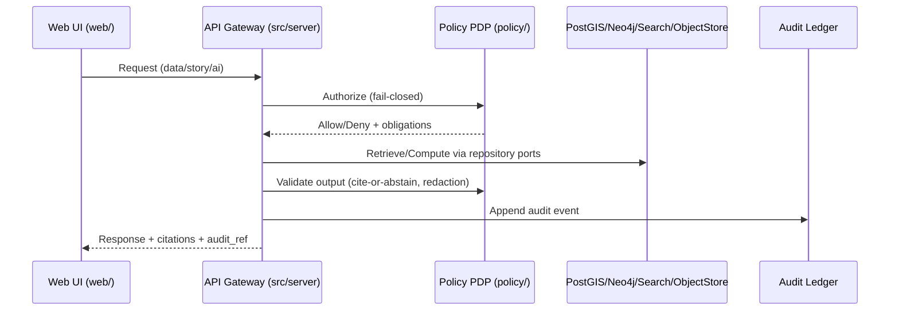
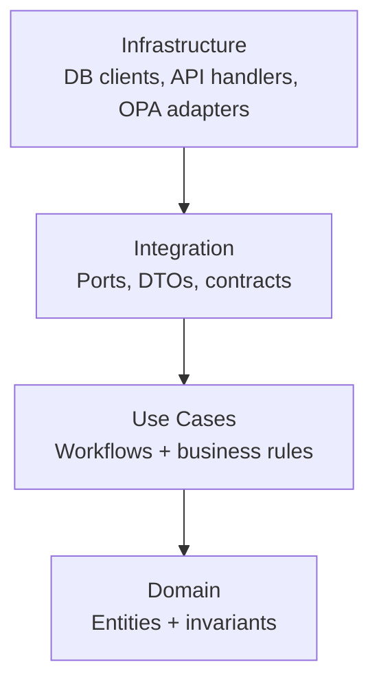

<!--
File: src/README.md
Purpose: Canonical, “don’t leave anything out” README for all governed backend code living under /src.
This README is a GOVERNED artifact: changes should be reviewed as “production changes” because they can alter trust guarantees.
-->

# 🧭 KFM `src/` — Governed Backend, Pipelines, and Graph


`src/` is the **single canonical home** for KFM’s *server-side* code: the **API backend**, **data pipelines**, and **knowledge graph build/sync** logic.

This folder is where KFM’s credibility guarantees are enforced in code:
- **Trust membrane:** the UI never hits databases directly; everything flows through the governed API + policy boundary.
- **Fail-closed policy:** every request is authorized; denials are default behavior.
- **Evidence-first:** outputs must be grounded; Focus Mode answers must include citations *or abstain*.
- **Auditability:** normal request paths emit audit + provenance signals.

---

## Table of contents

- [1. Non‑negotiables (what must always remain true)](#1-nonnegotiables-what-must-always-remain-true)
- [2. What belongs in `src/` (and what does not)](#2-what-belongs-in-src-and-what-does-not)
- [3. Repo context (how `src/` fits the top-level layout)](#3-repo-context-how-src-fits-the-toplevel-layout)
- [4. Canonical directory layout (the one source of truth)](#4-canonical-directory-layout-the-one-source-of-truth)
- [5. Architecture contract (clean layers + trust membrane)](#5-architecture-contract-clean-layers--trust-membrane)
- [6. Subsystems](#6-subsystems)
  - [6.1 `src/server/` — Governed API](#61-srcserver--governed-api)
  - [6.2 `src/pipelines/` — Ingestion + processing + catalogs](#62-srcpipelines--ingestion--processing--catalogs)
  - [6.3 `src/graph/` — Knowledge graph build/sync](#63-srcgraph--knowledge-graph-buildsync)
- [7. Evidence & provenance (first-class artifacts)](#7-evidence--provenance-firstclass-artifacts)
- [8. Policy-as-code integration (OPA)](#8-policyascode-integration-opa)
- [9. Testing strategy (required test types)](#9-testing-strategy-required-test-types)
- [10. Local development (minimum supported workflow)](#10-local-development-minimum-supported-workflow)
- [11. How to add things safely (extension playbooks)](#11-how-to-add-things-safely-extension-playbooks)
- [12. CI / governance gates for `src/` changes](#12-ci--governance-gates-for-src-changes)
- [13. Security & secrets (do not leak)](#13-security--secrets-do-not-leak)
- [14. Troubleshooting](#14-troubleshooting)
- [15. Glossary](#15-glossary)

---

## 1. Non‑negotiables (what must always remain true)

> [!IMPORTANT]
> If you change code in `src/` in a way that breaks any invariant below, treat it as a **governance incident** until fixed.

### System invariants enforced by `src/`

| Invariant | What it means in code | Where it is enforced |
|---|---|---|
| **No UI direct DB access** | Frontend clients never connect to PostGIS/Neo4j/Search/ObjectStore directly | By design (network isolation) + API-only data exposure via `src/server/` |
| **Policy evaluates every request** | Every data/story/AI request is authorized; default deny | `src/server/` policy middleware / policy port |
| **Focus Mode must cite or abstain** | AI answers must include resolvable citations or refuse to answer | `src/server/` Focus Mode pipeline + output validation |
| **Audit is on the hot path** | Each request yields an `audit_ref` and stores an audit event | `src/server/` audit port/adapter + audit ledger |
| **Dataset promotion is gated** | Raw → Work → Processed requires checksums + STAC/DCAT/PROV + validation | `src/pipelines/` promotion gates + CI |

---

## 2. What belongs in `src/` (and what does not)

### ✅ Belongs in `src/`

- **API backend** (REST; optional GraphQL) including contract definitions.
- **Data ingestion / ETL / processing** code, including catalog writing (DCAT/STAC/PROV) and validation gates.
- **Graph build + sync** code (ontology application, migrations, sync jobs).
- Shared governed libraries that support the above (ID rules, time model utilities, provenance helpers, etc.).

### ❌ Does not belong in `src/`

- UI code → **`/web/`** (React/TypeScript + Map components)
- OPA policies → **`/policy/`**
- Raw/processed data → **`/data/`**
- Governed narratives (Story Nodes) → **`/docs/…/story_nodes/`** (see project docs for exact path)

If you’re about to add server logic outside `src/`, stop. This is the canonical home.

---

## 3. Repo context (how `src/` fits the top-level layout)

KFM is organized so each major subsystem has **one canonical home** to prevent drift and duplicate implementations.

```
repo/
├─ data/        # raw/work/processed + catalogs + checksums
├─ docs/        # governed docs + Story Nodes + templates + standards
├─ src/         # (YOU ARE HERE) backend code: server + pipelines + graph
├─ web/         # React UI (never direct DB)
├─ policy/      # OPA/Rego policies (default deny)
└─ .github/     # CI workflows enforcing governance gates
```

---

## 4. Canonical directory layout (the one source of truth)

> [!NOTE]
> The *exact* file names may differ, but the **roles and boundaries** below must hold.

### 4.1 `src/` top-level structure

```
src/
├─ server/                 # Governed API layer (REST + optional GraphQL)
│  ├─ contracts/           # OpenAPI YAML, GraphQL SDL, JSON Schemas (request/response)
│  ├─ domain/              # Entities/value objects + invariants (pure)
│  ├─ usecases/            # Workflows + business rules (ports only)
│  ├─ integration/         # Ports/contracts + DTOs + schema-bound models
│  ├─ infrastructure/      # DB clients, API handlers, OPA adapters, repo implementations
│  ├─ tests/               # Unit/usecase/contract/integration tests (see §9)
│  └─ README.md            # Server-specific details (this README remains the umbrella)
│
├─ pipelines/              # All ingestion/ETL/catalog code (and only ETL/catalog code)
│  ├─ connectors/          # Per-source adapters implementing the connector contract
│  ├─ catalogs/            # DCAT/STAC/PROV writers + link-check utilities
│  ├─ validation/          # Schema/geo/time/license/policy validation gates
│  ├─ promotion/           # Raw→Work→Processed promotion logic (CI-enforced)
│  ├─ registry/            # Dataset registry + connector configuration
│  ├─ tests/               # Unit/integration/regression tests for pipelines
│  └─ README.md
│
├─ graph/                  # Graph initialization + migrations + sync jobs
│  ├─ ontology/            # Ontology definitions / mappings
│  ├─ migrations/          # Cypher migrations / versioned schema changes
│  ├─ sync/                # Jobs to sync entities/events/artifacts into graph
│  ├─ tests/
│  └─ README.md
│
└─ shared/                 # Shared utilities used across server/pipelines/graph (keep small)
   ├─ ids/                 # deterministic IDs, hashing, stable identifiers
   ├─ time/                # time model helpers (intervals, uncertainty)
   ├─ provenance/          # PROV helpers, evidence bundle helpers
   └─ README.md
```

### 4.2 “No duplicates” rule

- There must not be both `src/api/` and `src/server/`—server API code lives in **`src/server/`** only.
- ETL logic must not be scattered across `tools/`, `scripts/`, random folders, etc. If it ingests/transforms/promotes data, it belongs in **`src/pipelines/`**.

---

## 5. Architecture contract (clean layers + trust membrane)

### 5.1 Trust membrane (runtime flow)

**The core runtime sequence (conceptual):**



### 5.2 Clean layers (dependency rules)

KFM uses a clean architecture layout that prevents accidental bypass of governance and audit logic.

**Layering rule:** dependencies point inward only.



#### Allowed dependencies

| Layer | May import | Must NOT import |
|---|---|---|
| Domain | Domain only | Usecases / Integration / Infrastructure / external frameworks |
| Usecases | Domain + Integration (ports/DTOs) | Infrastructure details (DB, HTTP, OPA clients) |
| Integration | Domain (sometimes) | Infrastructure implementations |
| Infrastructure | All above | (Nothing forbidden, but must respect port boundaries) |

> [!WARNING]
> If you “just import the DB client” in a use case, you broke the architecture. Fix it by adding a **port** in Integration and implementing it in Infrastructure.

---

## 6. Subsystems

## 6.1 `src/server/` — Governed API

### Responsibilities

`src/server/` is the sole home for **server-side API code**. It must:
- Accept requests from UI/clients (REST; optional GraphQL).
- Enforce **policy checks** on every request (fail-closed).
- Provide **evidence-resolvable citations**.
- Emit audit events with stable `audit_ref`.

### Contracts (must be explicit + tested)

Contracts live under `src/server/contracts/`.

At minimum, Focus Mode exposes:

- `POST /api/v1/ai/query`
  - Request: `FocusQuery { question, context{ time_range, bbox, active_layers, story_node_id } }`
  - Response: `FocusAnswer { answer_markdown, citations[], audit_ref }`

> [!TIP]
> Treat contracts as “public law”: any breaking change requires a version bump and contract test updates.

### Evidence resolution requirement

Any citation reference returned by the API must be resolvable through an API endpoint scheme, e.g.:

- `prov://…`
- `stac://…`
- `dcat://…`
- `doc://…`
- `graph://…`

That means `src/server/` must provide resolvers (directly or through a resolver service) for every supported reference type.

---

## 6.2 `src/pipelines/` — Ingestion + processing + catalogs

### Responsibilities

`src/pipelines/` is the canonical home for:
- Source ingestion (batch and incremental)
- Normalization (schema, geometry, time)
- Validation gates (schema/geo/time/license/policy)
- Dataset promotion (Raw → Work → Processed)
- Catalog writing (DCAT always; STAC/PROV as applicable)
- Run records (machine-readable) that make promotions and audits reproducible

### Connector-driven ingestion (standard contract)

Every data source is implemented as a connector adapter that follows a common lifecycle:

1. **Discover** — endpoints, parameters, auth needs, capability metadata
2. **Acquire** — incremental slice fetch when possible, else snapshot+diff
3. **Normalize** — canonical encodings (UTF‑8), geometry (WGS84), time (ISO‑8601)
4. **Validate** — schema checks, geometry validity, timestamp sanity, license/policy checks
5. **Publish** — promote to Processed, update catalogs, trigger index refresh

**Do not build one-off “special scripts” outside this pattern.** If a dataset is special, document *why* and still conform to the contract.

### Promotion gates (Raw → Work → Processed)

Promotion is blocked unless:
- license is present
- sensitivity classification exists
- schema + geospatial checks pass
- checksums computed
- STAC/DCAT/PROV artifacts exist and validate
- audit event recorded
- human approval if sensitive

### Run records & validation artifacts

Pipelines should emit:
- `run_record.json` (inputs, code version, outputs, hashes)
- `validation_report.json` (what passed/failed)
- `prov_ref` or inline PROV chain

These artifacts are required to support audits and reproducibility.

---

## 6.3 `src/graph/` — Knowledge graph build/sync

### Responsibilities

`src/graph/` is the home for:
- Graph initialization and sync (ontology application, migrations, bulk import prep)
- Cypher migrations (versioned, reviewable)
- Graph refresh jobs driven by processed dataset updates

### Data placement rule

Static import data (like CSVs for nodes/edges) belongs in **`data/graph/`**, not in `src/graph/`.

---

## 7. Evidence & provenance (first-class artifacts)

KFM treats provenance as queryable, first-class data. This affects **both pipelines and server**.

### Catalog standards (what pipelines must emit)

- **DCAT**: dataset-level metadata (publisher, license, temporal/spatial coverage, update cadence)
- **STAC**: geospatial assets for map/timeline rendering (Collections + Items)
- **PROV**: lineage chain linking raw inputs → transforms → processed derivatives

### Audit ledger

The audit ledger is append-only and must support `audit_ref` lookups for:
- API responses (data/story/ai)
- Pipeline promotions
- Policy denials (for regression tracking)

---

## 8. Policy-as-code integration (OPA)

### Fail-closed expectations

- Default behavior is **deny** unless explicitly allowed.
- Policy must enforce:
  - role-based access restrictions
  - field-level redactions
  - sensitivity class restrictions
  - “sensitive-location” precision suppression/generalization
  - aggregate-only thresholds

### CI policy regression suite (non-negotiable)

Policy changes must include regression tests:
- Golden queries that leaked previously must fail forever.
- Negative tests for sensitive-location precision.
- Field-level redaction tests (owner names, small-count health/crime, exact archaeology coords, etc.).
- Audit integrity tests: every API response includes an audit ref + evidence bundle hash.

---

## 9. Testing strategy (required test types)

> [!IMPORTANT]
> The minimum bar is: unit + use case + contract + integration coverage. Missing one category is a “not ready” signal.

| Area | Test type | What it proves |
|---|---|---|
| Domain | Pure unit tests | Invariants hold; entities behave correctly |
| Usecases | Use-case tests w/ mocked ports | Business rules without infra coupling |
| Integration/contracts | Contract + schema tests | Request/response stability; validators; backward compat |
| Infrastructure | Integration + e2e smoke tests | DB/OPA/search wiring works; request path emits audit |

---

## 10. Local development (minimum supported workflow)

> [!NOTE]
> The repo’s canonical local dev stack is Docker Compose (see root README for exact commands if they differ).

Minimum workflow:
1. Copy env defaults (example pattern):
   - `cp .env.example .env`
2. Start the stack:
   - `docker compose up --build`
3. Verify:
   - API docs at `http://localhost:8000/docs`
   - UI at `http://localhost:3000`

The baseline compose stack includes (at minimum):
- `api`
- `web`
- `postgis`
- `neo4j`
- `opensearch` (or equivalent search/vector)
- `opa`

---

## 11. How to add things safely (extension playbooks)

## 11.1 Add a new dataset connector (pipelines)

**Definition of Done:**
- Connector implemented + registered in registry config
- Raw acquisition produces deterministic manifest + checksums
- Normalization emits canonical schema and/or STAC assets
- Validation gates enforced in CI
- Policy labels defined; restricted fields/locations redacted per rules
- Catalogs emitted (DCAT always; STAC/PROV as applicable) and link-check clean
- API contract tests pass for at least one representative query
- Backfill strategy documented

**Test plan (minimum):**
- Unit: mapping/type coercion, geometry validity helpers, incremental window logic
- Integration: run connector on a fixed slice; assert stable counts + checksums
- Contract: verify API response includes provenance + respects redaction
- Regression: profiling metrics stable or explainably versioned

## 11.2 Add or change an API endpoint (server)

Checklist:
- Define/update contract in `src/server/contracts/`
- Add DTOs + schema validation (request and response)
- Implement a use case (business rules) and keep it port-driven
- Implement infrastructure adapters (DB/search/graph) behind ports
- Add policy rules + policy tests (default deny)
- Ensure response includes evidence bundle + `audit_ref`
- Add/update contract tests (OpenAPI/GraphQL) + integration tests

## 11.3 Change the graph schema (graph)

Checklist:
- Add a versioned migration under `src/graph/migrations/`
- Update ontology definitions/mappings
- Add graph integrity checks (no orphan node types, relationship constraints)
- Run migration in CI (or CI smoke environment) and validate

---

## 12. CI / governance gates for `src/` changes

Any PR touching `src/` should pass:
- ✅ Unit tests (domain + usecases)
- ✅ Contract/schema tests (OpenAPI/GraphQL + JSON Schemas)
- ✅ Integration tests (DB + OPA + search/graph wiring)
- ✅ Architecture lint (no forbidden imports / layer violations)
- ✅ Policy regression suite (if policy-sensitive behavior changes)
- ✅ Provenance validation (if pipelines/catalogs change)
- ✅ “No-leak” checks (sensitive-location, restricted fields)

> [!WARNING]
> If you can’t explain how your change preserves “cite-or-abstain,” you’re not done.

---

## 13. Security & secrets (do not leak)

Rules:
- **Never** commit secrets (API keys, tokens, upstream credentials).
- Connector auth: default to none when public; otherwise store secrets in the platform secret manager (vault/cluster secrets) and inject at runtime.
- Respect provider rate limits; implement backoff and caching where appropriate.

---

## 14. Troubleshooting

Common failure modes:
- **Policy denies everything:** confirm OPA is reachable; confirm request context includes roles/claims; remember default is deny.
- **No citations returned:** Focus Mode output validation should block; fix evidence resolution first.
- **Pipeline promotion blocked:** open the validation report + catalog validators; missing license/sensitivity/policy labels are a hard stop.
- **Graph migrations drift:** ensure only one canonical migration path; never “hot patch” the graph without recording provenance.

---

## 15. Glossary

- **Trust membrane** — governed boundary where policy + audit are enforced for every request.
- **Audit ledger** — append-only log of important events; yields `audit_ref`.
- **Evidence bundle** — structured set of sources used to answer a query, with resolvable references.
- **Cite-or-abstain** — Focus Mode rule: produce citations or refuse to answer.
- **Dataset promotion** — Raw → Work → Processed; gated by validation + catalogs + checksums.

---

### References (governed design sources)

- KFM Next-Gen Blueprint & Primary Guide (internal, dated 2026‑02‑12)
- KFM Comprehensive Data Source Integration Blueprint (internal, dated 2026‑02‑12)
- MARKDOWN_GUIDE v13 (canonical subsystem homes)