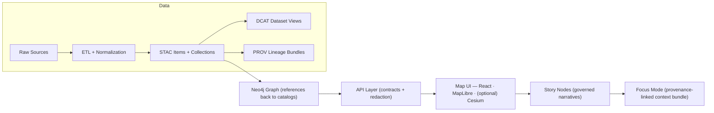

# 🧭 Kansas Frontier Matrix (KFM) — `src/` Core Code Guide


Welcome to the **canonical home for KFM’s core implementation**: deterministic ETL pipelines, knowledge graph tooling, and the governed server/API layer. In v13, the repo’s “one-home-per-subsystem” rule puts these here: `src/pipelines/`, `src/graph/`, `src/server/`. [oai_citation:0‡MARKDOWN_GUIDE_v13.md.gdoc](file-service://file-UYVruFXfueR8veHMUKeugU)

---

## 🧭 Quick Navigation

- 🧪 **Pipelines** → `src/pipelines/` (ETL, normalization, validations)
- 🕸️ **Graph** → `src/graph/` (ontology, integrity rules, import/export)
- 🌐 **Server** → `src/server/` (REST/GraphQL API, Focus Mode orchestration, redaction)
- 🧩 **Shared libs** → optional `src/shared/` (cross-cutting utilities; keep contracts clean)

---

## ✅ What `src/` is responsible for

| Area | `src/` owns it | Notes |
|---|---:|---|
| Deterministic ETL pipelines | ✅ | Must be replayable + idempotent [oai_citation:1‡MARKDOWN_GUIDE_v13.md.gdoc](file-service://file-UYVruFXfueR8veHMUKeugU) |
| Boundary metadata artifacts (STAC/DCAT/PROV) creation + validation hooks | ✅ | “Boundary artifacts” must exist before downstream use [oai_citation:2‡MARKDOWN_GUIDE_v13.md.gdoc](file-service://file-UYVruFXfueR8veHMUKeugU) |
| Knowledge graph integration + integrity | ✅ | Graph schema stability + migrations; avoid orphan nodes [oai_citation:3‡MARKDOWN_GUIDE_v13.md.gdoc](file-service://file-UYVruFXfueR8veHMUKeugU) |
| Governed API + redaction | ✅ | UI must not talk to Neo4j directly [oai_citation:4‡MARKDOWN_GUIDE_v13.md.gdoc](file-service://file-UYVruFXfueR8veHMUKeugU) |
| Focus Mode AI orchestration | ✅ | Hybrid retrieval + citations required [oai_citation:5‡Kansas Frontier Matrix (KFM) – Comprehensive Technical Documentation.pdf](file-service://file-AkqwUuYPp5zePf7pv5SMxi) |
| UI (React/MapLibre/Cesium) | ❌ | Canonical home is `web/` [oai_citation:6‡MARKDOWN_GUIDE_v13.md.gdoc](file-service://file-UYVruFXfueR8veHMUKeugU) |
| Story Node content (draft/published narratives) | ❌ | Canonical home is `docs/reports/story_nodes/` [oai_citation:7‡MARKDOWN_GUIDE_v13.md.gdoc](file-service://file-UYVruFXfueR8veHMUKeugU) |
| Data artifacts | ❌ | Canonical home is `data/` (raw/work/processed + catalogs) [oai_citation:8‡MARKDOWN_GUIDE_v13.md.gdoc](file-service://file-UYVruFXfueR8veHMUKeugU) |

---

## 🚦 Non‑negotiables (v13 invariants)

> [!IMPORTANT]
> If you change code in `src/`, you’re changing a governed pipeline. These rules are **hard gates** in CI and design.

1) **Pipeline ordering is absolute**  
ETL → Catalogs (STAC/DCAT/PROV) → Graph → API → UI → Story Nodes → Focus Mode [oai_citation:9‡MARKDOWN_GUIDE_v13.md.gdoc](file-service://file-UYVruFXfueR8veHMUKeugU)

2) **API boundary rule**  
The frontend **must never query Neo4j directly**; all access goes through `src/server/` for redaction and contract enforcement [oai_citation:10‡MARKDOWN_GUIDE_v13.md.gdoc](file-service://file-UYVruFXfueR8veHMUKeugU)

3) **Provenance-first publishing**  
Data must be registered with STAC/DCAT and a PROV lineage record before it can be graph/UI/story referenced [oai_citation:11‡MARKDOWN_GUIDE_v13.md.gdoc](file-service://file-UYVruFXfueR8veHMUKeugU)

4) **Evidence-first narrative**  
No unsourced narrative in Story Nodes or Focus Mode; AI must not introduce uncited claims [oai_citation:12‡MARKDOWN_GUIDE_v13.md.gdoc](file-service://file-UYVruFXfueR8veHMUKeugU)

5) **Fail closed**  
If a gate fails (license missing, provenance incomplete, schema invalid, citations absent), it’s blocked from merge/publish [oai_citation:13‡Kansas Frontier Matrix (KFM) – Comprehensive Architecture, Features, and Design.pdf](file-service://file-4Umt1yHoGKicdmLWzFJ9sC)

---

## 🗂️ Canonical v13 repo placement (context)

`src/` sits inside a broader “contract + data + narrative” repo structure:

```text
📁 schemas/            # machine-validated contract artifacts (stac/dcat/prov/story/ui/telemetry)
📁 src/                # 🚀 code (pipelines/graph/server)
📁 tools/              # validation tooling (policy pack, linters, helpers)
📁 web/                # UI (React + MapLibre + optional Cesium)
📁 data/               # raw/work/processed + catalogs (stac/dcat/prov)
📁 docs/               # governance, standards, templates, story nodes
```

(See the v13 directory layout blueprint for full tree.) [oai_citation:14‡MARKDOWN_GUIDE_v13.md.gdoc](file-service://file-UYVruFXfueR8veHMUKeugU)

---

## 🧪🕸️🌐 `src/` folder layout (recommended)

> [!NOTE]
> The **top-level** `src/` structure is fixed by v13. Substructure is flexible, but keep boundaries clean.

```text
src/
├── 🧪 pipelines/
│   ├── <domain_or_product>/
│   │   ├── ingest.py
│   │   ├── transform.py
│   │   ├── validate.py
│   │   ├── publish.py          # writes STAC/DCAT/PROV + run_manifest
│   │   └── configs/
│   └── _shared/
│       ├── io/
│       ├── hashing/
│       └── validators/
│
├── 🕸️ graph/
│   ├── ontology/               # ontology definitions, mapping docs, versions
│   ├── migrations/             # explicit graph migrations (no silent breaking changes)
│   ├── integrity/              # constraints + health checks (no orphan nodes)
│   ├── loaders/                # CSV/JSON import helpers
│   └── exports/                # graph → artifacts
│
└── 🌐 server/
    ├── api/                    # FastAPI controllers (REST)
    ├── graphql/                # schema + resolvers (optional)
    ├── services/               # use-cases / app layer
    ├── domain/                 # entities + core logic (no DB, no HTTP)
    ├── adapters/
    │   ├── outbound/
    │   │   ├── postgis/
    │   │   └── neo4j/
    │   └── inbound/
    ├── ai/                     # Focus Mode orchestration (RAG + citations)
    ├── auth/                   # roles/tokens, access checks
    └── middleware/             # logging, rate limits, tracing, request IDs
```

This aligns with KFM’s layered architecture approach (domain + service logic + adapter/infrastructure perimeter). [oai_citation:15‡Kansas Frontier Matrix (KFM) – Comprehensive Technical Documentation.pdf](file-service://file-AkqwUuYPp5zePf7pv5SMxi)

---

## 🔁 The canonical pipeline (how `src/` is meant to behave)

KFM’s high-level flow is designed so **every stage consumes the validated artifacts of the stage before it**:



This pipeline and ordering are explicitly documented as inviolable in v13. [oai_citation:16‡MARKDOWN_GUIDE_v13.md.gdoc](file-service://file-UYVruFXfueR8veHMUKeugU)

---

## 🧱 Architecture mental model (how to code inside `src/`)

KFM follows a **clean, contract-driven boundary design**:

- **Domain layer**: entities + rules (no DB, no HTTP)
- **Service / use-case layer**: orchestration + business logic
- **Integration layer (“ports”)**: interfaces that domain/services depend on
- **Infrastructure (“adapters”)**: concrete PostGIS/Neo4j/FastAPI implementations behind interfaces [oai_citation:17‡Kansas Frontier Matrix (KFM) – Comprehensive Technical Documentation.pdf](file-service://file-AkqwUuYPp5zePf7pv5SMxi)

> [!TIP]
> If you’re about to import a database client into a domain module… you’re probably crossing a boundary.

---

## 🗺️ Core stack assumptions (why `src/` looks the way it does)

KFM’s core implementation choices referenced across the docs:

- **Backend**: Python + **FastAPI** for high-performance REST + OpenAPI, with background tasks/workers for heavy jobs [oai_citation:18‡Kansas Frontier Matrix (KFM) – Comprehensive Architecture, Features, and Design.pdf](file-service://file-4Umt1yHoGKicdmLWzFJ9sC)
- **Geospatial DB**: **PostGIS** for spatial queries/indexing and map-scale performance [oai_citation:19‡Kansas Frontier Matrix (KFM) – Comprehensive Architecture, Features, and Design.pdf](file-service://file-4Umt1yHoGKicdmLWzFJ9sC)
- **Knowledge graph**: **Neo4j** for entities/relationships, multi-hop context, and provenance linkages [oai_citation:20‡Kansas Frontier Matrix (KFM) – Comprehensive Architecture, Features, and Design.pdf](file-service://file-4Umt1yHoGKicdmLWzFJ9sC)
- **UI (outside `src/`)**: React + MapLibre (and optional Cesium) [oai_citation:21‡MARKDOWN_GUIDE_v13.md.gdoc](file-service://file-UYVruFXfueR8veHMUKeugU)

---

## 🧠 Focus Mode implementation contract (what `src/server/ai/` must guarantee)

Focus Mode is a **hybrid retrieval** pipeline: it pulls from structured stores (Neo4j/PostGIS) and unstructured sources, then generates a response with citations. The backend flow is described as: lookup context → query graph/datasets → assemble prompt with sources → generate answer → return answer with citations. [oai_citation:22‡Kansas Frontier Matrix (KFM) – Comprehensive Technical Documentation.pdf](file-service://file-AkqwUuYPp5zePf7pv5SMxi)

> [!IMPORTANT]
> Focus Mode must *always* be provenance-linked, and policy gates require citations. The AI system overview explicitly notes an OPA+Conftest policy pack and rules like “AI outputs must include at least one citation.” [oai_citation:23‡Kansas Frontier Matrix (KFM) – AI System Overview 🧭🤖.pdf](file-service://file-Pv8eev6RWvCKrGCXyzY7zg)

**Practical implications for `src/server/ai/`:**
- Build a **context bundle** from graph + catalogs (not ad-hoc memory)
- Return **citations** that link back to cataloged sources [oai_citation:24‡Kansas Frontier Matrix (KFM) – AI System Overview 🧭🤖.pdf](file-service://file-Pv8eev6RWvCKrGCXyzY7zg)
- Refuse when evidence is missing (fail closed) [oai_citation:25‡Kansas Frontier Matrix (KFM) – Comprehensive Architecture, Features, and Design.pdf](file-service://file-4Umt1yHoGKicdmLWzFJ9sC)

---

## ⚖️ Policy pack + quality gates (where they hook into `src/`)

KFM governance rules are encoded as a **Policy Pack (OPA + Conftest)** with Rego policies stored under a path like `tools/validation/policy/*.rego`, enforced in CI to block non-compliant changes. [oai_citation:26‡Kansas Frontier Matrix (KFM) – AI System Overview 🧭🤖.pdf](file-service://file-Pv8eev6RWvCKrGCXyzY7zg)

Minimum gates called out in the architecture docs include checks for:
- schema validity
- STAC/DCAT/PROV completeness
- license presence
- sensitivity classification handling
- provenance completeness
- Focus Mode outputs must include citations (or refuse) [oai_citation:27‡Kansas Frontier Matrix (KFM) – Comprehensive Architecture, Features, and Design.pdf](file-service://file-4Umt1yHoGKicdmLWzFJ9sC)

---

## 🧪 Adding a new data domain (ETL → catalogs → graph → API)

> [!NOTE]
> The v13 “domain expansion pattern” is standardized and repeatable. Don’t invent a new layout.

### ✅ Domain expansion checklist

- [ ] **Raw sources**: add under `data/raw/<new-domain>/`  
- [ ] **Work outputs**: use `data/work/<new-domain>/`  
- [ ] **Processed outputs**: publish to `data/processed/<new-domain>/` [oai_citation:28‡MARKDOWN_GUIDE_v13.md.gdoc](file-service://file-UYVruFXfueR8veHMUKeugU)
- [ ] **Catalog outputs**: write STAC/DCAT/PROV to canonical locations (`data/stac/…`, `data/catalog/dcat/`, `data/prov/`) [oai_citation:29‡MARKDOWN_GUIDE_v13.md.gdoc](file-service://file-UYVruFXfueR8veHMUKeugU)
- [ ] **Domain runbook**: create `docs/data/<new-domain>/README.md` describing ETL + sources + caveats [oai_citation:30‡MARKDOWN_GUIDE_v13.md.gdoc](file-service://file-UYVruFXfueR8veHMUKeugU)
- [ ] **Graph integration**: load nodes/edges **only after** catalogs exist, and keep graph entries pointing back to catalog IDs [oai_citation:31‡MARKDOWN_GUIDE_v13.md.gdoc](file-service://file-UYVruFXfueR8veHMUKeugU)
- [ ] **API exposure**: add endpoints in `src/server/` (contract-first; version carefully) [oai_citation:32‡MARKDOWN_GUIDE_v13.md.gdoc](file-service://file-UYVruFXfueR8veHMUKeugU)
- [ ] **UI work (not here)**: add layer registry + UI wiring in `web/`
- [ ] **Story + Focus (not here)**: add governed narrative under `docs/reports/story_nodes/` using templates [oai_citation:33‡MARKDOWN_GUIDE_v13.md.gdoc](file-service://file-UYVruFXfueR8veHMUKeugU) [oai_citation:34‡MARKDOWN_GUIDE_v13.md.gdoc](file-service://file-UYVruFXfueR8veHMUKeugU)

---

## 🧾 Evidence artifacts (AI/analysis outputs) are *datasets*, not “random files”

If you generate an analysis product (simulation output, OCR corpus, AI-predicted raster layer), it must be treated as a first-class dataset:

- stored in `data/processed/...`
- cataloged in STAC/DCAT (as derived/AI-generated where applicable)
- captured in PROV with method + parameters + confidence/metrics
- optionally integrated into Neo4j with explicit provenance
- exposed only through governed APIs (no UI hard-coding) [oai_citation:35‡MARKDOWN_GUIDE_v13.md.gdoc](file-service://file-UYVruFXfueR8veHMUKeugU)

---

## 🧾 Run manifests + deterministic hashing (pipeline “ledger”)

Additional project notes propose a **run manifest** (e.g., `data/audits/<run_id>/run_manifest.json`) capturing sources, tool versions, counts, errors, etc., and using **RFC 8785 JSON Canonicalization** + SHA-256 hashing to produce stable run identifiers/idempotency keys. [oai_citation:36‡Additional Project Ideas.pdf](file-service://file-Pc2GNivcrHBeKjBQksLC3T)

**Where it belongs in code:**
- `src/pipelines/_shared/hashing/` → canonical JSON + digest utilities
- `src/pipelines/<domain>/publish.py` → emit run_manifest + attach to PROV activity
- `tools/validation/` → policy checks can validate the manifest schema and hash

---

## 🧾 Story Nodes are machine‑ingestible, provenance‑linked narratives

Story Nodes aren’t just Markdown blobs — they’re meant to become **queryable, provenance-linked artifacts**.

- Story Nodes should include structured references so claims can be traced and audited
- CI can validate that each citation in the narrative resolves to a real file/URI and matches the manifest [oai_citation:37‡Additional Project Ideas.pdf](file-service://file-Pc2GNivcrHBeKjBQksLC3T)
- The UI/maintainer workflow anticipates story content living in a structured directory and being reviewed for citations and schema correctness [oai_citation:38‡Kansas Frontier Matrix – Comprehensive UI System Overview.pdf](file-service://file-KcBQruYcoFVDEixzzRHTwt)

Canonical content location (v13): `docs/reports/story_nodes/` [oai_citation:39‡MARKDOWN_GUIDE_v13.md.gdoc](file-service://file-UYVruFXfueR8veHMUKeugU)

---

## 📦 Supply-chain & artifact distribution hooks (future‑ready)

Project idea docs describe treating data artifacts like software:

- **OCI artifact distribution**: store tilesets/models/data artifacts in OCI registries with immutable digests
- **Cosign signatures**: verify origin/integrity (chain of custody)
- **Policy gates**: Conftest/OPA rules ensure licenses, metadata, and governance compliance [oai_citation:40‡Additional Project Ideas.pdf](file-service://file-Pc2GNivcrHBeKjBQksLC3T)

These concepts map naturally to:
- `src/pipelines/.../publish.py` (push artifacts + metadata)
- `tools/validation/policy/` (verify signatures/registrations)
- `src/server/` (only serve verified artifacts)

---

## 🧩 “Definition of done” for a `src/` PR (practical)

- [ ] Pipelines are deterministic + idempotent (re-run safe) [oai_citation:41‡MARKDOWN_GUIDE_v13.md.gdoc](file-service://file-UYVruFXfueR8veHMUKeugU)
- [ ] STAC/DCAT/PROV emitted (or updated) before graph/UI usage [oai_citation:42‡MARKDOWN_GUIDE_v13.md.gdoc](file-service://file-UYVruFXfueR8veHMUKeugU)
- [ ] Graph changes include migrations + integrity constraints when needed [oai_citation:43‡MARKDOWN_GUIDE_v13.md.gdoc](file-service://file-UYVruFXfueR8veHMUKeugU)
- [ ] API changes are contract-first and versioned (no silent breaks) [oai_citation:44‡MARKDOWN_GUIDE_v13.md.gdoc](file-service://file-UYVruFXfueR8veHMUKeugU)
- [ ] Policy gates pass (license, provenance, schema, citations, security) [oai_citation:45‡Kansas Frontier Matrix (KFM) – Comprehensive Architecture, Features, and Design.pdf](file-service://file-4Umt1yHoGKicdmLWzFJ9sC)
- [ ] If Focus Mode touched: responses still cite sources / refuse when they can’t [oai_citation:46‡Kansas Frontier Matrix (KFM) – Comprehensive Architecture, Features, and Design.pdf](file-service://file-4Umt1yHoGKicdmLWzFJ9sC)

---

## 🧰 Research bundles (reference-only, not runtime)

These project files act as **research libraries** to guide implementation choices and future enhancements:

- 🧠 AI concepts & broader ML references (PDF portfolio)  [oai_citation:47‡AI Concepts & more.pdf](file-service://file-K6BctJjeUwvyCahLf9qdwr)  
- 🗺️ Maps / virtual worlds / geospatial WebGL references (PDF portfolio)  [oai_citation:48‡Maps-GoogleMaps-VirtualWorlds-Archaeological-Computer Graphics-Geospatial-webgl.pdf](file-service://file-RshcX5sNY2wpiNjRfoP6z6)  
- 💻 Programming languages & resources (PDF portfolio)  [oai_citation:49‡Various programming langurages & resources 1.pdf](file-service://file-4wp3wSSZs7gk5qHWaJVudi)  
- 🗄️ Data management / architectures / Bayesian methods (PDF portfolio)  [oai_citation:50‡Data Managment-Theories-Architures-Data Science-Baysian Methods-Some Programming Ideas.pdf](file-service://file-RrXMFY7cP925exsQYermf2)  
- 📘 Data mining primer (KDD/DM foundations)  [oai_citation:51‡Data Mining Concepts & applictions.pdf](file-service://file-2uwEbQAFVKpXaTtWgUirAH)  

---

## 📚 Source documents used to write this `src/README.md`

> [!NOTE]
> The following files are treated as first-class design inputs and should remain linked in the repo for traceability.

### Core KFM design + governance
- 🧭 Master Guide / repo placement / invariants (v13 draft)  [oai_citation:52‡Kansas Frontier Matrix (KFM) – Comprehensive Architecture, Features, and Design.pdf](file-service://file-4Umt1yHoGKicdmLWzFJ9sC)  [oai_citation:53‡MARKDOWN_GUIDE_v13.md.gdoc](file-service://file-UYVruFXfueR8veHMUKeugU)  
- 📚 Data Intake — Technical & Design Guide  [oai_citation:54‡📚 Kansas Frontier Matrix (KFM) Data Intake – Technical & Design Guide.pdf](file-service://file-EbUCdsJMbu5KwpoKMrLrgj)  [oai_citation:55‡📚 Kansas Frontier Matrix (KFM) Data Intake – Technical & Design Guide.pdf](file-service://file-EbUCdsJMbu5KwpoKMrLrgj)  
- 🤖 AI System Overview 🧭🤖  [oai_citation:56‡Kansas Frontier Matrix (KFM) – AI System Overview 🧭🤖.pdf](file-service://file-Pv8eev6RWvCKrGCXyzY7zg)  
- 🏗️ Comprehensive Architecture, Features, and Design  [oai_citation:57‡Kansas Frontier Matrix (KFM) – Comprehensive Architecture, Features, and Design.pdf](file-service://file-4Umt1yHoGKicdmLWzFJ9sC)  
- 📘 Comprehensive Technical Documentation  [oai_citation:58‡Kansas Frontier Matrix (KFM) – Comprehensive Technical Documentation.pdf](file-service://file-AkqwUuYPp5zePf7pv5SMxi)  
- 🖥️ Comprehensive UI System Overview  [oai_citation:59‡Kansas Frontier Matrix – Comprehensive UI System Overview.pdf](file-service://file-KcBQruYcoFVDEixzzRHTwt)  [oai_citation:60‡Kansas Frontier Matrix – Comprehensive UI System Overview.pdf](file-service://file-KcBQruYcoFVDEixzzRHTwt)  

### Innovation / proposals / future modules
- 💡 Innovative Concepts to Evolve KFM  [oai_citation:61‡Innovative Concepts to Evolve the Kansas Frontier Matrix (KFM).pdf](file-service://file-G71zNoWKxsoSW44iwZaaCC)  [oai_citation:62‡Innovative Concepts to Evolve the Kansas Frontier Matrix (KFM).pdf](file-service://file-G71zNoWKxsoSW44iwZaaCC)  
- 🧵 Pulse Threads / Conceptual Attention Nodes + refinement notes  [oai_citation:63‡Additional Project Ideas.pdf](file-service://file-Pc2GNivcrHBeKjBQksLC3T)  
- 🧠 Latest Ideas & Future Proposals  [oai_citation:64‡🌟 Kansas Frontier Matrix – Latest Ideas & Future Proposals.docx.pdf](file-service://file-SQ3f7ve8SGiusT6ThZEuCe)  
- 🧩 Additional Project Ideas (run manifests, OCI artifacts, policy gates, etc.)  [oai_citation:65‡Additional Project Ideas.pdf](file-service://file-Pc2GNivcrHBeKjBQksLC3T)  

### Authoring standards (used by Story Nodes & docs)
- ✍️ Comprehensive Markdown Guide (templates/front-matter best practices)  [oai_citation:66‡Comprehensive Markdown Guide_ Syntax, Extensions, and Best Practices.docx](file-service://file-J6rFRcp4ExCCeCdTevQjxz)  

---

## 🧭 If you only remember one thing…

> [!IMPORTANT]
> **In KFM, code is not “done” until it produces evidence.**  
> If your `src/` change creates or transforms data, it must emit **STAC/DCAT/PROV** and pass policy gates before it can reach graph, API, UI, stories, or Focus Mode. [oai_citation:67‡MARKDOWN_GUIDE_v13.md.gdoc](file-service://file-UYVruFXfueR8veHMUKeugU) [oai_citation:68‡Kansas Frontier Matrix (KFM) – Comprehensive Architecture, Features, and Design.pdf](file-service://file-4Umt1yHoGKicdmLWzFJ9sC)