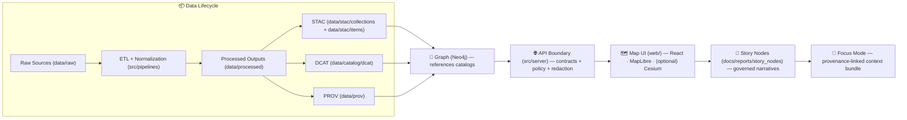

# 🧩 `src/` — Core Platform Code (KFM v13)

<p align="left">
  
  
  
  
  
  
</p>

> 🧭 **Purpose:** `src/` is the canonical home for KFM’s **ETL pipelines**, **knowledge graph build**, and the **governed API boundary** (contracts + policy + redaction).  
> 🗺️ Looking for the map UI? → **`../web/`**  
> 📦 Looking for datasets + catalogs? → **`../data/`**  
> 🧾 Looking for schemas/contracts? → **`../schemas/`** (+ `src/server/contracts/`)  
> ⚖️ Looking for governance rules? → **`../docs/governance/`** (+ `../policy/` if present)

---

<details>
<summary><strong>🧭 Table of Contents</strong></summary>

- [🔎 Quick Links](#-quick-links-start-here)
- [🗂️ Repo Map (v13 mental model)](#️-repo-map-v13-mental-model)
- [🗺️ The non-negotiable flow](#️-the-non-negotiable-flow)
- [📁 What lives in `src/`](#-what-lives-in-src)
- [✅ Golden rules (read before coding)](#-golden-rules-read-before-coding)
- [📎 Contract artifacts (what must exist)](#-contract-artifacts-what-must-exist)
- [🛠️ `src/pipelines/` — ETL, normalization, catalogs](#️-srcpipelines--etl-normalization-catalogs)
- [🧠 `src/graph/` — knowledge graph build + ontology safety](#-srcgraph--knowledge-graph-build--ontology-safety)
- [🌐 `src/server/` — governed API boundary (REST/GraphQL)](#-srcserver--governed-api-boundary-restgraphql)
- [🔒 Governance enforcement (CI + runtime)](#-governance-enforcement-ci--runtime)
- [🧩 Adding new capability (where to touch)](#-adding-new-capability-where-to-touch)
- [🧪 Testing & CI expectations](#-testing--ci-expectations)
- [🧰 Local dev (typical workflow)](#-local-dev-typical-workflow)
- [🧭 If you’re lost 😅](#-if-youre-lost-)

</details>

---

## 🔎 Quick Links (start here)

- 📘 **Master Guide (v13):** `../docs/MASTER_GUIDE_v13.md`
- 🧱 **Architecture Blueprints:** `../docs/architecture/`
- ⚖️ **Governance / Ethics / Sovereignty:** `../docs/governance/`
- 🧰 **Templates:** `../docs/templates/`
  - Story Nodes: `TEMPLATE__STORY_NODE_V3.md`
  - API contract changes: `TEMPLATE__API_CONTRACT_EXTENSION.md`
- 📦 **Standards (profiles + conventions):** `../docs/standards/`
- 🧾 **Schemas (machine-validated contracts):** `../schemas/`
- 🧩 **Story Nodes (draft/published):** `../docs/reports/story_nodes/`
- 🧪 **Tests:** `../tests/`
- 🧰 **Tools / validators:** `../tools/`
- 🏷️ **Release artifacts:** `../releases/`

---

## 🗂️ Repo Map (v13 mental model)

KFM v13 is **monorepo + contract-first**: every subsystem has **one canonical home** (no duplicate “mystery dirs” 😤).

```text
📦 repo-root/
├─ 📁 data/                # raw/work/processed + catalogs (STAC/DCAT/PROV)
├─ 📁 schemas/             # JSON Schemas for STAC/DCAT/PROV/story nodes/UI/telemetry
├─ 📁 src/                 # ✅ YOU ARE HERE (pipelines + graph + API boundary)
│  ├─ 📁 pipelines/
│  ├─ 📁 graph/
│  └─ 📁 server/
├─ 📁 web/                 # UI (React + MapLibre + optional Cesium)
├─ 📁 docs/                # governed documentation + story node content
├─ 📁 tests/               # automated gates
├─ 📁 tools/               # standalone validation/utilities
├─ 📁 policy/              # policy-as-code (OPA/Rego) (if present in this repo)
└─ 📁 releases/            # versioned releases + published snapshots
```

> 🧠 **Canonical-homes mindset:** if you’re duplicating logic across folders, stop and refactor.  
> ✅ v13 wants *one* place to look for a thing.

---

## 🗺️ The non-negotiable flow

KFM is intentionally organized as a:

**ETL → Catalogs (STAC/DCAT/PROV) → Graph → API → UI → Story Nodes → Focus Mode**

This ordering is the *design contract* of the platform. ✅



> 🚫 Any shortcut that bypasses a stage (e.g., UI reading DB directly) violates the platform contract.

---

## 📁 What lives in `src/`

> 🎯 **Rule of thumb:** if it’s **execution logic** (ETL, graph loading, API services, validation tooling), it belongs here.

| Folder | Owns 🧠 | Outputs / Interfaces 📤 | “Don’t break” rule 🔒 |
|---|---|---|---|
| `src/pipelines/` | ETL + normalization + catalog writers + dataset validation | `data/processed/**` + boundary artifacts: STAC/DCAT/PROV | Deterministic + replayable (idempotent) |
| `src/graph/` | Graph build, ontology bindings, migrations, integrity checks | Neo4j graph state (schema-stable) | Ontology changes require migrations |
| `src/server/` | Governed API boundary (REST/GraphQL), contracts, policy checks, redaction | OpenAPI/GraphQL contracts + audited access | UI never bypasses API |

### 🧭 Common subfolders (recommended)
These aren’t mandatory, but they keep `src/` consistent:

```text
src/server/
├─ contracts/        # OpenAPI YAML, GraphQL SDL (the contract surface)
├─ domain/           # pure models + rules (no DB imports)
├─ services/         # use-cases (orchestration)
├─ adapters/         # PostGIS/Neo4j/catalog/OPA clients
├─ api/              # routers/controllers (FastAPI)
└─ infra/            # app boot, DI wiring, config, telemetry hooks
```

---

## ✅ Golden rules (read before coding)

### 1) 🔁 Pipeline ordering is absolute
No stage may consume data that hasn’t exited the prior stage through formal outputs + checks.

### 2) 🧾 Contract-first development
Schemas + API contracts are first-class artifacts:
- schemas live in `../schemas/`
- API contracts live in `src/server/contracts/`

Any contract change must be versioned and tested.

### 3) 🧪 Deterministic, idempotent ETL
Pipelines must be config-driven, fully logged, and safe to re-run.

### 4) 🚧 API boundary rule
Frontend/UI must **never** query Neo4j (or PostGIS) directly. All access flows through `src/server/`.

### 5) 🧬 Provenance first
Before graph or UI usage, data must be registered with provenance:
- STAC
- DCAT
- PROV

### 6) 🧠 Evidence-first narrative
Story Nodes + Focus Mode can only contain provenance-linked, evidence-backed content.  
No “hallucinated” claims.

### 7) 🔒 Governance: fail closed
If a policy/validation gate fails, KFM blocks by default.

### 8) 🪶 Sovereignty & classification propagation
No output artifact may be **less restricted** than its inputs.  
Redaction/aggregation is explicit and governed.

---

## 📎 Contract artifacts (what must exist)

KFM is “strict” on purpose: each boundary has artifacts that act like interfaces.

| Stage | Must exist ✅ | Where it lives 📌 | Typical gate 🧪 |
|---|---|---|---|
| ETL | pipeline config + run log + validation report | `src/pipelines/**` (+ `data/work/**`) | unit tests + lint + deterministic output checks |
| Catalogs | STAC + DCAT + PROV records | `data/stac/**`, `data/catalog/dcat/**`, `data/prov/**` | schema/profile validation |
| Graph | ontology + constraints + migrations | `src/graph/**` | integrity checks (no orphan node types, etc.) |
| API | OpenAPI/GraphQL contracts + contract tests | `src/server/contracts/**` | contract tests + backwards-compat gates |
| UI | layer registry config + safety/redaction compliance | `web/**` | UI checks (no leakage, accessibility) |
| Story/Focus | Story Node template compliance + citations | `docs/reports/story_nodes/**` | doc validation + citation presence |

---

## 🛠️ `src/pipelines/` — ETL, normalization, catalogs

### What belongs here ✅
- Domain ETL pipelines (raw → work → processed)
- Catalog writers (boundary artifacts):
  - **STAC**
    - `data/stac/collections/`
    - `data/stac/items/`
  - **DCAT JSON-LD**
    - `data/catalog/dcat/`
  - **PROV lineage**
    - `data/prov/`
- Validators (schema/profile checks)
- Reproducible pipeline configs + run logs

### 🔥 Design pattern: evidence artifacts (AI/analysis outputs) 🧠📦
If an AI/analysis produces a dataset (raster, table, OCR corpus, prediction layer), treat it as a **first-class dataset**:

- store it under `data/processed/**`,
- catalog it (STAC/DCAT),
- trace it (PROV),
- integrate into graph **only with explicit provenance**,
- expose only through governed APIs (never hard-code in UI).

> ✅ Goal: evidence artifacts should be indistinguishable from “regular datasets” in how they move through the pipeline — just with stronger lineage metadata.

---

## 🧠 `src/graph/` — knowledge graph build + ontology safety

### What belongs here ✅
- Ontology definitions (labels/relations expectations)
- Graph loader jobs (ingest references to catalog records)
- Constraint checks (no orphan node types, etc.)
- Migration scripts for deliberate breaking/renaming

### 🧷 Graph references catalogs (don’t duplicate payloads)
The graph should store **relationships + references**, not bulky data:
- store STAC Item IDs / dataset IDs / stable URIs
- resolve details via catalogs when needed (through API)

### Versioning rule 📌
Graph structure should remain backwards-compatible unless a deliberate migration is performed.  
Breaking changes require coordination across graph ↔ API ↔ UI.

---

## 🌐 `src/server/` — governed API boundary (REST/GraphQL)

### What belongs here ✅
- OpenAPI / GraphQL “contract surface” (`src/server/contracts/`)
- Request validation + response shaping
- Centralized governance checks:
  - access control
  - classification propagation
  - redaction / generalization for sensitive outputs
- Audit hooks (who accessed what, under what policy, and why)
- Adapters to PostGIS / Neo4j / catalogs (STAC/DCAT/PROV)

### 🧱 Recommended layering (Clean Architecture-ish)
Keep business logic separate from frameworks:

- **Domain layer:** core entities + rules (no DB imports)
- **Service / use-case layer:** orchestration of domain behaviors
- **Integration / adapters:** PostGIS/Neo4j/catalog/policy clients
- **Infrastructure:** FastAPI app, routers, DI wiring, startup/shutdown

> 🎯 Goal: swap a database or external API by replacing an adapter, without rewriting core logic.

---

## 🔒 Governance enforcement (CI + runtime)

KFM governance is **policy-as-code**:
- **CI** blocks non-compliant additions (fail closed).
- **Runtime** enforces decisions consistently for API + AI.

### CI (fail closed) ✅
Expect gates like:
- missing PROV lineage → ❌ fail
- missing license field → ❌ fail
- schema invalid → ❌ fail
- secrets/sensitive leaks → ❌ fail

### Runtime (API boundary) ✅
The API layer is where governance becomes real:
- every request is validated against contracts,
- every response can be redacted based on policy and classification,
- AI responses (Focus Mode) are governed and audited.

> 🧯 Fix the artifact, don’t bypass the gate.

---

## 🧩 Adding new capability (where to touch)

<details>
<summary><strong>🆕 A) Add a new data domain</strong></summary>

1) Place inputs/outputs in the standard lifecycle:
- `data/raw/<new-domain>/`
- `data/work/<new-domain>/`
- `data/processed/<new-domain>/`

2) Implement domain pipeline in:
- `src/pipelines/<new-domain>/...`

3) Publish boundary artifacts (required):
- STAC → `data/stac/collections/` + `data/stac/items/`
- DCAT → `data/catalog/dcat/`
- PROV → `data/prov/`

4) Add a runbook:
- `docs/data/<new-domain>/README.md` (ETL procedures + sources + constraints)

5) If you need extra metadata fields:
- extend the KFM profiles in `docs/standards/` (don’t invent ad-hoc fields)

</details>

<details>
<summary><strong>🧠 B) Add an “evidence artifact” (AI/analysis output)</strong></summary>

Treat the artifact like any other dataset:
- Store in `data/processed/**`
- Catalog it (STAC/DCAT)
- Trace it (PROV)
- Integrate into graph only with explicit provenance
- Expose only via API so redaction/classification rules apply

</details>

<details>
<summary><strong>🧬 C) Change graph schema / ontology</strong></summary>

- Prefer backwards-compatible changes
- If breaking:
  - write a migration script,
  - update constraints/integrity checks,
  - coordinate API contract updates and UI expectations

</details>

<details>
<summary><strong>🧾 D) Add or change an API endpoint (contract-driven)</strong></summary>

- Start from the contract:
  - OpenAPI spec / GraphQL schema (`src/server/contracts/`)
- Implement in `src/server/`:
  - request parsing + validation
  - service/use-case call
  - policy/redaction enforcement
  - audit logging
  - contract tests

> Tip: use `../docs/templates/TEMPLATE__API_CONTRACT_EXTENSION.md`

</details>

<details>
<summary><strong>📖 E) Add Story Nodes / Focus Mode context</strong></summary>

Story content lives outside `src/`:
- templates: `../docs/templates/`
- story content: `../docs/reports/story_nodes/`
  - `draft/`
  - `published/<story_slug>/story.md` + `assets/`

Hard rule: provenance-linked claims only ✅

</details>

---

## 🧪 Testing & CI expectations

KFM expects contributions to pass automated gates, including:
- schema/profile validation (STAC/DCAT/PROV)
- provenance completeness checks
- graph integrity checks
- contract tests for APIs
- security scans (secrets/sensitive data leaks)
- policy compliance checks (fail closed)

### ✅ PR checklist (recommended)
- [ ] I did not bypass the pipeline order
- [ ] New/changed datasets have STAC/DCAT/PROV artifacts
- [ ] Contracts updated first (schemas + OpenAPI/GraphQL), with tests
- [ ] Graph changes include migrations and integrity checks
- [ ] No sensitive content leaks; classification propagation is preserved
- [ ] Docs/runbooks updated where needed

---

## 🧰 Local dev (typical workflow)

> Your branch may differ, but the common workflow is containerized + API contract exploration.

### 🚀 Run the stack
```bash
docker-compose up --build
```

### 🧭 Useful ports (common defaults)
- PostGIS: `5432`
- Neo4j browser: `7474`
- Neo4j bolt: `7687`
- API: `8000`
- Web dev server: `3000`
- (Optional) OPA: `8181`

### 🧪 Explore the API
- Swagger UI: `http://localhost:8000/docs`
- GraphQL (if enabled): `http://localhost:8000/graphql`

### 🏃 Run a one-off pipeline (example shape)
```bash
docker-compose exec <api-or-worker-service> python <pipeline_entrypoint.py>
```

---

## 🧭 If you’re lost 😅

1) Read **`../docs/MASTER_GUIDE_v13.md`**  
2) Pick the subsystem:
- ETL? → `src/pipelines/`
- Graph? → `src/graph/`
- API boundary? → `src/server/`
- UI? → `../web/`
- Story Nodes? → `../docs/reports/story_nodes/`
3) If you can’t draw the pipeline for your change, you’re not done.

---

📝 _This README is intentionally strict. It encodes contract-level expectations so KFM stays provenance-first, governance-safe, and reproducible._  
📚 _Primary references: Master Guide v13 + architecture/governance docs in `../docs/`._