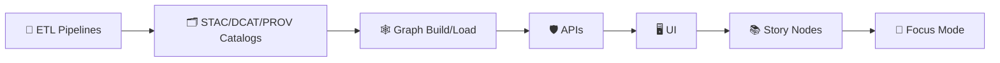

# 🧩 `src/` — Kansas Frontier Matrix (KFM) Executable Source Code


> Canonical home for **auditable**, **reproducible** KFM source code: **🧪 ETL Pipelines → 🗂️ Catalogs (STAC/DCAT/PROV) → 🕸️ Graph → 🛡️ APIs**.

---

## 🧭 Quick Navigation
- [📘 Overview](#overview)
- [🧠 Core invariants](#core-invariants)
- [🗂️ Directory layout](#directory-layout)
- [📌 Where does this go?](#where-does-this-go)
- [🧱 Architecture](#architecture)
  - [🧪 Pipelines](#pipelines-srcpipelines)
  - [🕸️ Graph](#graph-srcgraph)
  - [🛡️ Server](#server-srcserver)
  - [📜 Contracts](#contracts-srcservercontracts)
- [🧪 Validation & CI/CD](#validation--cicd)
- [⚖️ FAIR+CARE & governance](#faircare--governance)
- [📚 Reference library](#reference-library)
- [🕰️ Version history](#version-history)

---

<a id="overview"></a>

## 📘 Overview

### Purpose
`src/` is the **canonical home** for Kansas Frontier Matrix (KFM) executable source code. It implements the system layers that must remain **auditable** and **reproducible**:

- **🧪 Pipelines**: data ingestion + ETL + metadata generation (STAC/DCAT/PROV) and validation
- **🕸️ Graph**: knowledge graph build/load utilities (**from cataloged outputs**)
- **🛡️ Server**: the API boundary (REST/GraphQL contracts + implementation)

### Scope
✅ In scope for `src/`:
- Code that runs ETL jobs and writes data lifecycle outputs (`raw/`, `work/`, `processed/`) and catalogs (STAC/DCAT/PROV)
- Code that builds/loads the knowledge graph **from cataloged products**
- API services and **contract-first** schemas (OpenAPI/GraphQL) consumed by UI and Focus Mode

🚫 Out of scope for `src/` (canonical homes elsewhere):
- Governed documentation and templates → `docs/`
- Data assets and outputs → `data/`
- Schema registries / JSON schema artifacts → `schemas/`
- Frontend UI code → `web/`

---

<a id="core-invariants"></a>

## 🧠 Core invariants

> [!IMPORTANT]
> KFM enforces this **non-negotiable** order:
>
> **ETL → STAC/DCAT/PROV Catalogs → Graph → APIs → UI → Story Nodes → Focus Mode**



### Implications for `src/` contributors
- ✅ Nothing enters the graph or UI unless it has passed ETL **and** has catalog records.
- ✅ The UI must never query the graph directly; it only uses contracted APIs.
- ✅ Derived products (including AI/ML outputs) must be treated as data with lineage (PROV).

### Constraints you must not break
- **No out-of-band data**: If it isn’t produced via ETL and cataloged, it doesn’t belong in graph/UI.
- **Contract-first APIs**: UI and other clients integrate via API contracts (OpenAPI/GraphQL), not internal DB schema.
- **Provenance-first**: derived outputs (joins, interpolations, AI annotations, model results) must log lineage and uncertainty.
- **Sensitivity propagation**: classification/sensitivity controls must carry through catalogs → graph → APIs → UI.

---

<a id="directory-layout"></a>

## 🗂️ Directory layout

### Repository context (expected structure)
This tree is the KFM “easy to read” emoji layout pattern used across docs. Treat it as the target structure for **v13+**.

```text
📁 docs/ — governed documentation (templates, standards, architecture, reports)
├── 📄 MASTER_GUIDE_v13.md
├── 📄 MASTER_GUIDE_v12.md
├── 📁 architecture/
│   ├── 📄 KFM_VISION_FULL_ARCHITECTURE.md
│   ├── 📄 KFM_REDESIGN_BLUEPRINT_v13.md
│   ├── 📄 KFM_FOCUS_MODE_SPEC.md
│   └── 📄 KFM_LAYER_REGISTRY.md
├── 📁 standards/
│   ├── 📄 KFM_MARKDOWN_WORK_PROTOCOL.md
│   ├── 📄 KFM_CHATGPT_WORK_PROTOCOL.md
│   ├── 📄 KFM_DATA_CONTRACTS.md
│   ├── 📄 KFM_STAC_PROFILE.md
│   ├── 📄 KFM_DCAT_PROFILE.md
│   └── 📄 KFM_PROV_PROFILE.md
├── 📁 templates/
│   ├── 📄 TEMPLATE__KFM_UNIVERSAL_DOC.md
│   ├── 📄 TEMPLATE__STORY_NODE_V3.md
│   └── 📄 TEMPLATE__API_CONTRACT_EXTENSION.md
└── 📁 reports/
    └── 📁 <topic>/
        └── 📁 story_nodes/

📁 src/ — executable code (this folder)
├── 🧪 pipelines/
├── 🕸️ graph/
└── 🛡️ server/
    └── 📜 contracts/

📁 data/ — data lifecycle roots (raw → work → processed + catalogs + prov)
├── 📁 raw/
├── 📁 work/
├── 📁 processed/
├── 📁 stac/
├── 📁 catalog/
│   └── 📁 dcat/
└── 📁 prov/

📁 schemas/ — schema/profile registry (machine validated)
├── 📁 stac/
├── 📁 dcat/
└── 📁 prov/

📁 web/ — frontend UI (React/MapLibre + Focus Mode UI)
├── 🌍 map_viewer/
├── 🗺️ focus_mode_ui/
└── 📚 story_reader/

📁 .github/
└── workflows/

📁 releases/ — packaged release artifacts
└── <version>/
```

### `src/` layout (canonical homes)
Minimum canonical homes (must exist conceptually even if implementations evolve):

```text
📁 src/
├── 🧪 pipelines/ — ETL + catalog writers/validators (STAC/DCAT/PROV)
│   └── 🧫 etl/ — dataset ingestion + transforms (expected sub-home for ETL jobs)
├── 🕸️ graph/ — graph build/load tools (from cataloged outputs)
└── 🛡️ server/ — API boundary (policy + contracts + services)
    └── 📜 contracts/ — OpenAPI + GraphQL contracts (source of truth)
```

Suggested internal structure (recommended; align with Master Guide + team conventions):
- Keep modules small and layered. Prefer “thin” adapters around stable contracts.
- Keep file paths stable once published (contracts, schema versions, catalog IDs).

---

<a id="where-does-this-go"></a>

## 📌 Where does this go?

Use this quick map when you’re unsure:

| You are adding… | Put it in… | Why |
|---|---|---|
| Ingestion/ETL logic, transformations, validators | `src/pipelines/` | Produces reproducible data outputs + catalogs |
| STAC/DCAT/PROV writers + validators | `src/pipelines/` | Catalogs are the gate into graph + UI |
| Graph build artifacts + loaders/migrations | `src/graph/` | Graph is derived from cataloged products |
| REST/GraphQL server implementation | `src/server/` | API is the only boundary for clients |
| OpenAPI / GraphQL schemas | `src/server/contracts/` | Contracts are source of truth |
| Docs, templates, standards | `docs/` | Governed documentation lives here |
| Data outputs and catalogs | `data/` | Data lifecycle root |
| JSON schemas / profiles | `schemas/` | Machine-validation registry |
| UI/Frontend code | `web/` | Client-side consumers |

---

## 🧭 Context

### How `src/` fits the platform
KFM is an evidence-driven geospatial knowledge platform that intertwines:
- structured geospatial data + catalog metadata
- a knowledge graph linking entities across time/place
- APIs that enforce policy and provide stable access
- a UI that presents maps, timelines, stories, and **Focus Mode** (evidence-only view)

This is why `src/` is organized by pipeline stages and contracts rather than “random utils.”

---

<a id="architecture"></a>

## 🧱 Architecture

<a id="pipelines-srcpipelines"></a>

### 🧪 Pipelines (`src/pipelines/`)
What goes here:
- ingestion code (downloaders, scrapers, loaders)
- transformations and standardization (CRS fixes, time normalization, schema harmonization)
- **catalog writers** (STAC/DCAT/PROV outputs)
- validators and quality gates (schema checks, link checks, determinism/idempotency checks)

What should *not* go here:
- manual edits to graph database
- UI logic
- untracked “one-off” notebooks that write data without metadata/PROV

Expected I/O pattern:
- Inputs: `data/raw/` (immutable originals) + trusted upstream sources
- Intermediate: `data/work/`
- Published outputs: `data/processed/`
- Catalogs: `data/stac/`, `data/catalog/dcat/`
- Lineage: `data/prov/`

<a id="graph-srcgraph"></a>

### 🕸️ Graph (`src/graph/`)
What goes here:
- building graph-ready artifacts from cataloged datasets
- graph load scripts (idempotent) and migrations
- graph validation utilities (ontology alignment, referential integrity)

Hard rule:
- graph loads are driven from **catalog outputs**, not from ad-hoc UI calls or manual inserts.

<a id="server-srcserver"></a>

### 🛡️ Server (`src/server/`)
What goes here:
- API service implementation
- authn/authz/policy enforcement hooks
- “bundle” endpoints for evidence retrieval (e.g., Focus Mode citation bundles)
- telemetry/logging at the API boundary

<a id="contracts-srcservercontracts"></a>

### 📜 Contracts (`src/server/contracts/`)
Contracts are the stable interface between KFM internals and the outside world:
- REST (OpenAPI)
- GraphQL (SDL/schema)
- shared types for “evidence bundles” and provenance display

Treat contracts as:
- versioned, reviewed, and backward compatible (when possible)
- the place where breaking changes are explicitly managed

> [!TIP]
> Prefer **contract changes first**, then adapters, then implementation.  
> If you can’t write a contract test for it, it’s probably not ready.

---

<a id="validation--cicd"></a>

## 🧪 Validation & CI/CD

### CI pipeline intent (conceptual)
KFM CI is expected to enforce (at minimum):
- formatting and linting
- schema validation (STAC/DCAT/PROV + front-matter in governed docs)
- contract checks (OpenAPI/GraphQL)
- safety/governance checks (FAIR+CARE sensitivity labeling; no secrets; no PII)

If you’re adding new code under `src/`:
- add tests for new contracts and pipeline outputs
- ensure deterministic outputs (stable IDs, repeatable runs)
- ensure outputs land in the correct `data/` roots and have catalogs + PROV

### Contributor checklist (before you open a PR)
- [ ] Outputs are deterministic (stable IDs; repeatable runs)
- [ ] Pipeline outputs land in correct `data/` roots (`raw/` → `work/` → `processed/`)
- [ ] STAC/DCAT/PROV catalogs are emitted + validated
- [ ] Graph loads are driven from catalogs (no manual inserts)
- [ ] Contracts updated first (if API surface changed)
- [ ] Tests added/updated for contracts and pipeline outputs
- [ ] Sensitivity/classification propagates end-to-end

---

<a id="faircare--governance"></a>

## ⚖️ FAIR+CARE & governance

`src/` code changes can have governance impact when they affect:
- how sensitivity/classification is computed or propagated
- how provenance is generated or displayed
- how AI/ML derived outputs are created, stored, and surfaced
- how Story Nodes and Focus Mode retrieve evidence

When in doubt:
- treat changes as governance-relevant
- prefer conservative defaults (redact/generalize; require review)
- ensure all “evidence-only” features remain strict: uncited/unsupported content must be hidden/flagged in Focus Mode

---

<a id="reference-library"></a>

## 📚 Reference library

These materials are **implementation guidance** only; they must not override KFM contracts/governance.  
Also: ensure licensing allows redistribution before committing any PDFs into the repo.

### KFM canonical project docs (source of truth)
- KFM Architecture Document
- Kansas Frontier Matrix (KFM) – Master Documentation
- Kansas Frontier Matrix – Unified Technical Plan
- Inside and Out of GitHub_ A Deep Guide for the Kansas Frontier Matrix
- KFM Markdown Guide
- Master Guide v13 (see `docs/MASTER_GUIDE_v13.md`)

### Engineering + DataOps (optional reading)
- Scientific Modeling and Simulation_ A Comprehensive NASA-Grade Guide.pdf
- Scalable Data Management for Future Hardware.pdf
- Command Line Kung Fu (Bash scripting tricks & one-liners).pdf
- clean-architectures-in-python.pdf

### Geospatial / Remote sensing / cartography (optional reading)
- Geographic Information System Basics.pdf
- geoprocessing-with-python.pdf
- python-geospatial-analysis-cookbook.pdf
- Cloud-Based Remote Sensing with Google Earth Engine (Fundamentals and Applications).pdf
- Google Earth Engine Applications.pdf
- making-maps-a-visual-guide-to-map-design-for-gis.pdf
- Map Reading & Land Navigation (verify accessibility/licensing before referencing)

### Analytics / statistics / ML (optional reading)
- Understanding Statistics & Experimental Design.pdf
- Statistics Done Wrong.pdf
- regression-analysis-with-python.pdf
- graphical-data-analysis-with-r.pdf
- Bayesian computational methods.pdf
- Data Science & Machine Learning (Mathematical & Statistical Methods).pdf
- deep-learning-in-python-prerequisites.pdf
- Artificial-neural-networks-an-introduction.pdf
- Data Mining Concepts & applictions.pdf
- AI Foundations of Computational Agents (3rd Ed).pdf

### Web/UI/graphics (optional reading)
- responsive-web-design-with-html5-and-css3.pdf
- webgl-programming-guide.pdf
- Computer Graphics using JAVA 2D & 3D.pdf
- Google Maps API Succinctly.pdf
- google-maps-javascript-api-cookbook.pdf

---

<a id="version-history"></a>

## 🕰️ Version history

| Version | Date | Summary of Changes | Author |
|---:|---|---|---|
| v1.0.1 | 2026-01-06 | Polished structure + navigation; added contributor checklist; clarified contract-first + governance guardrails. | KFM Engineering |
| v1.0.0 | 2025-12-31 | Initial `src/README.md` created from Master Guide v13 + KFM docs; added emoji directory layout and subsystem guide. | TBD (KFM Engineering) |
