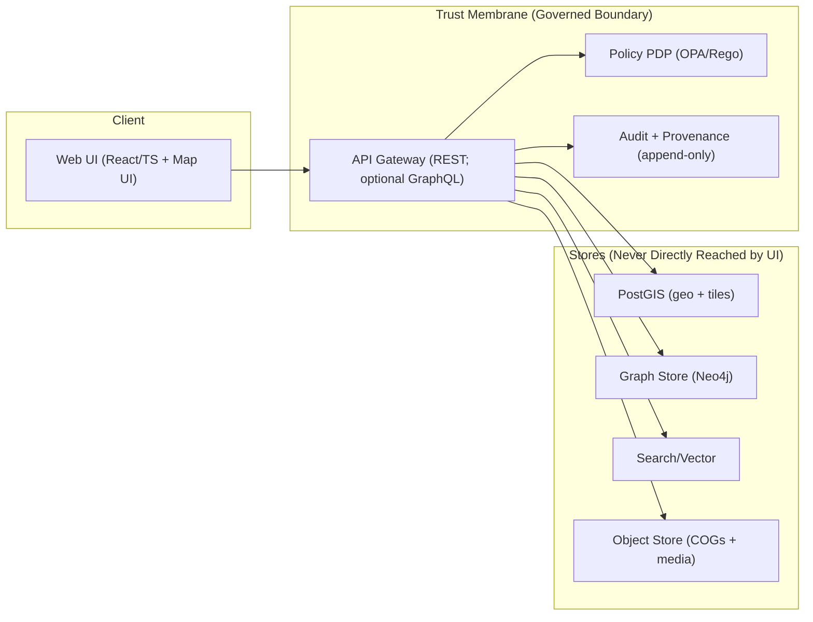

<!--
GOVERNED ARTIFACT NOTICE
This README lives inside KFM’s trust boundary: it documents architecture invariants and layering rules.
If you change meaning (not just phrasing), route through governance review.
-->

<div align="center">

# `src/` — KFM Backend Core 🧭⚙️

**Clean layers + trust membrane enforcement.**  
This directory is where KFM’s governed backend behavior is implemented: domain rules, use cases, ports, adapters, and infrastructure—**with policy + audit as first-class citizens**.

</div>

---

## Why This Folder Exists

KFM is not “a web app with a database.”  
KFM is a **governed system**: every data/story/AI request must pass through **policy enforcement** and produce **auditable evidence trails**.

`src/` is the backend implementation of that promise.

> **Non-negotiables**
> - **No UI → DB access. Ever.** UI talks only to governed APIs.
> - **Fail-closed policy checks** occur on every request.
> - Backend code uses **ports (interfaces)** and **cannot bypass them**.
> - **Audit/provenance** are produced on the normal request path.
>
> If you violate these, you’re not “moving fast”—you’re breaking the system guarantee.

---

## Quick Links (Start Here)

- 🧠 **Domain layer**: [`src/domain/`](./domain/README.md)
- 🧩 **Use cases**: [`src/use_cases/`](./use_cases/README.md)
- 🔌 **Ports (contracts)**: [`src/ports/`](./ports/README.md)
- 🧱 **Adapters**: [`src/adapters/`](./adapters/README.md)
  - DB: [`src/adapters/db/`](./adapters/db/README.md)
  - Graph: [`src/adapters/graph/`](./adapters/graph/README.md)
  - Policy: [`src/adapters/policy/`](./adapters/policy/README.md)
  - Search: [`src/adapters/search/`](./adapters/search/README.md)
- 🏗️ **Infrastructure**: [`src/infrastructure/`](./infrastructure/README.md)
- 🌐 **API boundary**: [`src/api/`](./api/README.md)
- 🧪 **Tests**: [`src/tests/`](./tests/README.md)

---

## Directory Layout

> This is the *architectural* map of `src/`. Some subfolders may expand over time, but the dependency direction must not.

```text
src/
├── domain/                 # Pure entities + value objects + invariants
├── use_cases/              # Orchestrated workflows (business rules)
├── ports/                  # Interfaces/contracts (repositories, policy, audit, search)
├── adapters/               # Port implementations (db/graph/policy/search/…)
├── infrastructure/         # Concrete clients + wiring (db drivers, http clients, runtime config)
├── api/                    # HTTP boundary (routes, schemas, dependencies)
└── tests/                  # Unit + contract + integration tests (mirrors src structure)
```

---

## Clean Layers (What Goes Where)

| Layer | What it contains | Must **NOT** contain | Tests that should exist |
|---|---|---|---|
| **Domain** | Entities, value objects, invariants | DB clients, HTTP frameworks, OPA calls | Pure unit tests |
| **Use Cases** | Workflows, business rules, orchestration | Web handlers, SQL/Cypher, concrete SDK calls | Use-case tests w/ mocked ports |
| **Ports** | Interfaces + DTOs + boundary contracts | Concrete implementations | Contract tests + schema tests |
| **Adapters** | Implement ports for DB/graph/policy/search | Business logic that belongs in use cases | Adapter integration tests |
| **Infrastructure** | Runtime wiring, concrete clients, config | Domain rules | Integration + smoke tests |
| **API** | Routes/controllers, request parsing, response shaping | Direct DB access, business logic | Route tests + contract tests |

---

## The Trust Membrane (How Requests Flow)

**Everything** crosses the membrane through the governed API boundary.



---

## How to Add a New Capability (The “Thin Slice” Path)

> The fastest safe path is a **walking skeleton**: add the smallest vertical slice that proves the contracts and policy gates.

### 1) Start in the Domain
- Add/extend entities and invariants in `src/domain/`
- Keep logic pure and deterministic

### 2) Define the Contract in Ports
- Create a port interface (e.g., `DatasetRepo`, `GraphRepo`, `PolicyClient`, `AuditWriter`)
- Define DTOs and error/result types

### 3) Implement a Use Case
- Add a workflow in `src/use_cases/`
- Depend **only** on ports
- Add use-case tests that mock ports

### 4) Implement an Adapter
- Implement the port in `src/adapters/<target>/`
- Add adapter-level integration tests (against local containers if needed)

### 5) Expose Through API (No Business Logic Here)
- Add request/response schemas in `src/api/schemas/`
- Add route wiring in `src/api/routes/`
- Ensure:
  - **AuthZ** happens before data access
  - **Audit** is written on success/failure paths
  - Responses include any required `audit_ref` and citations metadata

### 6) Add/Update Policy Rules
- Ensure policy is **default deny**
- Add regression tests for allowed/denied cases

### 7) Prove It With Tests + Gates
Minimum expected coverage:
- ✅ Domain unit tests
- ✅ Use-case tests (mock ports)
- ✅ Contract/schema tests
- ✅ Adapter integration tests
- ✅ End-to-end smoke test (compose)

---

## Testing Expectations

KFM testing is not optional—**it’s governance enforcement**.

- **Unit**: domain invariants and pure functions
- **Use-case**: behavior with mocked ports
- **Contract**: schemas, DTOs, OpenAPI fragments (where applicable)
- **Integration**: adapters against local services
- **Smoke/E2E**: compose-based “happy path + deny path” checks

> Tip: Mirror folder structure in `src/tests/` so “where do I test this?” is always obvious.

---

## Local Development (Preferred)

From the repo root, KFM’s documented baseline uses Docker Compose:

```bash
cp .env.example .env
docker compose up --build
```

If you add new services/adapters, update compose and ensure tests still run in a clean environment.

---

## Code Standards That Matter Here

- **Dependency direction is sacred**: `domain -> use_cases -> ports -> adapters/infrastructure -> api`
- **No “just this once” bypass** of ports to “speed things up”
- **Fail-closed by default**:
  - policy errors → deny
  - missing provenance/citations → abstain/deny (as applicable)
- **Deterministic IDs and reproducible runs** (pipeline/audit friendliness)
- **Explicit time model** for historical/temporal data (don’t hand-wave timestamps)

---

## Definition of Done (Backend Change)

- [ ] Added/updated domain + tests
- [ ] Added/updated port contract + contract tests
- [ ] Implemented use case + mocked-port tests
- [ ] Implemented adapter + integration tests
- [ ] API route added with schema validation
- [ ] Policy rule updated + regression test
- [ ] Audit/provenance emitted on the request path
- [ ] Documentation updated (as a governed artifact)

---

### Need the bigger picture?
- System invariants + trust membrane rationale live in the architecture blueprints (see `docs/architecture/`).
- UI is deliberately separate (`web/`) and must never reach into backend internals.

---