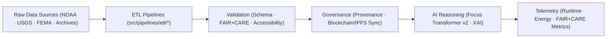

<div align="center">

# 🧠 **Kansas Frontier Matrix — Source Code & ETL Pipelines**
`src/README.md`

**Purpose:**  
Serve as the FAIR+CARE-certified automation and intelligence core of KFM — orchestrating ETL pipelines, AI reasoning, validation suites, and telemetry systems under **Diamond⁹ Ω / Crown∞Ω Ultimate Certification**.  
Implements sustainable, explainable, and ethically governed automation following **MCP-DL v6.3**, **FAIR+CARE**, and **ISO 19115 / 50001** standards.

[](../docs/standards/)
[](../docs/standards/faircare-validation.md)
[](../LICENSE)
[]()
[]()

</div>

---

## 📘 Overview

The `src/` directory houses KFM’s **automated pipelines and knowledge integration logic**.  
It is the execution center for the system’s modular architecture — spanning ingestion, validation, AI reasoning, provenance governance, and telemetry reporting.

Each submodule aligns with FAIR+CARE principles and the **Master Coder Protocol (MCP-DL v6.3)** for traceable, auditable, and sustainable open science.

---

## 🧩 Core Responsibilities

- Automate **ETL workflows** for geospatial, historical, and environmental data.  
- Power **AI explainability and Focus Mode reasoning** (via Focus Transformer v2).  
- Maintain **provenance synchronization** through blockchain/IPFS governance ledgers.  
- Generate **sustainability and performance telemetry** for ISO/FAIR+CARE compliance.  
- Enforce **schema, ethics, and checksum validation** for every data lifecycle stage.  

---

## 🗂️ Directory Layout

```plaintext
src/
├── README.md
│
├── pipelines/                      # FAIR+CARE automation (ETL · AI · Validation · Governance)
│   ├── etl/                        # Ingestion + transformation (streaming + batch)
│   ├── ai/                         # Focus Transformer v2 models + explainability
│   ├── validation/                 # Schema + FAIR+CARE ethics validation
│   ├── governance/                 # Blockchain/IPFS provenance + ledger sync
│   ├── telemetry/                  # Runtime, energy, and carbon metrics
│   └── utils/                      # Shared STAC/DCAT/JSON utilities
│
├── graph/                          # Neo4j graph schema, ingest, queries, utils
│   ├── schema/                     # Ontology mappings + constraints
│   ├── ingest/                     # Graph ingestion + provenance sync
│   ├── queries/                    # Focus Mode & analytical Cypher templates
│   └── utils/                      # Graph helpers, checksum + metadata bridges
│
├── design-tokens/                  # UI tokens for color, typography, and themes
├── theming/                        # Styling + component themes
├── map/                            # MapLibre / Cesium map engine integrations
├── icons/                          # Symbolic, accessibility, and system iconography
├── ARCHITECTURE.md                 # Complete system design + flow diagram
├── metadata.json                   # Provenance & checksum registry metadata
└── tests/                          # Unit/integration tests (PyTest + CI validation)
```

---

## ⚙️ End-to-End Automation Flow



1. **ETL:** Harmonizes and normalizes raw data feeds into schema-compliant formats.  
2. **Validation:** Executes FAIR+CARE audits, checksum verification, and ethics checks.  
3. **Governance:** Commits verified outputs to blockchain/IPFS provenance ledgers.  
4. **AI:** Provides explainable inferences and Focus Mode narratives with bias safeguards.  
5. **Telemetry:** Measures runtime, sustainability, and compliance metrics for reporting.  

---

## 🧾 Example Registry Metadata

```json
{
  "id": "src_registry_v10.1.0_2025Q4",
  "pipelines_registered": [
    "climate_stream_etl.py",
    "focus_transformer_v2.py",
    "governance_sync.py",
    "telemetry_reporter.py"
  ],
  "executions_logged": 148,
  "checksum_verified": true,
  "fairstatus": "certified",
  "ai_explainability_score": 0.997,
  "sustainability_index": 0.992,
  "governance_registered": true,
  "telemetry_ref": "releases/v10.1.0/focus-telemetry.json",
  "governance_ref": "reports/audit/ai_src_ledger.json",
  "created": "2025-11-10T12:00:00Z",
  "validator": "@kfm-src-core"
}
```

---

## 🧠 FAIR+CARE Governance Matrix

| Principle | Implementation | Oversight |
|------------|----------------|------------|
| **Findable** | All pipelines indexed in `metadata.json` + STAC/DCAT registries. | @kfm-data |
| **Accessible** | MIT-licensed; open-source FAIR+CARE automation. | @kfm-accessibility |
| **Interoperable** | STAC 1.0 / DCAT 3.0 / ISO 19115 compliance. | @kfm-architecture |
| **Reusable** | Modular, versioned, containerized pipelines. | @kfm-design |
| **Collective Benefit** | Transparent automation serving public and research communities. | @faircare-council |
| **Authority to Control** | Governance Council approves schema + ethics revisions. | @kfm-governance |
| **Responsibility** | Maintainers ensure sustainability, reproducibility, and ethics. | @kfm-security |
| **Ethics** | Continuous bias, inclusion, and accessibility review loop. | @kfm-ethics |

---

## ⚙️ Core Dependencies

| Domain | Frameworks | Purpose |
|--------|-------------|---------|
| **ETL** | Pandas · GDAL · PyArrow · GeoPandas | Geospatial + tabular ingestion and transformation |
| **AI/XAI** | PyTorch · Transformers · SHAP · LIME | Explainable Focus reasoning and bias detection |
| **Validation** | JSONSchema · Pydantic · FAIR+CARE Validator | Schema + ethics conformance |
| **Governance** | Neo4j · IPFS · Ethereum · STAC/DCAT Bridge | Provenance and immutable ledgering |
| **Telemetry** | OpenTelemetry · Grafana · Prometheus | Energy, performance, and sustainability metrics |

---

## 🌱 Sustainability Metrics (Q4 2025)

| Metric | Value | Standard | Verified By |
|--------|-------|-----------|-------------|
| Avg Runtime / Pipeline | 2.8 min | ISO 50001 | @kfm-ops |
| Energy / Run | 0.90 Wh | ISO 14064 | @kfm-sustainability |
| Carbon Output | 0.08 g CO₂e | ISO 14064 | @kfm-security |
| Renewable Energy | 100 % (RE100) | — | @kfm-infrastructure |
| FAIR+CARE Compliance | 100 % | MCP-DL v6.3 | @faircare-council |

Telemetry stored in `../releases/v10.1.0/focus-telemetry.json`.

---

## 🧩 Validation Workflows

| Workflow | Purpose | Output |
|-----------|----------|---------|
| **etl-sync.yml** | Validates ETL lineage + checksum integrity. | `../reports/self-validation/work-src-validation.json` |
| **faircare-validate.yml** | FAIR+CARE / ethics conformance audit. | `../reports/fair/src_summary.json` |
| **governance-ledger.yml** | Appends ledger proofs for provenance. | `../reports/audit/ai_src_ledger.json` |
| **telemetry-export.yml** | Publishes performance + energy metrics. | `../releases/v10.1.0/focus-telemetry.json` |

---

## 🧾 Citation

```text
Kansas Frontier Matrix (2025). Source Code & ETL Pipelines (v10.1.0).
Core automation and AI reasoning framework ensuring reproducibility, ethics, and sustainability under Master Coder Protocol v6.3 and FAIR+CARE governance.
```

---

## 🕰️ Version History

| Version | Date | Summary |
|----------|------|----------|
| **v10.1.0** | 2025-11-10 | Refactored streaming ETL + Focus Transformer v2; improved sustainability metrics and DCAT/STAC bridge integration. |
| **v10.0.0** | 2025-11-08 | Added AI reasoning, telemetry, and sustainability tracking; full FAIR+CARE certification. |
| **v9.7.0** | 2025-11-05 | Enhanced telemetry schema and governance synchronization. |
| **v9.6.0** | 2025-11-04 | Integrated explainability and performance reporting. |

---

<div align="center">

**© 2025 Kansas Frontier Matrix — MIT License**  
*Autonomous Pipelines × Explainable AI × Sustainable Governance*  
[Back to Architecture](./ARCHITECTURE.md) · [Docs Portal](../docs/) · [Governance Charter](../docs/standards/governance/DATA-GOVERNANCE.md)

</div>
