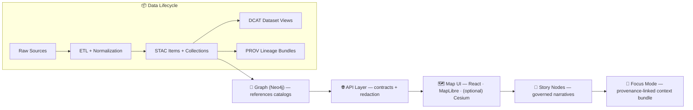

# 🧩 `src/` — Core Platform Code (KFM v13)


> 🧭 **Purpose:** `src/` is the canonical home for KFM’s **pipelines**, **knowledge graph build**, and the **governed API layer**.  
> 🎛️ If you’re looking for the map UI, go to **`../web/`**. If you’re looking for datasets, go to **`../data/`**.

---

## 🔎 Quick Links (start here)

- 📘 **Master Guide (v13):** `../docs/MASTER_GUIDE_v13.md`
- 🧱 **Architecture Blueprints:** `../docs/architecture/`
- ⚖️ **Governance / Ethics / Sovereignty:** `../docs/governance/`
- 🧰 **Templates (Story Nodes, API contracts, etc.):** `../docs/templates/`
- 📦 **Standards (STAC / DCAT / PROV profiles):** `../docs/standards/`

---

## 🗺️ The non‑negotiable flow

KFM is intentionally organized as a **pipeline → catalog → graph → API → UI → Story → Focus** system.  
This ordering is the *design contract* of the platform. ✅



---

## 📁 What lives in `src/`

> 🎯 **Rule of thumb:** if it’s *execution logic* (ETL, graph loading, APIs, validation tooling), it belongs here.

| Folder | Owns 🧠 | Outputs / Interfaces 📤 | “Don’t break” rule 🔒 |
|---|---|---|---|
| `src/pipelines/` | ETL + normalization + validation tooling | **Processed datasets** + boundary artifacts (STAC/DCAT/PROV) | Deterministic + replayable runs |
| `src/graph/` | Graph build, loaders, migrations | **Neo4j graph state** (schema-stable) | Migrations for ontology/schema changes |
| `src/server/` | Governed API layer (REST/GraphQL), policy checks, redaction | **OpenAPI/GraphQL contracts** + audited access | UI never bypasses API |

> 🧠 **Canonical-homes mindset:** there should be exactly one source of truth per subsystem. If you find yourself duplicating logic across folders, stop and refactor.

---

## ✅ Golden rules (read before coding)

### 1) 🔁 Pipeline ordering is absolute
No stage may consume data that hasn’t exited the prior stage through formal outputs + checks.

### 2) 🧾 Contract-first development
Schemas + API contracts are first-class artifacts.  
Changes must be versioned and tested (contract tests).

### 3) 🧪 Deterministic, idempotent ETL
Pipelines must be config-driven, fully logged, and safe to re-run.

### 4) 🚧 API boundary rule
Frontend/UI must **never** query Neo4j directly. All access flows through `src/server/`.

### 5) 🧬 Provenance first
Before graph or UI usage, data must be registered with provenance (STAC/DCAT + PROV).

### 6) 🧠 Evidence-first narrative
Story Nodes + Focus Mode can only contain provenance-linked, evidence-backed content.  
No “hallucinated” claims.

### 7) 🔒 Governance: fail closed
If a policy/validation gate fails, the system blocks the action by default.

---

## 🛠️ `src/pipelines/` — ETL, normalization, validation

### What belongs here ✅
- Domain ETL pipelines (raw → work → processed)
- Catalog writers:
  - STAC Collections + Items
  - DCAT JSON-LD datasets
  - PROV bundles for lineage
- Validators (schema/profile checks)
- Reproducible pipeline configs + run logs

### Design pattern: evidence artifacts (AI/analysis outputs) 🧠📦
If an AI/analysis produces a dataset (raster, table, OCR corpus, prediction layer), treat it as a **first-class dataset**:
- store it under processed outputs,
- catalog it (STAC/DCAT),
- trace it (PROV),
- optionally integrate into graph with explicit provenance,
- expose only through governed APIs (never hard-code in UI).

---

## 🧠 `src/graph/` — knowledge graph build + ontology safety

### What belongs here ✅
- Ontology definitions (labels/relations expectations)
- Graph loader jobs (ingest references to catalog records)
- Constraint checks (no orphan node types, etc.)
- Migration scripts for deliberate breaking/renaming

### Versioning rule 📌
Graph structure should remain backwards-compatible unless a deliberate migration is performed.  
Breaking changes require coordination across graph ↔ API ↔ UI.

---

## 🌐 `src/server/` — governed API layer (REST/GraphQL)

### What belongs here ✅
- OpenAPI / GraphQL “contract surface”
- Request validation + response shaping
- Centralized governance checks (access control, redaction, classification propagation)
- Audit hooks (what was accessed, under what policy, etc.)
- Adapters to PostGIS / Neo4j / catalogs (STAC/DCAT/PROV)

### 🧱 Recommended layering (Clean Architecture-ish)
Keep business logic separate from frameworks:

- **Domain layer:** core entities + rules (no DB imports)
- **Service / use-case layer:** orchestration of domain behaviors
- **Integration / adapters:** PostGIS/Neo4j/catalog clients
- **Infrastructure:** FastAPI app, routers, DI wiring, startup/shutdown

> 🎯 Goal: swap a database or external API by replacing an adapter, without rewriting core logic.

---

## 🧩 Adding new capability (where to touch)

<details>
<summary><strong>🆕 A) Add a new data domain</strong></summary>

1) Put inputs/outputs in the standard lifecycle:
- `data/raw/<new-domain>/`
- `data/work/<new-domain>/`
- `data/processed/<new-domain>/`

2) Implement domain pipeline in:
- `src/pipelines/…`

3) Publish boundary artifacts (required):
- STAC → `data/stac/...`
- DCAT → `data/catalog/dcat/...`
- PROV → `data/prov/...`

4) Add a runbook:
- `docs/data/<new-domain>/README.md` (ETL procedures + sources + constraints)

</details>

<details>
<summary><strong>🧠 B) Add an “evidence artifact” (AI/analysis output)</strong></summary>

Treat the artifact like any other dataset:
- Store in processed outputs
- Catalog it (STAC/DCAT)
- Trace it (PROV)
- Integrate into graph only with explicit provenance
- Expose only via API so redaction/classification rules apply

</details>

<details>
<summary><strong>🧬 C) Change graph schema / ontology</strong></summary>

- Prefer backwards-compatible changes
- If breaking:
  - write a migration script,
  - update constraints/integrity checks,
  - coordinate API contract updates and UI expectations

</details>

<details>
<summary><strong>🧾 D) Add or change an API endpoint (contract-driven)</strong></summary>

- Start from the contract:
  - OpenAPI spec / GraphQL schema
- Implement in `src/server/`:
  - request parsing + validation
  - service/use-case call
  - policy/redaction enforcement
  - contract tests

> Tip: use `../docs/templates/TEMPLATE__API_CONTRACT_EXTENSION.md`

</details>

<details>
<summary><strong>📖 E) Add Story Nodes / Focus Mode context</strong></summary>

Most story content lives outside `src/`:
- templates: `../docs/templates/`
- story data/content: see the repo’s story node structure
- hard rule: provenance-linked claims only ✅

</details>

---

## 🧪 Testing & CI expectations

KFM expects contributions to pass automated gates, including:
- schema/profile validation (STAC/DCAT/PROV)
- provenance completeness checks
- contract tests for APIs
- security scans (secrets/sensitive data leaks)
- policy compliance checks

> 🧯 If something fails: fix the artifact, don’t bypass the gate.

---

## 🧰 Local dev (typical workflow)

> Your branch may differ, but the common workflow is containerized + API contract exploration.

### 🚀 Run the stack
```bash
docker-compose up
```

### 🧭 Useful ports (common defaults)
- PostGIS: `5432`
- Neo4j browser: `7474`
- API: `8000`
- Web dev server: `3000`

### 🧪 Explore the API
- Swagger UI: `http://localhost:8000/docs`
- GraphQL (if enabled): `http://localhost:8000/graphql`

### 🏃 Run a one-off pipeline (example shape)
```bash
docker-compose exec <api-or-worker-service> python <pipeline_entrypoint.py>
```

---

## 🔒 Security, governance & ethics (this is not optional)

KFM is governance-driven by design:
- access control and classification propagate end-to-end,
- policies can block unsafe data exposure (including AI outputs),
- auditability matters (who saw what, and why).

See:
- `../docs/governance/ROOT_GOVERNANCE.md`
- `../docs/governance/ETHICS.md`
- `../docs/governance/SOVEREIGNTY.md`

---

## 🧭 If you’re lost 😅

1) Read **`../docs/MASTER_GUIDE_v13.md`**  
2) Pick the subsystem:
- ETL? → `src/pipelines/`
- Graph? → `src/graph/`
- API? → `src/server/`
- UI? → `../web/`
3) If you can’t draw the pipeline for your change, you’re not done.

---

📝 _This README is intentionally strict. It encodes contract-level expectations so KFM stays provenance-first, governance-safe, and reproducible._