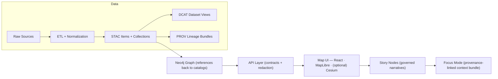

# 🧭 Kansas Frontier Matrix (KFM) — `src/` Core Code Guide


> **`src/` is KFM’s canonical home for core implementation**:  
> 🧪 deterministic ETL pipelines • 🕸️ graph/ontology tooling • 🌐 governed API layer • 🤖 Focus Mode orchestration.  
> If you change code here, you’re changing **governed systems** — every change must produce **auditable evidence**.

---

## 🧭 Quick Navigation

- 🎯 [What `src/` owns](#-what-src-owns)
- 🚦 [Non-negotiables](#-non-negotiables-v13-invariants)
- 🗂️ [Repo context](#️-repo-context-v13-layout)
- 🧪🕸️🌐 [`src/` layout](#️-src-layout-recommended)
- 🔁 [Canonical pipeline](#-the-canonical-pipeline)
- 🧱 [Architecture mental model](#-architecture-mental-model-how-to-code-inside-src)
- 🧪 [Pipelines playbook](#-pipelines-playbook-srcpipelines)
- 🕸️ [Graph playbook](#️-graph-playbook-srcgraph)
- 🌐 [Server playbook](#-server-playbook-srcserver)
- 🤖 [Focus Mode contract](#-focus-mode-contract-srcserverai)
- ⚖️ [Policy pack & quality gates](#️-policy-pack--quality-gates)
- 🚀 [Golden paths](#-golden-paths)
- ✅ [Definition of Done](#-definition-of-done-for-src-prs)
- 📚 [Reference library](#-reference-library)

---

## 🎯 What `src/` owns

| Area | `src/` owns it | Boundary notes |
|---|---:|---|
| 🧪 Deterministic ETL pipelines | ✅ | Must be replayable + idempotent; no ad-hoc edits |
| 🧾 Metadata “catalog triplet” generation (STAC/DCAT/PROV) | ✅ | Must exist **before** graph/UI/story/focus use |
| 🕸️ Knowledge graph integration + integrity | ✅ | Ontology stability + migrations; prevent orphan/drift |
| 🌐 Governed API + redaction layer | ✅ | UI must not talk to Neo4j directly |
| 🤖 Focus Mode orchestration + citations | ✅ | Hybrid retrieval, citations required, refuse when missing |
| 🎛️ UI (React/MapLibre/Cesium) | ❌ | Canonical home: `web/` |
| 🧾 Story Nodes (narratives) | ❌ | Canonical home: `docs/reports/story_nodes/` |
| 🗃️ Data artifacts & catalogs | ❌ | Canonical home: `data/` (raw/work/processed + STAC/DCAT/PROV) |

---

## 🚦 Non-negotiables (v13 invariants)

> [!IMPORTANT]
> These are **hard gates** (design + CI). If you violate them, you’re not “almost done” — you’re blocked.

1) **Pipeline ordering is absolute** 🧱  
`ETL → Catalogs (STAC/DCAT/PROV) → Graph → API → UI → Story Nodes → Focus Mode`

2) **API boundary rule** 🚧  
Frontend **must never query Neo4j directly**. All graph access goes through `src/server/` for contracts + policy + redaction.

3) **Provenance-first publishing** 🧾  
No dataset is “published” until it has STAC + DCAT + PROV and passes validation.

4) **Evidence-first narrative + AI** 📌  
Story Nodes and Focus Mode must never introduce unsourced claims. If evidence is missing: **refuse**.

5) **Fail-closed policy gates** 🔒  
Missing license, missing CRS, missing provenance, schema drift, missing citations, secrets leakage → **block merge/publish**.

6) **Sovereignty & classification propagation** 🪶  
Outputs cannot be less restricted than inputs. Redaction and approval rules propagate end-to-end.

---

## 🗂️ Repo context (v13 layout)

`src/` lives inside a larger “contracts + data + narrative” repo:

```text
📁 schemas/                 # ✅ machine-validated contract artifacts (STAC/DCAT/PROV/story/ui/telemetry)
📁 src/                     # 🚀 code (pipelines/graph/server)
📁 tools/                   # policy pack, validators, linters, helpers
📁 web/                     # UI (React + MapLibre + optional Cesium)
📁 data/                    # raw/work/processed + catalogs (stac/dcat/prov) + audits
📁 docs/                    # governance, standards, templates, story nodes, runbooks
📁 releases/                # immutable, signed build & artifact bundles (optional)
```

> [!TIP]
> **Contract-first** means: schemas/contracts change first, code follows.  
> If you’re editing code without a matching contract update, you’re likely drifting.

---

## 🗂️ `src/` layout (recommended)

> [!NOTE]
> Top-level `src/` boundaries are stable. Subfolders may evolve, but keep contracts clean.

```text
src/
├── 🧪 pipelines/                         # ingest → validate → transform → publish
│   ├── 🗂️ <domain_or_product>/            # one pipeline per domain/product (config-driven)
│   │   ├── 📥 ingest.py                   # acquire inputs (ETag caching, receipts, raw snapshot)
│   │   ├── 🧪 transform.py                # raw → work → processed (deterministic params/seeds)
│   │   ├── ✅ validate.py                 # schema + policy checks (fail-closed)
│   │   ├── 📦 publish.py                  # publish outputs + write STAC/DCAT/PROV + run manifest
│   │   └── ⚙️ configs/                    # configs only (NO secrets)
│   └── ♻️ _shared/                        # pipeline utilities (single source of truth)
│       ├── 🧰 io/                         # canonical paths + atomic writes + receipts + telemetry
│       ├── 🔐 hashing/                    # digests, stable IDs, file hashing (SHA-256)
│       ├── 🧾 catalogs/                   # STAC/DCAT/PROV writers + validators
│       └── ✅ validators/                 # schema, link integrity, geo sanity, policy hooks
│
├── 🕸️ graph/
│   ├── 🧠 ontology/                       # vocab, mappings, versioned ontology definitions
│   ├── 🔁 migrations/                     # explicit migrations (no silent breaking changes)
│   ├── 🛡️ integrity/                      # constraints + drift detection + QA reports
│   ├── 📥 loaders/                        # STAC/DCAT/PROV → graph (mapping + normalization)
│   └── 📤 exports/                        # graph → digestable outputs (JSON-LD, UI bundles)
│
└── 🌐 server/
    ├── 🌐 api/                            # REST routers/controllers (thin)
    ├── 🧬 graphql/                        # GraphQL schema/resolvers (optional; enforce depth/cost)
    ├── 🧩 services/                       # use-cases (search, tiles, story, focus, redaction)
    ├── 🧠 domain/                         # pure logic: entities + rules (no DB/HTTP)
    ├── 🧷 adapters/                       # ports/adapters perimeter
    │   ├── 📤 outbound/                   # PostGIS/Neo4j/OPA/OCI clients
    │   └── 📥 inbound/                    # queues/webhooks/streams (if used)
    ├── 🤖 ai/                             # Focus Mode (RAG + citations + answer receipts)
    ├── 🔐 auth/                           # RBAC/ABAC scopes + token validation + policy scopes
    └── 🧱 middleware/                     # tracing, request IDs, rate limits, error mapping, CORS
```

---

## 🔁 The canonical pipeline

KFM is designed so **each stage consumes validated artifacts from the stage before it**:



> [!IMPORTANT]
> The **catalog triplet** (STAC + DCAT + PROV) is the “boundary artifact” contract.  
> Graph, API, UI, Story Nodes, and Focus Mode **must link back** to cataloged sources.

---

## 🧱 Architecture mental model (how to code inside `src/`)

KFM’s implementation style is **clean, contract-driven, and evidence-led**:

- 🧠 **Domain layer**: entities + rules (pure code; no DB/HTTP clients)
- 🧩 **Service layer**: use-cases/orchestration (calls ports, returns results)
- 🧷 **Ports (interfaces)**: abstractions for PostGIS/Neo4j/policy/caches
- 📦 **Adapters**: actual implementations (Neo4j driver, SQLAlchemy, HTTP clients)

> [!TIP]
> If you’re about to import a database client inside `src/server/domain/`… stop.  
> That’s a boundary violation. Move it to an adapter and depend on a port/interface.

---

## 🧪 Pipelines playbook (`src/pipelines/`)

### ✅ Core guarantees

A pipeline is “KFM-valid” only if it is:

- 🔁 **Deterministic**: same inputs + same config → same outputs
- ♻️ **Idempotent**: reruns don’t duplicate or corrupt state
- 🧾 **Accountable**: emits receipts/logs + file hashes + run identifiers
- ✅ **Validated**: schema + geo checks + policy pack checks (fail closed)
- 🧷 **Cataloged**: produces STAC/DCAT/PROV at publish time

### 📦 Staging rules (do not improvise)

- `data/raw/<domain>/` → immutable snapshots (store original receipts/metadata)
- `data/work/<domain>/` → intermediate work products (throwaway but logged)
- `data/processed/<domain>/` → final published artifacts (stable & referenced)
- `data/stac/...` + `data/catalog/dcat/...` + `data/prov/...` → boundary artifacts

### 🛰️ Data formats: “serve performance, preserve traceability”

Common patterns:
- 🗺️ Vector: GeoJSON / GeoPackage / GeoParquet (export-friendly)
- 🌄 Raster: Cloud-Optimized GeoTIFF (COG) + pyramids/overviews
- 🧱 Tiles: vector tiles (server-side or prebuilt artifacts; treat as datasets)
- 📄 Documents/OCR: extracted text corpora treated as datasets (with PROV)
- 🔗 Everything must link back to licenses + sources + hashes + CRS

### 📡 Streaming ingestion (near-real-time)

Streaming is handled as **many small batch ingests**:
- micro-batches append to PostGIS (often time-partitioned)
- provenance is captured in **batched logs / append-only ledgers**
- policy still applies (no provenance → block or tag until stub exists)

### 🧾 Run manifests (evidence ledger)

Every `publish.py` should emit a compact run record that answers:
- what inputs were used (URIs + hashes + timestamps)
- what configs/params were applied
- what outputs were produced (paths + hashes + record counts)
- what validations passed/failed
- what policy gates were checked
- what commit/build produced the run

> [!NOTE]
> Treat “analysis outputs” (simulations, OCR, AI-derived layers) as **first-class datasets**:  
> processed storage → STAC/DCAT → PROV lineage → (optional) graph integration → governed API exposure.

---

## 🕸️ Graph playbook (`src/graph/`)

### 🧠 Ontology first (and versioned)

- ontology defines node labels, relationship types, and key properties
- changes must be explicit and **migration-backed**
- clients (API/UI/AI) rely on stability → breaking changes require version strategy

### 🔁 Migrations are mandatory for breaking changes

- no “silent” ontology drift
- prefer **forward-only** migrations
- maintain a migration index + version history

### 🛡️ Integrity checks are part of normal operation

Examples:
- prevent orphan nodes / dangling relationships
- ensure required properties exist
- ensure graph nodes reference catalog IDs (STAC/DCAT/PROV) rather than duplicating payloads

> [!IMPORTANT]
> The graph models **relationships**, not bulk storage.  
> The “source of truth” for data assets is the catalogs + processed artifacts.

---

## 🌐 Server playbook (`src/server/`)

### 🎛️ API is the governance boundary

The API layer is responsible for:
- ✅ contract validation (OpenAPI / GraphQL schema)
- 🔒 policy enforcement (OPA decisions, redaction, classification)
- 🧾 provenance linkage (responses can point to catalog/source artifacts)
- 🧭 consistent query semantics (so UI and AI get stable behavior)

> [!IMPORTANT]
> UI → API → (PostGIS/Neo4j/catalogs).  
> **No direct UI→Neo4j**.

### 🧬 GraphQL is optional (but must be governed)

If GraphQL is enabled:
- enforce query depth/cost limits
- use contract tests
- keep resolvers thin; call services/use-cases

### 🗺️ Geospatial endpoints (typical)

Examples of API responsibilities (implementation details may vary by deployment):
- tile endpoints (vector/raster)
- spatial search (bbox, radius, polygon)
- temporal filters (time window / timeline)
- layer registry and metadata lookups
- story node retrieval (published narratives)
- “evidence panel” queries (show provenance + source links)

---

## 🤖 Focus Mode contract (`src/server/ai/`)

Focus Mode is a **hybrid retrieval** pipeline:
- 🔎 pulls structured context (Neo4j + PostGIS)
- 📚 pulls catalog evidence (STAC/DCAT/PROV + source docs)
- 🧾 builds a **context bundle** with links + citations
- ✍️ generates an answer that **must cite evidence**
- 🛑 refuses when evidence is missing or policy blocks access

### ✅ Hard requirements

- **No citations → no answer** (fail closed)
- citations must resolve to cataloged sources / datasets
- policy + redaction must be applied before response generation
- return “answer receipts” (inputs + sources + policy decisions) for auditability

### 📈 Monitoring & reliability

- track latency, refusal rate, citation density, and source coverage
- rebuildability is a feature: indexes can be reconstructed from raw → processed → catalogs

---

## ⚖️ Policy pack & quality gates

KFM governance is enforced via:
- **OPA (Rego policies)** + **Conftest** (CI evaluation)
- schema validators for STAC/DCAT/PROV + internal contracts
- security scanning (secrets, dependency health, artifacts integrity)
- geo validation (CRS, geometry validity, bounds sanity)

Example policy classes:
- 📜 **Data**: license required; CRS required; sensitivity restrictions
- 🤖 **AI**: “answers must include at least one citation”; “entities referenced must exist in graph”
- 🧑‍💻 **Dev**: no secrets; review required; lint/tests required

> [!NOTE]
> CI follows **Detect → Validate → Promote**.  
> If Validate fails, Promote does not happen. No exceptions without governance approval.

---

## 🚀 Golden paths

> [!TIP]
> These are the “happy path” workflows. If your change doesn’t fit, stop and document why.

<details>
<summary><strong>🧪 Add a new data domain (ETL → catalogs → graph → API)</strong></summary>

**1) Create the pipeline skeleton**
- `src/pipelines/<new-domain>/ingest.py`
- `src/pipelines/<new-domain>/transform.py`
- `src/pipelines/<new-domain>/validate.py`
- `src/pipelines/<new-domain>/publish.py`
- `src/pipelines/<new-domain>/configs/`

**2) Add staging paths**
- `data/raw/<new-domain>/`
- `data/work/<new-domain>/`
- `data/processed/<new-domain>/`

**3) Publish boundary artifacts**
- `data/stac/collections/...` + `data/stac/items/...`
- `data/catalog/dcat/...`
- `data/prov/...`

**4) Add runbook**
- `docs/data/<new-domain>/README.md` (sources, caveats, methods, ethics)

**5) Integrate graph**
- add loader mapping only after catalogs exist
- graph nodes point to catalog IDs

**6) Expose via API**
- add endpoint(s) in `src/server/api/`
- add service in `src/server/services/`
- add policy checks + redaction if needed

</details>

<details>
<summary><strong>🕸️ Change the graph schema safely</strong></summary>

- update ontology definition (version it)
- add a migration in `src/graph/migrations/`
- add/adjust integrity checks in `src/graph/integrity/`
- update API contract if shape changes
- update UI contracts (if applicable) — but keep UI work in `web/`

</details>

<details>
<summary><strong>🌐 Add a new API endpoint (contract-first)</strong></summary>

- update the contract (OpenAPI/GraphQL) first
- implement handler (thin)
- implement service/use-case (business logic)
- add adapter changes as needed (Neo4j/PostGIS/OPA)
- add contract tests + policy tests
- ensure response contains provenance links when relevant

</details>

<details>
<summary><strong>🤖 Extend Focus Mode retrieval</strong></summary>

- define what evidence counts (cataloged datasets/docs only)
- implement retriever behind a port (adapter pattern)
- enforce policy/redaction before prompt assembly
- require citations for every non-trivial claim
- log an “answer receipt” (sources + hashes + policy decisions)

</details>

---

## 🧪 Testing & validation matrix (recommended)

| Layer | What to test | Where |
|---|---|---|
| 🧪 Pipelines | determinism, idempotency, schema/geo validation, policy checks | `pytest` + CI |
| 🧾 Catalogs | STAC/DCAT/PROV schema validity; link integrity | `tools/validation/` + CI |
| 🕸️ Graph | migrations, constraints, integrity checks | `src/graph/integrity/` + CI |
| 🌐 API | contract tests, auth/policy checks, redaction correctness | `src/server/tests/` + CI |
| 🤖 Focus Mode | citation presence, refusal behavior, policy gates | `src/server/ai/tests/` + CI |

---

## 🔐 Security, privacy, and inference control (don’t skip)

- 🔑 **No secrets in repo** (configs are non-secret; secrets come from env/secret manager)
- 🪪 **AuthZ everywhere** (RBAC/ABAC + OPA decisions)
- 🧼 **Redaction is server-side** (UI should not “self-police”)
- 🧠 **Inference risk exists** even if you hide raw values  
  Consider privacy-preserving methods (aggregation, suppression, k-anonymity/l-diversity/t-closeness, query auditing) for sensitive releases.

> [!IMPORTANT]
> If a dataset is sensitive, its derivatives **inherit** restrictions unless governance approves release.

---

## ✅ Definition of Done for `src/` PRs

- [ ] Pipelines are deterministic + idempotent (re-run safe)
- [ ] STAC/DCAT/PROV emitted/updated **before** graph/UI/story use
- [ ] Graph changes include migrations + integrity checks (when needed)
- [ ] API changes are contract-first and versioned (no silent breakage)
- [ ] Policy gates pass (license, provenance, schema, citations, security)
- [ ] If Focus Mode changed: answers still cite sources or refuse (fail closed)
- [ ] Telemetry/logging added for new critical paths (so governance can audit)

---

## 📚 Reference library

### 🧭 Core KFM design inputs (read these first)
- 📘 `docs/MASTER_GUIDE_v13.md` (canonical pipeline + invariants + repo contracts)
- 🏗️ `docs/architecture/` (platform architecture, roadmap, subsystem contracts)
- 🤖 `docs/ai/` (Focus Mode rules, evaluation, telemetry expectations)
- 🖥️ `docs/ui/` (UI integration constraints + layer registry expectations)
- ⚖️ `docs/governance/` (FAIR+CARE, ethics, sovereignty, review triggers)
- ✍️ `docs/templates/` (Universal doc, Story Node, API contract extension templates)

### 📚 Research bundles (reference-only, not runtime)
These are **idea libraries** for implementation choices (GIS, WebGL, security, data science).  
They are not “runtime dependencies,” but they influence patterns and guardrails.

- 🗺️ Web mapping & virtual worlds references (MapLibre/Cesium/WebGL ecosystem)
- 🧠 AI/ML concept portfolio (modeling patterns, evaluation ideas)
- 🗄️ Data management + architectures + Bayesian methods portfolio
- 🧰 Programming resources portfolios (Git/Docker/GraphQL/security/tooling)
- 📍 GIS + Python geospatial cookbook (recipes & workflows; adapt to modern Python)
- 🧪 Scientific method + engineering rigor protocol (reproducibility culture)
- 🔐 Data mining & privacy references (privacy-preserving analytics concepts)

---

## 🧭 If you only remember one thing…

> [!IMPORTANT]
> **In KFM, code is not “done” until it produces evidence.**  
> If your change creates or transforms data, it must emit **STAC/DCAT/PROV**, pass policy gates, and remain replayable — before it can reach graph, API, UI, stories, or Focus Mode.