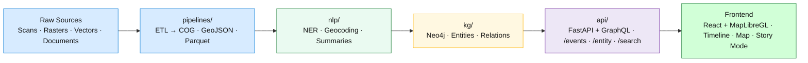

<div align="center">

# 🧩 Kansas Frontier Matrix — `src/` Codebase

**ETL · AI/ML · Knowledge Graph · API Services**  
_The beating heart of the Kansas Frontier Matrix stack._

[](../.github/workflows/site.yml)
[](../.github/workflows/stac-validate.yml)
[](../.github/workflows/codeql.yml)
[](../.github/workflows/trivy.yml)
[](https://pre-commit.com)
[](../docs/)
[](../LICENSE)

</div>

---

## 📚 Purpose
The `src/` directory contains all **core logic** for the Kansas Frontier Matrix:

- ⚙️ **ETL Pipelines** → reproducible ingestion & transformation (COGs, GeoJSON, Parquet)  
- 🤖 **AI/ML Modules** → NLP, entity linking, summarization, confidence scoring  
- 🕸 **Knowledge Graph** → Neo4j integration (CIDOC CRM, OWL-Time, PeriodO)  
- 🔌 **API Layer** → FastAPI / GraphQL endpoints powering the web app + KML exports  

> Think of `src/` as the **engine room** where raw data becomes structured, searchable knowledge.

---

## 🏗 Directory Structure
```text
src/
├─ pipelines/      # ETL jobs: fetch, transform, load (scans, rasters, vectors, docs)
├─ nlp/            # NLP + AI/ML enrichment (NER, linking, summarization)
├─ graph/          # Graph schema + Neo4j integration (Cypher utils, entity upserts)
├─ api/            # FastAPI/GraphQL services (REST endpoints, resolvers)
├─ utils/          # Shared helpers (logging, config, checksum validation)
└─ __tests__/      # Optional inline unit tests
````

🧭 For architectural context see [`src/ARCHITECTURE.md`](./ARCHITECTURE.md).

---

## 🚀 Quickstart (Dev Setup)

```bash
# 1. create environment
python -m venv .venv && source .venv/bin/activate
# 2. install deps
pip install -r requirements.txt
# 3. run ETL (example: DEMs)
make fetch cogs stac
# 4. launch API
uvicorn src.api.main:app --reload --port 8000
```

Visit → **[http://localhost:8000/docs](http://localhost:8000/docs)** for interactive Swagger UI.

---

## 🧭 Data Flow



---

## 🔬 Core Technologies

| Domain             | Library / Framework                   |
| ------------------ | ------------------------------------- |
| API                | **FastAPI**, **GraphQL (Strawberry)** |
| Graph              | **Neo4j / Cypher**, `py2neo`          |
| NLP / ML           | **spaCy**, Transformers (BART / T5)   |
| Geospatial         | **rasterio**, **rio-cogeo**, **GDAL** |
| Catalog / Metadata | **pystac**, **jsonschema**            |
| Language           | **Python 3.11 +**                     |

---

## 🧪 Testing

```bash
pytest src --maxfail=1 --disable-warnings -v --cov=src
```

Tests live in `tests/python/` and optional inline `src/__tests__/`.

---

## 🛡 Quality & Security

* 🧹 **Pre-commit hooks:** `ruff`, `black`, `mypy`
* 🧠 **CodeQL:** static analysis via GitHub Actions
* 🧱 **Trivy:** dependency & container scan
* 🧾 **STAC Validation:** verifies geospatial metadata compliance

---

## 🎯 Developer Workflows

### Adding a New Dataset

1. Add manifest → `data/sources/{id}.json`
2. Run ETL:

   ```bash
   make fetch cogs stac
   ```
3. Add pipeline → `src/pipelines/{new_source}.py`
4. Extend graph → `src/graph/schema.py`
5. Document in `docs/sop.md` + add tests.

### Adding a New API Endpoint

1. Create route → `src/api/routes/{endpoint}.py`
2. Annotate with OpenAPI decorators
3. Add tests → `tests/api/test_{endpoint}.py`

---

## 📦 Example API Calls

```http
GET /events?start=1850-01-01&end=1870-12-31&bbox=-100,37,-94,40
```

Returns all Kansas events in range as GeoJSON + AI summaries.

```http
GET /entity/fort-larned
```

Returns linked events, documents, and geospatial context.

---

## 🎨 Layer & Timeline Integration

Color tokens and time windows for the frontend reside in
[`web/config/layers.json`](../web/config/layers.json).
See **[Layer Timeline Legend](./ARCHITECTURE.md#-layer-timeline-legend)**
for canonical visualization styles.

---

## 🗂 Documentation

* 📖 [`ARCHITECTURE.md`](./ARCHITECTURE.md) — component relationships
* 🧭 [`../docs/`](../docs/) — SOPs · experiments · model cards
* 🧪 [`../tests/`](../tests/) — test suites & coverage
* ⚙️ `.github/workflows/` — CI/CD automation

---

## 🤝 Contributing

Follow **MCP (Master Coder Protocol)**:

1. Document before code (SOP / experiment / architecture).
2. Reproduce everything (checksum · schema · logs).
3. Add tests for every change.
4. Include provenance metadata in PR descriptions.

See [`CONTRIBUTING.md`](../CONTRIBUTING.md).

---

## 📖 References

* **STAC 1.0.0** — SpatioTemporal Asset Catalog standard
* **CIDOC CRM + OWL-Time + PeriodO** — semantic and temporal ontologies
* **Kansas GIS Hub · USGS 3DEP · NOAA NCEI · FEMA OpenFEMA · KSHS** — primary data sources

---

<div align="center">

✨ *“The `src/` directory is where Kansas history is translated into a living, queryable atlas.”* ✨

</div>
