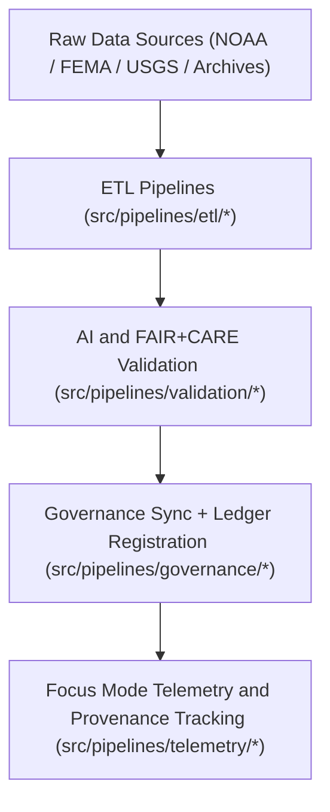

<div align="center">

# 🧠 Kansas Frontier Matrix — **Source Code & ETL Pipelines**
`src/README.md`

**Purpose:**  
Core FAIR+CARE-certified source code directory for all **ETL, AI, governance, and validation pipelines** in the Kansas Frontier Matrix (KFM).  
This workspace contains modular, version-controlled Python scripts for automating reproducible and ethical data operations across all KFM domains.

[](../docs/standards/faircare-validation.md)
[](../LICENSE)
[](../docs/architecture/repo-focus.md)

</div>

---

## 📚 Overview

The `src/` directory serves as the **core execution layer** of the Kansas Frontier Matrix — the foundation for ETL pipelines, AI/ML models, and governance synchronization tasks.  
It unites data engineering, machine learning, and ethical auditing under one transparent, reproducible, and FAIR+CARE-aligned codebase.

### Core Responsibilities
- Ingest, transform, and validate all structured and unstructured KFM data.  
- Integrate AI/ML models for Focus Mode reasoning and explainability analytics.  
- Synchronize metadata, provenance, and FAIR+CARE governance registries.  
- Maintain compliance with ISO, CF, and MCP-DL v6.3 documentation-first standards.  

---

## 🗂️ Directory Layout

```plaintext
src/
├── README.md                              # This file — documentation for Source Code & ETL Pipelines
│
├── pipelines/                             # Primary ETL and AI pipeline scripts
│   ├── etl/                               # ETL ingestion and transformation pipelines
│   │   ├── climate_etl.py
│   │   ├── hazards_etl.py
│   │   ├── hydrology_etl.py
│   │   └── tabular_etl.py
│   │
│   ├── ai/                                # AI model training, inference, and explainability pipelines
│   │   ├── ai_focus_reasoning.py
│   │   ├── ai_bias_detection.py
│   │   └── ai_drift_monitor.py
│   │
│   ├── validation/                        # FAIR+CARE and schema validation automation
│   │   ├── schema_validation.py
│   │   ├── checksum_audit.py
│   │   └── faircare_audit_runner.py
│   │
│   ├── governance/                        # Provenance, ethics, and ledger synchronization tools
│   │   ├── governance_sync.py
│   │   ├── ledger_update.py
│   │   └── checksum_registry.py
│   │
│   ├── telemetry/                         # Focus Mode telemetry and metrics collection
│   │   ├── focus_metrics_collector.py
│   │   └── telemetry_reporter.py
│   │
│   └── utils/                             # Shared helper modules
│       ├── io_utils.py
│       ├── json_tools.py
│       ├── stac_helpers.py
│       └── metadata_utils.py
│
└── metadata.json                          # Provenance and governance linkage metadata for src layer
```

---

## ⚙️ ETL Workflow



### Workflow Description
1. **Extraction:** Retrieve raw datasets from trusted open sources.  
2. **Transformation:** Normalize and clean data using FAIR+CARE-aligned schemas.  
3. **Validation:** Apply schema, checksum, and ethical audits for reproducibility.  
4. **Governance:** Register results in blockchain-backed provenance ledgers.  
5. **Telemetry:** Log process performance and transparency metrics for Focus Mode.  

---

## 🧩 Example Source Metadata Record

```json
{
  "id": "src_pipeline_registry_v9.5.0_2025Q4",
  "pipelines_registered": [
    "climate_etl.py",
    "ai_focus_reasoning.py",
    "checksum_audit.py"
  ],
  "executions_logged": 58,
  "checksum_verified": true,
  "fairstatus": "certified",
  "ai_explainability_score": 0.992,
  "governance_registered": true,
  "telemetry_ref": "releases/v9.5.0/focus-telemetry.json",
  "governance_ref": "reports/audit/ai_src_ledger.json",
  "created": "2025-11-02T23:59:00Z",
  "validator": "@kfm-src"
}
```

---

## 🧠 FAIR+CARE Governance Matrix

| Principle | Implementation |
|------------|----------------|
| **Findable** | All ETL scripts indexed and version-controlled with provenance metadata. |
| **Accessible** | Open Python source under MIT license, documented per MCP-DL standards. |
| **Interoperable** | Schema-aligned across FAIR+CARE, STAC/DCAT, and ISO 19115. |
| **Reusable** | Modular and portable codebase with reproducible outputs. |
| **Collective Benefit** | Enables open environmental, historical, and ethical research. |
| **Authority to Control** | FAIR+CARE Council approves core ETL and governance updates. |
| **Responsibility** | Developers maintain traceable, ethical, and reproducible pipelines. |
| **Ethics** | All automation processes adhere to open governance and ethical standards. |

Audit results maintained in:  
`reports/audit/ai_src_ledger.json` • `reports/fair/src_summary.json`

---

## ⚙️ Key Pipelines Summary

| Module | Function | FAIR+CARE Role |
|---------|-----------|----------------|
| `pipelines/etl/` | Extract, transform, and load datasets across domains. | Ensures reproducible FAIR+CARE workflows. |
| `pipelines/ai/` | Manage AI reasoning, explainability, and drift detection. | Ethical AI validation and transparency. |
| `pipelines/validation/` | Execute schema and FAIR+CARE audits. | Automated ethics and compliance assurance. |
| `pipelines/governance/` | Synchronize ledgers, checksums, and provenance. | Immutable traceability and ethics certification. |
| `pipelines/telemetry/` | Log system performance and Focus Mode metrics. | Continuous monitoring and accountability. |

Automation handled via `src_pipelines_sync.yml`.

---

## 🧾 Retention Policy

| File Type | Retention Duration | Policy |
|------------|--------------------|--------|
| Source Code | Permanent | Version-controlled under Git with full governance lineage. |
| Validation Reports | 365 days | Retained for audit review and provenance verification. |
| FAIR+CARE Logs | Permanent | Maintained for reproducibility and certification. |
| Metadata | Permanent | Archived in governance manifest and checksum registry. |

Cleanup automated through `src_cleanup.yml`.

---

## 🧾 Internal Use Citation

```text
Kansas Frontier Matrix (2025). Source Code & ETL Pipelines (v9.5.0).
Core FAIR+CARE-certified automation layer powering all data ingestion, transformation, and governance operations.
Ensures transparency, reproducibility, and ethical automation under MCP-DL v6.3 compliance.
```

---

## 🧾 Version Notes

| Version | Date | Notes |
|----------|------|--------|
| v9.5.0 | 2025-11-02 | Added AI pipeline explainability logging and FAIR+CARE telemetry integration. |
| v9.3.2 | 2025-10-28 | Enhanced governance synchronization and checksum automation. |
| v9.3.0 | 2025-10-26 | Established source layer for reproducible ETL and validation operations. |

---

<div align="center">

**Kansas Frontier Matrix** · *Data Engineering × FAIR+CARE Ethics × Provenance Automation*  
[🔗 Repository](https://github.com/bartytime4life/Kansas-Frontier-Matrix) • [🧭 Docs Portal](../docs/) • [⚖️ Governance Ledger](../docs/standards/governance/)

</div>
