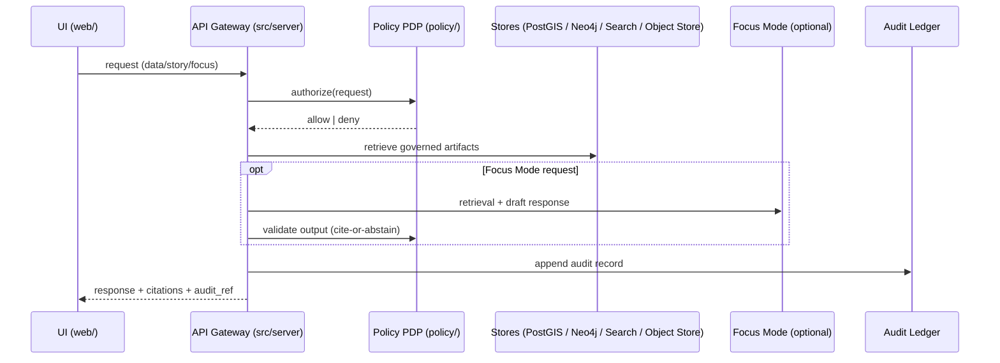
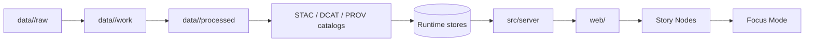

<!--
File: src/README.md
KFM governed artifact: yes (system behavior)
-->

# `src/` — KFM pipelines, graph build, and API boundary

This directory contains KFM’s **source code** for:

- **ETL / transformations** (`src/pipelines/`)
- **Knowledge graph build + ingest tooling** (`src/graph/`)
- **Governed API boundary** (`src/server/`)

If you’re looking for the frontend, go to `web/`. If you’re looking for governed docs or Story Nodes, go to `docs/`. If you’re looking for catalogs and promoted datasets, go to `data/`.

---

## Table of contents

- [What lives here](#what-lives-here)
- [Non-negotiables](#non-negotiables)
- [Directory map](#directory-map)
- [Request flow](#request-flow)
- [Local dev quickstart](#local-dev-quickstart)
- [Clean layers inside `src/server/`](#clean-layers-inside-srcserver)
- [Where to make changes](#where-to-make-changes)
- [Testing expectations](#testing-expectations)
- [Troubleshooting](#troubleshooting)
- [Governance notes](#governance-notes)

---

## What lives here

KFM is built as a **pipeline → catalogs → stores → API → UI → Story Nodes → Focus Mode** system.

`src/` is responsible for the **code** that makes that chain real:

- Pipelines produce processed artifacts and machine-readable catalogs.
- Graph tooling produces/imports graph artifacts and constraints.
- The API serves **only governed/publishable outputs** through a policy gate and emits audit/provenance references.

---

## Non-negotiables

> [!IMPORTANT]
> These are release-blocking invariants.
>
> - **No UI → DB direct access.** The frontend must never talk to PostGIS/Neo4j/Search/ObjectStore directly.
> - **Fail-closed policy.** If authorization is uncertain, deny by default.
> - **Repository interfaces only.** Backend business logic cannot bypass ports/contracts to talk straight to storage.
> - **Audit + provenance are normal-path outputs.** Every governed response should be traceable.

---

## Directory map

```text
src/
├── pipelines/   # ETL jobs + domain transformations
├── graph/       # graph build code (ontology bindings, ingest scripts, constraints)
└── server/      # governed API boundary (service + API contract defs)
```

---

## Request flow

### Conceptual sequence (governed)



### Data “truth path” (why pipelines matter)



---

## Local dev quickstart

> [!NOTE]
> Run the stack from the **repo root** unless your branch documents otherwise.

1) Create your env file:

```bash
cp .env.example .env
```

2) Start the compose stack:

```bash
docker compose up --build
```

3) Confirm you can reach:
- **API docs** at `http://localhost:8000/docs`
- **Web UI** at `http://localhost:3000`

If your branch exposes GraphQL, it may be available at `/graphql` (optional).

---

## Clean layers inside `src/server/`

KFM backend code is expected to follow **clean architecture** boundaries. The goal is to make governance enforceable and testable.

| Layer | What goes here | What must *not* go here | Tests expected |
|---|---|---|---|
| Domain | Entities, value objects, invariants | DB calls, web handlers, policy calls | Pure unit tests |
| Use Cases | Workflows + business rules | DB clients, framework code | Use-case tests with mocked ports |
| Integration | Ports/contracts + DTOs | Storage implementations | Contract/schema tests |
| Infrastructure | DB clients, API handlers, OPA adapters | Business rules | Integration + end-to-end smoke tests |

> [!TIP]
> Treat ports/contracts as the “trust membrane’s seam”: it is how we prevent accidental bypassing of governance.

---

## Where to make changes

| You need to… | Edit here | Notes |
|---|---|---|
| Add a new ETL job / transform | `src/pipelines/` | Must produce governed outputs + catalogs |
| Update graph ingest / constraints | `src/graph/` | Ensure deterministic IDs and repeatable builds |
| Add/modify API endpoints | `src/server/` | Must route through policy + audit |
| Change who can access what | `policy/` (outside `src/`) | Default deny, policy tests required |
| Change UI behavior | `web/` (outside `src/`) | UI never talks directly to databases |

---

## Testing expectations

> [!IMPORTANT]
> Any change that could affect governed output must have tests.

Minimum bar (by layer):
- **Domain**: unit tests for invariants
- **Use cases**: tests with mocked ports (no live DB)
- **Contracts**: schema/DTO/contract tests (breakage = CI fail)
- **Infrastructure**: integration tests (policy + stores + API boundary)

---

## Troubleshooting

- **Port conflicts**: common offenders are Postgres (`5432`), Neo4j (`7474`), API (`8000`), UI (`3000`). Stop the conflicting service or adjust compose port mappings.
- **Compose startup timing**: if a dependency wasn’t ready, rerun `docker compose up` or verify `depends_on`.
- **Hot reload not working**: check volume mounts (e.g., `web/src` mounted into the web container) and whether the API server runs with reload enabled in compose.
- **Env changes not applied**: restart relevant containers (down/up).

---

## Governance notes

- **Evidence-first**: if output can’t be supported, the system must “cite or abstain.”
- **Sensitivity**: if a dataset includes sensitive locations or culturally restricted knowledge, do not publish precise derivatives without a governed redaction/generalization path and separate provenance.

---

<!-- End of governed src README -->