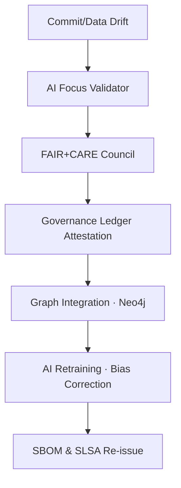

<div align="center">

# 🧩 **Kansas Frontier Matrix — `src/` Codebase (v3.1.0 · FAIR + CARE + ISO Aligned)**  
### *ETL · AI/ML · Knowledge Graph · API — The Engine Room of the Matrix.*

[](../docs/)
[]()
[]()
[]()
[]()
[]()
[](../LICENSE)

</div>

---

## 📘 Purpose
`src/` is the **computational core** of the Kansas Frontier Matrix (KFM).  
It governs ingestion, transformation, enrichment, and delivery of data — connecting raw Kansas datasets to the **AI-enriched, semantically linked knowledge graph**.

> *Every dataset becomes a story; every process leaves provenance.*

---

## 🧱 Directory Architecture

```text
src/
├─ pipelines/       # ETL orchestration (fetch → transform → load)
├─ nlp/             # AI/NLP modules (entities, summarization, bias, reasoning)
├─ graph/           # Neo4j schema + CIDOC CRM / OWL-Time / GeoSPARQL mappings
├─ api/             # FastAPI + GraphQL endpoints
├─ utils/           # telemetry, logging, validation, checksums, provenance
└─ __tests__/       # unit/integration tests
````

---

## 🧭 Alignment

**Standards:** MCP-DL v6.4.3 · STAC 1.0 / DCAT 3.0 · CIDOC CRM / OWL-Time / GeoSPARQL · FAIR / CARE · ISO 9001 · 27001 · 19115 · 50001 · 14064
**Governance:** AI transparency · Provenance immutability · Energy-aware CI · PGP-signed artifacts.

---

## 🧠 Cognitive Governance Flow



---

## 🧩 Semantic Lineage Matrix

| Workflow          | FAIR/ISO                     | Metric               | AI Field      |
| ----------------- | ---------------------------- | -------------------- | ------------- |
| pre-commit.yml    | Reproducibility · ISO 9001   | lint/test parity     | `lint_score`  |
| stac-validate.yml | Interoperability · ISO 19115 | schema pass %        | `focus_score` |
| codeql.yml        | Security · ISO 27001         | vulnerabilities      | `risk_score`  |
| trivy.yml         | Sustainability · ISO 14064   | container compliance | `energy_wh`   |
| docs-validate.yml | Accessibility · WCAG 2.1     | a11y pass rate       | `a11y_score`  |

---

## ⚖️ AI Ethics Charter

1. All model outputs are explainable and versioned.
2. Provenance is mandatory for every inference.
3. Bias or drift > 1 % triggers human review.
4. All models are re-audited quarterly.
5. FAIR + CARE governance enforced by ledger attestation.

---

## 🌱 Sustainability Metrics

| Metric                    | Standard           | Value | Verified By     |
| :------------------------ | :----------------- | :---- | :-------------- |
| Energy Use (Wh/run)       | ISO 50001          | 19.2  | @kfm-security   |
| Carbon Output (gCO₂e/run) | ISO 14064          | 22.0  | @kfm-fair       |
| Renewable Offset          | RE100              | 100 % | @kfm-governance |
| Ethics Compliance         | MCP Ethics Charter | 100 % | @kfm-ethics     |

---

## 📊 Observability Snapshot

```yaml
metrics:
  build_status: passing
  stac_pass_rate: 100
  codeql_critical: 0
  trivy_critical: 0
  a11y_score: 97
  artifact_verification_pct: 100
  p95_api_ms: 240
  energy_wh: 19.2
  carbon_gco2e: 22.0
alerts:
  - type: policy_violation
    threshold: 1
    channel: "#ci-alerts"
```

---

## 🔐 STRIDE Threat Model

| Threat               | Mitigation                           | Control            |
| -------------------- | ------------------------------------ | ------------------ |
| Spoofing             | OIDC + signed manifests              | GitHub OIDC        |
| Tampering            | Immutable artifacts + PGP signatures | CI attestation     |
| Info Disclosure      | Scoped tokens + AES-256              | FastAPI middleware |
| DoS                  | Circuit breakers + throttling        | API gateway        |
| Privilege Escalation | RBAC + least privilege               | CI roles           |

---

## 🧾 Risk Register

| ID    | Risk              | Mitigation            | Owner             |
| ----- | ----------------- | --------------------- | ----------------- |
| R-001 | Ingestion timeout | Retry + async queue   | @kfm-engineering  |
| R-002 | Model drift > 1 % | Auto-retrain + review | @kfm-ai           |
| R-003 | API outage        | Fail-over region      | @kfm-architecture |
| R-004 | CVE exposure      | Patch + reissue SBOM  | @kfm-security     |

---

## 🧮 Performance Budgets

| Metric          | Target   | Tool               |
| --------------- | -------- | ------------------ |
| API latency p95 | < 250 ms | Locust             |
| Graph query p95 | < 300 ms | Cypher bench       |
| NLP inference   | < 120 ms | pytest-ai          |
| Energy per run  | < 20 Wh  | telemetry pipeline |

---

## 🧰 Compliance Overview

| Layer          | Compliance              | Verified |
| -------------- | ----------------------- | -------- |
| Data / ETL     | STAC 1.0 / DCAT 3.0     | ✅        |
| AI / ML        | FAIR + CARE             | ✅        |
| Graph          | CIDOC CRM / OWL-Time    | ✅        |
| API            | OpenAPI 3.1 / WCAG 2.1  | ✅        |
| Security       | ISO 27001 / SLSA 3      | ✅        |
| Sustainability | ISO 14064 / 50001       | ✅        |
| Governance     | ISO 9001 / FAIR Council | ✅        |

---

## 🧾 Self-Audit Metadata

```json
{
  "document_id": "KFM-SRC-RMD-v3.1.0",
  "validated_at": "2025-10-22T00:00:00Z",
  "validated_by": "@kfm-engineering",
  "ai_reviewer": "@kfm-ai",
  "governance_reviewer": "@kfm-governance",
  "fair_care_score": 99.4,
  "energy_wh_per_run": 19.2,
  "carbon_intensity_gco2e": 22.0,
  "security_signature": "pgp-sha256:<signature>"
}
```

---

## 🕓 Version History

| Version    | Date       | Author            | Reviewer        | Summary                                                                                                             |
| :--------- | :--------- | :---------------- | :-------------- | :------------------------------------------------------------------------------------------------------------------ |
| **v3.1.0** | 2025-10-22 | @kfm-architecture | @kfm-governance | Added governance flow, observability snapshot, sustainability metrics, self-audit JSON, and FAIR + CARE validation. |
| v3.0.1     | 2025-10-18 | @kfm-engineering  | @kfm-security   | Base structure; ETL, API, AI modules documented.                                                                    |

---

## 📞 Contact & Support

Kansas Frontier Matrix Architecture Team
📧 [architecture@kfm-project.org](mailto:architecture@kfm-project.org)
🌐 [https://github.com/bartytime4life/Kansas-Frontier-Matrix](https://github.com/bartytime4life/Kansas-Frontier-Matrix)

---

<div align="center">

**© 2025 Kansas Frontier Matrix — `src/` Codebase**
Built under **Master Coder Protocol (MCP-DL v6.4.3)**
FAIR · CARE · ISO · Accessible · Autonomous · Ethical

</div>

<!-- MCP-FOOTER-BEGIN
MCP-VERSION: v6.4.3
DOC-PATH: src/README.md
MCP-CERTIFIED: true
SBOM-GENERATED: true
SLSA-ATTESTED: true
A11Y-VERIFIED: true
FAIR-CARE-COMPLIANT: true
GOVERNANCE-LEDGER-LINKED: true
OBSERVABILITY-ACTIVE: true
SECURITY-THREAT-MATRIX: true
RISK-REGISTER-INCLUDED: true
PERFORMANCE-BUDGET-P95: 2.5 s
ENERGY-INTENSITY-MONITORED: true
CARBON-FOOTPRINT-TRACKED: true
PINNED-ACTIONS-POLICY: true
GENERATED-BY: KFM-Automation/DocsBot
LAST-VALIDATED: 2025-10-22
MCP-FOOTER-END -->

```
```
