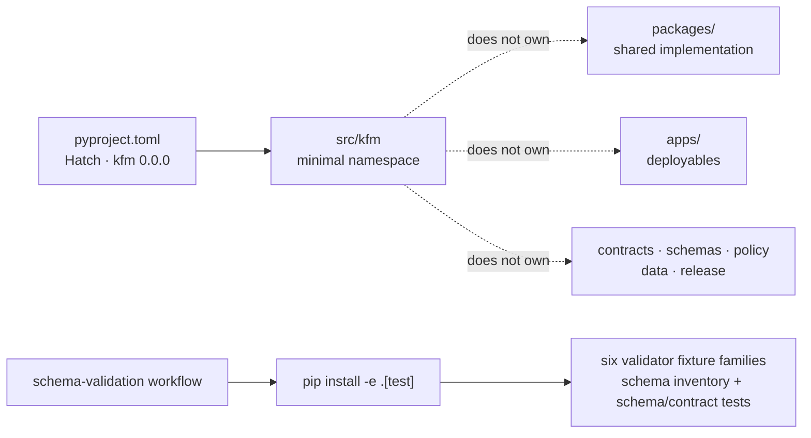

<!-- [KFM_META_BLOCK_V2]
doc_id: kfm://doc/src-readme
title: src/ — Root Python Distribution Source Layout and Compatibility Boundary
type: README
version: v0.3
status: draft; repository-grounded; compatibility-and-drift-root; active-packaging-layout; migration-decision-open; public-api-unestablished; non-authoritative
owner: NEEDS VERIFICATION — default CODEOWNERS route is @bartytime4life; no explicit /src/ rule, accepted package steward, or independent review-enforcement record was established
created: NEEDS VERIFICATION — the empty README was replaced by v0.1 on 2026-07-04
updated: 2026-07-23
supersedes: v0.2 documentation at the same path; no packaging, import, dependency, workflow, test, runtime, release, or publication behavior is superseded
policy_label: repository-facing; python; hatch; source-layout; compatibility-boundary; no-parallel-implementation-authority; no-hidden-facade; no-public-api-claim; no-runtime-authority; no-lifecycle-authority; no-release-authority; adr-or-migration-required; correction-aware; rollback-aware
owning_root: UNRESOLVED — src/ is an existing root-level Python packaging layout, not a canonical Directory Rules responsibility root
responsibility: contain and explain the active root Python distribution source layout while retention, facade adoption, migration into packages/, or retirement remains undecided
truth_posture: cite-or-abstain; configuration and CI installation prove a bounded packaging dependency, not a supported API, clean artifact, published distribution, runtime role, or release authority
evidence_snapshot:
  repository: bartytime4life/Kansas-Frontier-Matrix
  base_ref: main
  base_commit: e0b50a6c342a216c150624df6dd513121d9d1f85
  prior_blob: bf0ee991067fd2c82a34c7f85686fa7aa7694c8d
  prior_evidence_commit: 0c9df2b0ed87753ff482bdd2da87f35507517eed
  intervening_commits: 840
  child_readme_blob: d8cd7a5fc70357eb78c52b9311e32cec8c7063f5
  namespace_init_blob: b0c8ae94b22045818b6af9db40260acdf40338f1
  root_pyproject_blob: 3bba45d49de489c221734ee2446b21083f84fb28
  packages_root_readme_blob: fc18fb3334fefe992a551fe12aa98c812232cd17
  makefile_blob: 51537af34ee065c2de571134688415042b83b22a
  schema_validation_workflow_blob: e6b26337aa1eea142b96560e041419f855c44d59
  tests_root_readme_blob: 55ac53c6c08f9a2b77149645d0a22de3ea680732
  codeowners_blob: dd2a84aa514d8ecd9208bc347f90f9a2ed37dd61
  directory_rules_doctrine_blob: 2affb080e6f0043867c64c7f06c1ca52030fbd55
  directory_rules_architecture_blob: 18653c00ba193a4afaa3e07a0924452807fb98ef
  drift_register_blob: 5c5078b93c467e66f4cc8b86a7a696dbce5ae7e0
  prior_generated_receipt_blob: 037d033f06f2e2a1a9a9fa0bffaa53e13317c404
related:
  - kfm/README.md
  - kfm/__init__.py
  - ../pyproject.toml
  - ../packages/README.md
  - ../tests/README.md
  - ../Makefile
  - ../.github/workflows/schema-validation.yml
  - ../.github/CODEOWNERS
  - ../docs/doctrine/directory-rules.md
  - ../docs/architecture/directory-rules.md
  - ../docs/registers/DRIFT_REGISTER.md
  - ../data/receipts/generated/genrec-src-readme-2a102125.json
notes:
  - "v0.3 is a same-path documentation modernization and evidence refresh after 840 commits from the v0.2 evidence base."
  - "The first twelve H2 sections follow the Directory Rules §15 canonical/compatibility-root README contract."
  - "The root project still builds distribution kfm 0.0.0 from src/kfm; the namespace still contains only a package docstring."
  - "Current schema-validation CI installs the root project with test dependencies, checks six configured validator fixture families, validates schema inventory/identity, and runs schema/contract tests. That is schema-lane evidence, not root-package artifact or API proof."
  - "The current drift register still has no dedicated root-src entry. No accepted retention, facade, migration, or retirement ADR was surfaced."
  - "The child src/kfm README still contains a stale statement about the parent README; reconciliation is recorded as a separate documentation item rather than expanded into this scoped change."
[/KFM_META_BLOCK_V2] -->

<a id="top"></a>

# `src/` — Root Python Distribution Source Layout and Compatibility Boundary

[](#status)
[](#authority-level)
[](#status)
[](#bounded-current-inventory)
[](#status)
[](#validation)

> **One-line purpose.** `src/` is the active source-layout carrier for the repository's root `kfm` distribution; this README contains that compatibility boundary so it cannot silently become a second shared-library, application, runtime, trust-object, lifecycle, or release authority.

**Quick navigation:** [Purpose](#purpose) · [Authority](#authority-level) · [Status](#status) · [Belongs](#what-belongs-here) · [Does not belong](#what-does-not-belong-here) · [Inputs](#inputs) · [Outputs](#outputs) · [Validation](#validation) · [Review](#review-burden) · [Related roots](#related-folders) · [ADRs](#adrs) · [Last reviewed](#last-reviewed) · [Inventory](#bounded-current-inventory) · [Parent/child](#parent-and-child-readme-contract) · [Trust](#trust-and-import-boundary) · [Packaging](#packaging-and-dependency-boundary) · [Decision](#adr-and-migration-decision) · [Done](#definition-of-done) · [Open](#open-verification-register) · [Rollback](#maintenance-correction-and-rollback)

> [!IMPORTANT]
> The root [`pyproject.toml`](../pyproject.toml) configures Hatchling to build distribution `kfm` version `0.0.0` from `src/kfm`. The schema-validation workflow installs the root project with test dependencies before running six configured validator fixture families and the schema/contract test lane. Those facts establish a bounded packaging dependency. They do **not** establish a supported facade, clean wheel or sdist, published package, public API, production consumer, or release.

> [!WARNING]
> Directory Rules do not recognize root `src/` as a canonical responsibility root. Shared reusable implementation belongs under [`packages/`](../packages/README.md). Retention, curated-facade adoption, migration, or retirement therefore requires a reviewed decision rather than convenience-driven growth.

> [!CAUTION]
> Do not move active packaging or add facade exports merely to make this README look cleaner. This document records the conflict and the evidence needed to resolve it; it does not choose a migration outcome.

---

## Purpose

`src/README.md` is the directory-level operating contract for the repository-root Python source layout.

It exists to:

- orient maintainers to the configured root distribution;
- index the inspected child namespace without duplicating its package contract;
- distinguish packaging configuration from API, runtime, release, and publication proof;
- route substantial implementation into the correct responsibility roots;
- keep the root-`src` placement conflict visible;
- define the evidence needed for retention, facade adoption, migration, or retirement;
- preserve correction and rollback paths for documentation and future package changes.

The bounded question this README answers is:

> What may the active root Python source layout contain while its long-term authority and packaging role remain undecided?

It does not define semantic contracts, machine schemas, policy, domain truth, lifecycle data, release decisions, deployable behavior, or public interfaces.

[Back to top](#top)

---

<a id="repository-fit-and-conflict"></a>

## Authority level

**Directory class:** existing compatibility-and-drift boundary with active packaging use.

`src/` has no independent responsibility in the canonical KFM root model, while the live root project still selects `src/kfm` as its wheel package. Both facts are material.

| Question | Current determination | Truth posture |
|---|---|---:|
| Is `src/kfm` selected by the root Hatch wheel configuration? | Yes. | `CONFIRMED` |
| Does the root project declare distribution `kfm` version `0.0.0`? | Yes. | `CONFIRMED` |
| Is root `src/` a canonical Directory Rules responsibility root? | No. | `CONFIRMED doctrine` |
| Is [`packages/`](../packages/README.md) the shared reusable implementation root? | Yes. | `CONFIRMED` |
| Is `kfm` an accepted umbrella facade or stable public API? | Not established. | `UNKNOWN` |
| Is root package publication intended? | Not established; project license metadata is still `TBD`. | `UNKNOWN` |
| Is a root-`src` migration or retention ADR accepted? | None surfaced in the inspected evidence. | `NEEDS VERIFICATION` |
| Is root-`src` drift registered? | No dedicated entry appears in the inspected drift register. | `CONFIRMED bounded absence` |
| Does this README authorize retention or migration? | No. | `DENY` |

### Authority boundary

`src/` may carry the currently configured root namespace while a decision is pending. It must not become a parallel home for:

- shared implementation owned by `packages/`;
- deployable behavior owned by `apps/`;
- source admission owned by `connectors/`;
- transformations owned by `pipelines/`;
- runtime adapters owned by `runtime/`;
- validators and builders owned by `tools/`;
- contracts, schemas, or policy;
- lifecycle data, receipts, proofs, catalogs, or published artifacts;
- release, correction, withdrawal, or rollback decisions.

A Python import path does not transfer ownership. An installable distribution does not prove a supported API. A green schema workflow does not ratify the root package role.

[Back to top](#top)

---

<a id="status-and-evidence-boundary"></a>

## Status

### Current evidence boundary

Snapshot: `main@e0b50a6c342a216c150624df6dd513121d9d1f85`.

| Surface | Observed state | Safe conclusion |
|---|---|---|
| `src/README.md` | Existing v0.2, blob `bf0ee991…` | Same-path parent contract exists and is eligible for an evidence refresh. |
| [`src/kfm/README.md`](kfm/README.md) | Existing v0.2, blob `d8cd7a5f…` | Detailed namespace/facade contract exists; it does not establish implementation. |
| [`src/kfm/__init__.py`](kfm/__init__.py) | One package docstring | Namespace remains minimal and has no documented exports or side effects. |
| Root [`pyproject.toml`](../pyproject.toml) | Hatchling; `kfm==0.0.0`; Python `>=3.11`; `jsonschema`; pytest extra; wheel package `src/kfm` | Root packaging is configured. License remains `TBD`. |
| Root [`Makefile`](../Makefile) | Six-validator aggregate through `make schemas`; narrow schema/contract `make test` | Commands are executable surfaces, not a root-package suite. |
| Schema-validation workflow | Installs `.[test]`, requires nonempty configured fixtures, parses schema JSON, meta-schema checks schemas, requires unique canonical IDs, runs validators and schema/contract tests | Substantive schema-lane CI exists; it does not build or inspect root package artifacts. |
| [`tests/README.md`](../tests/README.md) | Current v1.3 test-root contract | No canonical root-wide full-suite command is established. |
| [`packages/README.md`](../packages/README.md) | Shared reusable implementation responsibility root | Substantial reusable code belongs there, not under root `src/`. |
| [`.github/CODEOWNERS`](../.github/CODEOWNERS) | Default route `* @bartytime4life`; no explicit `/src/` pattern | Review routing is established; stewardship and required-review enforcement remain separate. |
| Drift register | No root-`src` entry in the inspected file | Registration remains open; this README is not a drift-register substitute. |
| Prior generation receipt | `genrec-src-readme-2a102125.json` exists | It preserves v0.2 provenance and must not be overwritten. |
| Clean wheel/sdist, publication, consumers, production use | No current proof inspected | `UNKNOWN` |

### Truth labels used here

| Label | Meaning |
|---|---|
| `CONFIRMED` | Verified from the pinned repository file, configuration, workflow definition, test source, or generated artifact. |
| `PROPOSED` | A recommended containment, test, migration, or decision path not accepted as current behavior. |
| `UNKNOWN` | Evidence is insufficient to establish the claim. |
| `NEEDS VERIFICATION` | A concrete inspection, run, owner decision, or review is required. |
| `CONFLICTED` | Current evidence or documentation surfaces disagree and this README does not silently choose a winner. |
| `DENY` | A prohibited authority, bypass, or maturity interpretation. |

### Current conflicts

1. **Active packaging versus canonical placement.** Root `src/kfm` is selected by Hatch, but root `src/` is not a canonical responsibility root.
2. **Parent/child documentation drift.** The child README still describes the parent README as stale even though v0.2 already corrected that condition.
3. **Directory Rules placement.** Both `docs/doctrine/directory-rules.md` and `docs/architecture/directory-rules.md` are live; their own canonical placement remains unresolved. They nevertheless agree on the responsibility-root principle used here.
4. **CI installation versus package proof.** Editable installation is required for current schema tooling, but no clean artifact or API contract is established.

[Back to top](#top)

---

<a id="content-and-authority-rules"></a>

## What belongs here

The default content set is intentionally small.

| Content | Admission posture | Required evidence |
|---|---|---|
| This parent README | Allowed | Current inventory, placement boundary, validation, decision, and rollback guidance |
| [`kfm/README.md`](kfm/README.md) | Allowed | Child namespace/package contract |
| [`kfm/__init__.py`](kfm/__init__.py) package marker | Allowed while current packaging remains | Minimal, side-effect-free, no hidden imports or exports |
| Tightly scoped compatibility shim | Review required | Accepted owner, consumer inventory, tests, deprecation window, migration and rollback |
| Migration/deprecation/correction note | Review required | Governing decision, affected consumers, prior/new paths, rollback target |
| Packaging metadata helper | Exceptional | Explicit ownership, no hidden I/O, deterministic behavior, direct tests |

Before adding any export, module, alias, dynamic version loader, `py.typed`, package data, entry point, plugin registry, optional dependency, generated code, or compatibility facade, establish:

1. the owning responsibility;
2. why the canonical package/application/tool root cannot own it directly;
3. the public or internal API contract;
4. dependency direction;
5. tests for import safety and artifact parity;
6. consumer and compatibility scope;
7. deprecation, correction, and rollback.

[Back to top](#top)

---

## What does NOT belong here

| Material | Correct responsibility root |
|---|---|
| Shared reusable implementation or domain libraries | [`packages/`](../packages/README.md) |
| CLI, service, worker, API, review console, or UI shell | `apps/` |
| Source clients, fetchers, or admission logic | `connectors/` |
| Executable transformations or orchestration | `pipelines/` |
| Runtime/model adapters or harnesses | `runtime/` |
| Validators, generators, builders, proof/release/QA tooling | `tools/` |
| Small operational helper | `scripts/` |
| Semantic meaning | `contracts/` |
| Machine-checkable shape | `schemas/` |
| Admissibility, rights, sensitivity, or release policy | `policy/` |
| Test assertions or reusable fixtures | `tests/` and `fixtures/` |
| RAW, WORK, QUARANTINE, PROCESSED, CATALOG/TRIPLET, PUBLISHED state | `data/` lifecycle roots |
| Receipts, proofs, catalogs, or registries | their governed `data/` roots |
| Release manifests, promotion decisions, correction or rollback records | `release/` |
| Public API, map, UI, or AI behavior | accepted app/package boundaries consuming governed payloads |

The following interpretations are also prohibited:

```text
import kfm succeeds
  != stable public API

pip install -e . succeeds
  != clean wheel or sdist proof

schema-validation is green
  != root package role accepted

src/kfm is packaged
  != src/ owns repository implementation

documentation is polished
  != migration or release approved
```

[Back to top](#top)

---

## Inputs

### Current inputs

| Input | Role | Limit |
|---|---|---|
| Root [`pyproject.toml`](../pyproject.toml) | Distribution metadata, build backend, dependency carrier, wheel/sdist selection | Configuration only; not artifact or publication proof |
| [`src/kfm/__init__.py`](kfm/__init__.py) | Minimal namespace marker | No exports or behavior |
| [`src/kfm/README.md`](kfm/README.md) | Detailed package/facade boundary | Contains one stale parent-status statement requiring separate reconciliation |
| [`packages/README.md`](../packages/README.md) | Shared implementation authority | Does not decide root-package migration |
| Directory Rules | Responsibility-root and migration doctrine | Their own live placement is conflicted |
| [`Makefile`](../Makefile) and schema workflow | Current validator/test installation path | Schema-lane scope only |
| [`tests/README.md`](../tests/README.md) | Test-root scope and claim discipline | No full-suite command |
| CODEOWNERS | Default GitHub review routing | Not stewardship, approval, or branch-protection proof |
| Prior generation receipt | v0.2 provenance | Lineage only; never rewrite it |

### Future decision inputs

A retention, facade, migration, or retirement decision should include:

- accepted owners and review burden;
- current and proposed import graph;
- internal and external consumer inventory;
- build and artifact evidence;
- package-index and license intent;
- dependency ownership;
- API/export snapshot;
- compatibility and deprecation plan;
- CI and release implications;
- correction and rollback plan.

[Back to top](#top)

---

## Outputs

### Outputs of this directory today

| Output | Status | Claim limit |
|---|---|---|
| Configured `kfm` package namespace | `CONFIRMED` | Minimal marker only |
| Candidate wheel/sdist inclusion of `src/kfm` | `CONFIRMED by configuration` | Exact built contents not inspected |
| Editable-install participation in schema CI | `CONFIRMED` | Supports the root dependency/tooling environment; not a public API |
| Directory and child-package documentation | `CONFIRMED` | Guidance and evidence boundary only |

### Outputs this directory must not emit by implication

`src/` does not emit or authorize:

- `EvidenceBundle`, `PolicyDecision`, `PromotionDecision`, `ReleaseManifest`, or rollback authority;
- lifecycle transitions or canonical data mutations;
- deployable services or public routes;
- source activation;
- model-runtime access;
- published packages or KFM public artifacts;
- domain truth;
- supported facade exports unless separately accepted and tested.

A future build artifact is a **candidate** until its contents, provenance, version, license, tests, and release state are inspected.

[Back to top](#top)

---

<a id="validation-and-ci-boundary"></a>

## Validation

### Confirmed repository checks

```bash
# Current aggregate: six configured schema-fixture validators.
make schemas

# Current narrow schema/contract pytest lane.
make test

# Current aggregate of the two commands above.
make validate
```

The schema-validation workflow currently:

1. installs the root project with `python -m pip install -e ".[test]"`;
2. requires all six configured validator scripts, schemas, and nonempty valid/invalid fixture lanes;
3. requires expected-error sidecars for configured invalid fixtures;
4. parses all JSON under `schemas/`;
5. checks all `*.schema.json` files against Draft 2020-12;
6. requires canonical v1 schemas to declare unique `$id` values;
7. runs `make schemas`;
8. runs `python -m pytest -q tests/schemas tests/contracts`.

That workflow provides evidence about the configured schema-validation environment. It does **not** directly test the `kfm` distribution as a package.

### Root-package proof still required

Before changing the root package role or claiming package readiness, add and observe a reviewed package-proof sequence such as:

```bash
# PROPOSED until accepted and wired.
python -m build
python -m zipfile -l dist/*.whl
python -m tarfile -l dist/*.tar.gz

python -m venv .tmp/kfm-wheel-check
.tmp/kfm-wheel-check/bin/python -m pip install --no-deps dist/*.whl
.tmp/kfm-wheel-check/bin/python -c "import kfm; print(kfm.__doc__)"
```

The accepted implementation must also prove:

- deterministic wheel and sdist contents;
- isolated install and import;
- no import-time network, subprocess, filesystem mutation, environment mutation, logging configuration, or lifecycle access;
- editable-versus-wheel parity;
- API/export snapshot;
- dependency direction;
- `kfm` versus `kfm-cli` separation;
- known-consumer compatibility;
- failure, correction, and rollback behavior.

### Non-vacuity rule

A package check is not substantive when:

- no artifact was built;
- no artifact contents were inspected;
- import ran against the working tree rather than the installed artifact;
- the test asserted only that Python found the namespace;
- no negative import-side-effect checks ran;
- no consumer or compatibility boundary was exercised.

[Back to top](#top)

---

## Review burden

Current GitHub routing falls through the default CODEOWNERS rule to `@bartytime4life`. No explicit `/src/` rule or accepted package-steward identity was established.

| Change | Minimum review burden |
|---|---|
| Documentation-only evidence refresh | Default CODEOWNER + docs/package-boundary review |
| New export, alias, facade, or compatibility shim | Architecture + package + consumer owners + tests/CI |
| New dependency, package data, build hook, or entry point | Packaging + security/supply-chain + CI + affected owners |
| Public API or semantic-versioning promise | Architecture + package + API/consumer + release |
| Migration into `packages/` | ADR/migration review + package owners + CI + consumers + rollback |
| Root distribution retirement | Packaging + workflow/tool owners + consumers + release/correction |
| Trust-bearing or lifecycle access | Request changes; route behavior to its canonical responsibility root |
| License or publication change | Legal/rights posture + package/release review |

CODEOWNERS routing does not prove review occurred, does not assign stewardship, and does not authorize merge, package publication, release, or KFM publication.

[Back to top](#top)

---

## Related folders

| Related surface | Relationship to `src/` |
|---|---|
| [`src/kfm/`](kfm/README.md) | Child namespace and detailed facade/import/package contract |
| [`packages/`](../packages/README.md) | Canonical shared reusable implementation root |
| `apps/` | Deployable application and service authority |
| `apps/cli/` | Separate `kfm-cli` distribution boundary |
| [`tests/`](../tests/README.md) | Authored enforceability proof; currently no direct root-package suite established |
| `fixtures/` | Deterministic reusable examples; not package data by default |
| `tools/validators/` | Shared schema registry/validator implementation that drives the root dependency need |
| [`pyproject.toml`](../pyproject.toml) | Current root distribution and dependency configuration |
| [`.github/workflows/schema-validation.yml`](../.github/workflows/schema-validation.yml) | Current editable-install schema/test CI consumer |
| [`data/receipts/generated/`](../data/receipts/generated/README.md) | AI-generation provenance receipts; not package/release authority |
| `release/` | Any future package release, correction, withdrawal, and rollback decision |
| `docs/registers/` | Drift, verification, and decision tracking |

[Back to top](#top)

---

<a id="adr-and-migration-decision"></a>

## ADRs

No accepted ADR governing the root `src/` role was surfaced in the inspected evidence. The existing path therefore remains contained rather than normalized by assertion.

### Decision options

| Option | Meaning | Minimum closure evidence |
|---|---|---|
| Retain as marker/dependency carrier | Keep `src/kfm` minimal for root tooling compatibility | ADR or accepted migration note; owner; dependency rationale; build/import tests; consumers; rollback |
| Curated facade | Re-export a small stable API from canonical packages | Facade contract; API snapshot; dependency-direction guard; versioning; consumers; deprecation/correction/rollback |
| Migrate to a package under `packages/` | Move shared package responsibility into the canonical package root | Accepted destination; import map; atomic packaging/CI update; compatibility window; artifact and consumer tests |
| Retire root distribution | Remove root wheel selection and editable-install dependency | Replacement dependency/tooling plan; workflow updates; consumer proof; artifact/import regression tests; rollback |
| Keep the decision open | Preserve current minimal namespace while evidence is assembled | No opportunistic exports; visible verification backlog; periodic review |

### ADR triggers

An ADR or equivalently accepted migration decision is required before:

- ratifying root `src/` as a lasting authority surface;
- moving or retiring the root package;
- creating a repository-wide umbrella facade;
- changing ownership between root `src/` and `packages/`;
- adding a compatibility promise with broad consumer impact.

A documentation-only refresh does not decide any of those questions.

[Back to top](#top)

---

## Last reviewed

**Last reviewed:** 2026-07-23 against `main@e0b50a6c342a216c150624df6dd513121d9d1f85`.

Re-review this README when any of the following changes:

- `pyproject.toml` package selection, dependencies, version, license, entry points, or build backend;
- files under `src/` or `src/kfm/`;
- the child namespace README;
- package imports or repository consumers;
- `packages/` authority or package topology;
- schema validator dependency wiring;
- Makefile test/validation commands;
- schema-validation or package-related workflows;
- CODEOWNERS or stewardship;
- Directory Rules, ADRs, drift/verification registers;
- package artifact, publication, correction, or rollback behavior.

Older than six months without review is a documentation-health warning, not evidence that the package became invalid.

[Back to top](#top)

---

<a id="bounded-current-inventory"></a>

## Bounded current inventory

The current inspection directly established:

```text
src/
├── README.md
└── kfm/
    ├── README.md
    └── __init__.py
```

| Path | Role | Explicit limit |
|---|---|---|
| `src/README.md` | Directory inventory, placement boundary, routing, decision and rollback summary | Does not define package exports or settle retention |
| `src/kfm/README.md` | Namespace, facade, import-safety, artifact-proof, compatibility and migration contract | Does not create shared-library authority or deployable behavior |
| `src/kfm/__init__.py` | Minimal import marker | No exports, command, version attribute, registry, adapter, or side effects established |

This is a bounded inventory based on the inspected paths and searches. It is not an exhaustive tree, generated-file, ignored-file, branch-local, or package-consumer inventory.

[Back to top](#top)

---

<a id="parent-and-child-readme-contract"></a>

## Parent and child README contract

| Document | Owns | Must not duplicate or claim |
|---|---|---|
| `src/README.md` | Directory purpose, authority class, inventory, root-wide containment, related roots, decision state, review, correction and rollback | Symbol-level exports, facade API, exact package artifact contents, package test implementation |
| `src/kfm/README.md` | Distribution metadata, namespace behavior, import safety, facade admission, package tests, compatibility and retirement details | Canonical package authority, deployable behavior, root-level Directory Rules decision |

Update the parent when:

- children are added, removed, or reclassified;
- root packaging or dependency purpose changes;
- the root placement/ADR decision changes;
- root-wide review or rollback guidance changes.

Update the child when:

- exports, imports, package modules, API promises, entry points, version behavior, tests, artifacts, consumers, facade behavior, or compatibility changes.

> [!NOTE]
> The current child README still says the parent contains stale packaging uncertainty. That statement was already superseded by parent v0.2 and remains a separate documentation reconciliation item. This scoped update does not rewrite the child.

[Back to top](#top)

---

<a id="trust-and-import-boundary"></a>

## Trust and import boundary

`src/` has no authority to:

- read or write RAW, WORK, QUARANTINE, PROCESSED, CATALOG/TRIPLET, or PUBLISHED state;
- create or approve source admission, evidence, policy, review, promotion, correction, withdrawal, or rollback records;
- expose canonical or internal stores to public clients;
- activate connectors, pipelines, runtime providers, models, routes, renderers, or plugins;
- treat maps, tiles, graphs, indexes, dashboards, summaries, screenshots, or generated language as truth;
- make `EvidenceBundle` or policy checks optional;
- become a direct public API merely because it is importable.

Preferred dependency direction:

```text
apps / pipelines / tools / tests
  -> accepted owning packages under packages/*
```

Unreviewed umbrella direction to avoid:

```text
repository implementation
  -> kfm umbrella namespace
  -> arbitrary internal roots
```

Any future facade must re-export only accepted, documented owning-package APIs. It must not reach into data stores, application internals, or unpublished lifecycle state.

[Back to top](#top)

---

## Packaging and dependency boundary


```mermaid
flowchart LR
    PY["pyproject.toml<br/>Hatch · kfm 0.0.0"] --> SRC["src/kfm<br/>minimal namespace"]
    CI["schema-validation workflow"] --> INSTALL["pip install -e .[test]"]
    INSTALL --> VALIDATE["six validator fixture families<br/>schema inventory + schema/contract tests"]

    SRC -. "does not own" .-> PKG["packages/<br/>shared implementation"]
    SRC -. "does not own" .-> APPS["apps/<br/>deployables"]
    SRC -. "does not own" .-> TRUST["contracts · schemas · policy<br/>data · release"]
```

### Current packaging contract

```toml
[build-system]
requires = ["hatchling"]
build-backend = "hatchling.build"

[project]
name = "kfm"
version = "0.0.0"
requires-python = ">=3.11"
license = { text = "TBD" }

[tool.hatch.build.targets.wheel]
packages = ["src/kfm"]
```

The root distribution currently carries the `jsonschema` dependency used by shared validator registry tooling. That dependency relationship is configuration evidence, not proof that validator implementation belongs under `src/kfm`.

### Import-safety contract

The current marker should remain:

- deterministic;
- side-effect free;
- no-network;
- no subprocess;
- no filesystem mutation;
- no environment mutation;
- no logging reconfiguration;
- no implicit connector, pipeline, runtime, model, API, UI, or release activation.

A future export or facade changes the package contract and must be tested as such.

[Back to top](#top)

---

## ADR and migration decision

Until a decision is accepted:

1. keep the namespace minimal;
2. add no opportunistic implementation or umbrella exports;
3. route reusable work to `packages/`;
4. document and test any temporary compatibility shim;
5. register or explicitly close the root-`src` drift;
6. preserve old/new import and artifact evidence;
7. keep rollback possible.

### Smallest sound decision sequence

1. Inventory tracked and generated `src/` contents and all consumers.
2. Build and inspect clean wheel/sdist artifacts.
3. Add isolated import, no-side-effect, API snapshot, dependency-direction, and editable/wheel parity tests.
4. Establish package/license/version/publication intent.
5. Assign accountable owners and review burden.
6. Record the root-`src` drift.
7. Decide retain, facade, migrate, or retire through ADR/migration review.
8. Apply the smallest atomic implementation change with consumer tests and rollback.

[Back to top](#top)

---

<a id="definition-of-done"></a>

## Definition of done

The root source-layout question is closed only when:

- [ ] the root distribution role and accountable owners are accepted;
- [ ] retention, facade, migration, or retirement is recorded in an accepted ADR or migration decision;
- [ ] root-`src` drift is registered or explicitly closed;
- [ ] license, version source, dependency ownership, and publication metadata are resolved;
- [ ] clean wheel and sdist builds pass and artifact contents are inspected;
- [ ] isolated import and no-side-effect checks pass;
- [ ] API/export snapshot and editable/wheel parity checks pass;
- [ ] dependency direction is enforced;
- [ ] `kfm` and `kfm-cli` boundaries are tested;
- [ ] internal and external consumers are inventoried;
- [ ] any facade maps only to accepted owning-package APIs;
- [ ] substantive package CI exists;
- [ ] compatibility, deprecation, correction, and rollback policies are accepted;
- [ ] related documentation and provenance are synchronized.

Until then, the safe label is:

> **Configured root source layout with a minimal, non-canonical, unratified namespace.**

[Back to top](#top)

---

<a id="open-verification-register"></a>

## Open verification register

| ID | Verification item | Current status | Closure evidence |
|---|---|---|---|
| KFM-SRC-01 | Assign root-distribution and source-layout stewards. | `NEEDS VERIFICATION` | Accepted stewardship record and review route |
| KFM-SRC-02 | Accept retention, facade, migration, or retirement. | `NEEDS VERIFICATION` | ADR or migration decision |
| KFM-SRC-03 | Register or explicitly close root-`src` drift. | `NEEDS VERIFICATION` | Drift entry or accepted ADR |
| KFM-SRC-04 | Establish complete tracked/generated/ignored inventory. | `NEEDS VERIFICATION` | Commit-pinned recursive tree and build manifest |
| KFM-SRC-05 | Build and inspect clean wheel and sdist. | `NEEDS VERIFICATION` | Reproducible build logs and artifact inventory |
| KFM-SRC-06 | Verify isolated import, no side effects, and editable/wheel parity. | `NEEDS VERIFICATION` | Dedicated package tests |
| KFM-SRC-07 | Define and snapshot public/internal exports. | `NEEDS VERIFICATION` | Accepted API contract and snapshot |
| KFM-SRC-08 | Inventory repository, workflow, and external consumers. | `NEEDS VERIFICATION` | Import/dependency graph |
| KFM-SRC-09 | Resolve `jsonschema` dependency ownership. | `NEEDS VERIFICATION` | Package/tool ownership decision |
| KFM-SRC-10 | Resolve license, version source, package index, signing, and publication intent. | `NEEDS VERIFICATION` | Reviewed packaging/release contract |
| KFM-SRC-11 | Add dependency-direction and `kfm`/`kfm-cli` separation tests. | `NEEDS VERIFICATION` | Executable positive/negative tests |
| KFM-SRC-12 | Define compatibility, deprecation, correction, and rollback. | `NEEDS VERIFICATION` | Accepted lifecycle policy and tests |
| KFM-SRC-13 | Reconcile the child README's stale parent-status statement. | `NEEDS VERIFICATION` | Separate child-doc update |
| KFM-SRC-14 | Resolve the two live Directory Rules placement surfaces. | `CONFLICTED` | Accepted ADR/supersession and link migration |
| KFM-SRC-15 | Determine whether any generated, mirrored, localized, or external README copies require synchronization. | `UNKNOWN` | Complete documentation inventory |
| KFM-SRC-16 | Verify branch protection and required package-related checks. | `UNKNOWN` | Repository settings/ruleset evidence |
| KFM-SRC-17 | Establish current package pass, duration, coverage, and flake metrics. | `UNKNOWN` | Governed QA report |

[Back to top](#top)

---

<a id="maintenance-correction-and-rollback"></a>

## Maintenance, correction, and rollback

### Documentation maintenance

Update this README when its review triggers change. Update the child README when package-level behavior changes. Preserve the prior generation receipt and add a new receipt for substantive AI-authored revisions rather than rewriting provenance.

### Before merge

- close the draft pull request; and
- delete or abandon its review branch.

No default-branch state changes.

### After merge

- revert the documentation commit and its new generated receipt; or
- submit a corrective documentation/provenance pull request.

A documentation rollback does not change installed packages, dependencies, tests, workflows, artifacts, consumers, releases, or production systems.

### Package correction

For a package defect or accidental compatibility change:

1. halt package/release promotion;
2. preserve artifacts, hashes, logs, tests, and consumer evidence;
3. identify affected versions and consumers;
4. correct through review;
5. rebuild and test in isolation;
6. publish correction or deprecation guidance where required;
7. retain correction and rollback lineage.

### Migration or retirement

Inventory consumers, accept the governing decision, update packaging and workflows atomically, use a bounded compatibility shim only when justified, test old and new paths, preserve history, and remove the old lane only after migration evidence closes.

[Back to top](#top)

---

<a id="no-loss-revision-note"></a>

## No-loss ledger

| v0.2 material | v0.3 disposition |
|---|---|
| Stable `kfm://doc/src-readme` identity and path | Preserved |
| Root packaging evidence | Preserved and refreshed to current blobs |
| Minimal namespace inventory | Preserved |
| Root-`src` versus `packages/` conflict | Preserved and made part of the required authority section |
| Parent/child README split | Preserved; stale child statement surfaced |
| Content and authority routing table | Preserved under required belongs/does-not-belong sections |
| Trust and import boundary | Preserved and expanded |
| Current schema/test commands | Preserved and corrected to the six-validator, non-vacuous workflow |
| ADR option matrix | Preserved |
| Definition of done | Preserved and expanded |
| Open verification register | Preserved and expanded from 9 to 17 items |
| Maintenance, correction, migration, and rollback | Preserved |
| Legacy heading fragments | Preserved with explicit custom anchors |
| Prior generated receipt | Preserved as immutable lineage |

The modernization removes only stale snapshot metadata, outdated workflow characterization, unverified owner placeholders presented without current CODEOWNERS context, and section ordering that did not meet the current canonical-root/compatibility-root README contract.

[Back to top](#top)

---

## Changelog

### v0.3 — 2026-07-23

- refreshed repository evidence from `0c9df2b0…` to `e0b50a6c…` after 840 intervening commits;
- reordered the first twelve H2 sections to Directory Rules §15;
- preserved the stable path, document ID, H1, prior strong content, and legacy anchors;
- recorded the verified default CODEOWNERS route and bounded stewardship gap;
- corrected schema-validation scope to six configured validator families, nonempty fixture checks, schema inventory/identity checks, and schema/contract tests;
- aligned command limits with the current tests-root contract;
- surfaced the stale child-README parent-status statement;
- preserved the unresolved root-`src` drift and Directory Rules placement conflict;
- expanded package-proof, review, decision, verification, correction, and rollback guidance;
- retained the prior generated receipt as lineage and requires a new receipt for this revision.

### v0.2 — 2026-07-16

- reconciled the parent README with active Hatch packaging and the child namespace contract;
- added placement, containment, validation, decision, correction, and rollback guidance;
- changed documentation only.

---

*Status: draft · Authority: compatibility-and-drift boundary · Implementation: active packaging layout, minimal namespace · Public API: unestablished · Last reviewed: 2026-07-23*
