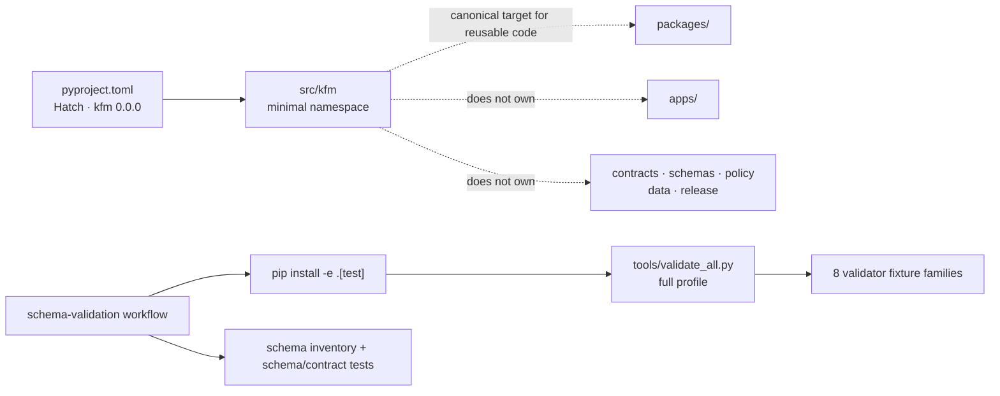

<!-- [KFM_META_BLOCK_V2]
doc_id: kfm://doc/src-readme
title: src/ — Conditional Root Distribution Facade Boundary
type: readme; root-readme; conditional-src-root; root-distribution-boundary; facade-admission-gate; migration-boundary
version: v0.4
status: draft; repository-grounded; conditional-root-confirmed; root-activation-hold; active-packaging-layout; root-facade-profile-unaccepted; public-api-unestablished; package-release-unverified; non-authoritative
owners:
  - "@bartytime4life — verified CODEOWNERS fallback and root-registry writer/reviewer projection"
  - "OWNER_TBD — Root distribution and Python packaging steward"
  - "OWNER_TBD — Architecture and package steward"
  - "OWNER_TBD — Validation, CI, security, supply-chain, and release reviewers"
created: NEEDS VERIFICATION — the empty README was replaced by v0.1 on 2026-07-04
updated: 2026-08-09
supersedes: v0.3 documentation at the same path; no package, import, dependency, workflow, test, runtime, release, deployment, or publication behavior is superseded
prepared_under_prompt: KFM Repository Build-Out & Markdown Modernization Implementation Agent v6.0.0
policy_label: "repository-facing; python; hatch; conditional-root; root-distribution-facade-candidate; hold-no-new-implementation; canonical-target-packages; no-parallel-implementation-authority; no-hidden-facade; no-public-api-claim; no-runtime-authority; no-lifecycle-authority; no-release-authority; adr-required-for-activation; correction-aware; rollback-aware"
current_path: src/README.md
root_profile: ROOT_FULL
root_registry_id: root.src
root_class: conditional
root_activation_outcome: HOLD
readme_placement_outcome: PLACE
canonical_target: packages/
responsibility: contain and explain the currently configured root Python distribution namespace while an accepted root-distribution-facade profile, migration, or retirement decision remains absent
truth_posture: >-
  CONFIRMED same-path target; accepted Directory Rules v2 through ADR-0029;
  ROOT_FULL README requirement; active root-registry entry root.src with conditional
  class, packages/ canonical target, hold-no-new-authority validation profile, and
  accepted-root-distribution-facade-ADR activation condition; root Hatchling project
  kfm 0.0.0 selecting src/kfm; minimal package docstring; one direct child directory;
  eight-validator full profile; current schema-validation workflow; and verified
  CODEOWNERS fallback / PROPOSED root facade, retention, migration, retirement,
  package-proof, compatibility, correction, and rollback decisions / UNKNOWN stable
  public API, clean wheel or sdist evidence, consumers, package publication,
  production use, and server-enforced review requirements / NEEDS VERIFICATION named
  stewards, independent review, accepted facade ADR, complete consumer graph,
  artifact proof, child README reconciliation, drift-record closure, and rollback drill
evidence_snapshot:
  repository: bartytime4life/Kansas-Frontier-Matrix
  visibility: public
  base_ref: main
  base_commit: 3a9715582adf17a682920ca98f15aa3582ee8cdc
  prior_blob: 30999b2ccbc876186b86653bdff80ec3aa7fcb34
  src_tree: fd1dedd17b232d5d77f62af2684e3cc52e75338e
  child_readme_blob: d8cd7a5fc70357eb78c52b9311e32cec8c7063f5
  namespace_init_blob: b0c8ae94b22045818b6af9db40260acdf40338f1
  root_pyproject_blob: 074e2c505bcd748788c494bb9d0dd56e13ad91a9
  packages_root_readme_blob: 7b672f4d834b648f4b30ce7e2e9a5e214efa2c71
  makefile_blob: 4abc7f941ce25d7d14703e87e387cef6e96d1592
  schema_validation_workflow_blob: 3deebb4fa1e5db00108e0b43804ac633083d94c2
  validator_entrypoint_blob: c308015da780d7b72f56277b521fb0e42317651e
  validator_compatibility_runner_blob: c3a87b45bb199d9d2bc07715d7432ec5cc9d6369
  validator_registry_blob: 12517f368cb1c8b850d3a7138a968cee889875ba
  directory_rules_blob: fd49a0b83e55cef52c1124281f093e263526898d
  root_registry_blob: 024f668b5f0a9239bafa4f8b09e2afd86300ff8c
  adr_index_blob: d91b15d4b13a8d741b0f13733d5e51e575eb5604
  codeowners_blob: dd2a84aa514d8ecd9208bc347f90f9a2ed37dd61
  drift_register_blob: 5c5078b93c467e66f4cc8b86a7a696dbce5ae7e0
  generated_receipt_schema_blob: fba21ed27ebccf1362fe397fe0c3ebd85e072685
  direct_children: "1 directory plus this README"
  inventory_method: GitHub connector exact-file reads, commit-pinned contents inspection, accepted-ADR/index review, root-registry review, workflow/config inspection, and open-work reconciliation
related:
  - kfm/README.md
  - kfm/__init__.py
  - ../pyproject.toml
  - ../packages/README.md
  - ../Makefile
  - ../tools/validate_all.py
  - ../tools/validators/_common/run_all.py
  - ../tools/validators/validator_registry.json
  - ../tests/README.md
  - ../.github/workflows/schema-validation.yml
  - ../.github/CODEOWNERS
  - ../docs/doctrine/directory-rules.md
  - ../docs/adr/ADR-0029-adopt-directory-governance-standard-v2.md
  - ../docs/adr/INDEX.md
  - ../control_plane/root_registry.yaml
  - ../docs/registers/DRIFT_REGISTER.md
  - ../data/receipts/generated/README.md
  - ../schemas/contracts/v1/receipts/generated_receipt.schema.json
notes:
  - "v0.4 adopts the Directory Rules v2 ROOT_FULL README profile without activating the conditional src/ root."
  - "The README itself has a same-path PLACE outcome; new src/ implementation remains HOLD until an accepted root-distribution-facade ADR satisfies the registry activation condition."
  - "Current root packaging and editable-install use are preserved as evidence, not converted into public API, facade, release, or publication claims."
  - "The first twelve H2 sections implement Directory Rules v2 §16.2; legacy anchors remain for inbound-link compatibility."
  - "This change modifies this README and its required generated provenance receipt only."
[/KFM_META_BLOCK_V2] -->

<a id="top"></a>
<a id="src"></a>

# `src/` — Conditional Root Distribution Facade Boundary

> **One-line purpose.** Contain the repository's currently configured root `kfm` distribution namespace while keeping `src/` in its adopted **conditional-root `HOLD` state** until an accepted root-distribution-facade decision establishes a narrow profile or a reviewed migration retires the path.

<p>
  <a href="#status"></a>
  <a href="#authority-level"></a>
  <a href="#authority-level"></a>
  <a href="#packaging-and-dependency-boundary"></a>
  <a href="#direct-child-directory-map"></a>
  <a href="#validation"></a>
</p>

> [!IMPORTANT]
> **Two outcomes apply to different questions.** Updating this existing root README is `PLACE`: Directory Rules v2 requires a `ROOT_FULL` contract for every conditional root. Activating `src/` for new implementation is `HOLD`: [`control_plane/root_registry.yaml`](../control_plane/root_registry.yaml) requires an accepted root-distribution-facade ADR, and no such accepted decision appears in the current ADR index.

> [!CAUTION]
> The root [`pyproject.toml`](../pyproject.toml) still builds distribution `kfm` version `0.0.0` from `src/kfm`, and schema-validation CI installs the root project. That proves a bounded packaging dependency. It does **not** prove a supported facade, stable API, clean artifact, consumer contract, package release, runtime role, or KFM publication.

> [!WARNING]
> While the root remains `HOLD`, do not add exports, modules, aliases, entry points, package data, dynamic version behavior, generated code, or reusable implementation here. Shared reusable implementation belongs under [`packages/`](../packages/README.md); a parallel implementation authority is denied.

**Quick navigation**

| Root contract | Trust and operation | Maintenance |
|---|---|---|
| [Purpose](#purpose) · [Class and owner](#authority-level) · [Status](#status) · [Belongs / prohibited](#what-belongs-here) | [Inputs / outputs / writers](#inputs) · [Exposure](#public-exposure-and-sensitivity-posture) · [Storage](#mutability-retention-generation-and-physical-storage) · [Validation](#validation) | [Review](#review-burden) · [Decisions](#adrs) · [Directory map](#direct-child-directory-map) · [Last review](#last-reviewed) · [Parent/child](#parent-and-child-readme-contract) · [Packaging](#packaging-and-dependency-boundary) · [Done](#definition-of-done) · [Rollback](#maintenance-correction-and-rollback) |

---

<a id="1-purpose"></a>

## Purpose

`src/README.md` is the directory-level authority and containment contract for the existing root Python source layout. It answers:

> What may remain under `src/` while the root distribution facade is unaccepted, and what evidence is required before the root can be activated, migrated, or retired?

This README exists to:

- explain the current Hatch-selected `src/kfm` namespace without inflating its maturity;
- keep the conditional-root admission state visible at the point of change;
- route reusable implementation to `packages/` and deployable behavior to `apps/`;
- separate packaging configuration from API, runtime, release, and publication proof;
- define validation, review, migration, correction, and rollback obligations;
- index the direct child boundary without duplicating the child README;
- preserve stable anchors and lineage for maintainers and automation.

It does not define semantic contracts, canonical schemas, policy, source authority, domain truth, lifecycle data, release decisions, deployable behavior, or public interfaces.

[Back to top](#top)

---

<a id="repository-fit-and-conflict"></a>
<a id="authority-level"></a>

## Root class and authority owner

**Root class:** `conditional`.

**Registry identity:** `root.src` in [`control_plane/root_registry.yaml`](../control_plane/root_registry.yaml).

**Current activation state:** `HOLD` for new implementation.

**Canonical target for reusable implementation:** [`packages/`](../packages/README.md).

**Authority owner:** no separately accepted root-distribution or Python-package steward was established. The current machine projection and CODEOWNERS fallback route to `@bartytime4life`; that routing is not independent review, package-release authority, or proof that review occurred.

Accepted [ADR-0029](../docs/adr/ADR-0029-adopt-directory-governance-standard-v2.md) adopts the exact Directory Rules v2 bytes at [`docs/doctrine/directory-rules.md`](../docs/doctrine/directory-rules.md). Under §10.2, a root `src/` is admitted only when an accepted root-distribution-facade profile proves all of the following:

1. the root manifest intentionally produces one aggregate distribution;
2. `src/<package>/` contains only a bounded facade, version metadata, or compatibility exports;
3. domain and reusable implementation remain under `packages/`;
4. dependency direction is facade → packages, never packages → facade;
5. API, packaging, testing, versioning, deprecation, and release contracts are explicit;
6. removal conditions exist when no verified consumer requires the distribution.

The current repository confirms item 1 only in a bounded configuration sense. The complete profile is not accepted or proven.

### Placement and activation decisions

| Question | Current outcome | Basis |
|---|---:|---|
| May this existing README be updated in place? | `PLACE` | Required `ROOT_FULL` contract for a tracked conditional root; same path; no authority transition. |
| May the existing minimal `src/kfm` marker remain while review is pending? | `HOLD` containment | Current packaging depends on it; no migration or deletion is authorized. |
| May new reusable implementation be added under `src/`? | `HOLD` / no | Activation condition is unmet; route implementation to `packages/`. |
| May `src/` become a second package authority beside `packages/`? | `DENY` | Parallel writable implementation authority violates Directory Rules. |
| May this README accept the facade profile or authorize migration? | `DENY` | A README and generated receipt cannot accept an ADR or execute migration. |

A Python import path does not transfer ownership. An installable distribution does not prove a supported API. A green schema workflow does not activate the conditional root.

[Back to top](#top)

---

<a id="status-and-evidence-boundary"></a>
<a id="status"></a>

## Adoption and conformance status

Snapshot: `main@3a9715582adf17a682920ca98f15aa3582ee8cdc`, inspected on 2026-08-09.

| Surface | Current evidence | Safe conclusion |
|---|---|---|
| `src/README.md` | Existing v0.3, blob `30999b2c…` | Same-path documentation exists; v0.4 may modernize the contract without activating the root. |
| Directory Rules v2 | Exact blob `fd49a0b8…`; adopted by accepted ADR-0029 | v2 controls root class, activation, direct-child map, README profile, migration, and review triggers. |
| Root registry | `root.src`; class `conditional`; activation requires `accepted_root_distribution_facade_adr`; target `packages/`; validation profile `hold_no_new_authority` | Machine projection confirms the current admission boundary; it cannot self-authorize activation. |
| ADR index | ADR-0029 is the only accepted numbered ADR; all other numbered records are proposed | No accepted root-distribution-facade ADR is registered. |
| Root `pyproject.toml` | Hatchling; `kfm==0.0.0`; Python `>=3.11`; four runtime dependencies; pytest extra; wheel and sdist select `src/kfm` | Root packaging is configured; license remains `TBD`; release and support are unproved. |
| Direct `src/` contents | This README plus one `kfm/` directory | Current map is bounded and simple. |
| `src/kfm/README.md` | Existing v0.2, blob `d8cd7a5f…` | Child package/facade contract exists but carries stale parent-status text. |
| `src/kfm/__init__.py` | One package docstring | Namespace remains minimal; no exports or side effects are established. |
| Validator entrypoint | `tools/validate_all.py` is the canonical thin entrypoint; the historical runner delegates to its `full` profile | Current repository-wide validator routing is no longer accurately described as six standalone validators. |
| Validator registry | `full` profile contains eight fixture validators | `make schemas` exercises eight configured families through the compatibility runner. |
| Schema-validation workflow | Installs `.[test]`, checks eight non-vacuous fixture families, parses schema JSON, checks Draft 2020-12 and unique IDs, then runs schema/contract tests | Substantive schema-lane evidence; not package artifact or public-API proof. |
| `packages/README.md` | Canonical reusable implementation root under adopted v2 | New shared implementation belongs there. |
| CODEOWNERS | Default `* @bartytime4life`; no explicit `/src/` rule | Review routing exists; stewardship and enforcement remain separate. |
| Drift register | No dedicated human root-`src` entry appears in the inspected register | Root registry projection exists; human drift/migration disposition remains open. |
| Clean wheel/sdist, external consumers, package publication, production use | No current proof inspected | `UNKNOWN`. |

### Truth labels used here

| Label | Meaning |
|---|---|
| `CONFIRMED` | Verified from a pinned repository file, accepted decision, configuration, workflow, or generated artifact. |
| `PROPOSED` | A recommended facade, test, migration, compatibility, correction, or rollback design not accepted as current behavior. |
| `UNKNOWN` | Available evidence does not establish the claim. |
| `NEEDS VERIFICATION` | A concrete inspection, test, owner decision, or review remains. |
| `CONFLICTED` | Admissible evidence asserts incompatible ownership or behavior; this README does not choose silently. |
| `HOLD` | The root profile is not admitted; preserve current containment and add no new implementation. |
| `DENY` | The requested interpretation or change would create prohibited authority or bypass. |

### Current conflicts and open gaps

1. **Configured distribution versus unaccepted root profile.** Hatch builds `src/kfm`, but the conditional-root activation contract is not accepted.
2. **Editable installation versus package proof.** Schema CI installs the root project, but does not build or inspect the wheel/sdist or exercise a facade API.
3. **Parent/child documentation drift.** The child README still calls the parent stale even though parent v0.3 already corrected that claim.
4. **Canonical Directory Rules versus compatibility body.** ADR-0029 establishes the doctrine path as sole writable authority; the full architecture copy remains a held compatibility migration dependency.
5. **Machine projection versus human drift closure.** `root.src` is registered, but no accepted facade/migration decision or dedicated human drift disposition was established.

[Back to top](#top)

---

<a id="content-and-authority-rules"></a>
<a id="what-belongs-here"></a>
<a id="what-does-not-belong-here"></a>

## What belongs and what is prohibited

### Allowed while the root remains `HOLD`

| Material | Admission posture | Required evidence |
|---|---|---|
| This `ROOT_FULL` README | Allowed | Current inventory, authority, validation, review, migration, and rollback facts. |
| `kfm/README.md` | Allowed | Child namespace contract; must not claim accepted facade or shared-library authority. |
| Existing `kfm/__init__.py` package marker | Contained | Remain minimal and side-effect free; behavioral expansion requires the accepted profile. |
| Documentation correction or migration note | Allowed through review | Exact affected claim/path, decision state, link compatibility, and rollback. |
| Defect-only maintenance required to preserve current packaging | Exceptional | Bounded defect evidence, tests, no API expansion, consumer impact, correction and rollback. |

> [!IMPORTANT]
> `HOLD` accepts **no new implementation**. A future accepted facade profile may narrow the allowed set, but this README cannot create that future state.

### Prohibited or routed elsewhere

| Material or responsibility | Correct home or outcome |
|---|---|
| Reusable implementation, domain libraries, value objects, shared APIs | [`packages/`](../packages/README.md) |
| CLI, service, worker, API, review console, UI shell | `apps/` |
| Source acquisition or admission implementation | `connectors/` |
| Lifecycle transforms and orchestration | `pipelines/` |
| Runtime/model adapters and composition | `runtime/` |
| Repository validators, generators, builders, operators | `tools/` |
| Thin invocation wrappers | `scripts/` |
| Semantic meaning | `contracts/` |
| Machine-checkable shape | `schemas/` |
| Admissibility, rights, sensitivity, access, release policy | `policy/` |
| Executable tests and reusable fixtures | `tests/` and `fixtures/` |
| Lifecycle, receipt, proof, catalog, registry, published instances | governed `data/` lanes |
| Release, promotion, correction, withdrawal, rollback decisions | `release/` |
| New facade exports, aliases, modules, entry points, package data, `py.typed`, dynamic versioning, plugin registration | `HOLD` until accepted facade profile and tests |
| Parallel package tree that duplicates `packages/` | `DENY` |

The following interpretations are also prohibited:

```text
import kfm succeeds
  != stable public API

pip install -e . succeeds
  != clean wheel or sdist proof

schema-validation is green
  != root distribution profile accepted

src/kfm is selected by Hatch
  != src/ owns reusable implementation

root registry contains root.src
  != conditional root activated

documentation is polished
  != ADR, migration, release, or publication approved
```

[Back to top](#top)

---

<a id="inputs"></a>
<a id="outputs"></a>

## Inputs, outputs, and permitted writers

### Inputs

| Input | Role | Limit |
|---|---|---|
| Root [`pyproject.toml`](../pyproject.toml) | Distribution metadata, build backend, dependencies, wheel/sdist selection | Configuration, not artifact or release proof. |
| [`kfm/__init__.py`](kfm/__init__.py) | Minimal namespace marker | No exports or behavior. |
| [`kfm/README.md`](kfm/README.md) | Child package/facade boundary | Contains stale parent-status text requiring a separate child update. |
| Accepted Directory Rules v2 and ADR-0029 | Root class, admission, README, migration, correction, rollback law | Do not decide that a facade should exist. |
| [`control_plane/root_registry.yaml`](../control_plane/root_registry.yaml) | Machine projection of root class, owner route, target, activation and exit conditions | Projection only; cannot accept its own activation condition. |
| [`packages/README.md`](../packages/README.md) | Reusable implementation authority | Does not decide root facade retention. |
| `Makefile`, validator entrypoint/registry, schema workflow | Current repository validation and editable-install consumers | Schema/contract scope; not package/public-API proof. |
| CODEOWNERS and ADR index | Review routing and accepted-decision inventory | Routing/indexing do not prove approval or server enforcement. |

### Outputs today

| Output | Status | Claim limit |
|---|---|---|
| Configured `kfm` distribution source selection | `CONFIRMED by configuration` | Exact clean artifact contents and reproducibility are not established. |
| Minimal import namespace | `CONFIRMED` | Package docstring only; no supported exports. |
| Editable-install participation in schema CI | `CONFIRMED` | Dependency/tooling environment only. |
| Root and child package documentation | `CONFIRMED` | Guidance and evidence boundary only. |

`src/` does not emit or authorize `EvidenceBundle`, `PolicyDecision`, `PromotionDecision`, `ReleaseManifest`, lifecycle transitions, source activation, public routes, model access, package publication, domain truth, or KFM publication.

### Permitted writers

| Change | Current writer posture | Required gate |
|---|---|---|
| Documentation-only evidence refresh | Registry/CODEOWNERS route `@bartytime4life` through reviewed feature branch | Exact diff, link/anchor checks, generated receipt, human review. |
| Minimal defect correction preserving current marker | Narrowly possible | Reproducing test, no API expansion, package/consumer review, rollback. |
| New export, module, facade, alias, entry point, package data, dependency-owned behavior | `HOLD` | Accepted root-distribution-facade ADR and complete profile evidence. |
| Reusable implementation | Not permitted here | Write to `packages/` under its contract. |
| Migration or retirement | Not permitted by this README | Accepted decision, migration manifest, consumer closure, validation, rollback. |

The registry-declared writer and CODEOWNERS route do not prove branch protection, required review, independence, or merge authority. Those controls remain `NEEDS VERIFICATION`.

[Back to top](#top)

---

## Public exposure and sensitivity posture

The repository is public, while `root.src` is classified `internal` by the machine projection. Public visibility of source bytes does not create a supported public interface.

- `src/README.md` is public repository guidance.
- `src/kfm` is not a governed public API, public package release, or public client route.
- Public and ordinary UI clients must never import or access this root as a substitute for governed APIs and released public-safe artifacts.
- This root may not read RAW, WORK, QUARANTINE, restricted, canonical/internal, or unreleased stores.
- No secret, credential, private endpoint, restricted payload, exact protected location, living-person private data, DNA/genomic material, archaeology detail, rare-species location, infrastructure vulnerability, or private-land record belongs here.
- Import errors, validation logs, and receipts must not leak protected values or hidden policy reasons.

When exposure, rights, sensitivity, or harmful precision is uncertain, route material to the appropriate governed source/data/policy/review boundary and fail closed. Path placement cannot make restricted content public-safe.

[Back to top](#top)

---

## Mutability, retention, generation, and physical storage

| Property | Current contract |
|---|---|
| Root class | Conditional. |
| Mutation | Versioned documentation and narrowly contained existing marker maintenance; no new implementation while `HOLD`. |
| Retention | `migration_bound` in the root registry; retained until an accepted profile, migration, or retirement closes the path. |
| Generation | This README and `src/kfm` source are hand-authored tracked files; no mirror or generator relationship was established. |
| Physical storage | Git repository. Candidate wheel/sdist artifacts are build outputs, not canonical KFM trust or release objects. |
| Canonical target | `packages/` for reusable implementation. |
| Provenance | Substantive AI-authored README revisions emit a new append-only generated receipt under `data/receipts/generated/`; prior receipts remain immutable lineage. |

### Change discipline

- Do not hand-edit a generated or mirrored copy if one is discovered; identify its source first.
- Do not commit `dist/`, virtual environments, caches, or build artifacts merely to prove packaging.
- Do not mutate prior generated receipts to make them describe new bytes.
- Do not remove the current namespace until consumers, editable-install behavior, artifact identity, and rollback are verified.
- Do not use rollback to recreate two writable implementation authorities.

[Back to top](#top)

---

<a id="validation-and-ci-boundary"></a>
<a id="validation"></a>

## Validation and negative checks

### Current repository validation surfaces

| Command or check | Current scope | Explicit limit |
|---|---|---|
| `python tools/validate_all.py --profile full` | Canonical validator orchestrator; eight configured fixture-validator families | Validates registered bounded shapes/semantics only; not package proof. |
| `make schemas` | Historical compatibility entrypoint delegating to the same full profile | Same eight-family scope. |
| `make test` | `tests/schemas` and `tests/contracts` | Narrow test lane; not full repository or root-package suite. |
| `make validate` | `make schemas` plus `make test` | Partial aggregate only. |
| `schema-validation` workflow | Installs `.[test]`; enforces nonempty valid/invalid lanes, expectation coverage, schema JSON parsing, Draft 2020-12, unique IDs, eight validators, and schema/contract tests | No wheel/sdist build, import-safety suite, consumer test, release, or publication. |
| `python tools/validators/validate_generated_receipt.py <receipt>` | Generated receipt shape, path/hash parity, supported SHA-256 bindings, bounded citations/review declarations | Receipt process memory only; does not approve merge or prove artifact truth. |
| `git diff --check` | Whitespace and patch hygiene | No semantic proof. |

### Documentation checks for this README

A substantive update should verify:

- one H1 and the twelve `ROOT_FULL` H2 fields in order;
- balanced fenced blocks and valid Mermaid/TOML/text fences;
- unique explicit anchors and preserved legacy fragments;
- direct-child map limited to `src/` and direct children;
- repository-relative links resolve at the branch head;
- no tabs, trailing whitespace, secrets, private data, or protected coordinates;
- final newline;
- generated receipt parses, validates, and binds the exact README SHA-256;
- remote branch bytes match the reviewed local bytes.

### Package proof still required before activation or readiness claims

```bash
# PROPOSED sequence; use an isolated environment and reviewed dependencies.
python -m build
python -m zipfile -l dist/*.whl
python -m tarfile -l dist/*.tar.gz

python -m venv .tmp/kfm-wheel-check
.tmp/kfm-wheel-check/bin/python -m pip install --no-deps dist/*.whl
.tmp/kfm-wheel-check/bin/python -c "import kfm; print(kfm.__doc__)"
```

A complete package-proof lane must also establish deterministic artifact contents, isolated install, editable/wheel parity, no import-time side effects, API/export snapshot, dependency direction, `kfm` versus `kfm-cli` separation, consumer compatibility, failure behavior, correction, and rollback.

### Negative and non-vacuity checks

| Check | Expected result |
|---|---|
| Add reusable implementation under `src/` without accepted profile | `HOLD` / reject change. |
| Make `packages/` import the root facade | Reject; dependency direction must be facade → packages. |
| Treat editable install as clean artifact proof | Reject claim. |
| Treat a green schema workflow as root activation or release | Reject claim. |
| Build no artifact but report package readiness | Non-vacuous proof failure. |
| Import from the working tree instead of installed wheel and call it wheel proof | Non-vacuous proof failure. |
| Add facade exports without API snapshot, consumer tests, version/deprecation/release contract | `HOLD`. |
| Put secrets, sensitive payloads, lifecycle data, receipts, proofs, or release decisions under `src/` | `DENY`. |

[Back to top](#top)

---

<a id="review-burden"></a>

## Owner, reviewers, and escalation path

### Current routing

- `@bartytime4life` is the verified default CODEOWNERS route and the owner/writer/reviewer projected for `root.src`.
- No explicit `/src/` CODEOWNERS rule was found.
- No independent package, Python packaging, security/supply-chain, CI, consumer, release, or documentation steward assignment was established.
- CODEOWNERS and the root registry do not prove human review, separation of duties, ruleset enforcement, or merge permission.

### Review burden

| Change | Required review posture |
|---|---|
| Documentation-only evidence refresh | Verified CODEOWNER route plus documentation/package-boundary review. |
| Defect correction preserving minimal marker | Package/consumer owner, validation/CI, and rollback review. |
| New dependency, build hook, package data, entry point, or generated code | Packaging, security/supply-chain, CI, affected consumer, and architecture review. |
| Public/internal API or semantic-versioning promise | Architecture, package/API consumer, compatibility, release, and documentation review. |
| Root facade activation | Accepted ADR with owner, activation/exit conditions, independent review, API/build/test/version/deprecation/release closure. |
| Migration into `packages/` or retirement | ADR/migration review, import/consumer inventory, package/workflow updates, compatibility window, correction and rollback. |
| License or publication change | Rights/legal posture plus package/release review. |
| Trust-bearing, lifecycle, source, policy, or public-path behavior | Reject from `src/`; escalate to the owning responsibility root. |

### Escalation

1. Stop new implementation when the activation profile is missing or evidence conflicts.
2. Open or update a verification/drift item naming the exact missing decision or evidence.
3. Route root-profile decisions to architecture/package governance through an ADR.
4. Route sensitive or supply-chain concerns to the appropriate security/rights reviewer.
5. Route release, correction, withdrawal, and rollback decisions to `release/` owners.
6. Preserve current minimal behavior and a safe rollback while review is unresolved.

[Back to top](#top)

---

<a id="adr-and-migration-decision"></a>
<a id="adrs"></a>

## Governing ADRs, migrations, aliases, and canonical target

### Governing decisions and projections

| Surface | Status | Effect on `src/` |
|---|---:|---|
| [ADR-0029](../docs/adr/ADR-0029-adopt-directory-governance-standard-v2.md) | `accepted` | Adopts exact Directory Rules v2 bytes and makes the doctrine path the sole writable human authority. |
| [`docs/doctrine/directory-rules.md`](../docs/doctrine/directory-rules.md) §10.2, §16, §18 | adopted bytes | Defines conditional root profile, `ROOT_FULL` README, and migration/rollback discipline. |
| [`control_plane/root_registry.yaml`](../control_plane/root_registry.yaml) `root.src` | active projection | Class `conditional`; target `packages/`; activation `accepted_root_distribution_facade_adr`; exit `accepted_profile_or_migrate_to_packages`; validation `hold_no_new_authority`. |
| [`docs/adr/INDEX.md`](../docs/adr/INDEX.md) | current inventory | ADR-0029 is the only accepted numbered ADR; no accepted facade ADR is listed. |

The Directory Rules artifact still contains its pre-adoption label because ADR-0029 adopted exact bytes. The accepted ADR, not a cosmetic label edit, supplies the effective decision.

### Canonical target, aliases, and migration state

- **Canonical target:** `packages/` for reusable implementation.
- **Root path:** `src/` remains a conditional root, not an alias or writable mirror of `packages/`.
- **Facade API aliases:** none accepted.
- **Migration manifest:** none established for root `src/`.
- **Deprecation/retirement receipt:** none established.
- **Human drift entry:** no dedicated root-`src` entry appears in the inspected drift register.
- **Physical move/delete:** not authorized by this README or this update.

### Decision options

| Option | Meaning | Minimum closure evidence |
|---|---|---|
| Accept bounded root facade | Keep one aggregate distribution with deliberate exports from canonical packages | Accepted ADR; API and dependency contracts; build/tests; consumers; version/deprecation/release and exit conditions. |
| Retain minimal dependency carrier as a time-bounded exception | Preserve current marker only for verified tooling consumers | Accepted decision/exception, consumer inventory, expiry/exit criteria, package proof, rollback. |
| Migrate distribution responsibility into `packages/` | Move implementation and packaging to the canonical package root | Accepted migration, old/new import map, atomic manifests/workflows, compatibility window, artifact/consumer parity, rollback. |
| Retire root distribution | Remove root wheel selection and editable-install dependency | Replacement tooling/dependency plan, zero-consumer proof, workflow/test updates, rollback. |
| Keep decision open | Preserve current minimal marker and collect evidence | No new implementation; visible backlog; event-triggered review. |

### ADR and migration triggers

An accepted decision is required before activating the conditional root, creating a lasting facade, moving/retiring the package, changing ownership between `src/` and `packages/`, or establishing broad compatibility promises. Migration must preserve identity, consumers, references, artifact evidence, single-write authority, correction lineage, and rollback.

[Back to top](#top)

---

<a id="bounded-current-inventory"></a>

## Direct-child directory map

**CONFIRMED direct map at `main@3a9715582adf17a682920ca98f15aa3582ee8cdc`:**

```text
src/
├── README.md    # ROOT_FULL contract for the conditional root
└── kfm/         # configured root distribution namespace; child README owns deeper detail
```

Directory Rules v2 requires this README to stop at direct children. See [`kfm/README.md`](kfm/README.md) for the namespace's internal files and package-level contract.

| Direct child | Current role | Admission state |
|---|---|---:|
| `README.md` | Root authority, containment, validation, decision, correction, and rollback guidance | `PLACE` |
| `kfm/` | Hatch-selected root distribution namespace | Existing containment; root activation remains `HOLD` |

The map is a commit-pinned direct-child inventory. It is not a generated-file, ignored-file, consumer, built-artifact, or runtime inventory.

[Back to top](#top)

---

<a id="last-reviewed"></a>

## Last evidence review and review trigger

**Last evidence review:** 2026-08-09 against `main@3a9715582adf17a682920ca98f15aa3582ee8cdc`.

Re-review when any of the following changes:

- root class, activation/exit condition, owner, writer, target, retention, or validation profile;
- ADR-0029, Directory Rules v2, ADR index, root registry, alias/deprecation/migration registers;
- `pyproject.toml` package selection, dependencies, version, license, entry points, package data, build backend, or sdist/wheel configuration;
- files or direct children under `src/`, or package-level behavior under `src/kfm/`;
- package exports, imports, consumers, dependency direction, or `kfm`/`kfm-cli` boundaries;
- `packages/` authority or package topology;
- validator entrypoint/registry, Makefile commands, schema workflow, package workflows, or required checks;
- CODEOWNERS, stewardship, separation-of-duties, or server-enforced review state;
- clean artifact, package publication, correction, withdrawal, or rollback behavior;
- drift, security, supply-chain, rights, sensitivity, or public-exposure finding.

Review is event- and risk-based. A date change without fresh evidence is not review.

[Back to top](#top)

---

<a id="parent-and-child-readme-contract"></a>

## Parent and child README contract

| Document | Owns | Must not duplicate or claim |
|---|---|---|
| `src/README.md` | Root class, admission state, direct-child map, containment, related authority roots, review, migration, correction, and rollback | Package symbols, exact exports, deep tree, artifact contents, package-test implementation. |
| `src/kfm/README.md` | Namespace behavior, import safety, facade admission details, package tests, artifact proof, consumer compatibility and retirement detail | Root activation, canonical package authority, deployable behavior, or release authority. |

Update the parent when direct children, root class, packaging purpose, target, owner/writer, decision state, or root-wide rollback changes. Update the child when exports, modules, imports, package metadata behavior, entry points, tests, artifacts, consumers, facade behavior, or package compatibility changes.

> [!NOTE]
> The child README still describes the parent as stale. Parent v0.3 already superseded that statement; v0.4 records it as a separate, bounded documentation reconciliation item rather than broadening this root-only update.

[Back to top](#top)

---

<a id="trust-and-import-boundary"></a>

## Trust and import boundary

`src/` has no authority to:

- read or write RAW, WORK, QUARANTINE, PROCESSED, CATALOG, TRIPLETS, or PUBLISHED state;
- create or approve source admission, evidence, policy, review, promotion, correction, withdrawal, or rollback records;
- expose canonical/internal stores to public clients;
- activate connectors, pipelines, runtime providers, models, APIs, renderers, plugins, or deployments;
- treat maps, tiles, graphs, indexes, dashboards, summaries, screenshots, tests, or generated language as sovereign truth;
- make `EvidenceRef → EvidenceBundle` or policy checks optional;
- become a public API merely because it is importable.

Permitted dependency direction after a future accepted facade decision:

```text
apps / connectors / pipelines / tools / tests
                         |
                         v
                    packages/*
                         |
                         v
                src/kfm facade only
```

The current root has no accepted facade. `packages/` must never depend on the facade. A future facade may re-export only accepted, documented owning-package APIs and must not reach into lifecycle stores, app internals, source clients, policy engines, model runtimes, or release state.

[Back to top](#top)

---

<a id="packaging-and-dependency-boundary"></a>

## Packaging and dependency boundary

### Current configured flow


```mermaid
flowchart LR
    PY["pyproject.toml<br/>Hatch · kfm 0.0.0"] --> SRC["src/kfm<br/>minimal namespace"]
    CI["schema-validation workflow"] --> INSTALL["pip install -e .[test]"]
    INSTALL --> ORCH["tools/validate_all.py<br/>full profile"]
    ORCH --> V["8 validator fixture families"]
    CI --> ST["schema inventory + schema/contract tests"]

    SRC -. "canonical target for reusable code" .-> PKG["packages/"]
    SRC -. "does not own" .-> APPS["apps/"]
    SRC -. "does not own" .-> TRUST["contracts · schemas · policy<br/>data · release"]
```

### Current root package contract

```toml
[project]
name = "kfm"
version = "0.0.0"
requires-python = ">=3.11"
license = { text = "TBD" }
dependencies = [
  "jsonschema>=4.26.0,<5",
  "rfc3339-validator==0.1.4",
  "rfc8785==0.1.4",
  "PyYAML==6.0.3",
]

[project.optional-dependencies]
test = ["pytest>=9.1.1,<10"]

[tool.hatch.build.targets.wheel]
packages = ["src/kfm"]
```

The root project is a dependency carrier for repository tooling. Dependency declarations do not move validator or governance implementation into `src/kfm`.

### Import-safety contract

The current marker should remain deterministic, side-effect free, no-network, no-subprocess, no filesystem/environment mutation, no logging reconfiguration, and no implicit connector, pipeline, runtime, model, API, UI, policy, lifecycle, or release activation.

A future export or facade changes the package contract and requires acceptance plus direct tests.

[Back to top](#top)

---

<a id="definition-of-done"></a>

## Definition of done

The root source-layout question is closed only when:

- [ ] an accountable root-distribution owner and independent review route are accepted;
- [ ] a facade, time-bounded retention, migration, or retirement decision is accepted;
- [ ] the root registry and human drift/migration records agree with that decision;
- [ ] license, version source, dependency ownership, package-index and publication intent are resolved;
- [ ] clean wheel and sdist builds pass and artifact contents are inspected;
- [ ] isolated import, no-side-effect, and editable/wheel parity checks pass;
- [ ] API/export snapshot and compatibility promises are explicit;
- [ ] dependency direction is enforced and `packages/` never imports the facade;
- [ ] `kfm` and `kfm-cli` boundaries are tested;
- [ ] internal, workflow, and external consumers are inventoried;
- [ ] any facade maps only to accepted owning-package APIs;
- [ ] substantive package CI and required-check mapping are established;
- [ ] deprecation, correction, withdrawal, and rollback behavior are accepted and drilled;
- [ ] child and related documentation plus provenance are synchronized;
- [ ] activation or retirement exit conditions are machine-verifiable.

Until then, the safe label is:

> **Configured root distribution source layout; conditional root in `HOLD`; minimal namespace; no accepted facade, stable API, package release, or public authority.**

[Back to top](#top)

---

<a id="open-verification-register"></a>

## Open verification register

| ID | Verification item | Current status | Closure evidence |
|---|---|---|---|
| KFM-SRC-01 | Assign root-distribution and Python-package stewards plus independent review. | `NEEDS VERIFICATION` | Accepted stewardship and review record. |
| KFM-SRC-02 | Decide facade, bounded retention, migration, or retirement. | `NEEDS VERIFICATION` | Accepted ADR/exception/migration decision. |
| KFM-SRC-03 | Add or explicitly close a human root-`src` drift/migration entry. | `NEEDS VERIFICATION` | Drift entry or accepted decision with disposition. |
| KFM-SRC-04 | Establish complete tracked, generated, ignored, and build inventory. | `NEEDS VERIFICATION` | Commit-pinned recursive inventory and build manifest. |
| KFM-SRC-05 | Build and inspect clean wheel and sdist. | `NEEDS VERIFICATION` | Reproducible build logs and artifact inventory. |
| KFM-SRC-06 | Verify isolated import, no side effects, and editable/wheel parity. | `NEEDS VERIFICATION` | Dedicated positive/negative package tests. |
| KFM-SRC-07 | Define and snapshot public/internal exports. | `NEEDS VERIFICATION` | Accepted API contract and snapshot. |
| KFM-SRC-08 | Inventory repository, workflow, and external consumers. | `NEEDS VERIFICATION` | Import/dependency/consumer graph. |
| KFM-SRC-09 | Resolve ownership of root Python dependencies used by tools. | `NEEDS VERIFICATION` | Package/tool dependency decision and lock strategy. |
| KFM-SRC-10 | Resolve license, version source, package index, signing, SBOM, and publication intent. | `NEEDS VERIFICATION` | Reviewed packaging and software-release contract. |
| KFM-SRC-11 | Enforce facade → packages direction and `kfm`/`kfm-cli` separation. | `NEEDS VERIFICATION` | Executable positive and negative tests. |
| KFM-SRC-12 | Define compatibility, deprecation, correction, withdrawal, and rollback. | `NEEDS VERIFICATION` | Accepted lifecycle policy and drill. |
| KFM-SRC-13 | Reconcile the child README's stale parent-status statement. | `NEEDS VERIFICATION` | Separate `src/kfm/README.md` update. |
| KFM-SRC-14 | Complete the ADR-0029 architecture-path tombstone/reference migration. | `HOLD` | Separate migration PR with consumer and fragment closure. |
| KFM-SRC-15 | Determine whether generated, mirrored, localized, or external README copies require synchronization. | `UNKNOWN` | Complete documentation inventory. |
| KFM-SRC-16 | Verify branch protection and required package-related checks. | `UNKNOWN` | Repository ruleset/settings evidence. |
| KFM-SRC-17 | Establish package pass, duration, coverage, flake, and reproducibility metrics. | `UNKNOWN` | Governed QA reports tied to exact heads. |
| KFM-SRC-18 | Prove root-registry and path-validator enforcement against `src/` additions on current main. | `NEEDS VERIFICATION` | Negative fixture/check run tied to a current commit. |

[Back to top](#top)

---

<a id="maintenance-correction-and-rollback"></a>

## Maintenance, correction, and rollback

### Documentation maintenance

Update this README when a review trigger changes. Update the child README for package-level behavior. Add a new generated receipt for substantive AI-authored bytes; never rewrite historical receipts.

### Before merge

Rollback is to close the unmerged draft pull request and abandon the feature branch. No default-branch, package, release, deployment, or publication state changes.

### After merge

Use a transparent revert of the README and its new generated receipt, or a forward-fix documentation/provenance pull request. Do not rewrite shared history.

A documentation rollback does not change installed packages, dependencies, tests, workflows, built artifacts, consumers, releases, deployments, or production systems.

### Package correction

For a package defect or accidental compatibility change:

1. halt package/release promotion;
2. preserve artifacts, digests, logs, tests, and consumer evidence;
3. identify affected versions and consumers;
4. correct through review;
5. rebuild and test in isolation;
6. publish correction/deprecation guidance only through the accepted software-release path;
7. retain correction, withdrawal, supersession, and rollback lineage.

### Migration or retirement

Freeze writers, inventory consumers, accept the governing decision, add the canonical target and negative write guard, update packaging/workflows atomically, use dual-read/single-write only when verified consumers require it, prove parity and zero old writers/consumers, then retire the old path. Rollback must not recreate two writable authorities.

[Back to top](#top)

---

<a id="no-loss-revision-note"></a>

## v0.3 to v0.4 no-loss ledger

| v0.3 material | v0.4 disposition |
|---|---|
| Stable `kfm://doc/src-readme` identity and same path | Preserved. |
| Active Hatch packaging evidence | Preserved and refreshed to current dependency/workflow state. |
| Minimal namespace inventory | Preserved; direct map now obeys v2 direct-child-only law. |
| `src/` versus `packages/` boundary | Preserved and upgraded to adopted conditional-root / canonical-target vocabulary. |
| Parent/child README split and stale child note | Preserved. |
| Belongs / does-not-belong routing | Preserved under the combined v2 field. |
| Inputs and outputs | Preserved and combined with permitted-writer rules. |
| Trust and import boundary | Preserved. |
| Validation and package-proof guidance | Preserved; corrected from six to eight validators and current orchestrator. |
| Review burden and CODEOWNERS caveat | Preserved and aligned to root-registry writer projection. |
| ADR option matrix | Preserved; ADR-0029 adoption and missing facade ADR made explicit. |
| Definition of done and verification register | Preserved and expanded. |
| Maintenance, correction, migration, and rollback | Preserved and aligned to v2. |
| Legacy explicit anchors | Preserved for inbound compatibility. |
| Historical generated receipts | Preserved as immutable lineage. |

Removed or corrected material is limited to stale evidence snapshots, the superseded v1/v1.4 README-section contract, the six-validator description, the old blanket six-month review timer, and pre-adoption Directory Rules ambiguity.

[Back to top](#top)

---

## Changelog

### v0.4 — 2026-08-09

- adopted the Directory Rules v2 `ROOT_FULL` field order while preserving stable anchors and content;
- distinguished the README's same-path `PLACE` outcome from the conditional root's `HOLD` activation state;
- aligned authority language to accepted ADR-0029 and `root.src` in the current root registry;
- recorded `packages/` as the canonical target for reusable implementation;
- refreshed root packaging dependencies and corrected validator coverage from six to eight families through the canonical orchestrator;
- replaced the stale six-month timer with event- and risk-based review triggers;
- limited the directory map to direct children;
- preserved package-proof, consumer, child-doc, migration, correction, and rollback gaps without claiming implementation or release.

### v0.3 — 2026-07-23

- refreshed repository evidence and reordered the first twelve H2 sections to the then-current Directory Rules contract;
- corrected active Hatch packaging and six-validator schema-workflow evidence;
- preserved the minimal namespace, parent/child split, decision matrix, validation, correction, and rollback guidance.

### v0.2 — 2026-07-16

- reconciled the parent README with active Hatch packaging and the child namespace contract;
- added placement, containment, validation, decision, correction, and rollback guidance;
- changed documentation only.

---

*Status: draft · Root class: conditional · Root activation: HOLD · README placement: PLACE · Canonical implementation target: packages/ · Distribution: configured kfm 0.0.0 · Public API/release: unestablished · Last evidence review: 2026-08-09*
