<div align="center">

# 🧠 **Kansas Frontier Matrix — Source Code & ETL Pipelines (v11 LTS)**  
`src/README.md`

**Purpose**  
Describe the **core source tree** for the Kansas Frontier Matrix (KFM) — including ETL/AI pipelines, LangGraph DAGs, validation engines, governance sync, telemetry collectors, and theming — all aligned with **FAIR+CARE**, **MCP-DL v6.3**, and **Diamond⁹ Ω / Crown∞Ω Ultimate Certification**.


</div>

---

## 📘 1. Overview

The `src/` directory houses KFM v11’s **automation and intelligence core**:

- **LangGraph v11** DAGs with **Reliable Nodes** (WAL · Retry · Resume · Compensation)  
- **ETL & AI pipelines** with data contracts, FAIR+CARE, and sovereignty gates  
- **Neo4j knowledge graph** schema + ingest + query templates  
- **Governance pipelines** for provenance/ledger sync  
- **Telemetry pipelines** for runtime, energy, carbon, and ethics metrics  
- **Theming & UI frameworks** for accessible, sustainable, and inclusive interfaces  

All code under `src/`:

- Conforms to **FAIR+CARE** and **sovereignty** policies  
- Is governed by **MCP-DL v6.3** and **KFM-PDC v11** (data contracts)  
- Emits **provenance**, **telemetry**, and **validation artifacts** to support reproducibility and auditability  

---

## 🗂️ 2. Directory Layout (v11)

```text
src/
│
├── README.md                        # Source Code & ETL overview (this document)
├── ARCHITECTURE.md                  # System architecture overview (v11)
│
├── pipelines/                       # FAIR+CARE automation (ETL · AI · Validation · Governance · Telemetry)
│   ├── etl/                         # Ingestion + transformation (batch + streaming)
│   ├── ai/                          # AI models (Focus Mode v3, climate/hydro models) + explainability
│   ├── validation/                  # Schema, checksum, FAIR+CARE, sovereignty audits
│   ├── governance/                  # Ledger, provenance, and manifest synchronization
│   ├── telemetry/                   # Runtime, energy, carbon, FAIR+CARE metrics collectors
│   ├── remote-sensing/              # Satellite + aerial ETL and STAC publishing
│   ├── updater/                     # Idempotent schedulers, webhooks, dry-run-safe updaters
│   └── utils/                       # Shared STAC/DCAT/JSON/metadata utilities
│
├── graph/                           # Neo4j graph schema, ingest, queries, and exports
│   ├── schema/                      # Ontology mappings, constraints (CIDOC, GeoSPARQL, OWL-Time)
│   ├── ingest/                      # Graph ingestion + provenance sync jobs
│   ├── queries/                     # Focus Mode & analytical Cypher templates
│   └── utils/                       # Graph helpers, checksum + metadata bridges
│
├── server/                          # FastAPI + GraphQL API services
│   ├── api/                         # REST endpoints for entity search, focus, story nodes, datasets
│   ├── graphql/                     # GraphQL schema and resolvers
│   └── middleware/                  # Auth, FAIR+CARE, sovereignty, and telemetry middleware
│
├── theming/                         # Theming & Adaptive UI framework (tokens → CSS/JS)
│   ├── base.css
│   ├── light.css
│   ├── dark.css
│   ├── high-contrast.css
│   └── theme.js
│
├── agents/                          # LangGraph DAG definitions + CrewAI/MCP bindings
│   ├── hydrology_dag.py
│   ├── climate_dag.py
│   ├── archives_dag.py
│   └── heritage_dag.py
│
├── design-tokens/                   # UI tokens used by frontends and internal tools
│   └── tokens/                      # Color, spacing, typography, etc.
│
├── metadata.json                    # Provenance & checksum registry for src/ (auto-generated)
└── tests/                           # Unit/integration tests for pipelines, graph, server, and theming
```

---

## 🧩 3. Core Responsibilities

The `src/` tree is responsible for:

- **ETL orchestration**: multi-source ingest, harmonization, and publication  
- **AI reasoning**: Focus Mode v3 narratives, explanation engines, climate/hydro models  
- **Validation & governance**: schema checks, FAIR+CARE, sovereignty, provenance  
- **Graph building**: Neo4j schema & ingest, lineage graph, narrative graph  
- **Telemetry**: recording performance and sustainability metrics  
- **UI/theming**: accessible, adaptive UI layer  

All new modules must:

- Declare their contracts in `metadata.json` and relevant schemas  
- Integrate with provenance + telemetry  
- Pass Source Tests & Validation Suite (`src/tests/`)  

---

## 🧠 4. End-to-End Automation Flow (v11)

```mermaid
flowchart LR
  A["Raw Data Sources<br/>NOAA · USGS · FEMA · KHS · Sensors"] 
    --> B["ETL Pipelines<br/>src/pipelines/etl/*"]
  B --> C["Validation Pipelines<br/>src/pipelines/validation/*"]
  C --> D["Governance Pipelines<br/>src/pipelines/governance/*"]
  D --> E["AI Pipelines<br/>src/pipelines/ai/* (Focus Mode v3 · models)"]
  E --> F["Telemetry Pipelines<br/>src/pipelines/telemetry/*"]
  F --> G["UI/Theming & Web App<br/>web/ · src/theming/"]
  D --> H["Graph Ingest<br/>src/graph/"]
  H --> E
```



---

## 📦 5. Provenance & Registry (metadata.json)

`src/metadata.json` tracks:

- Pipeline names and versions  
- Data contracts and their schemas  
- Checksum lineage for critical artifacts  
- Provenance relationships across ETL, AI, and governance modules  
- Telemetry bundle references  

Example snippet:

```json
{
  "id": "src_registry_v11.0.0",
  "pipelines_registered": [
    "pipelines/etl/climate_stream_etl.py",
    "pipelines/ai/focus_transformer_v3.py",
    "pipelines/governance/governance_sync.py",
    "pipelines/telemetry/telemetry_reporter.py"
  ],
  "checksum_verified": true,
  "fairstatus": "certified",
  "governance_registered": true,
  "telemetry_ref": "releases/v11.0.0/src-telemetry.json",
  "created": "2025-11-24T12:00:00Z",
  "validator": "@kfm-src-core"
}
```

---

## 🧮 6. FAIR+CARE Governance Matrix

| Principle | Implementation | Oversight |
|-----------|----------------|-----------|
| **Findable** | All code, pipelines, and artifacts indexed in `metadata.json`, STAC/DCAT catalogs, and CI logs. | `@kfm-data` |
| **Accessible** | MIT-licensed source, open docs, and machine-readable metadata. | `@kfm-accessibility` |
| **Interoperable** | STAC/DCAT alignment; ISO 19115/OWL-Time/CIDOC-CRM integration. | `@kfm-architecture` |
| **Reusable** | Modular, containerized, documented pipelines with deterministic configs. | `@kfm-design` |
| **Collective Benefit** | Automation supports research, public agencies, and communities. | `@faircare-council` |
| **Authority to Control** | CARE/A2C fields in data contracts; governance-ledger entries. | `@kfm-governance` |
| **Responsibility** | Source maintainers track ethical impact and drift; regular review. | `@kfm-sustainability` |
| **Ethics** | Bias, inclusion, and accessibility tests enforced via `src/tests/`. | `@kfm-ethics` |

---

## 🌱 7. Sustainability & Telemetry

All pipeline modules emit telemetry:

- Runtime, memory, I/O  
- Energy usage (Wh)  
- Carbon output (gCO₂e)  
- Fairness/drift signals (for AI)  

Aggregated in:

```
../releases/v11.0.0/src-telemetry.json
```

KFM uses these metrics to:

- Score pipeline sustainability  
- Provide Focus Mode and UI overlays for “cost of computation” 
- Support ISO 50001-like reporting  

---

## 🧪 8. Testing & Validation (`src/tests/`)

The **Source Tests & Validation Suite** (`src/tests/README.md`) must:

- Cover ETL invariants (schema, CRS, contract)  
- Check AI explainability & bias metrics  
- Validate governance sync & ledger writes  
- Confirm telemetry metrics & thresholds  
- Enforce theming accessibility  

CI is configured so that **any failure** in the test suite **blocks merges**.

---

## 🕰️ 9. Version History

| Version | Date       | Summary                                                                                              |
|--------:|------------|------------------------------------------------------------------------------------------------------|
| v11.0.0 | 2025-11-24 | Upgraded to KFM-MDP v11; integrated LangGraph v11, Reliable Pipelines v11, sovereignty, telemetry v11. |
| v10.3.2 | 2025-11-16 | v10.3.2 overview; Focus v2.x; STAC/DCAT ETL; telemetry v3; governance-ledger sync.                  |
| v10.1.0 | 2025-11-10 | Refactored streaming ETL + Focus v2; improved sustainability metrics and DCAT/STAC bridge.          |
| v10.0.0 | 2025-11-08 | Added AI reasoning + telemetry; baseline FAIR+CARE certification.                                   |
| v9.7.0  | 2025-11-05 | Expanded telemetry + governance pipeline coverage.                                                   |

---

<div align="center">

© 2025 Kansas Frontier Matrix — MIT License  
**Autonomous Pipelines × Explainable AI × Sustainable Governance × FAIR+CARE**  

[Back to Architecture](./ARCHITECTURE.md) · [Docs Portal](../docs/) · [Governance Charter](../docs/standards/governance/ROOT-GOVERNANCE.md)

</div>