<div align="center">

# 🧩 Kansas Frontier Matrix — **`src/` Codebase**  
`src/`

### *“ETL · AI/ML · Knowledge Graph · API — The KFM engine room.”*

[](../.github/workflows/site.yml)  
[](../.github/workflows/stac-validate.yml)  
[](../.github/workflows/codeql.yml)  
[](../.github/workflows/trivy.yml)  
[](https://pre-commit.com)  
[](../docs/)  
[](../LICENSE)

</div>

---

```yaml
---
title: "KFM • src/ Codebase"
version: "v1.6.0"
last_updated: "2025-10-17"
created: "2024-11-05"
owners: ["@kfm-engineering", "@kfm-architecture", "@kfm-data"]
status: "Stable"
maturity: "Production"
tags: ["etl","ai","api","graph","pipeline","stac","ontology","mcp"]
license: "MIT | CC-BY 4.0"
semantic_alignment:
  - STAC 1.0.0
  - CIDOC CRM
  - OWL-Time
  - DCAT 2.0
  - PeriodO
  - MCP-DL v6.3 (Reproducibility + Provenance)
---
```

---

## 📚 Purpose

`src/` hosts the core **orchestration modules** that transform raw spatial and textual sources into a structured, queryable **knowledge graph**, and expose it via **FastAPI/GraphQL**.

| Domain | Function |
| :-- | :-- |
| ⚙️ **ETL Pipelines** | Reproducible ingestion & transforms → COG, GeoJSON, Parquet |
| 🤖 **AI/ML Modules** | NER, entity/linking, summarization, confidence scoring |
| 🕸 **Knowledge Graph** | Neo4j schema (CIDOC CRM + OWL-Time + PeriodO bindings) |
| 🔌 **API Services** | FastAPI/GraphQL endpoints for events, entities, search |

---

## 🏗️ Directory Structure

```text
src/
├── pipelines/       # ETL jobs: fetch → transform → load (rasters, vectors, text)
├── nlp/             # NLP/AI enrichment (NER, entity linking, summarization)
├── graph/           # Neo4j schema, Cypher, ontology bindings
├── api/             # FastAPI | GraphQL services & routes
├── utils/           # Logging, config, checksums, validation helpers
└── __tests__/       # Module-local tests (additional to /tests)
```

See [`src/ARCHITECTURE.md`](./ARCHITECTURE.md) for module-level diagrams and contracts.

---

## 🧭 End-to-End Data Flow

```mermaid
flowchart LR
  A["Raw Sources<br/>Maps · Rasters · Vectors · Documents"] --> B["pipelines/<br/>COG · GeoJSON · Parquet"]
  B --> C["nlp/<br/>NER · Geocoding · Summaries"]
  C --> D["graph/<br/>Neo4j · Entities · Relations"]
  D --> E["api/<br/>FastAPI + GraphQL · /events · /entity · /search"]
  E --> F["Frontend<br/>React · MapLibre · Timeline · AI"]
  classDef a fill:#e6f2ff,stroke:#0078d4,color:#111;
  classDef b fill:#eafaf1,stroke:#1a7f37,color:#111;
  classDef c fill:#fff8e1,stroke:#ffb300,color:#111;
  classDef d fill:#ede7f6,stroke:#6a1b9a,color:#111;
  classDef e fill:#d1ffd7,stroke:#1a7f37,color:#111;
  class A,B a; class C b; class D c; class E d; class F e;
```


<!-- END OF MERMAID -->

---

## 🚀 Developer Quickstart

```bash
# 1) Environment
python -m venv .venv && source .venv/bin/activate

# 2) Dependencies
pip install -r requirements.txt

# 3) ETL example (incl. COG + STAC)
make fetch cogs stac

# 4) Dev API
uvicorn src.api.main:app --reload --port 8000
# → http://localhost:8000/docs   (Swagger)
# → http://localhost:8000/redoc
```

---

## 🔬 Core Technologies

| Domain | Stack |
| :-- | :-- |
| **API** | FastAPI · Strawberry GraphQL |
| **Graph** | Neo4j · Cypher · py2neo |
| **AI / NLP** | spaCy · Transformers (BART/T5) |
| **Geospatial** | GDAL · rasterio · rio-cogeo · geopandas |
| **Metadata** | pystac · jsonschema |
| **Python** | 3.11+ |

---

## 🧪 Testing

```bash
pytest src --maxfail=1 -q --cov=src --cov-report=term-missing
```

- Primary suites under `tests/`  
- Module-local sanity checks under `src/__tests__/`  
- Coverage target ≥ **90%**

---

## 🛡 Quality & Security

- 🧹 Pre-commit: `ruff`, `black`, `mypy`  
- 🔎 Static analysis: **CodeQL** (CI)  
- 🛡 Containers: **Trivy** scan (CI)  
- ✅ Data validation: STAC checks via `validate_stac.py`  
- 🔐 API: CORS scoped, HTTPS enforced in deploy

All pipelines emit **SHA-256 checksums**, provenance logs, and reproducible reports.

---

## 🎯 Workflows

### 🧱 Add a Dataset

1. Create manifest → `data/sources/{id}.json`  
2. ETL:

   ```bash
   make fetch convert stac
   ```
3. Pipeline → `src/pipelines/{dataset}.py`  
4. Graph schema → `src/graph/schema.py`  
5. Document → `docs/sop.md`  
6. Tests → `tests/pipelines/test_{dataset}.py`

### ⚙️ Add an API Endpoint

1. Route → `src/api/routes/{endpoint}.py`  
2. Models (Pydantic) & OpenAPI docs  
3. Register in `src/api/main.py`  
4. Tests under `tests/api/`

---

## 📦 Example API Calls

```http
GET /events?start=1850-01-01&end=1870-12-31&bbox=-100,37,-94,40
```

```http
GET /entity/fort-larned
```

---

## 🎨 Layers & Timeline

Layer control and temporal config are defined in `web/config/layers.json` and are synced from STAC via `tools/build_config.py`.  
See [`src/ARCHITECTURE.md#-layer-timeline-legend`](./ARCHITECTURE.md#-layer-timeline-legend) for canonical palettes & windowing.

---

## 🧩 Integration Points

| Module | Consumes | Produces | Downstream |
| :-- | :-- | :-- | :-- |
| `pipelines/` | Raw datasets | STAC Items, processed layers | STAC validator, Graph |
| `nlp/` | Processed text/geo | Entities, summaries | `graph/`, API |
| `graph/` | Entities/edges | Neo4j knowledge graph | API |
| `api/` | Graph + datasets | REST/GraphQL responses | Frontend |
| `utils/` | All modules | Logging, config, checksums | Global |

---

## 🧾 Provenance & Integrity

| Artifact | Description |
| :-- | :-- |
| **Inputs** | Manifests, raw data, STAC items |
| **Outputs** | Normalized, validated, queryable assets |
| **Dependencies** | Python, GDAL, spaCy, Neo4j |
| **Integrity** | CI-verified (hashes, schemas) |
| **Traceability** | STAC IDs, Cypher lineage, commit metadata |

---

## 🧠 MCP-DL v6.3 Compliance

| Principle | Implementation |
| :-- | :-- |
| Documentation-first | SOPs, architecture docs, docstrings |
| Reproducibility | Deterministic ETL/AI with seeded ops & logs |
| Provenance | Hashes, STAC IDs, graph lineage |
| Accessibility | FAIR-aligned data practices |
| Open Standards | STAC, GeoJSON, CIDOC, OWL-Time, DCAT |
| Auditability | CI build artifacts & metadata graph audit trails |

---

## 🧮 Versioning & Metadata

| Field | Value |
| :-- | :-- |
| **Version** | `v1.6.0` |
| **Codename** | *Engine Room Refinements* |
| **Last Updated** | 2025-10-17 |
| **Maintainers** | @kfm-engineering · @kfm-architecture |
| **License** | MIT (code) · CC-BY 4.0 (docs) |
| **Semantic Alignment** | STAC 1.0 · CIDOC CRM · OWL-Time · DCAT 2.0 · PeriodO |
| **Maturity** | Production |
| **Integrity** | CI: CodeQL · Trivy · STAC validate · Coverage ≥ 90% |

---

## 🧾 CHANGELOG

| Version | Date | Author | Summary |
| :-- | :-- | :-- | :-- |
| **v1.6.0** | 2025-10-17 | @kfm-engineering | MCP-DL v6.3 alignment; DCAT/PeriodO notes; workflow clarifications |
| **v1.5.0** | 2025-10-14 | @kfm-data | Expanded API examples; quality/security section |
| **v1.4.0** | 2025-10-01 | @kfm-architecture | Unified ETL flow; added GraphQL details |
| **v1.3.0** | 2025-09-20 | @kfm-data | Improved test layout and coverage targets |

---

## 📖 Documentation & References

- [`ARCHITECTURE.md`](./ARCHITECTURE.md) — system design & contracts  
- [`../docs/`](../docs/) — SOPs · experiment logs · model cards  
- [`../tests/`](../tests/) — Python/ETL/API test suites & fixtures  
- [`../web/`](../web/) — frontend integration & layers config  
- **Standards:** STAC 1.0 · CIDOC CRM · OWL-Time · DCAT 2.0 · PeriodO

---

<div align="center">

**© Kansas Frontier Matrix — `src/` Codebase**  
Built & maintained under the **Master Coder Protocol (MCP)**

</div>