<div align="center">

# 🧩 Kansas Frontier Matrix — **`src/` Codebase**

**ETL · AI/ML · Knowledge Graph · API Services**  
_The beating heart of the Kansas Frontier Matrix architecture._

[](../.github/workflows/site.yml)
[](../.github/workflows/stac-validate.yml)
[](../.github/workflows/codeql.yml)
[](../.github/workflows/trivy.yml)
[](https://pre-commit.com)
[](../docs/)
[](../LICENSE)

</div>

---

```yaml
---
title: "KFM • src/ Codebase"
version: "v1.5.0"
last_updated: "2025-10-14"
owners: ["@kfm-engineering", "@kfm-data"]
tags: ["etl","ai","api","graph","pipeline","mcp"]
license: "MIT | CC-BY 4.0"
semantic_alignment:
  - STAC 1.0.0
  - CIDOC CRM
  - OWL-Time
  - MCP-DL v6.2 (Reproducibility + Provenance)
---
````

---

## 📚 Purpose

The `src/` directory contains all **core logic and orchestration modules** powering the Kansas Frontier Matrix (KFM) backend stack.

This is the **engine room** — where raw spatial, textual, and historical data become a structured, queryable knowledge graph.

| Domain                 | Function                                                          |
| :--------------------- | :---------------------------------------------------------------- |
| ⚙️ **ETL Pipelines**   | Reproducible ingestion and transformation (COG, GeoJSON, Parquet) |
| 🤖 **AI/ML Modules**   | NLP, entity extraction, summarization, confidence scoring         |
| 🕸 **Knowledge Graph** | Neo4j integration — CIDOC CRM + OWL-Time + PeriodO ontology       |
| 🔌 **API Services**    | FastAPI + GraphQL endpoints serving frontend and KML/KMZ exports  |

---

## 🏗️ Directory Structure

```text
src/
├── pipelines/       # ETL jobs: fetch, transform, load (rasters, vectors, text)
├── nlp/             # NLP + AI enrichment (NER, entity linking, summarization)
├── graph/           # Neo4j schema + Cypher transactions + ontology bindings
├── api/             # FastAPI / GraphQL services and REST endpoints
├── utils/           # Logging, config parsing, checksum & validation helpers
└── __tests__/       # Optional local unit tests
```

For component-level relationships, see [`src/ARCHITECTURE.md`](./ARCHITECTURE.md).

---

## 🚀 Developer Quickstart

```bash
# 1️⃣ Create environment
python -m venv .venv && source .venv/bin/activate

# 2️⃣ Install dependencies
pip install -r requirements.txt

# 3️⃣ Run ETL for a dataset (e.g., DEMs)
make fetch cogs stac

# 4️⃣ Start the API locally
uvicorn src.api.main:app --reload --port 8000
```

➡️ Visit **[http://localhost:8000/docs](http://localhost:8000/docs)** for interactive API documentation (Swagger UI).

---

## 🧭 Data Flow (End-to-End)

```mermaid
flowchart LR
  A["Raw Sources<br/>Maps · Rasters · Vectors · Documents"] --> B["pipelines/<br/>ETL → COG · GeoJSON · Parquet"]
  B --> C["nlp/<br/>NER · Geocoding · AI Summaries"]
  C --> D["graph/<br/>Neo4j · Entities · Relations"]
  D --> E["api/<br/>FastAPI + GraphQL · /events · /entity · /search"]
  E --> F["Frontend<br/>React + MapLibre GL · Timeline · Map · AI Assistant"]

  classDef src fill:#d7ebff,stroke:#0078d4,color:#111;
  classDef ai fill:#eafaf1,stroke:#1a7f37,color:#111;
  classDef kg fill:#fff8e1,stroke:#ffb300,color:#111;
  classDef api fill:#ede7f6,stroke:#6a1b9a,color:#111;
  classDef ui fill:#d1ffd7,stroke:#1a7f37,color:#111;

  class A,B src;
  class C ai;
  class D kg;
  class E api;
  class F ui;
```



---

## 🔬 Core Technologies

| Domain                 | Framework / Library                     |
| :--------------------- | :-------------------------------------- |
| **API**                | FastAPI · GraphQL (Strawberry)          |
| **Graph**              | Neo4j / Cypher · py2neo                 |
| **AI / NLP**           | spaCy · Transformers (BART / T5)        |
| **Geospatial**         | rasterio · rio-cogeo · GDAL · geopandas |
| **Metadata**           | pystac · jsonschema                     |
| **Language / Runtime** | Python 3.11+                            |

---

## 🧪 Testing

```bash
pytest src --maxfail=1 --disable-warnings -v --cov=src
```

* Primary test suite lives under `tests/python/`
* Inline component tests under `src/__tests__/`
* Coverage enforced ≥ 90%

---

## 🛡 Quality & Security

* 🧹 **Pre-Commit Hooks:** `ruff`, `black`, `mypy`
* 🧠 **Static Analysis:** CodeQL via GitHub Actions
* 🧱 **Container Scan:** Trivy CI workflow
* 🧾 **Data Validation:** STAC compliance checks via `validate_stac.py`

All pipelines produce SHA-256 checksums, provenance logs, and reproducible metadata reports.

---

## 🎯 Developer Workflows

### 🧱 Adding a New Dataset

1. Add manifest → `data/sources/{id}.json`
2. Run ETL:

   ```bash
   make fetch convert stac
   ```
3. Add a pipeline → `src/pipelines/{dataset}.py`
4. Extend schema → `src/graph/schema.py`
5. Document change → `docs/sop.md`
6. Add new tests → `tests/pipelines/test_{dataset}.py`

### ⚙️ Adding a New API Endpoint

1. Create route → `src/api/routes/{endpoint}.py`
2. Add request/response models using Pydantic
3. Register route in `src/api/main.py`
4. Document via OpenAPI decorators
5. Add coverage tests under `tests/api/`

---

## 📦 Example API Calls

```http
GET /events?start=1850-01-01&end=1870-12-31&bbox=-100,37,-94,40
```

→ Returns all Kansas events in range as GeoJSON with linked AI summaries.

```http
GET /entity/fort-larned
```

→ Returns metadata, relationships, and map coordinates for Fort Larned.

---

## 🎨 Layer & Timeline Integration

Frontend layer control and temporal configuration are managed in
[`web/config/layers.json`](../web/config/layers.json)
and loaded automatically by the API for synchronization with timeline queries.

See [`src/ARCHITECTURE.md#-layer-timeline-legend`](./ARCHITECTURE.md#-layer-timeline-legend)
for canonical color palettes and time-window conventions.

---

## 🧩 Integration Points

| Module       | Consumes                 | Produces                           | Downstream                |
| :----------- | :----------------------- | :--------------------------------- | :------------------------ |
| `pipelines/` | Raw datasets             | STAC Items + Processed Layers      | `validate_stac.py`, Graph |
| `nlp/`       | Processed text, metadata | Entities + Summaries               | `graph/`, API             |
| `graph/`     | Entities, relationships  | Neo4j knowledge graph              | API endpoints             |
| `api/`       | Graph queries + datasets | REST/GraphQL responses             | Web Frontend              |
| `utils/`     | All modules              | Logs, config, provenance utilities | Global                    |

---

## 🧾 Provenance & Integrity

| Artifact         | Description                                                       |
| :--------------- | :---------------------------------------------------------------- |
| **Inputs**       | Raw data, manifests, and STAC items                               |
| **Outputs**      | Normalized, validated, and queryable datasets                     |
| **Dependencies** | Python, GDAL, spaCy, Neo4j                                        |
| **Integrity**    | Verified via CI + deterministic checksum hashes                   |
| **Traceability** | Linked through STAC IDs, Neo4j relationships, and commit metadata |

---

## 🧠 MCP Compliance Checklist

| MCP Principle       | Implementation                                            |
| :------------------ | :-------------------------------------------------------- |
| Documentation-first | SOPs, architecture docs, and code-level docstrings        |
| Reproducibility     | Deterministic ETL & AI workflows + provenance logs        |
| Provenance          | Dataset hashes, STAC IDs, and Cypher relationship lineage |
| Accessibility       | WCAG & FAIR data principles adhered to throughout         |
| Open Standards      | STAC, GeoJSON, CIDOC CRM, OWL-Time                        |
| Auditability        | Full data lineage trace via CI and Neo4j metadata graph   |

---

## 📖 Documentation & References

* **[`ARCHITECTURE.md`](./ARCHITECTURE.md)** — system-level design & dependencies
* **[`../docs/`](../docs/)** — SOPs · experiments · model cards
* **[`../tests/`](../tests/)** — test suites & fixtures
* **[`../web/`](../web/)** — frontend integration
* **STAC 1.0.0**, **CIDOC CRM**, **OWL-Time**, **PeriodO** — core metadata ontologies

---

<div align="center">

✨ *“The `src/` directory is the engine of the frontier — where Kansas’s archives become living, searchable knowledge.”* ✨

</div>
```
