<div align="center">

# 🧠 **Kansas Frontier Matrix — Source Code & ETL Pipelines (v11 LTS)**  
`src/README.md`

**Purpose**  
Describe the **core source tree** for the Kansas Frontier Matrix (KFM) — including ETL/AI pipelines, LangGraph agents, validation engines, governance sync, telemetry collectors, and theming — all aligned with **FAIR+CARE**, **MCP-DL v6.3**, and **Diamond⁹ Ω / Crown∞Ω Ultimate Certification**.

[](../docs/README.md)  
[](../docs/standards/faircare/FAIRCARE-GUIDE.md)  
[](../LICENSE)  
[](../docs/standards/README.md)  
[](../docs/standards/README.md)

</div>

---

## 📘 Overview

The `src/` directory houses KFM v11’s **automation and intelligence core**:

- **LangGraph v11 agents & DAGs** with reliable-node semantics (WAL · Retry · Resume · Compensation)  
- **ETL & AI pipelines** with data contracts, FAIR+CARE, and sovereignty gates  
- **Neo4j knowledge graph** schema, ingest jobs, and query templates  
- **Governance pipelines** for provenance and ledger synchronization  
- **Telemetry pipelines** for runtime, energy, carbon, and ethics metrics  
- **Theming & UI frameworks** for accessible, sustainable, inclusive interfaces  

All code under `src/`:

- Conforms to **FAIR+CARE** and **sovereignty** policies  
- Is governed by **MCP-DL v6.3** and KFM data contracts (`data_contract_ref`)  
- Emits **provenance**, **telemetry**, and **validation artifacts** to support reproducibility and auditability  

---

## 🗂️ Directory Layout (v11.2.x)

```text
📁 src/
│
├── 📄 README.md                        # Source Code & ETL overview (this document)
├── 📄 ARCHITECTURE.md                  # System architecture overview for KFM v11
│
├── 📁 pipelines/                       # FAIR+CARE automation (ETL · AI · Validation · Governance · Telemetry)
│   ├── 📁 etl/                         # Ingestion + transformation (batch + streaming)
│   ├── 📁 ai/                          # AI models (Focus Mode v3, climate/hydro models) + explainability
│   ├── 📁 validation/                  # Schema, checksum, FAIR+CARE, sovereignty audits
│   ├── 📁 governance/                  # Ledger, provenance, and manifest synchronization
│   ├── 📁 telemetry/                   # Runtime, energy, carbon, FAIR+CARE metrics collectors
│   ├── 📁 remote-sensing/              # Satellite + aerial ETL and STAC publishing
│   ├── 📁 updater/                     # Idempotent schedulers, webhooks, dry-run-safe updaters
│   └── 📁 utils/                       # Shared STAC/DCAT/JSON/metadata utilities
│
├── 📁 graph/                           # Neo4j schema, ingest, queries, and exports
│   ├── 📁 schema/                      # Ontology mappings, constraints (CIDOC, GeoSPARQL, OWL-Time)
│   ├── 📁 ingest/                      # Graph ingestion + provenance sync jobs
│   ├── 📁 queries/                     # Focus Mode & analytical Cypher templates
│   └── 📁 utils/                       # Graph helpers, checksum + metadata bridges
│
├── 📁 server/                          # FastAPI + GraphQL API services
│   ├── 📁 api/                         # REST endpoints for search, focus, story nodes, datasets
│   ├── 📁 graphql/                     # GraphQL schema and resolvers
│   └── 📁 middleware/                  # Auth, FAIR+CARE, sovereignty, telemetry middleware
│
├── 📁 theming/                         # Theming & Adaptive UI framework (tokens → CSS/JS)
│   ├── 📄 base.css
│   ├── 📄 light.css
│   ├── 📄 dark.css
│   ├── 📄 high-contrast.css
│   └── 📄 theme.js
│
├── 📁 agents/                          # Orchestration & agents (see src/agents/README.md)
│   ├── 📄 README.md                    # Agents & orchestration index
│   └── 📁 langgraph/                   # LangGraph-based agents (STAC refresh, etc.)
│       ├── 📄 README.md
│       └── 📁 stac_refresh/
│           ├── 📄 README.md            # STAC differential recomputation agent design
│           ├── 📄 agent.py             # LangGraph DAG implementation
│           └── 📄 graph_refresh_manifest.yaml
│
├── 📁 design-tokens/                   # UI design tokens for all frontends
│   └── 📁 tokens/                      # Color, spacing, typography, motion, etc.
│
├── 📄 metadata.json                    # Provenance & checksum registry for src/ (auto-generated)
└── 📁 tests/                           # Unit/integration tests for pipelines, graph, server, agents, theming
```

> All new modules **must** be represented in `metadata.json`, tested under `src/tests/`, and aligned with relevant docs in `../docs/`.

---

## 🧩 Core Responsibilities

The `src/` tree is responsible for:

- **ETL orchestration**  
  - Multi-source ingest (NOAA, USGS, FEMA, KHS, sensors, etc.)  
  - Harmonization into STAC/DCAT/Neo4j-friendly formats  

- **AI reasoning & Focus Mode**  
  - Focus Mode v3 narrative engines and explanation layers  
  - Climate, hydrology, and other domain models with explainability hooks  

- **Validation & governance**  
  - Schema, checksum, and contract validation  
  - FAIR+CARE & sovereignty audits for sensitive data  
  - Provenance and governance-ledger synchronization  

- **Graph building**  
  - Neo4j schema, ingest, and lineage graph  
  - Narrative graph and Story Node relationships  

- **Telemetry & sustainability**  
  - Runtime/latency metrics  
  - Energy & carbon estimation (ISO 50001-inspired)  
  - FAIR+CARE governance events  

- **UI / Theming**  
  - Accessible, responsive themes  
  - Token-based design for React/MapLibre/Cesium frontends

All new modules must:

- Declare contracts in **data contracts** (`data_contract_ref`) and/or dedicated schemas  
- Integrate with **provenance**, **telemetry**, and **validation** flows  
- Pass the **Source Tests & Validation Suite** in `src/tests/`

---

## 🔄 End-to-End Automation Flow (v11.2.x)

```mermaid
flowchart LR
  A["Raw Data Sources<br/>NOAA · USGS · FEMA · KHS · Sensors"] 
    --> B["ETL Pipelines<br/>src/pipelines/etl/*"]
  B --> C["Validation Pipelines<br/>src/pipelines/validation/*"]
  C --> D["Governance Pipelines<br/>src/pipelines/governance/*"]
  D --> H["Graph Ingest<br/>src/graph/"]
  H --> E["AI Pipelines<br/>src/pipelines/ai/*<br/>(Focus Mode v3 · models)"]
  E --> F["Telemetry Pipelines<br/>src/pipelines/telemetry/*"]
  F --> G["UI/Theming & Web App<br/>web/ · src/theming/"]
```



LangGraph agents under `src/agents/` can hook into any stage by consuming **events** (e.g., `stac.update`, lineage alerts, telemetry thresholds) and orchestrating **differential recomputation**.

---

## 📦 Provenance & `metadata.json` Registry

`src/metadata.json` acts as a **local registry** for the source tree:

- Pipeline names and versions  
- Data contract references and schema links  
- Checksums for critical artifacts (validation manifests, agents, STAC emitters)  
- Provenance relationships across ETL, AI, and governance modules  
- Telemetry bundle references (`telemetry_ref`)  

Example snippet:

```json
{
  "id": "src_registry_v11.2.4",
  "pipelines_registered": [
    "pipelines/etl/climate_stream_etl.py",
    "pipelines/ai/focus_transformer_v3.py",
    "pipelines/governance/governance_sync.py",
    "pipelines/telemetry/telemetry_reporter.py"
  ],
  "checksum_verified": true,
  "fairstatus": "certified",
  "governance_registered": true,
  "telemetry_ref": "../releases/v11.2.4/src-telemetry.json",
  "created": "2025-12-08T12:00:00Z",
  "validator": "@kfm-src-core"
}
```

> Generation and update of `metadata.json` should be **CI-controlled**, not manual.

---

## 🧮 FAIR+CARE Governance Matrix

| Principle            | Implementation                                                                 | Oversight              |
|----------------------|-------------------------------------------------------------------------------|------------------------|
| **Findable**         | All code, pipelines, and artifacts indexed in `metadata.json`, STAC/DCAT catalogs, CI logs. | `@kfm-data`           |
| **Accessible**       | MIT-licensed source, open docs, and machine-readable metadata.              | `@kfm-accessibility`  |
| **Interoperable**    | STAC/DCAT alignment; ISO 19115 / OWL-Time / CIDOC-CRM / GeoSPARQL integration. | `@kfm-architecture` |
| **Reusable**         | Modular, containerized, documented pipelines with deterministic configs.    | `@kfm-design`         |
| **Collective Benefit** | Automation supports research, public agencies, and communities.            | `@faircare-council`   |
| **Authority to Control** | CARE/A2C fields in data contracts; governance-ledger entries.            | `@kfm-governance`     |
| **Responsibility**   | Source maintainers track ethical impact and drift; regular review cycles.   | `@kfm-sustainability` |
| **Ethics**           | Bias, inclusion, and accessibility tests enforced via `src/tests/`.          | `@kfm-ethics`         |

Sovereignty-sensitive modules must also:

- Respect `sovereignty_policy` at all ETL and graph stages  
- Carry forward **sovereignty and sensitivity flags** into outputs and Story Nodes  

---

## 🌱 Sustainability & Telemetry

All pipeline modules and agents emit telemetry aggregated into:

```text
../releases/v11.2.4/src-telemetry.json
```

Telemetry includes:

- Runtime (latency, throughput), memory, I/O  
- Energy usage (Wh / kWh) and carbon output (gCO₂e / kgCO₂e)  
- FAIR+CARE and sovereignty-related events (e.g., data masked, consent respected)  

These metrics are used to:

- Score pipeline sustainability and reliability  
- Provide Focus Mode and UI overlays for **“cost of computation”**  
- Support ISO 50001-style energy reporting and FAIR+CARE governance audits  

---

## 🧪 Testing & Validation (`src/tests/`)

The **Source Tests & Validation Suite** (`src/tests/`) must cover:

- **ETL invariants** — schema, CRS, units & contract validation  
- **AI explainability & bias metrics** — Focus Mode, climate/hydro models  
- **Governance sync & ledger writes** — provenance and governance-ledger integrity  
- **Telemetry correctness** — schema conformity, thresholds, “no silent failures”  
- **Theming accessibility** — WCAG 2.1 AA+ via automated and manual checks  

CI is configured so that **any test failure blocks merges** into main branches.

---

## 🕰️ Version History

| Version  | Date       | Summary                                                                                                             |
|---------:|-----------:|---------------------------------------------------------------------------------------------------------------------|
| v11.2.4  | 2025-12-08 | Aligned `src/` overview with KFM-MDP v11.2.4; integrated agents index & LangGraph patterns; updated telemetry/paths. |
| v11.0.0  | 2025-11-24 | Upgraded to KFM-MDP v11; integrated LangGraph v11, Reliable Pipelines v11, sovereignty rules, telemetry v11.        |
| v10.3.2  | 2025-11-16 | v10.3.2 overview; Focus v2.x; STAC/DCAT ETL; telemetry v3; governance-ledger sync.                                 |
| v10.1.0  | 2025-11-10 | Refactored streaming ETL + Focus v2; improved sustainability metrics and DCAT/STAC bridge.                         |
| v10.0.0  | 2025-11-08 | Added AI reasoning + telemetry; baseline FAIR+CARE certification.                                                  |
| v9.7.0   | 2025-11-05 | Expanded telemetry + governance pipeline coverage.                                                                 |

---

<div align="center">

© 2025 Kansas Frontier Matrix Project  
Master Coder Protocol v6.3 · FAIR+CARE Certified · 🧠 Diamond⁹ Ω / 👑 Crown∞Ω Ultimate Certified  

Deterministic ETL → STAC/DCAT/PROV → Neo4j Graph → API → React/MapLibre/Cesium → Story Nodes → Focus Mode  

[📐 Architecture Overview](./ARCHITECTURE.md) • [📚 Docs Portal](../docs/README.md) • [⚖️ Governance Charter](../docs/standards/governance/ROOT-GOVERNANCE.md)

</div>