<div align="center">

# 🧩 Kansas Frontier Matrix — **`src/` Codebase (Diamond⁶ Engine-Core Certified)**  
`src/`

### *“ETL · AI/ML · Knowledge Graph · API — The beating heart of the Matrix.”*

[](../.github/workflows/site.yml)  
[](../.github/workflows/stac-validate.yml)  
[](../.github/workflows/codeql.yml)  
[](../.github/workflows/trivy.yml)  
[](https://pre-commit.com)  
[](../docs/)  
[](../LICENSE)  
[]()

</div>

---

---
title: "🏗️ Kansas Frontier Matrix — src/ Codebase (Diamond⁶ Engine-Core Certified)"
path: "src/README.md"
version: "v1.8.0"
last_updated: "2025-10-22"
review_cycle: "Quarterly / Autonomous"
commit_sha: "<latest-commit-hash>"
sbom_ref: "releases/v1.8.0/sbom.spdx.json"
manifest_ref: "releases/v1.8.0/manifest.zip"
governance_ref: "docs/standards/governance.md"
doc_id: "KFM-SRC-RMD-v1.8.0"
maintainers: ["@kfm-engineering", "@kfm-architecture", "@kfm-data", "@kfm-ai"]
approvers: ["@kfm-governance", "@kfm-security", "@kfm-fair"]
reviewed_by: ["@kfm-accessibility", "@kfm-ethics"]
ci_required_checks: ["codeql.yml", "trivy.yml", "docs-validate.yml", "pre-commit.yml", "stac-validate.yml"]
license: ["MIT (code)", "CC-BY 4.0 (docs)"]
mcp_version: "MCP-DL v6.4.3"
alignment:
  - FAIR / CARE
  - STAC 1.0 / DCAT 3.0
  - CIDOC CRM / OWL-Time / PROV-O
  - ISO 9001 / ISO 27001 / ISO 19115
status: "Diamond⁶ Engine-Core Certified"
maturity: "Production · Reproducible · FAIR+CARE · Autonomous"
focus_validation: true
tags: ["etl","ai","api","graph","pipeline","ontology","mcp","stac","dc","cidoc","neo4j","fastapi","security"]
---

---

## 📚 Purpose

The `src/` directory is the **engine core** of the **Kansas Frontier Matrix (KFM)** — where raw, unstructured history, geography, and ecology transform into **structured, queryable knowledge**.

It contains deterministic, idempotent, and auditable **pipelines**, **AI/ML enrichments**, and **graph-driven APIs** that power every layer of the system.

| Domain | Function |
| :-- | :-- |
| ⚙️ **ETL Pipelines** | Fetch, transform, and normalize spatial and textual sources into FAIR-compliant datasets |
| 🤖 **AI/ML Modules** | NLP, entity linking, summarization, classification, and confidence reasoning |
| 🕸 **Knowledge Graph** | Neo4j schema using CIDOC CRM, OWL-Time, PROV-O for semantic lineage |
| 🔌 **API Services** | FastAPI/GraphQL endpoints with field-selective, ETag-cached queries |
| 📊 **Autonomous Validation** | Self-auditing workflows for checksum, provenance, schema, and performance metrics |

---

## 🏗️ Directory Architecture

```text
src/
├── pipelines/       # ETL jobs: fetch → transform → load (COG, GeoJSON, text)
│   ├── terrain.py
│   ├── hydrology.py
│   ├── climate.py
│   ├── treaties.py
│   └── __init__.py
│
├── nlp/             # NLP/AI enrichment (NER, summarization, entity-linking)
│   ├── models/      # Trained weights, transformer configs
│   ├── focus_ai.py  # Focus Mode inference + drift detection
│   └── __init__.py
│
├── graph/           # Neo4j schema, Cypher, ontology bindings
│   ├── schema.py
│   ├── queries/
│   ├── migrations/
│   └── __init__.py
│
├── api/             # FastAPI | GraphQL routes and OpenAPI docs
│   ├── routes/
│   ├── models/
│   ├── main.py
│   └── __init__.py
│
├── utils/           # Logging, config, checksum verification, helpers
│   ├── checksums.py
│   ├── provenance.py
│   ├── validation.py
│   └── __init__.py
│
└── __tests__/       # Localized unit tests, mocks, data fixtures
````

---

## 🧭 End-to-End Data Flow

```mermaid
flowchart LR
  A["Raw Sources (Maps, Texts, APIs)"]
  B["ETL Pipelines → Processed Assets"]
  C["AI/NLP Modules → Entities · Metadata · Confidence"]
  D["Knowledge Graph (Neo4j)"]
  E["FastAPI/GraphQL API Layer"]
  F["Frontend (React · MapLibre · Timeline)"]

  A --> B --> C --> D --> E --> F
```



* **Input:** Historical topographic maps, archival text, time-series data
* **Output:** STAC/DCAT catalogs, FAIR-aligned datasets, AI-enriched entities
* **Provenance:** Recorded via Cypher edges and PROV-O metadata

---

## 🔍 Core Data Lineage Chain


---

## ⚙️ Workflow Examples

### 🧱 Add a New Dataset

1. Create manifest → `data/sources/{dataset}.json`
2. Run:

   ```bash
   make fetch process stac
   ```
3. Register graph entities via `src/graph/migrations/`
4. Validate with:

   ```bash
   make stac-validate
   ```
5. Document the lineage in `docs/data-contracts/`

### ⚙️ Add a New API Endpoint

1. Create route → `src/api/routes/{endpoint}.py`
2. Add model schemas → `src/api/models/{schema}.py`
3. Register route in `src/api/main.py`
4. Add test case → `tests/api/test_{endpoint}.py`

---

## 🧠 AI / ML Modules

| Module              | Purpose                                                 | Tools                           |
| :------------------ | :------------------------------------------------------ | :------------------------------ |
| `nlp/focus_ai.py`   | Entity-level focus reasoning & semantic drift detection | spaCy · Transformers (T5, BART) |
| `nlp/summarizer.py` | Text compression & metadata extraction                  | OpenAI · HuggingFace pipelines  |
| `nlp/linker.py`     | Named entity linking to Neo4j & Wikidata                | py2neo · custom heuristics      |
| `nlp/fair_eval.py`  | FAIR+CARE scoring & bias auditing                       | NumPy · SciKit Learn            |

---

## 🧾 Data Integrity Chain

| Layer              | Check                            | Validator             | Frequency    |
| :----------------- | :------------------------------- | :-------------------- | :----------- |
| **Raw Data**       | SHA-256 checksum                 | `utils/checksums.py`  | Per-fetch    |
| **Processed Data** | STAC JSON validation             | `stac-validate.yml`   | Per-pipeline |
| **Graph Entities** | Schema alignment                 | `src/graph/schema.py` | On migration |
| **API Responses**  | JSON Schema / OpenAPI validation | `docs-validate.yml`   | On CI        |
| **AI Outputs**     | Drift + coherence score          | `focus-validate.yml`  | Weekly       |

---

## 🧩 Integration Map (Cross-System)

| Source           | Consumes                | Produces                          | Upstream      | Downstream |
| :--------------- | :---------------------- | :-------------------------------- | :------------ | :--------- |
| `src/pipelines/` | `data/sources`          | `data/stac`                       | External APIs | Graph, API |
| `src/nlp/`       | `data/stac`             | `entities.json`, `summaries.json` | Pipelines     | Graph      |
| `src/graph/`     | `entities`, `relations` | Neo4j graph                       | NLP           | API        |
| `src/api/`       | `Neo4j`, `COGs`, `STAC` | REST/GraphQL                      | Graph         | Frontend   |
| `src/utils/`     | All modules             | Validation, metrics               | Global        | CI/CD      |

---

## 🧪 Testing

```bash
pytest src --maxfail=1 -q --cov=src --cov-report=term-missing
```

✅ Coverage target: **≥ 90%**
✅ Lint: `pre-commit run --all-files`
✅ Static: `make codeql`
✅ Security: `make trivy`

---

## 🧱 CI/CD Validation Gates

| Stage                   | Workflow             | Verification             |
| :---------------------- | :------------------- | :----------------------- |
| **Linting**             | `pre-commit.yml`     | Ruff, Black, isort       |
| **Testing**             | `tests.yml`          | pytest + coverage        |
| **Security**            | `trivy.yml`          | container + dependency   |
| **Semantic Validation** | `stac-validate.yml`  | STAC/DCAT/JSON Schema    |
| **AI Integrity**        | `focus-validate.yml` | FAIR+CARE drift analysis |

---

## 🔐 Security & Observability

* PGP-signed STAC manifests
* Provenance-verified API responses (hash-chained)
* OTel traces for ETL pipelines & API endpoints
* Security posture validated by CodeQL, Trivy, and SLSA attestations

---

## 🧬 Compliance Snapshot (MCP-DL v6.4.3)

| Principle               | Implementation                               |
| :---------------------- | :------------------------------------------- |
| **Documentation-First** | Every module linked to README + SOP          |
| **Reproducibility**     | Deterministic ETL pipelines, seeded AI ops   |
| **Provenance**          | STAC IDs, Cypher edges, checksum registry    |
| **Auditability**        | CI logs, validation artifacts, SBOM reports  |
| **Accessibility**       | FAIR-compliant datasets, WCAG-ready API docs |

---

## 🧮 Versioning & Metadata

| Field              | Value                                           |
| :----------------- | :---------------------------------------------- |
| **Version**        | `v1.8.0`                                        |
| **Codename**       | *Engine Room Ascension*                         |
| **Last Updated**   | 2025-10-22                                      |
| **Maintainers**    | @kfm-engineering · @kfm-architecture            |
| **SBOM Reference** | `releases/v1.8.0/sbom.spdx.json`                |
| **Manifest**       | `releases/v1.8.0/manifest.zip`                  |
| **Integrity**      | CodeQL · Trivy · STAC-Validate · Coverage ≥ 90% |
| **Maturity**       | Diamond⁶ — Engine-Core Stable                   |

---

## 🧾 CHANGELOG

| Version    | Date       | Author            | Summary                                                               |
| :--------- | :--------- | :---------------- | :-------------------------------------------------------------------- |
| **v1.8.0** | 2025-10-22 | @kfm-engineering  | Expanded compliance & validation; added autonomous integrity pipeline |
| **v1.7.0** | 2025-10-21 | @kfm-architecture | Added lineage map; AI model registry integration                      |
| **v1.6.1** | 2025-10-20 | @kfm-data         | Parser-safe mermaid + improved schema references                      |
| **v1.6.0** | 2025-10-17 | @kfm-engineering  | MCP-DL v6.3 alignment; DCAT/PeriodO integration                       |
| **v1.5.0** | 2025-10-14 | @kfm-data         | Quality/security enhancements; added FAIR matrix                      |

---

## 📖 References

* [`ARCHITECTURE.md`](./ARCHITECTURE.md) — module design & flow diagrams
* [`../docs/`](../docs/) — MCP-DL, SOPs, AI cards, data contracts
* [`../data/`](../data/) — datasets, manifests, STAC catalogs
* [`../web/`](../web/) — React + MapLibre frontend
* **Standards:** STAC 1.0 · CIDOC CRM · OWL-Time · PROV-O · DCAT 3.0 · FAIR+CARE

---

<div align="center">

**© Kansas Frontier Matrix — `src/` Codebase**
Engineered under **Master Coder Protocol (MCP-DL v6.4.3)**
**Diamond⁶ Certified · Autonomous · FAIR+CARE+Ethical**

</div>
```
