<div align="center">

# 💻 Kansas Frontier Matrix — **Source Code & Pipeline Architecture**
`src/README.md`

**Purpose:** Provides an overview of the source code architecture for all data processing, AI/ML, and governance pipelines powering the Kansas Frontier Matrix.  
Implements MCP-DL v6.4.3 standards for documentation-first reproducibility, ensuring FAIR+CARE alignment and immutable provenance across the full system lifecycle.

[](../.github/workflows/test-suite.yml)  
[](../docs/standards/faircare-validation.md)  
[](../docs/architecture/repo-focus.md)

</div>

---

## 📚 Overview

The `src/` directory contains all primary **source code** for Kansas Frontier Matrix — including ETL pipelines, AI/ML models, data governance integration, and API services.  
Each submodule is containerized, documented, and validated for reproducibility and ethical compliance under the **FAIR+CARE** framework.

**Core Objectives:**
- 🧩 Provide modular, reproducible **ETL pipelines** for data ingestion  
- 🧠 Integrate explainable **AI/Focus Mode** components  
- 🧾 Synchronize outputs with **Neo4j Knowledge Graph**  
- ⚖️ Enforce **FAIR+CARE** data and model governance  
- 🔍 Maintain provenance and telemetry at every transformation step  

---

## 🗂️ Directory Layout

```plaintext
src/
├── README.md                        # This file — source architecture and governance overview
│
├── pipelines/                       # Core ETL and data enrichment workflows
│   ├── fetch/                       # Data acquisition (APIs, FTP, scraping)
│   ├── transform/                   # Data normalization and cleaning scripts
│   ├── enrich/                      # Metadata enrichment and FAIR+CARE tagging
│   ├── load/                        # Data loading into Neo4j or STAC catalog
│   └── validation/                  # Validation routines (schema, checksum, FAIR compliance)
│
├── graph/                           # Neo4j Knowledge Graph integration
│   ├── schema/                      # Graph schema definitions and relationships
│   ├── queries/                     # Cypher query templates for entity linking
│   └── ingest/                      # Scripts to populate Neo4j with processed datasets
│
├── ai/                              # AI/ML pipelines for Focus Mode and explainability
│   ├── models/                      # Model definitions and weight management
│   ├── explainability/              # SHAP/LIME explainability generators
│   ├── training/                    # Training pipelines and data preprocessing
│   └── focus/                       # AI-driven Focus Mode summarization and inference
│
├── governance/                      # Provenance, FAIR+CARE, and ethics alignment
│   ├── validators/                  # FAIR+CARE compliance checkers and DCAT exports
│   ├── lineage/                     # Provenance tracking and governance ledger sync
│   └── audit/                       # Report generation and checksum registration
│
├── utils/                           # Shared library for configuration, logging, and telemetry
│   ├── config_loader.py             # Environment and YAML configuration loader
│   ├── telemetry_logger.py          # Centralized FAIR+CARE telemetry handler
│   ├── file_utils.py                # File integrity and I/O helpers
│   └── governance_helpers.py        # Governance reference mapping utilities
│
└── api/                             # Backend REST/GraphQL interface
    ├── fastapi_app.py               # Main API entry point (FastAPI)
    ├── routes/                      # Modular route definitions for endpoints
    ├── models/                      # Pydantic schemas for data exchange
    ├── auth/                        # Authentication and access logging
    └── services/                    # Business logic and Neo4j interaction layers
```

---

## ⚙️ Build & Development

### 🧾 Environment Setup
```bash
cd src
pip install -r requirements.txt
```

### 🧠 Run FastAPI Server
```bash
uvicorn api.fastapi_app:app --reload
```

### 🚀 Execute ETL Pipeline
```bash
python pipelines/etl_runner.py --config configs/etl_config.yml
```

### 🧩 Train or Sync AI Model
```bash
python ai/training/train_model.py --model focus_transformer_v1
```

### ⚖️ Run FAIR+CARE Validator
```bash
python governance/validators/faircare_validate.py --input data/processed/ --output reports/fair/data-validation.json
```

---

## 🧠 Governance Integration

Each submodule automatically logs outputs to the **Immutable Governance Ledger** via telemetry and audit reports.  
All modules reference a shared governance schema for provenance tracking.

| Module | Purpose | Governance Output |
|---------|----------|--------------------|
| **pipelines/** | ETL operations and data lineage | `reports/audit/etl-governance.json` |
| **graph/** | Neo4j schema population and relationship mapping | `reports/audit/graph-integrity.json` |
| **ai/** | Model explainability, bias testing, and telemetry | `reports/ai/ai-governance.json` |
| **governance/** | FAIR+CARE validation and ledger synchronization | `reports/audit/governance-ledger.json` |
| **api/** | Public-facing API telemetry and metadata reporting | `reports/audit/api-provenance.json` |

---

## 🔗 Data Flow Overview

```mermaid
flowchart TD
    A["Raw Data Sources (NOAA, USGS, KHS, Archives)"] --> B["ETL Pipelines (Extract · Transform · Load)"]
    B --> C["Data Validation & FAIR+CARE Enrichment"]
    C --> D["Neo4j Graph Integration (Entities · Events · Places)"]
    D --> E["Focus Mode AI Engine (Summarization & Explainability)"]
    E --> F["Web Frontend Visualization (MapLibre · Timeline · Knowledge Graph)"]
    F --> G["Governance Ledger + Telemetry (Immutable Chain)"]
```



**Flow Summary:**
1. Data collected via **ETL pipelines** and normalized into FAIR-compliant structures.  
2. Metadata enriched with provenance and validation tags.  
3. Datasets loaded into **Neo4j Knowledge Graph** for semantic linking.  
4. AI modules generate contextual summaries via Focus Mode.  
5. Frontend visualizes results with accessible and transparent metadata.  
6. All transactions and outputs recorded in the **Immutable Governance Chain**.

---

## 🧩 FAIR+CARE Alignment

Every component in `src/` is validated for:
- **Findability** — Metadata and STAC/DCAT catalog registration  
- **Accessibility** — Public data endpoints and license transparency  
- **Interoperability** — JSON-LD and CIDOC CRM schema compliance  
- **Reusability** — Open licensing and clear attribution  
- **Collective Benefit** — CARE-driven data governance and community impact  

Reports generated:
```
reports/fair/data-validation.json
reports/audit/governance-ledger.json
releases/v9.4.0/focus-telemetry.json
```

---

## 🧠 Telemetry & Observability

All modules emit telemetry events for audit traceability and observability dashboards.

Telemetry schema:  
`schemas/telemetry/pipelines-v1.json`

Telemetry outputs include:
- ETL progress logs  
- Model inference performance metrics  
- FAIR+CARE compliance results  
- Provenance signatures and hashes  

Stored in:
```
releases/v9.4.0/focus-telemetry.json
reports/audit/pipeline-telemetry.json
```

---

## 🧾 Version History

| Version | Date | Author | Summary |
|----------|------|---------|----------|
| v9.4.0 | 2025-11-02 | @kfm-architecture | Enhanced AI, ETL, and governance integration; updated data lineage telemetry schema. |
| v9.3.3 | 2025-11-01 | @kfm-devops | Added automated validation and FAIR+CARE enrichment to ETL pipelines. |
| v9.3.2 | 2025-10-29 | @kfm-ai | Integrated explainability and model drift detection tools. |
| v9.3.1 | 2025-10-27 | @bartytime4life | Improved Neo4j schema linkage and provenance management. |
| v9.3.0 | 2025-10-25 | @kfm-data | Established initial modular source architecture under MCP-DL v6.4.3. |

---

<div align="center">

**Kansas Frontier Matrix — Immutable Source Code & Pipeline Architecture**  
*“Every dataset transformed. Every model governed. Every process accountable.”* 🔗  
📍 `src/README.md` — FAIR+CARE-aligned, MCP-DL-compliant source documentation for the Kansas Frontier Matrix data and AI ecosystem.

</div>
