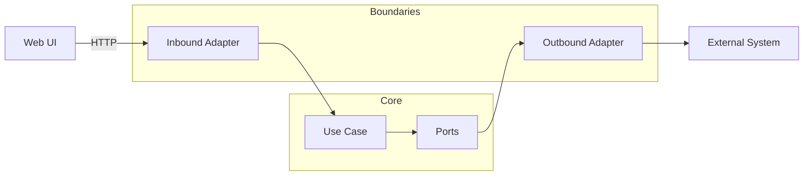

# Adapters


Adapters are the boundary modules that connect **core backend logic** (`src/domain`, `src/usecases`) to **external concerns** (datastores, web frameworks, queues, external APIs, auth providers, search engines, etc.) while keeping the core clean and testable.

> [!IMPORTANT]
> **Trust membrane invariant**
>
> All access to data or privileged functions must pass through governed interfaces at the boundary.
> No “side doors” from core logic into databases, file systems, or external networks.

---

## What belongs in `src/adapters`

Adapters **implement ports** (interfaces) defined by the core, and **translate** between:
- Core types: domain entities, value objects, use-case request/response DTOs
- External types: SQL rows, HTTP requests, JSON payloads, SDK objects, driver exceptions

### Common adapter categories

| Category | Typical responsibility | Examples |
|---|---|---|
| Inbound adapters | Convert a transport request into a use-case call | HTTP controllers, GraphQL resolvers, CLI commands, scheduled jobs |
| Outbound adapters | Implement ports used by use-cases to reach systems | PostGIS repositories, Neo4j/graph repositories, search index adapters, object storage adapters |
| Policy and governance adapters | Enforce policy checks and auditing at boundaries | OPA/PDP client wrapper, audit-log writer, provenance envelope injector |
| Anti-corruption adapters | Normalize messy external data into clean domain models | CSV/JSON import adapters, third-party API normalization |

> [!NOTE]
> **Adapters should not contain domain rules.**
> If you find yourself encoding “business meaning” here, move it into `src/usecases` or `src/domain`.
> Adapters should mainly do **translation, validation at the boundary, and I/O orchestration**.

---

## How adapters fit the architecture



### Dependency rules

- `src/domain` **depends on nothing** outside core
- `src/usecases` **depends on domain + ports only**
- `src/adapters` **depends on core ports** and may depend on **infrastructure clients**
- `src/infrastructure` owns environment specifics (drivers, clients, config wiring, DI container)

---

## Recommended folder conventions

This repo may choose a different layout, but these conventions keep adapters discoverable:

```text
src/adapters/
  inbound/
    http/
    graphql/
    cli/
  outbound/
    persistence/
      postgis/
      neo4j/
    search/
    object_store/
    external_apis/
  governance/
    policy/
    audit/
    provenance/
  shared/
    mapping/
    errors/
```

> [!TIP]
> Prefer **small adapters** over “mega-adapters”. Split by bounded context (story, layers, catalog, focus mode),
> then by technology.

---

## Adding a new adapter

### Step 1 — Define or reuse a port in core
- Put the interface in the core (commonly `src/usecases/ports/…`).
- Keep the port signature in **domain terms**, not database/HTTP terms.

### Step 2 — Implement the port in `src/adapters`
- Translate data in and out explicitly (mappers belong here or in `src/adapters/shared/mapping`).
- Convert driver exceptions into a small set of adapter-level errors.

### Step 3 — Wire it in the composition root
- Register the adapter implementation in your DI/container wiring (commonly in `src/infrastructure`).
- Ensure the core receives the adapter **only through the port type**.

### Step 4 — Add tests
- Unit test mappings and boundary validations
- Add an integration test if the adapter touches a real system

---

## Error handling contract

Adapters should translate “messy” external failures into stable categories the core can react to:

- `NotFound`
- `Conflict`
- `Unauthorized` / `Forbidden`
- `ValidationFailed`
- `RateLimited`
- `DependencyUnavailable`
- `DependencyTimeout`

> [!IMPORTANT]
> Do not leak raw driver errors to API responses.
> Map them to stable error types, then let inbound adapters present them (HTTP status, GraphQL error codes, etc.).

---

## Governance and sensitivity checklist

> [!CAUTION]
> KFM content can be sensitive, especially around precise locations and culturally restricted material.
> Adapters are a common place where accidental leakage happens.

- [ ] Enforce policy decisions at the boundary for protected endpoints and sensitive fields
- [ ] Ensure responses can carry provenance references when required
- [ ] Avoid logging secrets, access tokens, or raw payloads containing sensitive coordinates
- [ ] Default to **least-privilege** credentials for outbound systems
- [ ] Use parameterized queries and safe client libraries
- [ ] Fail closed when policy or audit subsystems are unavailable

---

## Definition of done for adapter PRs

- [ ] Port interface exists in core and is domain-shaped
- [ ] Adapter implementation is in `src/adapters` and contains no business rules
- [ ] Composition wiring updated in `src/infrastructure`
- [ ] Unit tests added for mapping and error translation
- [ ] Integration tests added when the adapter touches real dependencies
- [ ] Any new data exposure is aligned with governance and provenance expectations
- [ ] Docs updated if the adapter changes public behavior or contracts

---

## FAQ

### Why not call databases directly from use-cases
Because it couples the core to a specific datastore and bypasses the governed boundary. Adapters keep the core testable and enforceable.

### Where should mapping code live
Mapping between external representations and domain models typically lives in `src/adapters/shared/mapping` or within the adapter folder itself.

### Where does API request validation belong
Basic transport validation can happen in inbound adapters (required fields, parsing). Domain validation belongs in core.