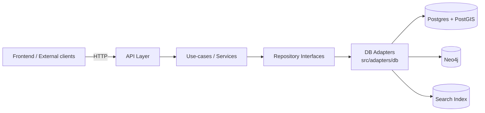
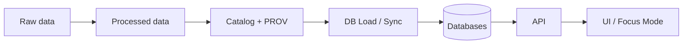

# 🗄️ DB Adapters (`src/adapters/db/`)


> **Purpose:** Outbound database adapters that implement KFM persistence interfaces (repositories).  
> **Non-goal:** Business logic, UI code, or direct DB access from clients.

---

## 📘 Overview

This directory contains **database adapter implementations** (a.k.a. “outbound adapters”) responsible for:

- Connecting to external stores (e.g., Postgres/PostGIS, Neo4j, search index) via **well-defined interfaces**
- Translating between **domain models** and **storage representations** (tables, documents, graph nodes/edges)
- Enforcing **consistent access patterns** (transactions, parameterization, paging, timeouts)
- Supporting KFM’s **governed access boundary** (“trust membrane”) by keeping DB access behind controlled interfaces

### ✅ Invariants (must always hold)

- **No UI / frontend code** in this directory.
- **No business rules** in this directory.
- **No direct DB access** from controllers/routes/use-cases outside repository interfaces.
- Any DB query executed here must be **parameterized** (never string-concatenate user input).
- Writes that materially change datasets should be **traceable** to a dataset/catalog/provenance reference (see below).

### 🚫 Common anti-patterns (avoid)

- “Quick” ad-hoc SQL inside a route handler
- Returning raw DB rows all the way to the API response (skip domain mapping)
- Writing “smart” adapters that embed business decisions (keep logic in use-cases)
- Storing secrets or credentials in code or committed config

---

## 🗂️ Directory Layout

> ⚠️ **Note:** Subfolders may vary by implementation. Keep the *conceptual* structure below even if names differ.

```text
src/
  adapters/
    db/
      README.md
      postgis/                 # Postgres/PostGIS adapters (expected)
      neo4j/                   # Neo4j adapters (expected)
      search/                  # Search index adapters (optional)
      migrations/              # DB migrations or DDL (optional)
      __tests__/               # Adapter-level tests (optional)
      fixtures/                # Test data & seed fixtures (optional)
```

### Naming conventions (recommended)

- `*Repository` for repository implementations (e.g., `ParcelRepositoryPostgis`)
- `*Mapper` for storage↔domain mapping helpers
- `*Client` for low-level connection/query wrappers (kept thin)

<details>
  <summary><strong>Why this structure?</strong></summary>

Keeping connection logic, mapping, and repositories separated makes it easier to:
- mock repositories in unit tests,
- swap storage implementations without rewriting use-cases,
- audit all DB access in one place (governance + security),
- apply consistent performance and safety practices (timeouts, paging, indexes).
</details>

---

## 🧭 Context

KFM is designed around a governed pipeline and a governed runtime:

- **Pipeline**: raw → processed → catalog/provenance → database → API → UI
- **Runtime**: clients interact through the API; the API calls use-cases; use-cases call repository interfaces; adapters implement those interfaces

This folder is the **DB-facing edge** of the backend runtime and should be treated as a governed surface.

---

## 🗺️ Diagrams

### Clean architecture placement (trust membrane)



### Data-to-runtime handoff



---

## 📦 Data & Metadata

### What adapters should accept/return

Adapters should **accept and return domain-level objects** (or DTOs defined by the use-case boundary), not raw rows.

A practical convention:

- **Read paths**: DB row → mapper → domain model → use-case output
- **Write paths**: use-case input → domain model → mapper → DB command

### Recommended minimal metadata fields (when persisting governed content)

| Field | Why it exists | Example |
|---|---|---|
| `dataset_id` | Connect stored rows to a cataloged dataset | `ks.railroads.network` |
| `dataset_version` | Reproducibility & rollback | `2026-02-12` or `v1.3.0` |
| `provenance_ref` | Traceability to PROV artifact | `prov:ks.railroads.network@v1.3.0` |
| `ingest_run_id` | Operational debugging / replays | `ingest_20260212_001` |
| `sensitivity_tag` | Support CARE / restricted handling | `public` / `restricted` |

> If your current schema doesn’t include these fields, treat this as a **migration target** rather than a hard requirement.

---

## 🌐 STAC, DCAT & PROV Alignment

Even though this is “just DB code,” adapters must support KFM’s provenance-first posture:

- **Adapters SHOULD NOT** mint new dataset identities.
- **Adapters SHOULD** require upstream callers (use-cases) to provide dataset identifiers/versioning context where relevant.
- **Adapters MAY** store provenance references alongside rows to keep runtime traceability intact.

---

## 🧱 Architecture

### Adapter responsibilities

| Concern | Adapter must do | Adapter must *not* do |
|---|---|---|
| Connection mgmt | pool / lifecycle / timeouts | create ad-hoc connections per call |
| Safety | parameterized queries, bounds, paging | interpolate user input into SQL/Cypher |
| Mapping | deterministic storage↔domain mapping | invent business meaning |
| Performance | use indexes, avoid N+1 queries | hide performance problems with caching-only |
| Errors | translate DB errors into typed failures | leak driver-specific errors across boundaries |

### Transactions

Prefer a single transaction per use-case “unit of work”:

- Read-only queries can use read-only sessions/transactions when supported.
- Writes should be atomic and idempotent where practical.

### Spatial specifics (PostGIS)

Common expectations for spatial workloads:

- Use the correct SRID consistently (store SRID explicitly; transform at boundaries when needed).
- Prefer bounding-box prefiltering + exact checks (index-friendly patterns).
- Add and maintain spatial indexes for geometry columns that are queried frequently.

---

## 🧠 Story Node & Focus Mode Integration

DB adapters may back features like:

- Story Node rendering (fetch referenced features/events/tiles)
- Focus Mode retrieval (search, entity expansion, timeline queries)
- Governance checks (supporting query constraints such as limiting geometry precision)

> The adapter layer should expose *capabilities* (query primitives), not “story logic.”

---

## 🧪 Validation & CI/CD

### Definition of Done (adapter changes)

- [ ] Repository interface contract unchanged or versioned with migrations
- [ ] New/changed queries are parameterized
- [ ] Integration tests cover the new behavior (prefer containerized DBs)
- [ ] Migrations are included (if schema changed) and are reversible when possible
- [ ] Query plans reviewed for obvious regressions (indexes, paging, selectivity)
- [ ] Any governed writes include dataset/provenance context (where applicable)

### Suggested test types

- **Unit tests:** mapping functions, query builders (no DB)
- **Integration tests:** run against ephemeral Postgres/PostGIS + Neo4j containers
- **Contract tests:** ensure adapter satisfies repository interface semantics

---

## ⚖️ FAIR+CARE & Governance

Adapters are a high-risk boundary for governance drift. Treat them accordingly:

- Avoid persisting or returning sensitive locations/attributes unless the upstream policy authorizes it.
- Prefer storing **generalized** geometry for public endpoints when needed (precision reduction belongs in use-cases/policy, but adapters must support it).
- Keep an audit-friendly trail: dataset IDs, versions, provenance references, and ingest run IDs.

> If you suspect data is culturally sensitive, restricted, or sovereignty-scoped, escalate to governance review rather than encoding “exceptions” in DB code.

---

## 🕰️ Version History

| Version | Date | Change | Author |
|---|---:|---|---|
| 0.1.0 | 2026-02-12 | Initial README scaffold for governed DB adapters | KFM AI assistant |
