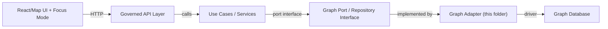
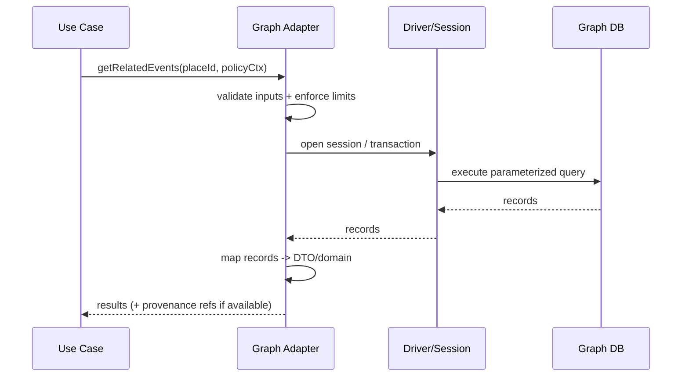

# 🕸️ Graph Adapter (src/adapters/graph)

🏷 **Layer:** Integration/Adapters · 🏷 **Boundary:** Use Cases ↔ Graph Store · 🏷 **Mode:** Policy-mediated access only

> [!IMPORTANT]
> The **graph database must never be accessed directly by UI/clients**. All reads/writes are mediated by the backend API + use-case layer to preserve governance and provenance integrity.  
> (This README documents the *adapter boundary*, not the graph schema of record.)

---

## 📘 Overview

### Purpose
This directory contains the **Graph Adapter**: code that implements **graph-facing repository/port interfaces** for KFM use cases, translating use-case calls into graph queries (e.g., Cypher) and mapping results back into domain models.

KFM’s architecture explicitly includes a graph adapter (e.g., “Neo4jAdapter”) in the adapter layer to support relationship queries such as *related events for a place*. This README makes those boundaries explicit and provides implementation + governance guidance.

### Scope
In scope:
- Graph query execution (driver/session management, retries/timeouts)
- Query construction + parameterization
- Mapping: graph records → domain model objects / DTOs (no UI models)
- Defensive constraints (query allowlists, limits, “safe by default” defaults)

Out of scope:
- UI rendering logic (MapLibre/Focus Mode UI)
- Domain model definitions (live in `src/domain/*` (not confirmed in repo))
- Business workflows (live in `src/usecases/*` (not confirmed in repo))
- Graph schema governance & ontology authoring (tracked elsewhere)

### Audience
- Backend engineers implementing graph reads/writes
- Governance/security reviewers auditing query patterns
- CI maintainers enforcing “no bypass” + policy gates

### Definitions
| Term | Meaning |
|---|---|
| **Adapter** | Implementation that bridges a port/interface to a concrete technology (graph database). |
| **Port** | Stable interface defined by the use-case layer (repository contract). |
| **Trust membrane** | Non-negotiable boundary: UI/clients never talk to databases directly; API mediates validation and policy. |
| **Provenance-first** | Returned data should remain traceable to sources / evidence bundles where applicable. |

---

## 🗂️ Directory Layout

### Location (this doc)
- `src/adapters/graph/README.md` (this file)

### Suggested module layout (align with actual repo structure)
> [!NOTE]
> The exact filenames may differ; keep the *conceptual separation* even if your file names change.

| Path | What goes here | Notes |
|---|---|---|
| `src/adapters/graph/` | Graph adapter package root | This directory |
| `src/adapters/graph/queries/` | Stored graph queries (e.g., Cypher) | Prefer reviewed/allowlisted query files |
| `src/adapters/graph/mappers/` | Record→domain mapping utilities | Keep mapping deterministic + tested |
| `src/adapters/graph/config.*` | Connection/config parsing | Use env + config providers |
| `src/adapters/graph/index.*` | Adapter exports | Keep public surface small |
| `src/adapters/graph/__tests__/` | Adapter-focused unit/contract tests | Integration tests may live elsewhere |

---

## 🧭 Context

### Why a graph adapter exists
KFM contains *relational/spatial* storage and *graph* storage. The graph store enables relationship traversal (events ↔ places ↔ people ↔ sources) that would be awkward or expensive in purely relational queries.

### Constraints & invariants
- **API boundary respected:** UI/Focus Mode uses **API only**, never direct database calls.
- **Pipeline ordering respected:** graph usage happens downstream of ingestion/catalog/provenance (graph is not a shortcut around provenance).
- **Evidence-first:** adapter behavior must support provenance traceability where required.

### Assumptions
- Graph database technology is expected to be **Neo4j + Cypher** *(not confirmed in repo)*.
- A use-case port/interface exists for graph operations *(not confirmed in repo)*.

<strong>Open questions (track in issues)</strong>

- What is the canonical “graph ID” format used across APIs/story nodes? *(not confirmed in repo)*
- Where is the authoritative ontology/schema documented? *(not confirmed in repo)*
- Which queries are allowed in “public” contexts vs “restricted” contexts? *(not confirmed in repo)*

---

## 🗺️ Diagrams

### Boundary + data flow (trust membrane + clean architecture)

### Query execution path (adapter internals)

---

## 📦 Data & Metadata

### Port surface (example — align with actual interfaces)
> [!IMPORTANT]
> **Do not** expose the graph driver/session outside the adapter. Use cases must depend only on ports.

| Method (example) | Inputs | Outputs | Notes |
|---|---|---|---|
| `getRelatedEvents(placeId)` | `placeId: string` | `EventRef[]` | Example referenced in KFM docs (place → related events) |
| `getNeighbors(nodeId, depth)` | `nodeId`, `depth` | `NodeRef[]` | Enforce depth limits |
| `upsertNode(node)` | node DTO | success/ID | Writes must be policy-gated upstream |
| `upsertEdge(edge)` | edge DTO | success/ID | Ensure deterministic relationship typing |

### Data handling rules
- **Parameterize queries** (no string concatenation).
- **Enforce limits** (max depth, max results, max execution time).
- **Map to stable DTOs/domain types** (no leaking driver record types).
- **Attach provenance pointers where required** *(exact mechanism not confirmed in repo)*.

---

## 🌐 STAC, DCAT & PROV Alignment

> [!NOTE]
> The graph adapter is *not* the pipeline ingestion layer. It should assume that nodes/edges referencing datasets or narratives point back to catalog/provenance artifacts (STAC/DCAT/PROV) produced upstream.

Recommended practice *(not confirmed in repo)*:
- Nodes representing datasets/narratives store **stable IDs** that can be resolved via the catalog/provenance services.
- Adapter returns those IDs without “inventing” provenance.

---

## 🧱 Architecture

### Responsibilities
✅ The Graph Adapter **should**:
- Implement use-case ports (repository interfaces)
- Manage connection lifecycle (driver/session/tx)
- Centralize query execution patterns (timeouts, retries, metrics)
- Provide mapping utilities with tests
- Keep queries reviewable (ideally file-based + allowlisted)
- Fail “safe by default” (bounded results, bounded traversal)

❌ The Graph Adapter **must not**:
- Contain business workflows (“what to do”) — belongs in use cases
- Bypass policy decisions — access control belongs in API/policy layer
- Call UI code or depend on frontend packages
- Leak secrets in logs or docs

### Configuration (examples — align with repo)
> [!WARNING]
> Do **not** commit credentials. Use placeholders and environment-based config.

| Setting | Example | Notes |
|---|---|---|
| Graph URI | `<GRAPH_URI>` | e.g., `bolt://localhost:7687` *(not confirmed in repo)* |
| Username | `<GRAPH_USER>` | |
| Password | `<GRAPH_PASSWORD>` | secret |
| DB name | `<GRAPH_DB>` | optional |

### Query governance patterns
Recommended *(not confirmed in repo)*:
- Maintain an **allowlist registry** of query IDs → query text
- Log query ID + parameters shape (not raw sensitive values) for auditability
- Prohibit “ad hoc query execution” in production paths

### Error handling & resilience
- Normalize driver errors into domain-relevant error types
- Apply timeouts + cancellation
- Retry only idempotent operations (reads), and only with safe backoff
- Return partials only if explicitly allowed by use case

---

## 🧠 Story Node & Focus Mode Integration

The graph adapter typically supports:
- “Context expansion” for narratives (related entities for a place/person/event)
- Relationship-based browsing for Focus Mode
- Cross-linking story nodes to datasets and sources

> [!IMPORTANT]
> When the graph is used to power narrative context, **sensitivity controls apply**: do not surface restricted relationships/locations unless policy explicitly allows it.

---

## 🧪 Validation & CI/CD

### Recommended tests
- **Unit tests**: mapping functions, query builders, limit enforcement
- **Contract tests**: port interface expectations (inputs/outputs)
- **Integration tests** *(if graph DB available in CI)*: run against ephemeral graph instance (e.g., Docker Compose) *(not confirmed in repo)*

### CI checks for this README
- Markdown lint passes
- Links resolve (no broken internal refs)
- No secrets in the file
- Version History updated for non-trivial changes

### Definition of Done
- [ ] Port interfaces referenced here match actual code (rename/update as needed)
- [ ] Query execution is parameterized and bounded (depth/results/time)
- [ ] Mapping is deterministic and covered by tests
- [ ] Governance notes reviewed (sensitivity, policy boundary)
- [ ] README passes markdown lint + link-check

---

## ⚖️ FAIR+CARE & Governance

> [!WARNING]
> KFM content can include sensitive historical/cultural information. Handle with CARE:
> - Redact/generalize precise locations of sacred/vulnerable sites
> - Avoid exposing personally identifying information unless explicitly cleared
> - If uncertain, omit details and flag for governance review

Governance reminders:
- **Evidence-first:** do not claim facts not supported by datasets/provenance.
- **“(not confirmed in repo)” marker:** use it when this README mentions a detail that must be verified in code/config.
- **Trust membrane:** UI never touches databases directly; API mediates access.

---

## 🕰️ Version History

| Version | Date | Summary of Changes | Author |
|---|---:|---|---|
| v0.1.0 | 2026-02-12 | Initial README for graph adapter boundary, governance, and test expectations. | ChatGPT (AI draft) |
