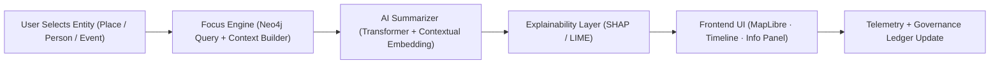

<div align="center">

# 🧠 Kansas Frontier Matrix — **AI & Focus Mode Architecture**
`src/ai/README.md`

**Purpose:** Defines the architecture, pipelines, and governance integration of the AI subsystems powering the Kansas Frontier Matrix — including Focus Mode reasoning, explainability, and ethical validation.  
Implements FAIR+CARE-aligned design to guarantee model transparency, provenance tracking, and governance compliance.

[](../../../.github/workflows/ai-validate.yml)  
[](../../../docs/standards/faircare-validation.md)  
[](../../../docs/ai/explainability.md)  
[](../../../docs/architecture/repo-focus.md)

</div>

---

## 📚 Overview

The **AI Module** implements Focus Mode — an AI-driven contextual exploration layer that connects historical, geospatial, and environmental data through interpretable machine learning models.  
It emphasizes transparency, bias auditing, and governance traceability using FAIR+CARE and MCP-DL methodologies.

**Core Objectives:**
- 🧠 Provide explainable AI reasoning for Focus Mode entities  
- 🧩 Integrate model outputs with Neo4j Knowledge Graph  
- ⚖️ Ensure ethical governance, FAIR+CARE validation, and provenance  
- 🔍 Offer transparent model metrics, versioning, and drift detection  
- 🧾 Maintain governance logs for AI lineage and decision accountability  

---

## 🗂️ Directory Layout

```plaintext
src/ai/
├── README.md                      # This file — documentation and architecture overview
│
├── models/                        # Model definitions and weight management
│   ├── focus_transformer_v1/      # Transformer-based summarization model for Focus Mode
│   ├── embeddings/                # Vector representations for places, events, and documents
│   └── registry.json              # Metadata registry of all AI models (versioned)
│
├── explainability/                # SHAP/LIME explainability and interpretability reports
│   ├── shap_analysis.py           # Generates SHAP feature importance visualizations
│   ├── lime_analysis.py           # Creates local interpretable model explanations
│   └── report_generator.py        # Compiles model explainability reports for governance
│
├── training/                      # Model training and evaluation pipelines
│   ├── train_model.py             # Fine-tunes models with KFM datasets
│   ├── evaluate_model.py          # Evaluates accuracy, bias, and confidence metrics
│   └── drift_detection.py         # Monitors model drift and ethical degradation
│
└── focus/                         # Focus Mode AI integration
    ├── focus_engine.py            # Core contextual reasoning engine
    ├── entity_linker.py           # Links entities (people, places, events) to graph nodes
    ├── ai_summarizer.py           # Generates contextual AI summaries for Focus Mode
    └── telemetry_logger.py        # Logs AI events, confidence scores, and governance metrics
```

---

## ⚙️ Example Workflows

### 🧠 Train or Fine-Tune Focus Transformer
```bash
python src/ai/training/train_model.py --model focus_transformer_v1 --dataset data/processed/focus_corpus.json
```

### 📊 Evaluate AI Model
```bash
python src/ai/training/evaluate_model.py --model focus_transformer_v1 --metrics reports/ai/metrics/focus_v1_eval.json
```

### 🔍 Generate Explainability Report
```bash
python src/ai/explainability/report_generator.py --model focus_transformer_v1 --output reports/ai/explainability/focus_v1.json
```

### ⚠️ Run Model Drift Detection
```bash
python src/ai/training/drift_detection.py --baseline releases/v9.3.3/models.json --current releases/v9.4.0/models.json
```

### 📡 Log Telemetry Event
```bash
python src/ai/focus/telemetry_logger.py --event focus_summary --entity_id treaty_1854 --confidence 0.92
```

---

## 🧩 FAIR+CARE & Governance Integration

| Workflow | Module | Output |
|-----------|---------|---------|
| **Model Training** | `training/train_model.py` | `reports/ai/metrics/model-training.json` |
| **Evaluation & Bias Detection** | `training/evaluate_model.py` | `reports/fair/ai-bias-validation.json` |
| **Explainability Report** | `explainability/report_generator.py` | `reports/ai/explainability/focus-mode.json` |
| **Drift Monitoring** | `training/drift_detection.py` | `reports/ai/ai-drift-detection.json` |
| **Telemetry Logging** | `focus/telemetry_logger.py` | `releases/v9.4.0/focus-telemetry.json` |

Governance integration ensures:
- **Ethical traceability:** All AI outputs reference data sources and model versions.  
- **Ledger updates:** Telemetry events appended to `governance-ledger.json`.  
- **Explainability compliance:** Each AI decision documented in FAIR+CARE logs.  

---

## 🧠 Focus Mode Architecture Diagram



**Flow Summary:**
1. Focus Mode queries the Neo4j Knowledge Graph to retrieve entity data.  
2. The AI model generates contextual summaries using transformers and embeddings.  
3. Explainability modules create SHAP/LIME visualizations.  
4. Outputs (summaries, confidence scores, ethical tags) logged to telemetry and governance ledgers.  

---

## 🧩 Standards & Compliance

| Standard | Purpose | Implementation |
|-----------|----------|----------------|
| **MCP-DL v6.4.3** | Documentation-driven AI design | All submodules |
| **FAIR+CARE** | Ethical transparency and governance | AI ethics reports and telemetry logs |
| **ISO 23894** | AI risk management | Drift detection and bias audit modules |
| **IEEE 7007** | Explainability and ontological transparency | SHAP/LIME explainability reports |
| **DCAT / JSON-LD / CIDOC CRM** | Semantic metadata linkage for provenance | Provenance integration in AI summaries |

---

## 🛡️ Security & Ethics

- **Integrity:** Model weights and telemetry logs cryptographically signed.  
- **Ethics:** All models undergo FAIR+CARE evaluation for bias, accountability, and transparency.  
- **Explainability:** Each prediction includes model confidence and top feature attributions.  
- **Governance:** All outputs automatically registered in `reports/audit/governance-ledger.json`.  

Reports archived in:
```
reports/ai/
reports/fair/
releases/v9.4.0/
```

---

## 🔍 Telemetry & Observability

Telemetry schema:  
`schemas/telemetry/ai-pipelines-v1.json`

**Telemetry Fields:**
- `model_id` — AI model name and version  
- `entity_id` — Focused entity identifier  
- `confidence` — AI confidence score  
- `explainability_ref` — Path to SHAP/LIME output  
- `timestamp` — UTC event timestamp  
- `checksum` — SHA-256 signature  

Telemetry reports stored in:
```
reports/ai/ai-events.json
releases/v9.4.0/focus-telemetry.json
```

---

## 🧾 Version History

| Version | Date | Author | Summary |
|----------|------|---------|----------|
| v9.4.0 | 2025-11-02 | @kfm-ai | Upgraded explainability, telemetry schema, and governance ledger integration. |
| v9.3.3 | 2025-11-01 | @kfm-focus | Added bias auditing and SHAP/LIME explainability visualizations. |
| v9.3.2 | 2025-10-29 | @bartytime4life | Implemented transformer model integration with Neo4j and FAIR+CARE validation. |
| v9.3.1 | 2025-10-27 | @kfm-ethics | Added AI ethics compliance and risk audit pipelines. |
| v9.3.0 | 2025-10-25 | @kfm-architecture | Established baseline Focus Mode AI architecture under MCP-DL v6.4.3. |

---

<div align="center">

**Kansas Frontier Matrix — Ethical AI Framework for Historical Insight**  
*“Every model explainable. Every inference accountable. Every action governed.”* 🔗  
📍 `src/ai/README.md` — FAIR+CARE-aligned documentation for the Kansas Frontier Matrix AI and Focus Mode architecture.

</div>
