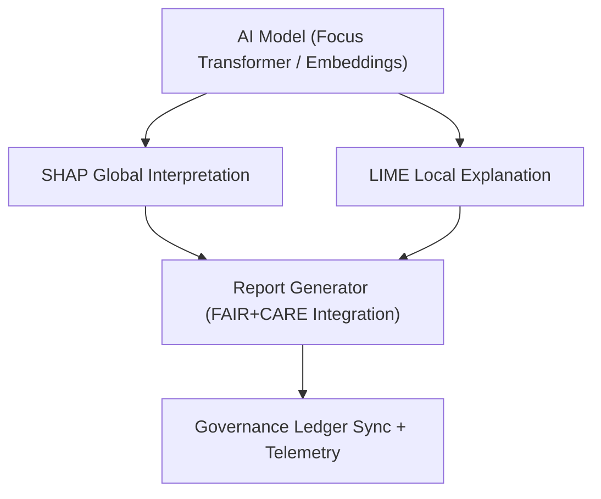

<div align="center">

# 🔍 Kansas Frontier Matrix — **AI Explainability & Interpretability Framework**
`src/ai/explainability/README.md`

**Purpose:** Provides the interpretability infrastructure for all AI models within the Kansas Frontier Matrix.  
Implements explainability workflows using **SHAP** and **LIME** to ensure transparency, accountability, and ethical compliance under FAIR+CARE and governance standards.

[](../../../.github/workflows/ai-validate.yml)  
[](../../../docs/standards/faircare-validation.md)  
[](../../../docs/architecture/repo-focus.md)

</div>

---

## 📚 Overview

The **Explainability Framework** enables interpretable AI decision-making across all KFM models, especially Focus Mode.  
It produces quantitative and visual interpretability outputs, linking each explanation to model provenance, telemetry, and governance ledgers.  
Every explainability artifact is FAIR+CARE-certified and aligned with international AI ethics standards.

**Core Objectives:**
- 🧠 Generate **transparent and interpretable model explanations** (SHAP + LIME)  
- ⚖️ Embed **ethical governance metadata** in every explainability artifact  
- 🧩 Provide **provenance integration** for each model inference  
- 🔍 Synchronize all reports with the Immutable Governance Ledger  
- 🧾 Ensure explainability assets meet **ISO 23894** and **IEEE 7007** guidelines  

---

## 🗂️ Directory Layout

```plaintext
src/ai/explainability/
├── README.md                     # This file — explainability framework documentation
│
├── shap_analysis.py              # Generates SHAP-based global interpretability metrics and plots
├── lime_analysis.py              # Computes LIME local interpretability for single predictions
├── report_generator.py           # Aggregates SHAP/LIME data into governance-aligned reports
├── visualize_shap.py             # Exports SHAP plots (summary, dependence, attention maps)
└── visualize_lime.py             # Produces bar and heatmap visualizations for local LIME results
```

**File Descriptions:**

- **`shap_analysis.py`** — Computes feature attribution using SHAP (global explainability).  
- **`lime_analysis.py`** — Provides local interpretability through LIME explanations for individual examples.  
- **`report_generator.py`** — Merges SHAP and LIME outputs into unified FAIR+CARE-compliant explainability reports.  
- **`visualize_shap.py` / `visualize_lime.py`** — Generate visual explainability assets for inclusion in public dashboards and governance reviews.

---

## ⚙️ Example Workflows

### 🧮 Run SHAP Analysis
```bash
python src/ai/explainability/shap_analysis.py \
  --model src/ai/models/focus_transformer_v1 \
  --dataset data/processed/focus_corpus.json \
  --output reports/ai/explainability/shap_values.json
```

### 💡 Generate LIME Explanations
```bash
python src/ai/explainability/lime_analysis.py \
  --model src/ai/models/focus_transformer_v1 \
  --text "Kansas River flooding event, 1903" \
  --output reports/ai/explainability/lime_explanation_003.json
```

### 📊 Compile Unified Explainability Report
```bash
python src/ai/explainability/report_generator.py \
  --model focus_transformer_v1 \
  --output reports/ai/explainability/focus_v1_report.json
```

### 🖼️ Create Visual Plots
```bash
python src/ai/explainability/visualize_shap.py \
  --input reports/ai/explainability/shap_values.json \
  --output reports/ai/explainability/plots/
```

---

## 🧩 FAIR+CARE Explainability Integration

| Component | Description | FAIR+CARE Dimension | Output |
|------------|--------------|----------------------|---------|
| **SHAP Analysis** | Global model interpretability | Transparency, Responsibility | `reports/ai/explainability/shap_values.json` |
| **LIME Analysis** | Instance-level interpretability | Accessibility, Ethics | `reports/ai/explainability/lime_explanation_*.json` |
| **Explainability Report** | Combined interpretability summary | Collective Benefit | `reports/ai/explainability/focus_v1_report.json` |
| **Visualization Outputs** | Human-readable explanation graphics | Stewardship, Transparency | `reports/ai/explainability/plots/*.png` |

Governance integration ensures:
```
reports/audit/governance-ledger.json
releases/v9.4.0/focus-telemetry.json
```

---

## 🧠 Explainability Workflow



**Workflow Summary:**
1. SHAP calculates global feature importance and attention attribution.  
2. LIME analyzes individual predictions for interpretability.  
3. Both outputs merged into unified explainability reports.  
4. Telemetry logs and provenance records updated for governance transparency.  

---

## 🧩 Standards & Compliance Mapping

| Standard | Purpose | Implementation |
|-----------|----------|----------------|
| **MCP-DL v6.4.3** | Documentation-driven interpretability governance | This README + explainability scripts |
| **FAIR+CARE** | Ethical and transparent AI auditing | Metadata embedded in explainability reports |
| **ISO 23894** | AI explainability and lifecycle transparency | Drift and ethics-aware explanations |
| **IEEE 7007** | Ontological transparency | SHAP/LIME interpretability methodology |
| **DCAT / JSON-LD** | Metadata interoperability for audit exchange | Explainability reports exportable as DCAT JSON-LD |

---

## 🛡️ Provenance, Security & Observability

- **Integrity:** Each explainability report SHA-256 verified and recorded in governance logs.  
- **Reproducibility:** SHAP/LIME computations consistent across hardware environments.  
- **Provenance:** All outputs contain dataset lineage and model version metadata.  
- **Telemetry:** Explainability events appended to Immutable Governance Ledger.  

Telemetry Schema:  
`schemas/telemetry/ai-pipelines-v1.json`

Telemetry Outputs:
```
reports/ai/explainability-events.json
releases/v9.4.0/focus-telemetry.json
```

---

## 🧾 Version History

| Version | Date | Author | Summary |
|----------|------|---------|----------|
| v9.4.0 | 2025-11-02 | @kfm-explainability | Expanded FAIR+CARE explainability schema and governance linkage. |
| v9.3.3 | 2025-11-01 | @kfm-ai | Enhanced LIME interpretability features and SHAP visualization exports. |
| v9.3.2 | 2025-10-29 | @bartytime4life | Integrated JSON-LD provenance and FAIR+CARE validation checks. |
| v9.3.1 | 2025-10-27 | @kfm-ethics | Added ethical metadata and explainability performance scoring. |
| v9.3.0 | 2025-10-25 | @kfm-architecture | Established explainability pipeline under MCP-DL v6.4.3. |

---

<div align="center">

**Kansas Frontier Matrix — Explainable & Ethical AI for Transparent Understanding**  
*“Every factor interpretable. Every insight transparent. Every action governed.”* 🔗  
📍 `src/ai/explainability/README.md` — FAIR+CARE-aligned documentation for AI explainability and interpretability frameworks within the Kansas Frontier Matrix.

</div>
