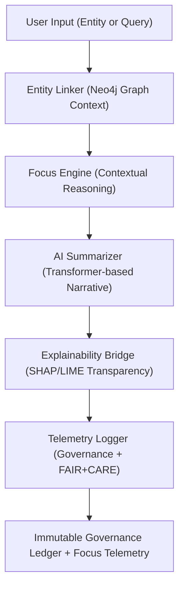

<div align="center">

# 🧭 Kansas Frontier Matrix — **Focus Mode AI Engine**
`src/ai/focus/README.md`

**Purpose:** Defines the architecture, components, and governance integration for the **Focus Mode AI Engine**, the interactive reasoning system that enables contextual exploration and semantic storytelling within the Kansas Frontier Matrix.  
Implements FAIR+CARE-aligned AI governance, explainability, and provenance tracking to ensure interpretability, transparency, and accountability in every AI interaction.

[](../../../.github/workflows/ai-focus.yml)  
[](../../../docs/standards/faircare-validation.md)  
[](../../../docs/architecture/repo-focus.md)

</div>

---

## 📚 Overview

The **Focus Mode Engine** is the contextual reasoning layer of the Kansas Frontier Matrix.  
It connects geospatial, historical, and environmental data with explainable AI insights, providing an interactive interface that allows users to “focus” on entities (places, people, events) and explore connections over time.

**Core Objectives:**
- 🧠 Enable contextual reasoning and AI-driven narrative generation  
- 🌍 Integrate with Neo4j Knowledge Graph for relational context  
- ⚖️ Maintain ethical, explainable, and FAIR+CARE-aligned reasoning  
- 🔍 Log provenance and telemetry for every inference and output  
- 🧩 Provide transparent, reproducible AI insight pipelines for Focus Mode users  

---

## 🗂️ Directory Layout

```plaintext
src/ai/focus/
├── README.md                     # This file — Focus Mode documentation and governance card
│
├── focus_engine.py               # Core AI reasoning engine orchestrating contextual exploration
├── entity_linker.py              # Connects entities (places, people, treaties) via Neo4j queries
├── ai_summarizer.py              # Generates contextual summaries using Focus Transformer models
├── telemetry_logger.py           # Captures inference metadata and emits governance telemetry
└── explainability_bridge.py      # Integrates SHAP/LIME explainability into Focus Mode outputs
```

**File Descriptions:**

- **`focus_engine.py`** — Handles query processing, context assembly, and reasoning orchestration across AI and graph layers.  
- **`entity_linker.py`** — Maps input queries to related entities within the Neo4j Knowledge Graph.  
- **`ai_summarizer.py`** — Generates dynamic, explainable summaries using transformer models.  
- **`telemetry_logger.py`** — Records all inference events, confidence scores, and governance lineage.  
- **`explainability_bridge.py`** — Injects explainability data (SHAP/LIME) into real-time Focus Mode responses.  

---

## ⚙️ Example Workflows

### 🧠 Run a Focus Mode Session
```bash
python src/ai/focus/focus_engine.py \
  --entity "Treaty of Fort Laramie" \
  --context "1851 Great Plains diplomacy" \
  --output reports/focusmode/session_treaty_1851.json
```

### 🔗 Link Entities
```bash
python src/ai/focus/entity_linker.py \
  --input "Kansas River" \
  --graph neo4j://localhost:7687 \
  --output reports/focusmode/entity_links_kansas_river.json
```

### 📜 Generate Contextual Summary
```bash
python src/ai/focus/ai_summarizer.py \
  --entity "Fort Larned" \
  --dataset data/processed/focus_corpus.json \
  --output reports/focusmode/summary_fort_larned.json
```

### 📡 Log Telemetry
```bash
python src/ai/focus/telemetry_logger.py \
  --entity "Fort Larned" \
  --confidence 0.94 \
  --summary "Fort Larned served as a vital supply post during the expansion era."
```

---

## 🧩 FAIR+CARE Governance Integration

| Process | Purpose | Output |
|----------|----------|---------|
| **Entity Linking** | Establish relational context between data and graph entities | `reports/focusmode/entity_links_*.json` |
| **AI Summarization** | Generate contextual and explainable historical summaries | `reports/focusmode/summary_*.json` |
| **Explainability Injection** | Add transparency via SHAP/LIME analysis | `reports/focusmode/explainability_*.json` |
| **Telemetry Logging** | Append governance lineage and model confidence to ledger | `releases/v9.4.0/focus-telemetry.json` |

Governance references:
```
reports/audit/governance-ledger.json
releases/v9.4.0/manifest.zip
```

---

## 🧭 Focus Mode Reasoning Workflow



**Workflow Summary:**
1. The user selects an entity or concept in Focus Mode.  
2. The system links entities via Neo4j to gather relational context.  
3. The Focus Engine generates AI-driven insights using contextual transformers.  
4. SHAP/LIME explainability embedded into the output for interpretability.  
5. All reasoning and metrics logged to governance and telemetry systems.  

---

## 🧠 Example Focus Mode Output

```json
{
  "entity": "Treaty of Fort Laramie (1851)",
  "summary": "The Treaty of Fort Laramie established peace among Plains tribes and formalized U.S. territorial boundaries, influencing westward expansion.",
  "related_entities": ["Sioux Nation", "Cheyenne", "U.S. Government"],
  "confidence": 0.93,
  "explainability_ref": "reports/focusmode/explainability_treaty_1851.json",
  "governance_hash": "b21a3d7e1bfb9e573bb52a7d4ceaf5c923a19c8deedaa93ad92a3f91d03fa220",
  "timestamp": "2025-11-02T00:00:00Z"
}
```

---

## 🧩 Standards & Compliance

| Standard | Purpose | Implementation |
|-----------|----------|----------------|
| **MCP-DL v6.4.3** | Documentation-first AI contextual reasoning | This README + Focus Engine scripts |
| **FAIR+CARE** | Ethical transparency and accountability | Focus Mode governance and telemetry |
| **ISO 23894** | AI lifecycle and interpretability risk management | Drift detection and bias scoring |
| **IEEE 7007** | Ontological transparency | SHAP/LIME explainability integration |
| **JSON-LD / DCAT** | Provenance and metadata interoperability | Explainability and lineage JSON exports |

---

## 🛡️ Security, Provenance & Observability

- **Integrity:** Every Focus Mode session is SHA-256 hashed and ledger-registered.  
- **Transparency:** Explainability metadata appended to all AI outputs.  
- **Reproducibility:** Focus reasoning pipelines are version-controlled and deterministic.  
- **Telemetry:** Each user interaction logged in Immutable Governance Ledger.  

Telemetry Schema:  
`schemas/telemetry/ai-pipelines-v1.json`

Telemetry Outputs:
```
reports/focusmode/session-events.json
releases/v9.4.0/focus-telemetry.json
```

---

## 🧾 Version History

| Version | Date | Author | Summary |
|----------|------|---------|----------|
| v9.4.0 | 2025-11-02 | @kfm-focus | Added governance-integrated reasoning engine and explainability bridge. |
| v9.3.3 | 2025-11-01 | @kfm-ai | Enhanced entity linking and Neo4j integration. |
| v9.3.2 | 2025-10-29 | @bartytime4life | Improved telemetry and explainability logging. |
| v9.3.1 | 2025-10-27 | @kfm-ethics | Embedded FAIR+CARE ethical validation for contextual summaries. |
| v9.3.0 | 2025-10-25 | @kfm-architecture | Established Focus Mode reasoning engine under MCP-DL v6.4.3. |

---

<div align="center">

**Kansas Frontier Matrix — Contextual AI for Ethical Understanding**  
*“Every insight explainable. Every connection traceable. Every story accountable.”* 🔗  
📍 `src/ai/focus/README.md` — FAIR+CARE-certified documentation for the Focus Mode AI Engine powering contextual reasoning in the Kansas Frontier Matrix.

</div>
