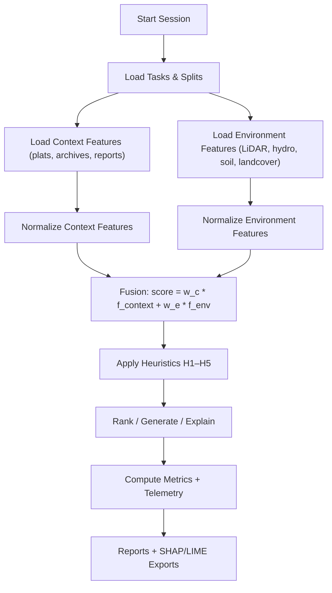

<div align="center">

# 🎯 **Focus Mode AI — Context vs. Environment Heuristic Evaluation**
`src/ai/focus/evaluation/context-vs-environment/README.md`

**Purpose:**  
Define a **repeatable evaluation session** to measure how **Focus Mode AI** balances **historical context weighting** vs. **environmental variables** (weather, hydrology, landcover, ownership, fauna, etc.). Tune heuristics so outputs are **faithful, useful, and auditable** under **FAIR+CARE**.

[](../../../../docs/README.md)
[](../../../../LICENSE)
[](../../../../docs/standards/README.md)
[](#)

</div>

---

## 📘 Overview

**Historical context weighting** = priority given to **time-aware, provenance-linked** facts (e.g., 1870s plats, 1930s drought reports, 1950s aerials).  
**Environmental variables** = contemporaneous or reconstructed signals (LiDAR hillshade, flood recurrence, soils, microclimate, species presence, ownership parcels).

We first **isolate** signals, then **blend** them to learn an **optimal weighting schedule** by task type (discovery, explanation, ranking, mapping).

---

## 🗂️ Directory Layout

```plaintext
src/ai/focus/evaluation/context-vs-environment/
├── configs/                               # Experiment configs (YAML/JSON)
│   ├── context_only.yaml                  # Context=1.0, Environment=0.0
│   ├── env_only.yaml                      # Context=0.0, Environment=1.0
│   ├── blended_grid.yaml                  # Grid-search over weights
│   └── ablation.yaml                      # Feature drop/disable tests
├── datasets/                              # Curated eval sets (links or small refs)
│   ├── tasks/                             # Task definitions & gold labels
│   └── splits/                            # train/val/test manifests
├── metrics/                               # Metric calculators & schemas
│   ├── explainability/                    # SHAP/LIME export adapters
│   └── provenance/                        # Lineage completeness checks
├── runs/                                  # Generated artifacts (gitignored)
│   ├── logs/                              # Structured logs/telemetry
│   ├── reports/                           # HTML/MD summaries
│   └── shards/                            # Intermediate caches
├── scripts/                               # CLI entrypoints
│   ├── run_grid_search.py                 # Weight grid search
│   ├── run_ablation.py                    # Feature ablations
│   ├── summarize_reports.py               # Compile eval dashboards
│   └── export_explanations.py             # SHAP/LIME packs
└── README.md
```

---

## 🧩 Evaluation Design

### 🧪 Tasks (representative KFM use-cases)

| Task ID | Description | Primary Signal | Gold/Label Source |
|---|---|---|---|
| T1 | Rank candidate “lost homestead” sites | Historical context | Cross-checked plats + registry |
| T2 | Explain why a site likely had human activity in year-range | Context → Env | Curated expert rationales |
| T3 | Prioritize survey tiles for field validation | Environmental | Hydrology + access + risk |
| T4 | Suggest interpretive panel copy (public history) | Context (time-aware) | Editor-reviewed text set |

### ⚖️ Weighting Schedule

Let **w_c** (context) and **w_e** (environment) such that **w_c + w_e = 1.0**.  
Fusion computes:

- **score = w_c · f_context + w_e · f_environment**

Sweep **w_c ∈ {1.0, 0.8, 0.6, 0.4, 0.2, 0.0}** (complement for **w_e**).

---

## 🧾 Metrics

| Category | Metric | Why it matters | Notes |
|---|---|---|---|
| Discovery | nDCG@k, MAP | Ranking quality | T1, T3 |
| Faithfulness | Attributed Fact Precision | Correct, time/place-anchored citations | Requires provenance anchors |
| Explanation | Rationale Helpfulness (Likert), Token Evidence Overlap | Human eval + text-evidence overlap | Blind annotators |
| Robustness | Δ under Ablation | Sensitivity to signal loss | Compare to baseline |
| Governance | Provenance Completeness %, License Pass | FAIR+CARE alignment | From lineage graph |
| Energy | J/Inference, gCO₂e/Run | Sustainability | From `telemetry_ref` schema |

---

## ⚙️ Heuristics Under Test

| Heuristic | Description | Control Range | Default |
|---|---|---|---|
| H1: Time-Proximity Boost | Prefer sources near target year-range | 0.0–2.0 | 1.0 |
| H2: Provenance Depth Bonus | Reward multi-hop corroboration | 0.0–1.5 | 0.8 |
| H3: Spatial Concordance | Penalize footprint mismatch | 0–100 m | 25 m |
| H4: Env Variability Gate | Downweight volatile env layers | 0.0–1.0 | 0.5 |
| H5: Narrative Coherence | Encourage consistent chains | 0.0–1.0 | 0.6 |

---

## 🧪 Procedure (One-Command Session)

**Goal:** run grid search over weights + ablations, export reports, and produce explainability packs.

```bash
# From repo root
python src/ai/focus/evaluation/context-vs-environment/scripts/run_grid_search.py \
  --config src/ai/focus/evaluation/context-vs-environment/configs/blended_grid.yaml \
  --tasks T1 T2 T3 T4 \
  --outdir src/ai/focus/evaluation/context-vs-environment/runs

python src/ai/focus/evaluation/context-vs-environment/scripts/run_ablation.py \
  --config src/ai/focus/evaluation/context-vs-environment/configs/ablation.yaml \
  --outdir src/ai/focus/evaluation/context-vs-environment/runs

python src/ai/focus/evaluation/context-vs-environment/scripts/export_explanations.py \
  --runs src/ai/focus/evaluation/context-vs-environment/runs \
  --outdir src/ai/focus/evaluation/context-vs-environment/runs/reports/explainability
```

---

## 🧩 Components Flow



---

## 🧾 Reporting & Acceptance

**Minimum acceptance per task (default thresholds):**

| Task | nDCG@10 | Attributed Fact Precision | Provenance Completeness | Energy Δ vs. baseline |
| ---- | ------: | ------------------------: | ----------------------: | --------------------: |
| T1   |  ≥ 0.78 |                         — |                  ≥ 0.90 |                 ≤ +5% |
| T2   |       — |                    ≥ 0.85 |                  ≥ 0.90 |                 ≤ +7% |
| T3   |  ≥ 0.75 |                         — |                  ≥ 0.85 |                 ≤ +5% |
| T4   |       — |                    ≥ 0.80 |                  ≥ 0.90 |                 ≤ +5% |

A run is **accepted** if all task-specific bars are met; else **flagged** for retune.

---

## 🧪 Quick Start Datasets (placeholders / link-outs)

* `datasets/tasks/`
  * `lost_homestead_rank.jsonl` — T1 pairs with labels.
  * `site_explanations.jsonl` — T2 rationales with evidence IDs.
  * `survey_prioritization.jsonl` — T3 tiles with priorities.
  * `panel_copy_eval.jsonl` — T4 target blurbs + editor scores.
* `datasets/splits/`
  * `train.json`, `val.json`, `test.json`

> Store only small manifests here; large rasters/graphs are **referenced via URIs** in the data catalog (STAC/DCAT).

---

## ♿ Accessibility & FAIR+CARE Notes

* Cite sources with **time & place**; add community-sensitive tags where applicable.  
* Use **probabilistic** language for culturally sensitive sites; include **consent-aware** metadata in outputs.

---

## 🕰️ Version History

| Version | Date       | Author     | Summary                                                     |
| ------- | ---------- | ---------- | ----------------------------------------------------------- |
| v10.0.0 | 2025-11-09 | Core Team  | Aligned to v10 metadata; thresholds, telemetry, governance. |
| v9.7.0  | 2025-11-09 | Core Team  | Initial evaluation design, metrics, CLI, reporting layout.  |

---

<div align="center">

© 2025 Kansas Frontier Matrix — Master Coder Protocol v6.3 · FAIR+CARE Certified · Diamond⁹ Ω / Crown∞Ω Ultimate Certified  
[Back to Docs Index](../../../../docs/README.md) · [Governance Charter](../../../../docs/standards/governance/ROOT-GOVERNANCE.md)

</div>
