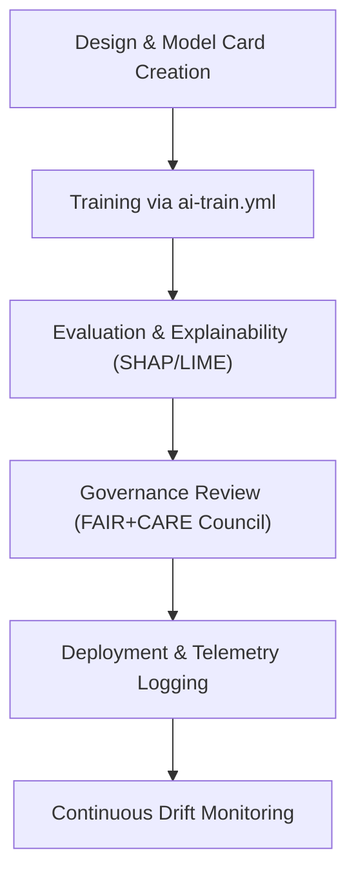

<div align="center">

# 🧠 **Kansas Frontier Matrix — AI Models Directory**
`src/ai/models/README.md`

**Purpose:**  
Document all **AI model architectures, training configurations, and governance frameworks** implemented in the Kansas Frontier Matrix (KFM).  
Ensures **FAIR+CARE compliance**, **MCP-DL v6.3 reproducibility**, and **ISO-aligned telemetry and sustainability** for every model training, deployment, and governance cycle.

[](../../../docs/)
[](../../../LICENSE)
[](../../../docs/standards/faircare.md)
[](#)

</div>

---

## 📘 Overview

The **AI Models Directory** contains all neural network models, transformer architectures, and explainability modules deployed across the Kansas Frontier Matrix.  
Every model follows an auditable, FAIR+CARE-governed lifecycle:

1. **Design & Documentation** — Architecture, configuration, and intended ethical use documented in `model_card.md`.  
2. **Training & Evaluation** — Managed through the `ai-train.yml` workflow with drift, bias, and telemetry tracking.  
3. **Governance Review** — FAIR+CARE Council reviews ethical alignment and data sourcing.  
4. **Deployment** — Validated models exported to APIs, Focus Mode, or analytical pipelines.  

---

## 🗂️ Directory Layout

```plaintext
src/ai/models/
├── README.md                        # This documentation file
│
├── focus_transformer_v1/            # Focus Mode v1 — contextual entity summarization
│   ├── README.md
│   ├── training/                    # Model configs, checkpoints, scripts
│   ├── explainability/              # SHAP/LIME explainability visualizations
│   └── governance/                  # Bias, drift, ethical governance metadata
│
├── focus_transformer_v2/            # Focus Mode v2 — narrative & predictive context modeling
│   ├── README.md
│   ├── training/
│   ├── explainability/
│   └── governance/
│
├── embeddings/                      # Vector embeddings and language model training
│   ├── README.md
│   ├── evaluation/
│   └── governance/
│
├── classification/                  # Domain-specific classifiers (e.g., hazards, climate)
│   ├── README.md
│   ├── training/
│   └── governance/
│
└── registry.json                    # Model registry — version, checksum, governance, telemetry links
```

---

## ⚙️ Model Registry Overview (`registry.json`)

Each model in the registry must contain its metadata, training configuration, and governance linkage.

```json
{
  "model_id": "focus_transformer_v2",
  "description": "Transformer model for narrative focus, predictive context synthesis, and explainability.",
  "version": "v9.9.0",
  "training_dataset": "data/work/processed/tabular/focus_training.parquet",
  "license": "MIT",
  "parameters": {
    "layers": 12,
    "embedding_dim": 1024,
    "attention_heads": 16,
    "dropout": 0.1
  },
  "telemetry": {
    "training_time_min": 328,
    "energy_wh": 1423,
    "bias_score": 0.04,
    "drift_flag": false
  },
  "governance_ref": "../../../docs/standards/faircare.md",
  "sbom_ref": "../../../releases/v9.9.0/sbom.spdx.json"
}
```

---

## 🧩 Model Families

| Model | Purpose | Framework | FAIR+CARE Governance |
|--------|----------|------------|-----------------------|
| **Focus Transformer v1** | NER-based contextual entity summarization and explainability. | PyTorch / Transformers | `@faircare-council` |
| **Focus Transformer v2** | Narrative + temporal reasoning + predictive storytelling. | HuggingFace + Neo4j Integration | `@kfm-ai` |
| **Embedding Suite** | Multimodal vector embeddings for text, maps, and imagery. | PyTorch / FAISS | `@kfm-architecture` |
| **Hazard Classifier** | Domain classifier for weather, flood, and fire datasets. | Scikit-Learn / LightGBM | `@kfm-data` |
| **Cultural NLP** | Sensitive language and heritage term classifier. | spaCy / Transformers | `@kfm-ethics` |

---

## ⚖️ FAIR+CARE Compliance in AI Models

| Principle | Enforcement | Validation |
|-----------|-------------|-------------|
| **Findable** | Model IDs, versions, and SBOMs in `registry.json`. | CI/CD validation |
| **Accessible** | Public metadata; restricted checkpoints for sensitive data. | FAIR+CARE Council |
| **Interoperable** | MLflow-compatible configs; JSON schema metadata. | ai-train.yml |
| **Reusable** | CC-BY/MIT licensing; reproducible configs. | MCP-DL validation |
| **CARE – Responsibility** | Bias tracking, drift analysis, explainability logs. | governance/ directory |
| **CARE – Ethics** | Governance approval required pre-release. | FAIR+CARE ledger |

---

## 🧠 Model Governance Lifecycle



### Key Governance Artifacts
- `MODEL_CARD.md` — Model purpose, data provenance, bias mitigation.  
- `bias_drift.json` — Monitored via Explainability module.  
- `faircare_audit.json` — Council-approved audit file.  
- `telemetry_ref` — Metrics recorded in `focus-telemetry.json`.  

---

## 📊 Telemetry Integration

Telemetry data from AI models feed into the unified ledger:

| Metric | Description | Source |
|--------|--------------|--------|
| `training_time_min` | Duration of model training. | ai-train.yml |
| `energy_wh` | Estimated energy consumption. | telemetry-export.yml |
| `bias_score` | Measured bias index post-evaluation. | Explainability module |
| `drift_flag` | Detected statistical drift (boolean). | Drift monitor |
| `a11y_metrics` | Accessibility compliance for AI reports. | Governance validator |

**Telemetry Output:**  
`releases/v9.9.0/focus-telemetry.json`  
**Schema:**  
`schemas/telemetry/src-ai-models-v1.json`

---

## 🔐 Governance & Security

- All trained models must be validated and signed using **Cosign** and **SLSA attestations**.  
- Model cards must include **data provenance**, **training script hashes**, and **checksum references**.  
- Bias and explainability audits are required before any production deployment.  
- Sensitive models (`care_tag: sensitive`) require explicit FAIR+CARE Council approval.

---

## 🧾 Internal Citation

```text
Kansas Frontier Matrix (2025). AI Models Directory (v9.9.0).
Comprehensive FAIR+CARE-aligned documentation for transformer, embedding, and classifier architectures, ensuring ethical governance, reproducibility, and sustainable telemetry.
```

---

## 🕰️ Version History

| Version | Date | Author | Summary |
|----------|------|--------|----------|
| v9.9.0 | 2025-11-08 | `@kfm-ai` | Initial creation; integrated governance workflow, telemetry schema, and AI model registry structure. |

---

<div align="center">

**Kansas Frontier Matrix**  
*Explainable AI × FAIR+CARE Ethics × Sustainable Intelligence*  
© 2025 Kansas Frontier Matrix · MIT · Master Coder Protocol v6.3 · FAIR+CARE Certified · Diamond⁹ Ω / Crown∞Ω Ultimate Certified  

[Back to AI Index](../README.md) · [Governance Charter](../../../docs/standards/governance/ROOT-GOVERNANCE.md)

</div>

