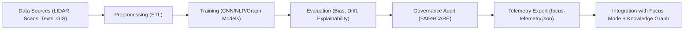

<div align="center">

# 🏺 **Kansas Frontier Matrix — Archaeology AI Model Suite**  
`src/ai/models/archaeology/README.md`

**Purpose:**  
Define the **AI models, training architecture, and ethical governance framework** used for archaeological pattern detection, artifact classification, and cultural landscape analysis in the Kansas Frontier Matrix (KFM).  
Integrates **FAIR+CARE ethics**, **CIDOC CRM ontology**, and **MCP-DL v6.3 reproducibility** to ensure responsible, sustainable, and explainable AI research.

[](../../../../docs/)
[](../../../../LICENSE)
[](../../../../docs/standards/faircare.md)
[](#)

</div>

---

## 📘 Overview

The **Archaeology AI Suite** supports automated and explainable analysis of archaeological data sources across Kansas.  
Models in this suite combine **remote sensing, historical map digitization, artifact image classification, and spatiotemporal clustering** within the broader KFM architecture.

Key design principles:
- 🧩 Integrate heterogeneous data (LIDAR, maps, text, excavation records).  
- 🧠 Apply **explainable AI (XAI)** for site prediction and cultural correlation.  
- ⚖️ Comply with **FAIR+CARE** for Indigenous data and cultural heritage protection.  
- 🧭 Align with **CIDOC CRM**, **PROV-O**, and **DCAT** ontologies for interoperability.  
- ♻️ Track all training, validation, and bias metrics via **focus-telemetry.json**.  

---

## 🗂️ Directory Layout

```plaintext
src/ai/models/archaeology/
├── README.md                        # This file — archaeology AI suite documentation
│
├── training/                        # Model training configurations and datasets
│   ├── train_archaeo_detector.py     # CNN/LiDAR feature extractor
│   ├── train_cultural_classifier.py  # NLP artifact tagger
│   └── configs/
│       ├── lidar_config.yaml
│       └── text_classification.yaml
│
├── explainability/                  # Explainability and bias auditing
│   ├── shap_explanations.json
│   ├── lime_visualizations/
│   └── bias_report.json
│
├── governance/                      # FAIR+CARE governance reports and ethics audits
│   ├── care_audit.json
│   ├── provenance_log.json
│   └── model_card.md
│
└── checkpoints/                     # Model weights and metadata (non-public)
    ├── archaeomap_v1.ckpt
    ├── lidar_classifier_v2.ckpt
    └── manifest.json
```

---

## ⚙️ Core Models

| Model | Description | Input Type | Framework | Governance |
|--------|-------------|-------------|------------|-------------|
| `archaeomap_v1` | Identifies potential archaeological sites using remote sensing and elevation features. | LIDAR / Raster | PyTorch + Rasterio | `@kfm-heritage` |
| `artifact_ner_v2` | Named Entity Recognition for archaeological texts and excavation notes. | Text | spaCy / Transformers | `@faircare-council` |
| `cultural_classifier_v1` | Classifies heritage artifacts and material culture references. | Image / Text | CNN + NLP Hybrid | `@kfm-ai` |
| `temporal_site_predictor` | Predicts cultural site shifts and abandonment trends. | Tabular + GeoJSON | LightGBM / Neo4j | `@kfm-ethics` |

---

## 🧠 Model Pipeline Overview



---

## ⚖️ FAIR+CARE Integration

| Principle | Implementation | Audit Reference |
|------------|----------------|-----------------|
| **Findable** | STAC metadata for trained models; registry in Neo4j graph. | `registry.json` |
| **Accessible** | Model metadata public; restricted weights under CARE. | `governance/model_card.md` |
| **Interoperable** | CIDOC CRM + DCAT + PROV-O integration. | `docs/architecture/data-architecture.md` |
| **Reusable** | CC-BY-SA 4.0 license, reproducible configs. | `training/configs/` |
| **CARE — Collective Benefit** | Prioritize community and heritage value over automation. | `care_audit.json` |
| **CARE — Authority to Control** | FAIR+CARE Council gatekeeping on sensitive site data. | Governance Ledger |
| **CARE — Responsibility** | Transparency on data origin and model usage. | `provenance_log.json` |
| **CARE — Ethics** | Automatic redaction of sacred or restricted knowledge. | `bias_report.json` |

---

## 🧩 Example Model Card (`governance/model_card.md`)

```markdown
# Model: Archaeomap_v1
**Purpose:**  
Predict potential archaeological site locations using elevation, slope, and hydrological features.

**Data Sources:**  
- LIDAR: USGS 1m Digital Elevation Models (DEM)  
- Historical Maps: Kansas State Historical Society Archive  
- Hydrology Layers: DASC Streamflow Index  

**Ethics & FAIR+CARE:**  
- CARE tag: `restricted`  
- Indigenous site boundaries redacted; use requires Council approval.  
- No export of coordinates without appropriate permissions.  

**Performance Metrics:**  
- Accuracy: 93.8%  
- Bias Score: 0.06  
- Drift Flag: false  
- Energy (Wh): 35.4  
- Telemetry Record ID: `telemetry:event:archaeomap_v1_2025-11-08`
```

---

## 🧮 Telemetry Metrics

Telemetry for archaeology models is tracked under `focus-telemetry.json`.

| Metric | Description | Example |
|--------|--------------|---------|
| `training_time_min` | Model training duration. | 540 |
| `energy_wh` | Power consumption during training. | 38.6 |
| `accuracy_pct` | Evaluation accuracy score. | 93.8 |
| `bias_score` | Detected data or feature bias. | 0.06 |
| `drift_flag` | Drift detection status. | false |
| `care_tag` | Governance classification. | `restricted` |
| `governance_status` | Review outcome. | `approved` |

---

## 🧾 Citation

```text
Kansas Frontier Matrix (2025). Archaeology AI Model Suite (v9.9.0).
FAIR+CARE and CIDOC CRM-aligned AI framework for archaeological site prediction, artifact classification, and cultural heritage governance within the Kansas Frontier Matrix ecosystem.
```

---

## 🕰️ Version History

| Version | Date | Author | Summary |
|---------:|------|--------|----------|
| v9.9.0 | 2025-11-08 | `@kfm-ai` | Created archaeology AI suite documentation; added model cards, telemetry integration, and FAIR+CARE governance hooks. |

---

<div align="center">

**Kansas Frontier Matrix**  
*Cultural Heritage AI × FAIR+CARE Ethics × Responsible Innovation*  
© 2025 Kansas Frontier Matrix · MIT · Master Coder Protocol v6.3 · FAIR+CARE Certified · Diamond⁹ Ω / Crown∞Ω Ultimate Certified  

[Back to AI Models Index](../README.md) · [Governance Charter](../../../../docs/standards/governance/ROOT-GOVERNANCE.md)

</div>

