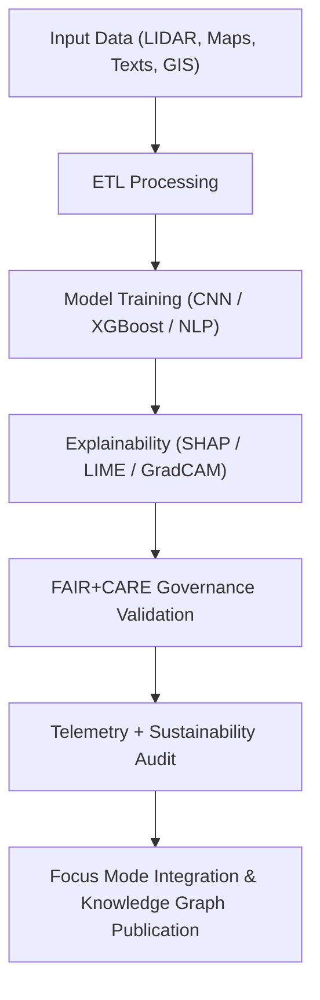

<div align="center">

# 🏺 **Kansas Frontier Matrix — Archaeology AI Model Suite**  
`src/ai/models/archaeology/README.md`

**Purpose:**  
Describe the integrated **AI architecture, training subsystems, and governance modules** used for archaeological research and heritage analysis in the Kansas Frontier Matrix (KFM).  
This suite implements **FAIR+CARE ethical AI governance**, **CIDOC CRM ontology alignment**, and **MCP-DL v6.3 reproducibility** for transparent and sustainable heritage science.

[](../../../../docs/)
[](../../../../LICENSE)
[](../../../../docs/standards/faircare.md)
[](#)

</div>

---

## 📘 Overview

The **Archaeology AI Model Suite** forms the foundation of predictive, interpretive, and governance-integrated artificial intelligence workflows for Kansas archaeology.  
This system enables sustainable, explainable, and ethically validated AI operations across the full data lifecycle — from remote sensing to Focus Mode visualization.

Key objectives:
- 🧩 Integrate diverse datasets (LIDAR, paleo-hydrography, soil, textual archives).  
- 🧠 Deliver explainable, bias-aware models for archaeological pattern detection.  
- ⚖️ Enforce **FAIR+CARE Council** review and governance checkpoints.  
- 🧭 Align with ontologies (CIDOC CRM, PROV-O, DCAT) for semantic interoperability.  
- ♻️ Log energy, accuracy, and ethics metrics in `focus-telemetry.json`.

---

## 🗂️ Directory Layout

```plaintext
src/ai/models/archaeology/
├── README.md                              # This file — AI suite documentation
│
├── predictive-zones/                      # Predictive archaeology (soil, elevation, hydro)
│   ├── pipeline/                          # ETL → Train → Explainability → Governance
│   ├── artifacts/                         # Model checkpoints, outputs, and metadata
│   ├── outputs/                           # Raster/Vector predictions and telemetry
│   └── governance/                        # FAIR+CARE approvals and provenance
│
├── training/                              # Core AI training framework (datasets, scripts)
├── explainability/                        # Bias auditing and interpretability modules
├── governance/                            # FAIR+CARE governance and Council audit framework
└── checkpoints/                           # Serialized model checkpoints and SBOM-linked artifacts
```

---

## ⚙️ Core Archaeological Models

| Model | Description | Input Data | Framework | Governance Reviewer |
|--------|--------------|-------------|------------|----------------------|
| **Predictive Zones AI** | Identifies potential archaeological sites based on soil, elevation, and paleo-hydrology. | DEM, NDMI, Paleo-channels | XGBoost / LightGBM | `@faircare-council` |
| **Artifact Classifier v1** | Recognizes artifact classes (ceramics, lithics, metalwork) via CNN+metadata fusion. | Image + Tabular | PyTorch | `@kfm-heritage` |
| **Text Tagger (NER v2)** | Extracts cultural and historical entities from excavation reports. | Text | spaCy / Transformers | `@kfm-nlp` |
| **Temporal Site Predictor** | Models migration and site abandonment over time. | Tabular + GeoJSON | LightGBM / Neo4j | `@kfm-ethics` |

---

## 🧠 AI Model Workflow



---

## ⚖️ FAIR+CARE Compliance

| Principle | Implementation | Validation Reference |
|------------|----------------|-----------------------|
| **Findable** | Metadata indexed in STAC/DCAT registry and SBOM manifest. | `releases/v9.9.0/manifest.zip` |
| **Accessible** | Model documentation and telemetry data publicly available. | `governance/model_card.md` |
| **Interoperable** | Ontology mappings via CIDOC CRM and PROV-O. | `docs/architecture/data-architecture.md` |
| **Reusable** | MIT-licensed models with reproducible configuration. | `training/configs/` |
| **CARE – Collective Benefit** | Models developed for heritage protection, not exploitation. | `governance/care_masking_report.json` |
| **CARE – Authority to Control** | FAIR+CARE Council approves release of sensitive outputs. | Governance Ledger |
| **CARE – Responsibility** | Energy, bias, and audit telemetry verified per release. | `focus-telemetry.json` |
| **CARE – Ethics** | Culturally sensitive data masked or generalized. | `explainability/logs/bias_report.json` |

---

## 🧩 Integration Across Frameworks

| Module | Function | Outputs |
|---------|-----------|----------|
| **Training** | Model preparation and validation (terrain, hydro, text). | `training_log.json`, `evaluation_metrics.json` |
| **Explainability** | SHAP/LIME bias and interpretability visualizations. | `explainability_summary.json` |
| **Governance** | Ethics, redaction, and FAIR+CARE Council reviews. | `governance_validation.json` |
| **Checkpoints** | Serialized models with checksum and energy metadata. | `checkpoints_manifest.json` |
| **Telemetry** | Unified log for energy, carbon, bias, and reproducibility. | `focus-telemetry.json` |

---

## 🧮 Sustainability & Telemetry Metrics

| Metric | Description | Example |
|--------|-------------|----------|
| `training_energy_wh` | Power used for model training. | 1489.2 |
| `carbon_gco2e` | CO₂ emissions (ISO 50001 equivalent). | 612.1 |
| `accuracy` | Model accuracy during validation. | 0.942 |
| `bias_score` | Average fairness deviation index. | 0.04 |
| `faircare_score` | Overall ethical compliance score. | 99.0 |
| `audit_status` | FAIR+CARE Council certification. | approved |

Telemetry collected in `releases/v9.9.0/focus-telemetry.json`.  
Schema: `schemas/telemetry/src-ai-models-archaeology-v1.json`.

---

## 🧾 Citation

```text
Kansas Frontier Matrix (2025). Archaeology AI Model Suite (v9.9.0).
FAIR+CARE-certified, CIDOC CRM-aligned AI ecosystem for ethical, explainable, and sustainable archaeological intelligence within the Kansas Frontier Matrix.
```

---

## 🕰️ Version History

| Version | Date | Author | Summary |
|---------:|------|--------|----------|
| v9.9.0 | 2025-11-08 | `@kfm-ai` | Updated Archaeology AI suite; integrated telemetry schema, governance ledger, and ontology compliance. |

---

<div align="center">

**Kansas Frontier Matrix**  
*Responsible Archaeological AI × FAIR+CARE Ethics × Sustainable Data Stewardship*  
© 2025 Kansas Frontier Matrix · MIT · Master Coder Protocol v6.3 · FAIR+CARE Certified · Diamond⁹ Ω / Crown∞Ω Ultimate Certified  

[Back to AI Models Index](../README.md) · [Governance Charter](../../../../docs/standards/governance/ROOT-GOVERNANCE.md)

</div>
