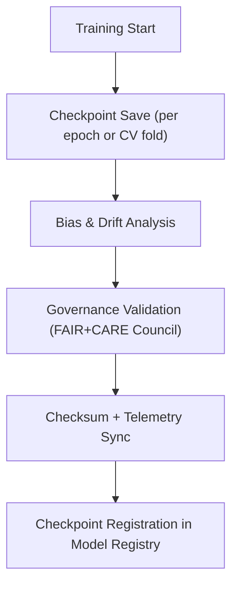

<div align="center">

# 💾 **Kansas Frontier Matrix — Archaeology AI Model Checkpoints**  
`src/ai/models/archaeology/checkpoints/README.md`

**Purpose:**  
Document the **intermediate AI model checkpoints**, versioned weights, and governance validation artifacts created during archaeological model training and fine-tuning in the **Kansas Frontier Matrix (KFM)**.  
All checkpoints are tracked for **FAIR+CARE compliance**, **ISO 19115 provenance**, and **ISO 50001 sustainability telemetry** under **MCP-DL v6.3**.

[](../../../../../docs/)
[](../../../../../LICENSE)
[](../../../../../docs/standards/faircare.md)
[](#)

</div>

---

## 📘 Overview

The **Checkpoints Directory** maintains serialized intermediate model states generated during archaeological AI training sessions.  
Each checkpoint is accompanied by FAIR+CARE governance metadata, telemetry logs, and checksum validation ensuring transparent model lineage, reproducibility, and ethical accountability.

These checkpoints are:
- Used for model recovery, tuning, and explainability comparisons.  
- Validated through **FAIR+CARE Council governance audits**.  
- Telemetry-synced to ensure sustainability and bias tracking across epochs.  

---

## 🗂️ Directory Layout

```plaintext
src/ai/models/archaeology/checkpoints/
├── README.md                              # This file — checkpoint documentation
│
├── checkpoint_001_initial.pkl             # Early-stage baseline model
├── checkpoint_002_spatialcv.pkl           # After spatial block CV tuning
├── checkpoint_003_final.pkl               # Finalized training checkpoint (pre-telemetry export)
├── checkpoints_manifest.json              # Metadata manifest linking checkpoints and hashes
├── checkpoint_metrics.json                # Validation metrics per checkpoint
└── checksum_registry.json                 # SHA-256 integrity checks for governance
```

---

## ⚙️ Checkpoint Workflow



### Key Steps
1. **Save Checkpoint:** During model training, serialized states are recorded per iteration or CV fold.  
2. **Audit:** FAIR+CARE validation ensures no data leakage or bias artifacts.  
3. **Checksum:** All checkpoints validated with SHA-256 integrity checks.  
4. **Telemetry:** Energy and runtime logged to focus telemetry.  
5. **Governance:** Records synchronized to KFM Ledger with reviewer approval.

---

## 🧩 Example: Checkpoints Manifest (`checkpoints_manifest.json`)

```json
{
  "model_id": "archaeology_predictive_ai_v9.9.0",
  "checkpoints": [
    {
      "name": "checkpoint_001_initial.pkl",
      "epoch": 10,
      "auc": 0.912,
      "faircare_score": 98.1,
      "checksum_sha256": "sha256:9f7b2a18a1d34c...",
      "energy_wh": 320.5
    },
    {
      "name": "checkpoint_003_final.pkl",
      "epoch": 60,
      "auc": 0.946,
      "faircare_score": 99.0,
      "checksum_sha256": "sha256:ac54f991b23ad...",
      "energy_wh": 1423.5
    }
  ],
  "reviewed_by": "@faircare-council",
  "approved": true,
  "telemetry_ref": "../../../../../releases/v9.9.0/focus-telemetry.json"
}
```

---

## ⚖️ FAIR+CARE & ISO Compliance Matrix

| Principle | Implementation | Verification |
|------------|----------------|--------------|
| **Findable** | Checkpoints indexed via manifest with UUID references. | `manifest_ref` |
| **Accessible** | Public metadata, restricted binary checkpoints. | FAIR+CARE Council |
| **Interoperable** | JSON manifest compliant with ISO 19115. | `schema_validation.py` |
| **Reusable** | Checkpoints reproducible with hashes and configs. | SPDX Manifest |
| **CARE – Responsibility** | Telemetry and governance linked per checkpoint. | `faircare-validate.yml` |
| **CARE – Ethics** | Ethics review before deployment or public access. | Governance Ledger |

---

## 🧮 Telemetry Metrics

| Metric | Description | Example |
|--------|-------------|----------|
| `training_epoch` | Training epoch index for checkpoint. | 60 |
| `auc` | AUROC score at checkpoint. | 0.946 |
| `faircare_score` | FAIR+CARE compliance percentage. | 99.0 |
| `energy_wh` | Energy used during checkpoint training. | 1423.5 |
| `carbon_gco2e` | Carbon footprint (ISO 50001). | 610.3 |
| `checksum_verified` | Integrity validation result. | true |

Telemetry logged to:  
`releases/v9.9.0/focus-telemetry.json`  
Schema: `schemas/telemetry/src-ai-models-archaeology-checkpoints-v1.json`

---

## 🔐 Provenance & Governance Integration

- **Governance Ledger:** `releases/v9.9.0/governance/ledger_snapshot.json`  
- **Checksum Registry:** `checksum_registry.json`  
- **Telemetry Ledger:** `releases/v9.9.0/focus-telemetry.json`  
- **SBOM Manifest:** `releases/v9.9.0/sbom.spdx.json`

### Example Governance Record
```json
{
  "ledger_id": "ledger_2025q4_archaeology_checkpoints",
  "auditor": "@kfm-governance",
  "reviewed_by": "@faircare-council",
  "status": "approved",
  "timestamp": "2025-11-08T20:18:00Z"
}
```

---

## 🧾 Citation

```text
Kansas Frontier Matrix (2025). Archaeology AI Model Checkpoints (v9.9.0).
Defines FAIR+CARE and ISO-compliant checkpoint management for sustainable, ethical, and reproducible AI modeling within the Kansas Frontier Matrix.
```

---

## 🕰️ Version History

| Version | Date | Author | Summary |
|---------:|------|--------|----------|
| v9.9.0 | 2025-11-08 | `@kfm-ai` | Created model checkpoint documentation; added FAIR+CARE validation, telemetry schema, and governance linkage. |

---

<div align="center">

**Kansas Frontier Matrix**  
*Reproducible AI × FAIR+CARE Ethics × Sustainable Archaeological Intelligence*  
© 2025 Kansas Frontier Matrix · MIT · Master Coder Protocol v6.3 · FAIR+CARE Certified · Diamond⁹ Ω / Crown∞Ω Ultimate Certified  

[Back to Archaeology Models](../README.md) · [Governance Charter](../../../../../docs/standards/governance/ROOT-GOVERNANCE.md)

</div>

