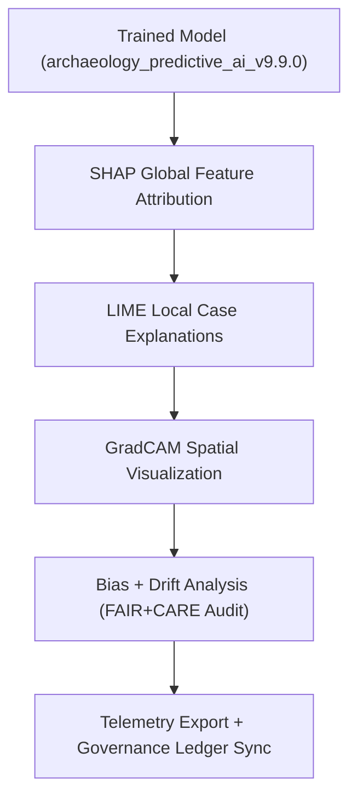

<div align="center">

# 🧠 **Kansas Frontier Matrix — Archaeology AI Explainability Framework**  
`src/ai/models/archaeology/explainability/README.md`

**Purpose:**  
Provide documentation for the **explainability, bias auditing, and interpretability modules** that make AI predictions in archaeology transparent and ethically governed.  
This framework integrates **FAIR+CARE**, **ISO 19115**, and **MCP-DL v6.3** standards to ensure responsible archaeological AI insights.

[](../../../../../docs/)
[](../../../../../LICENSE)
[](../../../../../docs/standards/faircare.md)
[](#)

</div>

---

## 📘 Overview

The **Archaeology Explainability Framework** enables detailed interpretation of model predictions across spatial, cultural, and environmental dimensions.  
Its core objective is to make AI reasoning understandable, auditable, and compliant with FAIR+CARE ethical data governance principles.

This subsystem supports:
- 🧩 **SHAP** for global and local feature attribution.  
- 🎯 **LIME** for localized explainability and case analysis.  
- 🌍 **GradCAM** for CNN-based spatial visualization (when applicable).  
- ⚖️ **Bias and fairness audits** through transparent reporting pipelines.  
- ♻️ **Energy and sustainability telemetry** for explainability runs.  

---

## 🗂️ Directory Layout

```plaintext
src/ai/models/archaeology/explainability/
├── README.md                            # This file — documentation for explainability framework
│
├── shap_analysis.py                     # SHAP global/local attribution computations
├── lime_explainer.py                    # Local interpretability module
├── gradcam_visualizer.py                # GradCAM-based visualization tool
├── bias_audit.py                        # FAIR+CARE bias and fairness reporting
├── drift_monitor.py                     # Drift detection and explainability stability tracking
└── logs/                                # Explainability outputs and audit records
    ├── shap_summary.json
    ├── lime_results.json
    ├── gradcam_maps.geojson
    ├── bias_report.json
    └── explainability_summary.json
```

---

## ⚙️ Explainability Workflow



### Core Explainability Functions
1. **SHAP Analysis** — Quantifies global feature importance and interactions.  
2. **LIME Explanations** — Provides localized understanding of predictions.  
3. **GradCAM Visualization** — Highlights spatial influence patterns for raster inputs.  
4. **Bias Auditing** — Evaluates fairness across geographic or demographic groups.  
5. **Governance Sync** — Logs explainability metadata to FAIR+CARE Ledger and Telemetry.  

---

## 🧩 Example: Explainability Summary (`logs/explainability_summary.json`)

```json
{
  "model_id": "archaeology_predictive_ai_v9.9.0",
  "explainability_methods": ["SHAP", "LIME", "GradCAM"],
  "top_features": ["slope", "distance_to_water", "soil_moisture_mean", "vegetation_ndvi"],
  "global_importance_variance": 0.06,
  "local_stability_index": 0.93,
  "bias_index": 0.04,
  "energy_wh": 28.6,
  "carbon_gco2e": 12.7,
  "reviewed_by": "@faircare-council",
  "approved": true,
  "telemetry_ref": "../../../../../releases/v9.9.0/focus-telemetry.json"
}
```

---

## ⚖️ FAIR+CARE Integration Matrix

| Principle | Implementation | Validator |
|------------|----------------|------------|
| **Findable** | Explainability outputs indexed by model UUID. | `telemetry-export.yml` |
| **Accessible** | Public visualizations restricted for sensitive content. | FAIR+CARE Council |
| **Interoperable** | JSON/GeoJSON artifacts ISO 19115 compliant. | `schema_validation.py` |
| **Reusable** | CC-BY 4.0 license; machine-readable provenance metadata. | SPDX Manifest |
| **CARE – Responsibility** | Bias reports audited quarterly for cultural fairness. | `faircare-validate.yml` |
| **CARE – Ethics** | Sensitive overlays masked to protect cultural sites. | `bias_audit.py` |

---

## 🧮 Telemetry Metrics

| Metric | Description | Example |
|--------|-------------|----------|
| `runtime_sec` | Explainability runtime in seconds. | 768 |
| `energy_wh` | Energy usage per explainability job. | 28.6 |
| `carbon_gco2e` | Equivalent CO₂ emissions. | 12.7 |
| `bias_index` | Average model bias score. | 0.04 |
| `local_stability_index` | Consistency of LIME explanations. | 0.93 |
| `faircare_score` | Governance audit compliance score. | 98.9 |

All telemetry entries logged to:  
`releases/v9.9.0/focus-telemetry.json`  
Schema: `schemas/telemetry/src-ai-models-archaeology-explainability-v1.json`

---

## 🔐 Provenance & Governance Integration

- **Governance Ledger:** `releases/v9.9.0/governance/ledger_snapshot.json`  
- **SBOM Manifest:** `releases/v9.9.0/sbom.spdx.json`  
- **Telemetry Ledger:** `releases/v9.9.0/focus-telemetry.json`  
- **CARE Ethics Review:** logged via `logs/bias_report.json`  

### Example Governance Record
```json
{
  "ledger_entry_id": "ledger_2025q4_explainability",
  "auditor": "@kfm-governance",
  "reviewed_by": "@faircare-council",
  "status": "certified",
  "timestamp": "2025-11-08T20:10:00Z"
}
```

---

## 🧾 Citation

```text
Kansas Frontier Matrix (2025). Archaeology AI Explainability Framework (v9.9.0).
FAIR+CARE-aligned explainability and bias auditing system ensuring transparent, ethical, and sustainable archaeological AI interpretation in the Kansas Frontier Matrix.
```

---

## 🕰️ Version History

| Version | Date | Author | Summary |
|---------:|------|--------|----------|
| v9.9.0 | 2025-11-08 | `@kfm-ai` | Created archaeology explainability documentation; integrated SHAP/LIME/GradCAM workflows and FAIR+CARE telemetry logging. |

---

<div align="center">

**Kansas Frontier Matrix**  
*Transparent Archaeological AI × FAIR+CARE Ethics × Sustainable Explainability*  
© 2025 Kansas Frontier Matrix · CC-BY 4.0 · Master Coder Protocol v6.3 · FAIR+CARE Certified · Diamond⁹ Ω / Crown∞Ω Ultimate Certified  

[Back to Archaeology Models](../README.md) · [Governance Charter](../../../../../docs/standards/governance/ROOT-GOVERNANCE.md)

</div>

