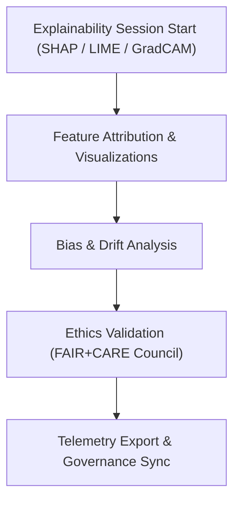

<div align="center">

# 📜 **Kansas Frontier Matrix — Archaeology Explainability Logs**  
`src/ai/models/archaeology/explainability/logs/README.md`

**Purpose:**  
Document all **explainability session logs, bias reports, and sustainability telemetry** generated by the **Archaeology AI Explainability Framework** within the **Kansas Frontier Matrix (KFM)**.  
These logs provide verifiable, FAIR+CARE-certified traceability for transparency, accountability, and ethical interpretability in archaeological AI.

[](../../../../../../docs/)
[](../../../../../../LICENSE)
[](../../../../../../docs/standards/faircare.md)
[](#)

</div>

---

## 📘 Overview

The **Explainability Logs Directory** serves as the audit archive for all model interpretation runs, capturing **SHAP/LIME outputs**, **bias audits**, **drift detection**, and **energy telemetry**.  
Each log entry is validated against FAIR+CARE standards and linked to the **KFM Governance Ledger** for certification.

---

## 🗂️ Directory Layout

```plaintext
src/ai/models/archaeology/explainability/logs/
├── README.md                            # This file — explainability log documentation
│
├── shap_summary.json                    # Global SHAP feature importance summary
├── lime_results.json                    # LIME local interpretability output
├── gradcam_maps.geojson                 # GradCAM spatial visualization overlays
├── bias_report.json                     # Bias and fairness analysis results
├── drift_stability.json                 # Explainability consistency and drift metrics
└── explainability_summary.json          # Aggregated explainability and telemetry log
```

---

## ⚙️ Explainability Logging Workflow



### Workflow Description
1. **Feature Attribution:** Global and local explanations generated via SHAP and LIME.  
2. **Visualization:** Spatial explanations created using GradCAM overlays.  
3. **Bias + Drift Audit:** Model bias and explainability drift logged for Council review.  
4. **Governance Sync:** Audit results written to FAIR+CARE governance ledger.  
5. **Telemetry Export:** Sustainability metrics appended to focus telemetry.

---

## 🧩 Example: Explainability Summary (`explainability_summary.json`)

```json
{
  "run_id": "explainability_2025_11_08_004",
  "model_id": "archaeology_predictive_ai_v9.9.0",
  "methods": ["SHAP", "LIME", "GradCAM"],
  "top_features": ["slope", "soil_moisture", "distance_to_water"],
  "bias_index": 0.04,
  "drift_flag": false,
  "explainability_stability": 0.92,
  "energy_wh": 28.5,
  "carbon_gco2e": 12.8,
  "restricted_visuals": 2,
  "reviewed_by": "@faircare-council",
  "telemetry_ref": "../../../../../../releases/v9.9.0/focus-telemetry.json",
  "timestamp": "2025-11-08T20:12:00Z"
}
```

---

## ⚖️ FAIR+CARE Compliance Matrix

| Principle | Implementation | Verified By |
|------------|----------------|--------------|
| **Findable** | Explainability logs indexed via UUID in telemetry ledger. | `telemetry-export.yml` |
| **Accessible** | Public SHAP summaries; restricted GradCAM overlays. | FAIR+CARE Council |
| **Interoperable** | JSON + GeoJSON formats (ISO 19115 compliant). | Schema Validator |
| **Reusable** | CC-BY 4.0 license; reproducible interpretability logs. | SPDX Manifest |
| **CARE – Responsibility** | Bias and drift audits reviewed quarterly. | `faircare-validate.yml` |
| **CARE – Ethics** | Restricted maps masked per Council protocol. | Governance Ledger |

---

## 🧮 Telemetry Metrics

| Metric | Description | Example |
|--------|-------------|----------|
| `runtime_sec` | Total duration of explainability run. | 785 |
| `energy_wh` | Energy used for SHAP/LIME computations. | 28.5 |
| `carbon_gco2e` | Carbon footprint of the session. | 12.8 |
| `bias_index` | Average detected model bias. | 0.04 |
| `explainability_stability` | Variance of SHAP feature rankings. | 0.92 |
| `restricted_visuals` | Number of cultural overlays masked. | 2 |

All telemetry metrics recorded in:  
`releases/v9.9.0/focus-telemetry.json`  
Schema: `schemas/telemetry/src-ai-models-archaeology-explainability-logs-v1.json`

---

## 🔐 Provenance & Governance Integration

- **Governance Ledger:** `releases/v9.9.0/governance/ledger_snapshot.json`  
- **Telemetry Reference:** `releases/v9.9.0/focus-telemetry.json`  
- **SBOM & SPDX:** `releases/v9.9.0/sbom.spdx.json`  
- **Ethical Audit Trail:** `bias_report.json`  

### Example Governance Record
```json
{
  "entry_id": "ledger_2025q4_explainability_logs",
  "reviewed_by": "@faircare-council",
  "auditor": "@kfm-governance",
  "status": "certified",
  "timestamp": "2025-11-08T20:15:00Z"
}
```

---

## 🧾 Citation

```text
Kansas Frontier Matrix (2025). Archaeology Explainability Logs (v9.9.0).
FAIR+CARE-certified explainability log system ensuring transparency, accountability, and ethical governance of AI interpretability within the Kansas Frontier Matrix.
```

---

## 🕰️ Version History

| Version | Date | Author | Summary |
|---------:|------|--------|----------|
| v9.9.0 | 2025-11-08 | `@kfm-ai` | Created explainability logs documentation; added FAIR+CARE telemetry schema, bias audit tracking, and governance ledger integration. |

---

<div align="center">

**Kansas Frontier Matrix**  
*Explainable AI × FAIR+CARE Ethics × Sustainable Archaeological Insight*  
© 2025 Kansas Frontier Matrix · Internal FAIR+CARE Certified · Master Coder Protocol v6.3 · Diamond⁹ Ω / Crown∞Ω Ultimate Certified  

[Back to Explainability Framework](../README.md) · [Governance Charter](../../../../../../docs/standards/governance/ROOT-GOVERNANCE.md)

</div>

