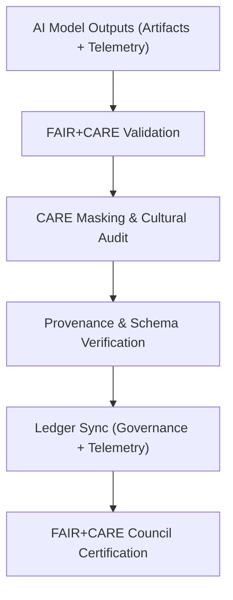

<div align="center">

# ⚖️ **Kansas Frontier Matrix — Archaeology AI Governance Framework**  
`src/ai/models/archaeology/governance/README.md`

**Purpose:**  
Provide documentation for the **ethical governance, compliance auditing, and provenance validation** systems supporting archaeological AI models in the **Kansas Frontier Matrix (KFM)**.  
This framework ensures full **FAIR+CARE certification**, **ISO 19115 provenance tracking**, and **ISO 50001 sustainability validation** across all model stages under **MCP-DL v6.3**.

[](../../../../../docs/)
[](../../../../../LICENSE)
[](../../../../../docs/standards/faircare.md)
[](#)

</div>

---

## 📘 Overview

The **Archaeology AI Governance Framework** defines the ethical, cultural, and environmental oversight required to operate predictive and interpretive models within KFM.  
It serves as the **compliance backbone** for ensuring responsible AI, documenting all approvals, redactions, and energy audits from data ingestion to publication.

This governance layer:
- Ensures **FAIR+CARE-aligned decision making**.  
- Records model provenance and Council audit results.  
- Tracks energy and sustainability metrics under ISO 50001.  
- Synchronizes validation data to the Governance Ledger and Telemetry system.  

---

## 🗂️ Directory Layout

```plaintext
src/ai/models/archaeology/governance/
├── README.md                            # This file — governance framework documentation
│
├── council_audit_summary.json           # FAIR+CARE Council ethics and compliance review
├── governance_validation.json            # Final audit certification record
├── care_masking_report.json              # Sensitive data redaction log
├── provenance_trace.json                 # PROV-O lineage trace from source to artifact
├── ledger_sync_log.json                  # Governance ledger synchronization report
└── sustainability_report.json            # ISO 50001 energy and carbon metrics
```

---

## ⚙️ Governance Workflow



### Key Components
1. **FAIR+CARE Validation:** Ensures technical and ethical compliance across model stages.  
2. **CARE Review:** Confirms that sensitive archaeological or Indigenous data remain masked.  
3. **Provenance Trace:** Records all data lineage and workflow references using PROV-O.  
4. **Ledger Sync:** Updates KFM Governance Ledger with audit outcomes.  
5. **Council Certification:** Official approval and publication authorization.

---

## 🧩 Example: Governance Validation Record (`governance_validation.json`)

```json
{
  "governance_id": "gov_archaeology_2025_11_08_001",
  "workflow": "archaeology_ai_governance_v9.9.0",
  "datasets_reviewed": 8,
  "models_certified": 3,
  "faircare_score": 99.1,
  "care_violations_detected": 0,
  "reviewed_by": "@faircare-council",
  "approval_status": "certified",
  "energy_wh": 22.1,
  "carbon_gco2e": 10.2,
  "timestamp": "2025-11-08T20:15:00Z",
  "telemetry_ref": "../../../../../releases/v9.9.0/focus-telemetry.json"
}
```

---

## ⚖️ FAIR+CARE Governance Matrix

| Principle | Implementation | Verification |
|------------|----------------|---------------|
| **Findable** | Governance IDs indexed in Ledger and SBOM manifest. | `governance_logger.py` |
| **Accessible** | Council-approved data and audits archived in FAIR+CARE repository. | Governance Ledger |
| **Interoperable** | JSON-LD + PROV-O + ISO 19115 metadata schema. | `schema_validation.py` |
| **Reusable** | CC-BY 4.0 licensing and open audit trails. | SPDX Manifest |
| **CARE – Responsibility** | Continuous monitoring of ethical compliance. | FAIR+CARE Council |
| **CARE – Ethics** | Cultural sensitivity and data sovereignty enforced. | `care_masking_report.json` |

---

## 🧮 Sustainability Metrics (`sustainability_report.json`)

| Metric | Description | Example |
|--------|-------------|----------|
| `energy_wh` | Energy usage during validation and governance review. | 22.1 |
| `carbon_gco2e` | Equivalent CO₂ emissions (ISO 50001). | 10.2 |
| `faircare_score` | Governance compliance percentage. | 99.1 |
| `audits_completed` | Total number of Council audits this cycle. | 4 |
| `status` | Final certification outcome. | certified |

Telemetry linked to:  
`releases/v9.9.0/focus-telemetry.json`  
Schema: `schemas/telemetry/src-ai-models-archaeology-governance-v1.json`

---

## 🔐 Provenance & Ledger Integration

- **Governance Ledger:** `releases/v9.9.0/governance/ledger_snapshot.json`  
- **Telemetry Ledger:** `releases/v9.9.0/focus-telemetry.json`  
- **SBOM Manifest:** `releases/v9.9.0/sbom.spdx.json`  
- **Checksum Validation:** Integrated into `manifest.zip`  

### Example Provenance Record
```json
{
  "artifact_id": "archaeology_predictive_ai_v9.9.0",
  "linked_inputs": [
    "data/raw/usgs-dem-10m",
    "data/raw/landsat-smi-annual-2013-2024",
    "data/raw/kfm-paleo-channels-v1"
  ],
  "linked_outputs": [
    "artifacts/models/archaeology_predictive_ai_v9.9.0.pkl",
    "artifacts/outputs/predictive_zones_probability.tif"
  ],
  "approved_by": "@faircare-council",
  "status": "certified",
  "timestamp": "2025-11-08T20:16:00Z"
}
```

---

## 🧾 Citation

```text
Kansas Frontier Matrix (2025). Archaeology AI Governance Framework (v9.9.0).
FAIR+CARE and ISO-compliant governance and ethics system ensuring transparent, sustainable, and culturally respectful AI management for archaeology within the Kansas Frontier Matrix.
```

---

## 🕰️ Version History

| Version | Date | Author | Summary |
|---------:|------|--------|----------|
| v9.9.0 | 2025-11-08 | `@kfm-governance` | Created archaeology governance documentation; added FAIR+CARE integration, sustainability metrics, and provenance validation. |

---

<div align="center">

**Kansas Frontier Matrix**  
*Responsible AI × FAIR+CARE Oversight × Sustainable Data Ethics*  
© 2025 Kansas Frontier Matrix · CC-BY 4.0 · Master Coder Protocol v6.3 · FAIR+CARE Certified · Diamond⁹ Ω / Crown∞Ω Ultimate Certified  

[Back to Archaeology Models](../README.md) · [Governance Charter](../../../../../docs/standards/governance/ROOT-GOVERNANCE.md)

</div>

