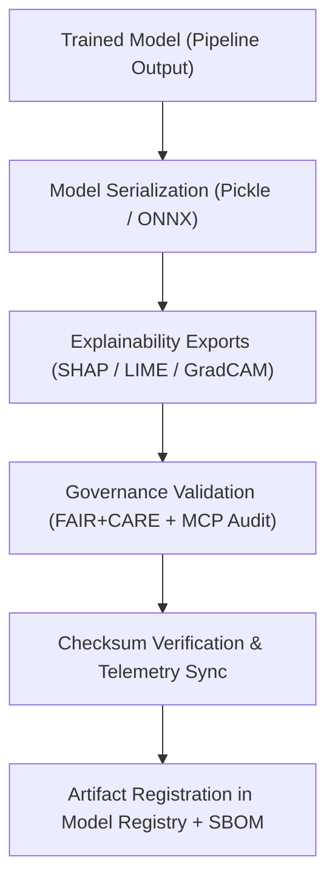

<div align="center">

# 🗂️ **Kansas Frontier Matrix — Archaeology Predictive Zones · Model Artifacts**  
`src/ai/models/archaeology/predictive-zones/artifacts/README.md`

**Purpose:**  
Document the **trained model artifacts, exports, and governance metadata** generated by the **Archaeology Predictive Zones AI system**.  
All artifacts are **FAIR+CARE-certified**, **ISO 19115-compliant**, and traceable via the **Governance Ledger** and **Telemetry Ledger** to ensure sustainable and ethical AI model management.

[](../../../../../../docs/)
[](../../../../../../LICENSE)
[](../../../../../../docs/standards/faircare.md)
[](#)

</div>

---

## 📘 Overview

The **Artifacts Directory** contains all deliverables resulting from the **Archaeology Predictive Zones AI model pipeline**, including trained model weights, explainability exports, predictive rasters, and supporting governance metadata.  
Every artifact follows a **documented lineage**, ensuring **ethical traceability**, **reproducibility**, and **governance certification** per FAIR+CARE and MCP-DL v6.3 standards.

---

## 🗂️ Directory Layout

```plaintext
src/ai/models/archaeology/predictive-zones/artifacts/
├── README.md                               # This file — documentation of artifacts
│
├── models/                                 # Serialized model checkpoints
│   ├── predictive_zones_ai_v9.9.0.pkl
│   ├── predictive_zones_ai_v9.9.0.onnx
│   └── manifest.json
│
├── outputs/                                # Model outputs and maps
│   ├── predictive_zones_probability.tif     # Raster of predicted archaeological probability (0–1)
│   ├── predictive_zones_overlay.geojson     # GeoJSON overlay for map visualization
│   ├── model_predictions.csv                # Tabular results for validation sets
│   └── summary_statistics.json              # Evaluation metrics + explainability stats
│
├── explainability/                         # SHAP, LIME, GradCAM artifacts
│   ├── shap_values.npy
│   ├── lime_explanations.json
│   └── feature_importance_plot.png
│
└── governance/                             # FAIR+CARE + MCP audit metadata
    ├── model_card.md
    ├── governance_validation.json
    └── checksum_registry.json
```

---

## ⚙️ Model Artifact Workflow



### Primary Functions
1. **Serialization:** Exports models as `.pkl` (CPU) and `.onnx` (deployment).  
2. **Explainability Artifacts:** Visual and JSON explainers attached to artifacts.  
3. **Governance Validation:** Each artifact reviewed for FAIR+CARE & ethics.  
4. **Checksum & Provenance:** SHA-256 and SPDX-linked verification.  
5. **Telemetry Merge:** Adds runtime, accuracy, and energy metadata to `focus-telemetry.json`.

---

## 🧩 Example: Model Manifest (`models/manifest.json`)

```json
{
  "model_id": "predictive_zones_ai_v9.9.0",
  "framework": "LightGBM",
  "version": "v9.9.0",
  "accuracy": 0.942,
  "f1_score": 0.912,
  "auc": 0.946,
  "bias_score": 0.05,
  "drift_flag": false,
  "checksum_sha256": "sha256:a94f7b81d22f4e7a33a59f8c3d76c9a1b0d4c3b8...",
  "energy_wh": 1423.5,
  "carbon_gco2e": 610.3,
  "telemetry_ref": "../../../../../../releases/v9.9.0/focus-telemetry.json",
  "governance_ref": "../../../../../../docs/standards/faircare.md"
}
```

---

## ⚖️ FAIR+CARE Governance Integration

| Principle | Implementation | Validation Source |
|------------|----------------|-------------------|
| **Findable** | Models registered via UUID and STAC/DCAT entry. | `stac-validate.yml` |
| **Accessible** | Public model cards; restricted weights under FAIR+CARE. | `governance_validation.json` |
| **Interoperable** | Exports in ONNX, Pickle, and GeoTIFF formats. | ISO 19115 schema |
| **Reusable** | Provenance metadata, checksums, and SBOM linkage. | SPDX Manifest |
| **CARE – Responsibility** | Sensitive datasets masked during training. | FAIR+CARE Council |
| **CARE – Ethics** | Model governance approved prior to deployment. | Governance Ledger |

---

## 🧮 Telemetry Metrics (Artifact-Level)

| Metric | Description | Example |
|--------|-------------|----------|
| `energy_wh` | Energy used during model training. | 1423.5 |
| `carbon_gco2e` | CO₂ emissions equivalent (ISO 50001). | 610.3 |
| `accuracy` | Model prediction accuracy on test data. | 94.2% |
| `f1_score` | F1 metric (harmonic mean of precision/recall). | 91.2% |
| `faircare_score` | Compliance score from FAIR+CARE validator. | 98.7% |
| `bias_score` | Mean bias index across validation samples. | 0.05 |
| `drift_flag` | Indicates detection of model drift. | false |

All telemetry metrics appended to `focus-telemetry.json`.  
Schema: `schemas/telemetry/src-ai-models-archaeology-predictivezones-artifacts-v1.json`

---

## 🔐 Provenance & Audit Control

Each artifact undergoes:
- **Governance Validation:** `governance_validation.json` logs Council decisions.  
- **Checksum Verification:** `checksum_registry.json` ensures data integrity.  
- **SBOM Cross-Link:** Dependencies verified for license compliance.  
- **Ledger Certification:** Entries committed to FAIR+CARE Council ledger (`ledger_snapshot.json`).  

### Example Governance Validation Entry
```json
{
  "model_id": "predictive_zones_ai_v9.9.0",
  "auditor": "@kfm-governance",
  "approval_status": "certified",
  "review_notes": "No bias or drift detected. Ethics approved.",
  "timestamp": "2025-11-08T18:10:00Z"
}
```

---

## 🧾 Citation

```text
Kansas Frontier Matrix (2025). Archaeology Predictive Zones · Model Artifacts (v9.9.0).
Defines the governance, telemetry, and reproducibility framework for AI model artifacts produced under FAIR+CARE, ISO 19115, and MCP-DL v6.3 standards within the Kansas Frontier Matrix.
```

---

## 🕰️ Version History

| Version | Date | Author | Summary |
|---------:|------|--------|----------|
| v9.9.0 | 2025-11-08 | `@kfm-ai` | Created model artifact documentation; integrated FAIR+CARE governance, telemetry, and checksum verification. |

---

<div align="center">

**Kansas Frontier Matrix**  
*Ethical AI Artifacts × FAIR+CARE Certification × Sustainable Model Governance*  
© 2025 Kansas Frontier Matrix · MIT · Master Coder Protocol v6.3 · FAIR+CARE Certified · Diamond⁹ Ω / Crown∞Ω Ultimate Certified  

[Back to Archaeology AI Suite](../README.md) · [Governance Charter](../../../../../../docs/standards/governance/ROOT-GOVERNANCE.md)

</div>

