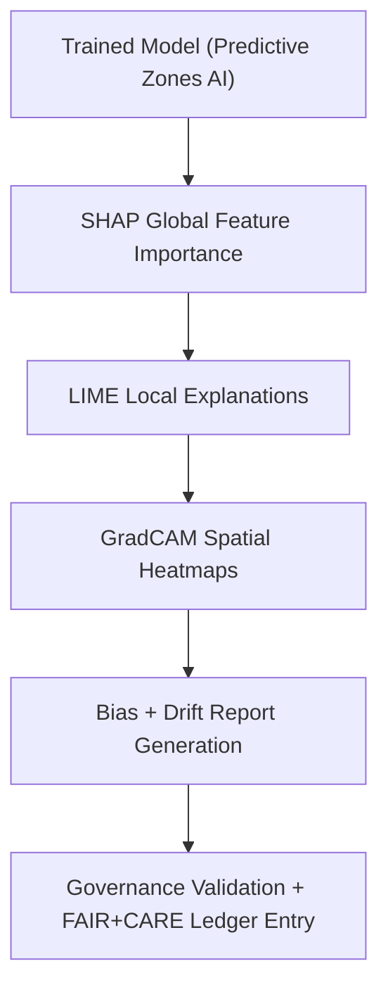

<div align="center">

# 🧠 **Kansas Frontier Matrix — Archaeology Predictive Zones · Explainability Artifacts**  
`src/ai/models/archaeology/predictive-zones/artifacts/explainability/README.md`

**Purpose:**  
Document the **explainability and interpretability artifacts** generated from the **Archaeology Predictive Zones AI model**.  
These files ensure **transparency, bias auditing, and FAIR+CARE-compliant accountability** under **MCP-DL v6.3**, enabling explainable insights into model decision-making processes.

[](../../../../../../../docs/)
[](../../../../../../../LICENSE)
[](../../../../../../../docs/standards/faircare.md)
[](#)

</div>

---

## 📘 Overview

The **Explainability Artifacts Directory** contains SHAP, LIME, and GradCAM interpretability outputs for the **Predictive Zones AI model**.  
These artifacts enable model transparency and bias detection while ensuring ethical constraints on cultural and Indigenous data visualization.

Each explainability artifact is linked to:
- The **model manifest** (`artifacts/models/model_manifest.json`)  
- The **telemetry ledger** (`focus-telemetry.json`)  
- The **governance ledger** (`ledger_snapshot.json`)  

---

## 🗂️ Directory Layout

```plaintext
src/ai/models/archaeology/predictive-zones/artifacts/explainability/
├── README.md                         # This file — explainability artifacts documentation
│
├── shap_values.npy                    # Global feature attributions
├── shap_summary_plot.png              # SHAP summary visualization
├── lime_explanations.json             # Local instance explanations
├── gradcam_visualization.geojson      # Spatial feature importance maps
├── bias_report.json                   # Bias and fairness analysis report
└── explainability_summary.json        # Combined summary and telemetry metadata
```

---

## ⚙️ Explainability Artifact Workflow



### Process Description
1. **SHAP Analysis** — Quantifies global feature contributions across input features.  
2. **LIME Analysis** — Produces interpretable local explanations per instance.  
3. **GradCAM Visualization** — Generates interpretable raster overlays highlighting spatial influence.  
4. **Bias Audit** — Identifies potential bias in environmental or cultural feature weighting.  
5. **Governance Review** — Validates and logs all artifacts for transparency and cultural compliance.

---

## 🧩 Example: Explainability Summary (`explainability_summary.json`)

```json
{
  "model_id": "predictive_zones_ai_v9.9.0",
  "version": "v9.9.0",
  "explainability_methods": ["SHAP", "LIME", "GradCAM"],
  "top_features": ["slope", "distance_to_water", "soil_moisture", "vegetation_index"],
  "explainability_stability": 0.92,
  "bias_score": 0.05,
  "restricted_visuals": 2,
  "energy_wh": 27.8,
  "carbon_gco2e": 12.4,
  "reviewed_by": "@faircare-council",
  "approved": true,
  "telemetry_ref": "../../../../../../../releases/v9.9.0/focus-telemetry.json",
  "governance_ref": "../../../../../../../docs/standards/faircare.md"
}
```

---

## ⚖️ FAIR+CARE Integration Matrix

| Principle | Implementation | Verification |
|------------|----------------|--------------|
| **Findable** | Explainability records indexed by UUID in telemetry ledger. | `telemetry-export.yml` |
| **Accessible** | Public visualizations for non-sensitive features; restricted maps under CARE tags. | Governance Ledger |
| **Interoperable** | JSON, NPY, PNG, and GeoJSON formats follow ISO 19115 metadata. | `stac-validate.yml` |
| **Reusable** | CC-BY 4.0 license; metadata standardized for analysis reuse. | SPDX Manifest |
| **CARE – Responsibility** | Bias reports and SHAP outputs reviewed quarterly. | FAIR+CARE Council |
| **CARE – Ethics** | Sensitive zones blurred/generalized ≥1 km for cultural safety. | `faircare-validate.yml` |

---

## 🧮 Telemetry Metrics

| Metric | Description | Example |
|--------|-------------|----------|
| `runtime_sec` | Duration of explainability job. | 682 |
| `energy_wh` | Power usage (ISO 50001). | 27.8 |
| `carbon_gco2e` | Carbon emission equivalent. | 12.4 |
| `explainability_stability` | Consistency of SHAP/LIME feature rankings. | 0.92 |
| `bias_score` | Bias index of predictions. | 0.05 |
| `restricted_visuals` | Number of restricted maps withheld from public output. | 2 |
| `reviewed_by` | FAIR+CARE Council reviewer. | `@faircare-council` |

All metrics appended to:  
`releases/v9.9.0/focus-telemetry.json`  
Schema: `schemas/telemetry/src-ai-models-archaeology-predictivezones-artifacts-explainability-v1.json`

---

## 🔐 Provenance & Governance

Each artifact references:
- **Model Manifest:** `artifacts/models/model_manifest.json`  
- **Checksum Verification:** `artifacts/governance/checksum_registry.json`  
- **Governance Ledger:** `releases/v9.9.0/governance/ledger_snapshot.json`  

### Example Governance Log
```json
{
  "artifact_id": "explainability_predictive_zones_v9.9.0",
  "approved_by": "@faircare-council",
  "audit_status": "certified",
  "timestamp": "2025-11-08T19:22:00Z",
  "notes": "Restricted visuals validated; no cultural bias detected."
}
```

---

## 🧾 Citation

```text
Kansas Frontier Matrix (2025). Archaeology Predictive Zones · Explainability Artifacts (v9.9.0).
FAIR+CARE and ISO-compliant explainability documentation ensuring transparency, accountability, and ethical oversight in AI-driven archaeological predictive modeling.
```

---

## 🕰️ Version History

| Version | Date | Author | Summary |
|---------:|------|--------|----------|
| v9.9.0 | 2025-11-08 | `@kfm-ai` | Created explainability artifacts documentation; added telemetry schema, FAIR+CARE validation, and governance references. |

---

<div align="center">

**Kansas Frontier Matrix**  
*Explainable Archaeological AI × FAIR+CARE Ethics × Sustainable Model Transparency*  
© 2025 Kansas Frontier Matrix · CC-BY 4.0 · Master Coder Protocol v6.3 · FAIR+CARE Certified · Diamond⁹ Ω / Crown∞Ω Ultimate Certified  

[Back to Artifacts Index](../README.md) · [Governance Charter](../../../../../../../docs/standards/governance/ROOT-GOVERNANCE.md)

</div>

