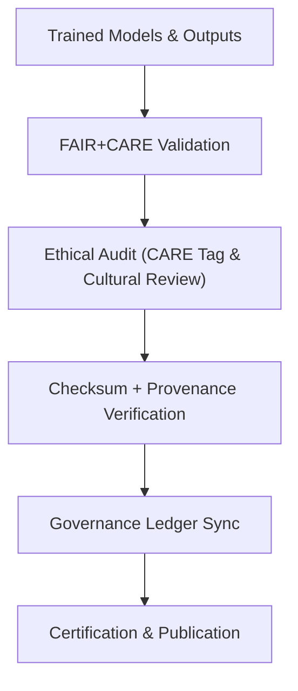

<div align="center">

# ⚖️ **Kansas Frontier Matrix — Archaeology Predictive Zones · Governance Artifacts**  
`src/ai/models/archaeology/predictive-zones/artifacts/governance/README.md`

**Purpose:**  
Record and describe all **FAIR+CARE governance, audit, and provenance artifacts** produced during the **Archaeology Predictive Zones AI lifecycle**.  
This documentation ensures **ethical accountability, transparency, and sustainability** across every model and dataset released under **MCP-DL v6.3** and **FAIR+CARE Council** supervision.

[](../../../../../../../docs/)
[](../../../../../../../LICENSE)
[](../../../../../../../docs/standards/faircare.md)
[](#)

</div>

---

## 📘 Overview

The **Governance Artifacts Directory** stores validation results, ethics approvals, checksum registries, and FAIR+CARE audit documentation related to the **Predictive Zones AI system**.  
These records link **model provenance**, **telemetry metrics**, and **FAIR+CARE council decisions**, ensuring that every release remains compliant, ethical, and reproducible.

---

## 🗂️ Directory Layout

```plaintext
src/ai/models/archaeology/predictive-zones/artifacts/governance/
├── README.md                            # This file — governance artifact documentation
│
├── model_card.md                        # Official FAIR+CARE model card (see models/)
├── governance_validation.json            # Ethics & compliance validation summary
├── care_masking_report.json              # Cultural data redaction log
├── checksum_registry.json                # SHA-256 integrity metadata for artifacts
├── audit_report.json                     # Council audit report and validation decisions
└── provenance_trace.json                 # Provenance chain linking datasets, models, and outputs
```

---

## ⚙️ Governance Artifact Workflow



### Pipeline Responsibilities
1. **Validation:** FAIR+CARE and ISO 19115 compliance review.  
2. **CARE Review:** Confirms cultural and Indigenous data governance.  
3. **Checksum Registry:** Verifies file integrity and reproducibility.  
4. **Provenance Trace:** Tracks data lineage from input to artifact.  
5. **Governance Ledger:** Logs certification and ethical approvals.

---

## 🧩 Example: Governance Validation (`governance_validation.json`)

```json
{
  "governance_id": "gov_2025_11_08_005",
  "workflow": "predictive_zones_governance_v9.9.0",
  "datasets_reviewed": 6,
  "models_reviewed": 2,
  "faircare_score": 98.7,
  "care_tag": "restricted",
  "reviewed_by": "@faircare-council",
  "ethics_status": "approved",
  "energy_wh": 18.4,
  "carbon_gco2e": 9.1,
  "telemetry_ref": "../../../../../../../releases/v9.9.0/focus-telemetry.json"
}
```

---

## ⚖️ FAIR+CARE Compliance Matrix

| Principle | Implementation | Validation Source |
|------------|----------------|-------------------|
| **Findable** | Governance records indexed by unique audit IDs. | `audit_report.json` |
| **Accessible** | Stored under FAIR+CARE-approved repository controls. | Governance Ledger |
| **Interoperable** | JSON-LD and PROV-O formats compatible with ISO 19115. | `provenance_trace.json` |
| **Reusable** | Reproducible ethics audits with license metadata. | SPDX Manifest |
| **CARE – Responsibility** | Audit records retain cultural oversight chain. | `faircare-validate.yml` |
| **CARE – Ethics** | Redaction of sacred data before AI training and export. | `care_masking_report.json` |

---

## 🧮 Telemetry Metrics

| Metric | Description | Example |
|--------|-------------|----------|
| `audits_completed` | Total governance audits executed. | 3 |
| `faircare_score` | Governance compliance percentage. | 98.7 |
| `care_violations_detected` | Detected cultural data violations. | 0 |
| `ledger_sync_events` | Number of ledger entries added. | 5 |
| `energy_wh` | Power used during audit processes. | 18.4 |
| `carbon_gco2e` | Equivalent carbon emissions. | 9.1 |
| `status` | Audit result and publication state. | certified |

Telemetry logs integrated with:  
`releases/v9.9.0/focus-telemetry.json`  
Schema: `schemas/telemetry/src-ai-models-archaeology-predictivezones-artifacts-governance-v1.json`

---

## 🔐 Provenance & Ledger Integration

Each governance artifact connects to:
- **Ledger Snapshot:** `releases/v9.9.0/governance/ledger_snapshot.json`  
- **Telemetry Ledger:** `releases/v9.9.0/focus-telemetry.json`  
- **SBOM:** `releases/v9.9.0/sbom.spdx.json`  

### Example Provenance Trace
```json
{
  "artifact_id": "predictive_zones_ai_v9.9.0",
  "linked_inputs": [
    "data/raw/lidar_dem_1m_kansas.tif",
    "data/processed/feature_stack.parquet"
  ],
  "linked_outputs": [
    "artifacts/models/predictive_zones_ai_v9.9.0.onnx",
    "artifacts/outputs/predictive_zones_probability.tif"
  ],
  "auditor": "@kfm-governance",
  "status": "approved",
  "timestamp": "2025-11-08T18:55:00Z"
}
```

---

## 🧾 Citation

```text
Kansas Frontier Matrix (2025). Archaeology Predictive Zones · Governance Artifacts (v9.9.0).
FAIR+CARE and ISO-compliant governance documentation ensuring transparent, ethical, and sustainable AI management for archaeological predictive modeling within the Kansas Frontier Matrix.
```

---

## 🕰️ Version History

| Version | Date | Author | Summary |
|---------:|------|--------|----------|
| v9.9.0 | 2025-11-08 | `@kfm-governance` | Created governance artifact documentation; linked provenance, checksum, and ethics audit logs to FAIR+CARE and telemetry records. |

---

<div align="center">

**Kansas Frontier Matrix**  
*Governed AI × FAIR+CARE Ethics × Sustainable Data Provenance*  
© 2025 Kansas Frontier Matrix · CC-BY 4.0 · Master Coder Protocol v6.3 · FAIR+CARE Certified · Diamond⁹ Ω / Crown∞Ω Ultimate Certified  

[Back to Artifacts Index](../README.md) · [Governance Charter](../../../../../../../docs/standards/governance/ROOT-GOVERNANCE.md)

</div>

