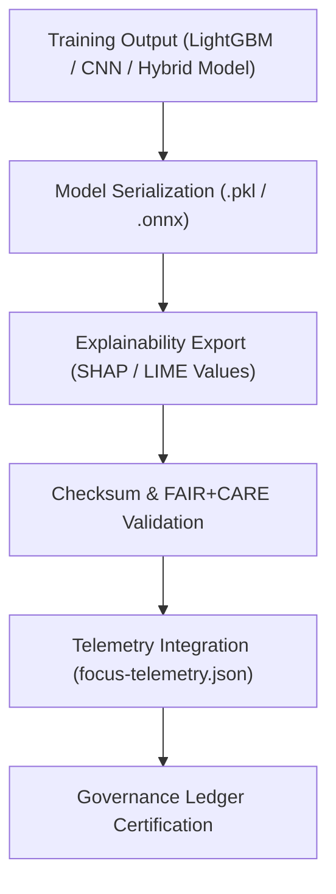

<div align="center">

# 🧩 **Kansas Frontier Matrix — Archaeology Predictive Zones · Trained Models**  
`src/ai/models/archaeology/predictive-zones/artifacts/models/README.md`

**Purpose:**  
Describe and document all **trained models, checkpoints, and registries** produced by the **Archaeology Predictive Zones AI system** within the Kansas Frontier Matrix (KFM).  
This directory captures **FAIR+CARE-governed model exports**, explainability layers, and governance validation records aligned with **MCP-DL v6.3** and **ISO 50001** sustainability standards.

[](../../../../../../../docs/)
[](../../../../../../../LICENSE)
[](../../../../../../../docs/standards/faircare.md)
[](#)

</div>

---

## 📘 Overview

The **Trained Models Directory** stores serialized model files and manifests that represent the final outputs of the **Predictive Zones AI training pipeline**.  
Each model undergoes **checksum verification**, **FAIR+CARE ethics review**, and **telemetry logging**, ensuring reproducibility, energy transparency, and explainability.

All models here are validated by:
- `faircare-validate.yml` — Ethics and compliance checks  
- `telemetry-export.yml` — Sustainability metrics integration  
- `stac-validate.yml` — Metadata and contract validation  

---

## 🗂️ Directory Layout

```plaintext
src/ai/models/archaeology/predictive-zones/artifacts/models/
├── README.md                          # This file — trained models documentation
│
├── predictive_zones_ai_v9.9.0.pkl     # Trained model (binary serialized)
├── predictive_zones_ai_v9.9.0.onnx    # ONNX export for cross-platform deployment
├── model_manifest.json                # Model metadata, accuracy, bias, and energy metrics
├── shap_explainer_values.npy          # SHAP feature importance values
├── model_card.md                      # Governance model card and ethical review
└── checksum.json                      # SHA-256 verification metadata
```

---

## ⚙️ Model Lifecycle



### Lifecycle Steps
1. **Serialization:** Models stored as `.pkl` (CPU) and `.onnx` (deployment).  
2. **Explainability:** SHAP and LIME analysis exported for governance review.  
3. **Checksum Verification:** Ensures cryptographic integrity.  
4. **Telemetry Integration:** Adds energy, runtime, and sustainability metrics.  
5. **Governance Certification:** FAIR+CARE Council approval recorded.  

---

## 🧩 Example: Model Manifest (`model_manifest.json`)

```json
{
  "model_id": "predictive_zones_ai_v9.9.0",
  "framework": "LightGBM",
  "version": "v9.9.0",
  "accuracy": 0.942,
  "f1_score": 0.912,
  "bias_score": 0.05,
  "drift_flag": false,
  "explainability_stability": 0.91,
  "energy_wh": 1423.5,
  "carbon_gco2e": 610.3,
  "checksum_sha256": "sha256:6a81d21b45d2a4a17b739ed5f4e7a9214fd39e52...",
  "reviewed_by": "@faircare-council",
  "approved": true,
  "telemetry_ref": "../../../../../../../releases/v9.9.0/focus-telemetry.json",
  "governance_ref": "../../../../../../../docs/standards/faircare.md"
}
```

---

## ⚖️ FAIR+CARE & MCP Governance Integration

| Principle | Implementation | Verified By |
|------------|----------------|--------------|
| **Findable** | Unique model IDs and STAC/DCAT entries with UUID linkage. | `stac-validate.yml` |
| **Accessible** | Public model cards; restricted weights for heritage data. | Governance Ledger |
| **Interoperable** | ONNX and Pickle exports support multiple environments. | MCP-DL |
| **Reusable** | SBOM, checksum, and license records in manifest. | SPDX Validator |
| **CARE – Responsibility** | AI bias, drift, and energy tracked in telemetry. | `telemetry-export.yml` |
| **CARE – Ethics** | Governance approval mandatory before deployment. | FAIR+CARE Council |

---

## 🧮 Telemetry Metrics (Per Model)

| Metric | Description | Example |
|--------|-------------|----------|
| `training_time_min` | Model training duration. | 318.4 |
| `energy_wh` | Energy consumed during training. | 1423.5 |
| `carbon_gco2e` | CO₂ equivalent emissions. | 610.3 |
| `bias_score` | Average model bias index. | 0.05 |
| `drift_flag` | Model drift indicator. | false |
| `faircare_score` | Compliance with FAIR+CARE ethics. | 98.7 |
| `explainability_stability` | Stability of SHAP/LIME importance rankings. | 0.91 |

All metrics appended to:  
`releases/v9.9.0/focus-telemetry.json`  
Schema: `schemas/telemetry/src-ai-models-archaeology-predictivezones-artifacts-models-v1.json`

---

## 🔐 Provenance & Security

- **Checksum Verification:** Every model export verified with SHA-256 and SPDX entry.  
- **Governance Ledger:** Approval and ethics certifications recorded in ledger snapshot.  
- **SLSA Provenance:** Models digitally signed to ensure authenticity.  
- **Access Control:** Restricted CARE-tagged models available only under governance review.  

### Example Checksum (`checksum.json`)
```json
{
  "file": "predictive_zones_ai_v9.9.0.pkl",
  "checksum_sha256": "sha256:6a81d21b45d2a4a17b739ed5f4e7a9214fd39e52...",
  "verified": true,
  "reviewed_by": "@kfm-data",
  "timestamp": "2025-11-08T18:30:00Z"
}
```

---

## 🧾 Citation

```text
Kansas Frontier Matrix (2025). Archaeology Predictive Zones · Trained Models (v9.9.0).
FAIR+CARE-certified AI model artifacts ensuring ethical, reproducible, and sustainable archaeological predictive intelligence within the Kansas Frontier Matrix system.
```

---

## 🕰️ Version History

| Version | Date | Author | Summary |
|---------:|------|--------|----------|
| v9.9.0 | 2025-11-08 | `@kfm-ai` | Added documentation for trained models; integrated FAIR+CARE ethics, checksum registry, and telemetry linkage. |

---

<div align="center">

**Kansas Frontier Matrix**  
*Responsible AI × FAIR+CARE Certification × Sustainable Knowledge Engineering*  
© 2025 Kansas Frontier Matrix · MIT · Master Coder Protocol v6.3 · FAIR+CARE Certified · Diamond⁹ Ω / Crown∞Ω Ultimate Certified  

[Back to Artifacts Index](../README.md) · [Governance Charter](../../../../../../../docs/standards/governance/ROOT-GOVERNANCE.md)

</div>

