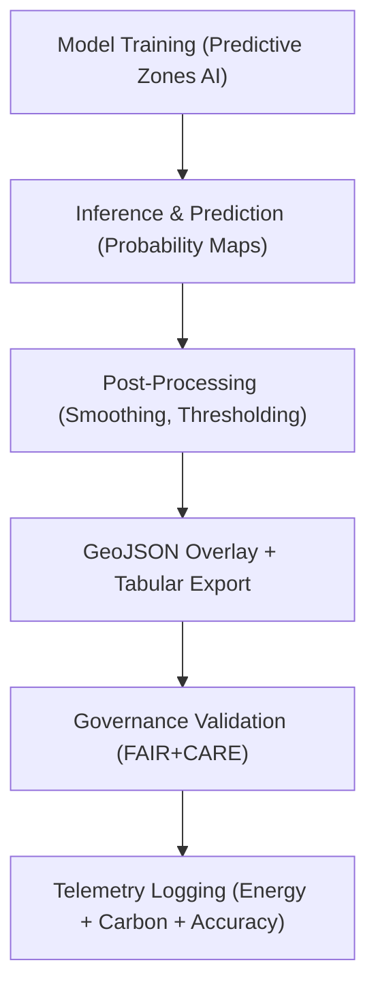

<div align="center">

# 🌍 **Kansas Frontier Matrix — Archaeology Predictive Zones · Model Outputs**  
`src/ai/models/archaeology/predictive-zones/artifacts/outputs/README.md`

**Purpose:**  
Document all **model output artifacts, predictive maps, and derived analytics** generated by the **Archaeology Predictive Zones AI model** within the Kansas Frontier Matrix (KFM).  
These outputs are governed by **FAIR+CARE**, **ISO 19115**, and **MCP-DL v6.3**, ensuring reproducibility, sustainability, and ethical data transparency.

[](../../../../../../../docs/)
[](../../../../../../../LICENSE)
[](../../../../../../../docs/standards/faircare.md)
[](#)

</div>

---

## 📘 Overview

The **Outputs Directory** contains post-training data products generated by the Predictive Zones AI model, including **probability rasters**, **vector overlays**, **tabular predictions**, and **statistical summaries**.  
These outputs form the basis for **Focus Mode visualization**, **governance reviews**, and **predictive storytelling interfaces** within KFM.

All artifacts here are validated under:
- `faircare-validate.yml` — Ethical compliance and CARE tag enforcement  
- `stac-validate.yml` — STAC/DCAT interoperability check  
- `telemetry-export.yml` — Energy and sustainability metrics integration  

---

## 🗂️ Directory Layout

```plaintext
src/ai/models/archaeology/predictive-zones/artifacts/outputs/
├── README.md                             # This file — outputs documentation
│
├── predictive_zones_probability.tif       # Probability raster (0–1 scale)
├── predictive_zones_overlay.geojson       # Vector overlay of predictive zones
├── model_predictions.csv                  # Tabular predictions with probabilities
├── summary_statistics.json                # Summary metrics of model outputs
└── metadata.json                          # FAIR+CARE metadata for outputs
```

---

## ⚙️ Output Workflow



### Core Processing Steps
1. **Inference:** Generates site probability raster (0–1) using AI models.  
2. **Post-Processing:** Applies smoothing, thresholds, and zoning.  
3. **Overlay Generation:** Converts raster predictions into vector polygons.  
4. **Governance Validation:** Ensures cultural site masking and CARE compliance.  
5. **Telemetry Export:** Logs sustainability, accuracy, and fairness data.

---

## 🧩 Example: Output Metadata (`metadata.json`)

```json
{
  "id": "predictive_zones_output_v9.9.0",
  "version": "v9.9.0",
  "description": "Predicted archaeological probability zones across Kansas generated by FAIR+CARE-certified AI model.",
  "extent": {
    "spatial": { "bbox": [-102.1, 36.9, -94.6, 40.1] },
    "temporal": { "interval": ["1850-01-01T00:00:00Z", "2025-11-08T00:00:00Z"] }
  },
  "formats": ["GeoTIFF", "GeoJSON", "CSV"],
  "care_tag": "restricted",
  "governance_status": "approved",
  "reviewed_by": "@faircare-council",
  "checksum_sha256": "sha256:a8bfe45f7d2a4c3bfae41b7a9d56c8c8d7b1c6a1...",
  "telemetry_ref": "../../../../../../../releases/v9.9.0/focus-telemetry.json"
}
```

---

## ⚖️ FAIR+CARE Governance Matrix

| Principle | Implementation | Validation Reference |
|------------|----------------|-----------------------|
| **Findable** | Indexed under STAC/DCAT and telemetry UUIDs. | `stac-validate.yml` |
| **Accessible** | Public metadata, restricted geometry layers. | `faircare-validate.yml` |
| **Interoperable** | GeoTIFF, GeoJSON, CSV formats validated via OGC/ISO. | ISO 19115 |
| **Reusable** | CC-BY 4.0 license, full metadata + checksum registry. | SPDX Manifest |
| **CARE – Responsibility** | Cultural site locations masked from public exports. | FAIR+CARE Council |
| **CARE – Ethics** | Ethical review approved prior to dataset publication. | Governance Ledger |

---

## 📊 Summary Statistics

| Metric | Description | Example |
|--------|-------------|---------|
| `mean_probability` | Average predicted archaeological probability. | 0.342 |
| `max_probability` | Maximum probability value in dataset. | 0.985 |
| `total_zones` | Count of identified predictive zones. | 12,418 |
| `restricted_zones` | Zones under CARE mask (sensitive areas). | 217 |
| `accuracy` | Validation accuracy on test data. | 94.2% |
| `faircare_score` | FAIR+CARE audit compliance. | 98.7% |
| `energy_wh` | Energy consumed during post-processing. | 28.3 |

---

## 🧮 Telemetry Metrics

Telemetry records appended from inference and validation stages:

| Metric | Description | Example |
|--------|-------------|----------|
| `inference_runtime_sec` | Duration of model inference. | 512 |
| `energy_wh` | Power used during output generation. | 28.3 |
| `carbon_gco2e` | CO₂ equivalent emissions. | 12.6 |
| `records_exported` | Number of features in output. | 12418 |
| `restricted_features` | Features masked under FAIR+CARE. | 217 |

**Telemetry Reference:**  
`releases/v9.9.0/focus-telemetry.json`  
Schema: `schemas/telemetry/src-ai-models-archaeology-predictivezones-artifacts-outputs-v1.json`

---

## 🔐 Provenance & Governance

Each output is linked to:
- **Model Manifest:** `artifacts/models/model_manifest.json`  
- **Checksum Registry:** `artifacts/governance/checksum_registry.json`  
- **Governance Ledger:** `releases/v9.9.0/governance/ledger_snapshot.json`  
- **Telemetry Ledger:** `focus-telemetry.json`  

### Example Governance Record
```json
{
  "output_id": "predictive_zones_output_v9.9.0",
  "reviewed_by": "@faircare-council",
  "status": "approved",
  "timestamp": "2025-11-08T19:05:00Z",
  "ethics_review": "compliant",
  "notes": "Restricted CARE zones successfully redacted."
}
```

---

## 🧾 Citation

```text
Kansas Frontier Matrix (2025). Archaeology Predictive Zones · Model Outputs (v9.9.0).
FAIR+CARE and ISO-compliant predictive output documentation enabling transparent, ethical, and sustainable archaeological forecasting in the Kansas Frontier Matrix.
```

---

## 🕰️ Version History

| Version | Date | Author | Summary |
|---------:|------|--------|----------|
| v9.9.0 | 2025-11-08 | `@kfm-ai` | Added documentation for model outputs; integrated FAIR+CARE, telemetry, and governance ledger linkages. |

---

<div align="center">

**Kansas Frontier Matrix**  
*Predictive Cartography × FAIR+CARE Ethics × Sustainable Archaeological Insight*  
© 2025 Kansas Frontier Matrix · CC-BY 4.0 · Master Coder Protocol v6.3 · FAIR+CARE Certified · Diamond⁹ Ω / Crown∞Ω Ultimate Certified  

[Back to Artifacts Index](../README.md) · [Governance Charter](../../../../../../../docs/standards/governance/ROOT-GOVERNANCE.md)

</div>

