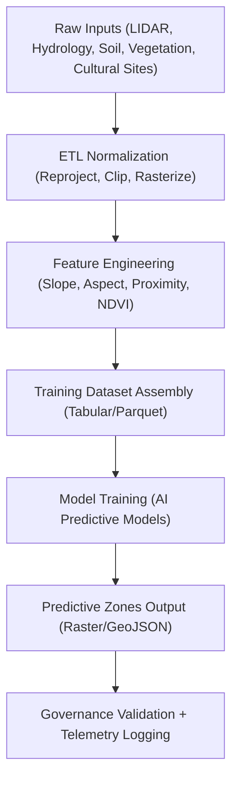

<div align="center">

# 📡 **Kansas Frontier Matrix — Archaeology Predictive Zones Data**
`src/ai/models/archaeology/predictive-zones/data/README.md`

**Purpose:**  
Document the **predictive zone datasets, preprocessing workflows, and FAIR+CARE governance metadata** used for training and validating the Archaeology AI model suite in the Kansas Frontier Matrix (KFM).  
These data identify **spatially probable zones** of cultural or archaeological significance using **environmental indicators**, **historical settlement data**, and **AI-driven spatial reasoning**.

[](../../../../../docs/)
[](../../../../../LICENSE)
[](../../../../../docs/standards/faircare.md)
[](#)

</div>

---

## 📘 Overview

**Predictive Zones Data** represent the combination of environmental and cultural variables used by KFM’s **Archaeomap v1** and **Temporal Site Predictor** models to forecast potential archaeological sites and landscape transformation patterns.

### Core Goals
- Integrate **multisource spatial data** (LIDAR, hydrology, vegetation, soil, proximity).  
- Create **zone-based probability rasters** predicting archaeological site likelihood.  
- Maintain ethical and cultural oversight for sensitive or Indigenous-related areas.  
- Enforce **FAIR+CARE + ISO 19115** metadata and provenance tracking.  
- Provide reproducible ETL → AI-ready feature datasets for internal modeling pipelines.

---

## 🗂️ Directory Layout

```plaintext
src/ai/models/archaeology/predictive-zones/data/
├── README.md                          # This file — predictive zone data documentation
│
├── raw/                               # Raw source layers (restricted access)
│   ├── lidar_dem_1m_kansas.tif
│   ├── soil_moisture_index_2025.tif
│   ├── hydrology_vector.geojson
│   ├── vegetation_density_2024.tif
│   └── cultural_sites_inventory.geojson
│
├── processed/                         # Harmonized feature datasets
│   ├── feature_stack.parquet          # Tabular ML-ready dataset
│   ├── predictive_zones_raster.tif    # Probability raster (0–1 scale)
│   ├── predictive_zones.geojson       # GeoJSON polygons for visualization
│   ├── zonal_stats.csv                # Summary metrics per region
│   └── metadata.json
│
├── staging/                           # Intermediate ETL steps for reproducibility
│   ├── etl_log.json
│   ├── feature_importance.json
│   └── provenance_trace.json
│
└── validation/                        # FAIR+CARE + ISO 19115 compliance reports
    ├── schema_validation.json
    ├── care_ethics_review.json
    └── checksum_registry.json
```

---

## ⚙️ Data Processing Workflow



---

## 🧩 Feature Dictionary

| Feature | Description | Data Type | Source |
|----------|--------------|------------|--------|
| `elevation` | Ground elevation (meters). | Float | USGS DEM |
| `slope` | Slope angle (degrees). | Float | Derived from DEM |
| `aspect` | Directional exposure. | Float | Derived from DEM |
| `soil_moisture` | Relative soil moisture content. | Float | USDA SMAP |
| `ndvi` | Vegetation greenness index. | Float | MODIS / Sentinel-2 |
| `distance_to_water` | Distance to nearest stream or lake. | Float | DASC Hydrology |
| `distance_to_settlement` | Nearest historical or modern settlement. | Float | KHS Archives |
| `artifact_density` | Known artifact count within grid cell. | Integer | KFM Archive |
| `care_tag` | Ethical classification (public/restricted/sensitive). | String | FAIR+CARE Council |

---

## ⚖️ FAIR+CARE Governance

| Principle | Implementation | Validation |
|------------|----------------|-------------|
| **Findable** | Indexed in STAC/DCAT; dataset ID registered in `metadata.json`. | `stac-validate.yml` |
| **Accessible** | Metadata public; raw layers restricted by CARE tag. | FAIR+CARE Council |
| **Interoperable** | GeoTIFF, Parquet, and GeoJSON formats. | ISO 19115 / CF conventions |
| **Reusable** | Open under CC-BY; provenance fully logged. | `provenance_trace.json` |
| **CARE – Responsibility** | Governance review for culturally sensitive content. | `care_ethics_review.json` |
| **CARE – Ethics** | Indigenous and heritage sites masked or generalized. | FAIR+CARE Audit |

---

## 🧮 Validation & Provenance

### Example `metadata.json`
```json
{
  "id": "predictive_zones_dataset_2025",
  "version": "v9.9.0",
  "license": "CC-BY-4.0",
  "records": 185420,
  "created": "2025-11-08T14:55:00Z",
  "checksum_sha256": "sha256:a7b43f9c...",
  "governance": {
    "care_tag": "restricted",
    "reviewed_by": "@faircare-council",
    "ethics_status": "approved"
  },
  "provenance": {
    "sources": [
      "USGS LIDAR DEM 1m",
      "USDA SMAP Soil Moisture",
      "KHS Cultural Inventory"
    ],
    "etl_script": "src/pipelines/etl/archaeo_zones.py"
  }
}
```

### Provenance Trace (`staging/provenance_trace.json`)
Documents every transformation, schema, and checksum — ensuring **MCP-DL reproducibility** and **FAIR+CARE audit readiness**.

---

## 📊 Telemetry Metrics

Telemetry metrics are automatically appended to the unified log:

| Metric | Description | Example |
|--------|--------------|---------|
| `datasets_processed` | Number of input layers normalized. | 8 |
| `records_output` | Row count in feature stack. | 185,420 |
| `energy_wh` | Energy consumed during processing. | 48.2 |
| `carbon_gco2e` | Carbon emission equivalent. | 21.3 |
| `review_outcome` | FAIR+CARE governance result. | `approved` |

All telemetry recorded in:  
`../../../../../releases/v9.9.0/focus-telemetry.json` (schema: `src-ai-models-archaeology-predictivezones-v1.json`).

---

## 🧾 Citation

```text
Kansas Frontier Matrix (2025). Archaeology Predictive Zones Data (v9.9.0).
Defines FAIR+CARE-governed, ISO 19115-aligned predictive zone datasets for archaeological site probability modeling, ensuring ethical transparency and sustainability.
```

---

## 🕰️ Version History

| Version | Date | Author | Summary |
|---------:|------|--------|----------|
| v9.9.0 | 2025-11-08 | `@kfm-ai` | Created predictive zones data documentation; added FAIR+CARE metadata schema, telemetry integration, and provenance trace. |

---

<div align="center">

**Kansas Frontier Matrix**  
*Archaeological Insight × FAIR+CARE Ethics × Sustainable AI Data Pipelines*  
© 2025 Kansas Frontier Matrix · CC-BY 4.0 · Master Coder Protocol v6.3 · FAIR+CARE Certified · Diamond⁹ Ω / Crown∞Ω Ultimate Certified  

[Back to Archaeology AI Suite](../README.md) · [Governance Charter](../../../../../docs/standards/governance/ROOT-GOVERNANCE.md)

</div>

