<div align="center">

# 🧮 **Kansas Frontier Matrix — Processed Data for Archaeology Predictive Zones**  
`src/ai/models/archaeology/predictive-zones/data/processed/README.md`

**Purpose:**  
Document the **cleaned, validated, and AI-ready datasets** used in the **Archaeology Predictive Zones** model suite within the Kansas Frontier Matrix (KFM).  
This directory contains **harmonized, contract-compliant, and FAIR+CARE-governed datasets** derived from raw environmental and cultural inputs, optimized for predictive modeling and explainable AI workflows.

[](../../../../../../docs/)
[](../../../../../../LICENSE)
[](../../../../../../docs/standards/faircare.md)
[](#)

</div>

---

## 📘 Overview

The **processed dataset collection** provides **AI-optimized training and validation data** for archaeological site probability modeling and historical landscape analysis.  
It merges multiple spatial, temporal, and cultural features into standardized formats ensuring **FAIR+CARE governance**, **ISO 19115 compliance**, and **MCP-DL v6.3 reproducibility**.

### Objectives
- Standardize environmental and cultural variables into machine-readable formats.  
- Produce **GeoJSON**, **GeoTIFF**, and **Parquet** feature stacks for AI pipelines.  
- Ensure all outputs include **checksum**, **license**, and **care_tag** metadata.  
- Record energy and provenance metrics for **sustainability telemetry**.

---

## 🗂️ Directory Layout

```plaintext
src/ai/models/archaeology/predictive-zones/data/processed/
├── README.md                          # This file — processed data documentation
│
├── predictive_zones_raster.tif        # Raster layer of site probability (0–1 range)
├── predictive_zones.geojson           # Vectorized polygons for visualization
├── feature_stack.parquet              # ML-ready tabular dataset (normalized features)
├── zonal_stats.csv                    # Statistical summaries per region
├── metadata.json                      # Metadata record for dataset lineage
├── provenance_trace.json              # Provenance and transformation lineage
└── checksums/
    ├── raster_checksum.json
    ├── parquet_checksum.json
    └── geojson_checksum.json
```

---

## ⚙️ Data Processing Pipeline

```mermaid
flowchart TD
  A["Raw Data (DEM, Hydrology, Vegetation, Sites)"] --> B["ETL & Normalization"]
  B --> C["Feature Engineering (Slope, NDVI, Proximity)"]
  C --> D["ML Feature Stack (Parquet)"]
  D --> E["Model Predictions (Raster 0–1)"]
  E --> F["Post-Processing (Thresholding, Smoothing)"]
  F --> G["Vectorization (GeoJSON Polygons)"]
  G --> H["Governance Validation + Telemetry Export"]
```



**ETL Scripts:**  
- `src/pipelines/etl/archaeo_zones_normalize.py`  
- `src/pipelines/ai/predictive_zones_inference.py`  
- `src/pipelines/validation/faircare_audit.py`

---

## 🧩 Metadata Summary (`metadata.json`)

```json
{
  "id": "processed_predictive_zones_v9.9.0",
  "title": "Archaeology Predictive Zones (Processed Data)",
  "version": "v9.9.0",
  "description": "Processed and harmonized spatial layers for AI-based archaeological site prediction.",
  "record_count": 185420,
  "extent": {
    "spatial": { "bbox": [-102.1, 36.9, -94.6, 40.1] },
    "temporal": { "interval": ["1850-01-01T00:00:00Z", "2025-11-08T00:00:00Z"] }
  },
  "format": ["GeoTIFF", "GeoJSON", "Parquet"],
  "license": "CC-BY-4.0",
  "checksum_sha256": "sha256:d1fa4e85c3c2b8d1a3b7a4e6...",
  "governance": {
    "care_tag": "restricted",
    "reviewed_by": "@faircare-council",
    "status": "approved"
  },
  "telemetry_ref": "../../../../../../releases/v9.9.0/focus-telemetry.json"
}
```

---

## ⚖️ FAIR+CARE Compliance

| Principle | Implementation | Audit Reference |
|------------|----------------|-----------------|
| **Findable** | Persistent ID in `metadata.json`; discoverable via STAC/DCAT. | `stac-validate.yml` |
| **Accessible** | Published internally under governance controls. | Governance Ledger |
| **Interoperable** | GeoTIFF / Parquet / GeoJSON; CRS = EPSG:4326. | ISO 19115 validation |
| **Reusable** | Open license; complete lineage + checksum registry. | SPDX SBOM |
| **CARE – Responsibility** | Sites of cultural sensitivity marked “restricted.” | FAIR+CARE audit |
| **CARE – Ethics** | Generalized coordinates for protected heritage zones. | Governance Ledger |

---

## 🧮 Validation Outputs

| File | Description | Validator |
|------|--------------|------------|
| `schema_validation.json` | Structural validation per data-contract. | `faircare-validate.yml` |
| `checksum_registry.json` | Hash validation for all assets. | `stac-validate.yml` |
| `care_ethics_review.json` | Council certification and redaction approval. | `faircare-validate.yml` |

Validation results archived in:
```
src/ai/models/archaeology/predictive-zones/data/validation/
```

---

## 📊 Telemetry Integration

Telemetry metrics are appended to the unified ledger `focus-telemetry.json`.

| Metric | Description | Example |
|--------|--------------|---------|
| `records_processed` | Rows in Parquet feature stack. | 185,420 |
| `energy_wh` | Energy used for ETL + processing. | 48.2 |
| `carbon_gco2e` | CO₂ equivalent for job. | 21.3 |
| `care_tagged_features` | Count of restricted zones. | 12 |
| `validation_status` | FAIR+CARE & schema result. | `passed` |

**Telemetry schema:** `schemas/telemetry/src-ai-models-archaeology-predictivezones-processed-v1.json`

---

## ♻️ Sustainability & Ethics Summary

- Energy monitored under **ISO 50001**.  
- Data transformations logged under **PROV-O** provenance ontology.  
- AI processing limited to **public/restricted** layers; sensitive geometry masked.  
- All datasets reviewed quarterly by **FAIR+CARE Council**.  

---

## 🧾 Citation

```text
Kansas Frontier Matrix (2025). Processed Data for Archaeology Predictive Zones (v9.9.0).
FAIR+CARE and ISO 19115 compliant processed datasets enabling predictive modeling, sustainability tracking, and transparent provenance for archaeology in Kansas Frontier Matrix.
```

---

## 🕰️ Version History

| Version | Date | Author | Summary |
|---------:|------|--------|----------|
| v9.9.0 | 2025-11-08 | `@kfm-ai` | Added documentation for processed archaeology predictive zone data, including FAIR+CARE and telemetry references. |

---

<div align="center">

**Kansas Frontier Matrix**  
*Predictive Heritage Modeling × FAIR+CARE Governance × Sustainable AI Pipelines*  
© 2025 Kansas Frontier Matrix · CC-BY 4.0 · Master Coder Protocol v6.3 · FAIR+CARE Certified · Diamond⁹ Ω / Crown∞Ω Ultimate Certified  

[Back to Predictive Zones Data](../README.md) · [Governance Charter](../../../../../../docs/standards/governance/ROOT-GOVERNANCE.md)

</div>

