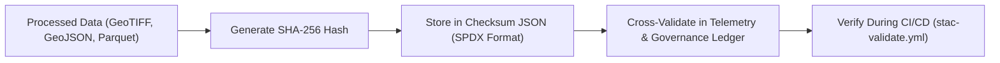

<div align="center">

# 🔐 **Kansas Frontier Matrix — Checksum Registry for Archaeology Predictive Zones**  
`src/ai/models/archaeology/predictive-zones/data/processed/checksums/README.md`

**Purpose:**  
Provide cryptographic **integrity verification**, **provenance validation**, and **FAIR+CARE compliance metadata** for all processed files within the **Archaeology Predictive Zones** dataset.  
This checksum registry ensures **traceability, reproducibility, and ethical accountability** under **MCP-DL v6.3**, **ISO 19115**, and **SPDX 2.3**.

[](../../../../../../../docs/)
[](../../../../../../../LICENSE)
[](../../../../../../../docs/standards/faircare.md)
[](#)

</div>

---

## 📘 Overview

This directory contains **checksum verification reports** for all processed datasets derived from the archaeology predictive zone pipeline.  
Each checksum record guarantees that:
- Files have not been altered since FAIR+CARE validation.  
- Provenance and data contracts are cryptographically secured.  
- Validation and telemetry are consistent with **focus-telemetry.json**.  
- All layers meet **ISO 19115 integrity and sustainability audit requirements**.

---

## 🗂️ Directory Layout

```plaintext
src/ai/models/archaeology/predictive-zones/data/processed/checksums/
├── README.md                       # This file — checksum documentation
├── raster_checksum.json             # Hash & metadata for predictive_zones_raster.tif
├── parquet_checksum.json            # Hash & metadata for feature_stack.parquet
└── geojson_checksum.json            # Hash & metadata for predictive_zones.geojson
```

---

## ⚙️ Checksum Schema

Each checksum file follows the **SPDX 2.3** and **ISO 19115-1 Annex E** format for integrity metadata.

### Example — `raster_checksum.json`
```json
{
  "id": "predictive_zones_raster",
  "file_name": "predictive_zones_raster.tif",
  "format": "GeoTIFF",
  "size_bytes": 812394528,
  "checksum_sha256": "sha256:b83c1cfe2b11f4d9a6e320d3a4c79de73a911a47...",
  "checksum_date": "2025-11-08T15:22:00Z",
  "license": "CC-BY-4.0",
  "governance": {
    "care_tag": "restricted",
    "validated_by": "@kfm-data",
    "ethics_review": "approved"
  },
  "provenance_ref": "../provenance_trace.json",
  "telemetry_ref": "../../../../../../../releases/v9.9.0/focus-telemetry.json"
}
```

---

## 🧩 Integrity Verification Process



### Verification Steps:
1. **Hashing:** SHA-256 computed post-validation.  
2. **Audit Linkage:** Each checksum JSON references provenance and telemetry.  
3. **Revalidation:** CI workflow (`stac-validate.yml`) re-checks hashes pre-release.  
4. **Governance Ledger:** Approved checksum records appended to immutable ledger.  

---

## ⚖️ FAIR+CARE & ISO Compliance Matrix

| Principle | Implementation | Verification |
|------------|----------------|---------------|
| **Findable** | Indexed in STAC/DCAT under dataset manifest. | `manifest_ref` |
| **Accessible** | Open checksum JSON, public license, and SBOM reference. | SPDX metadata |
| **Interoperable** | SPDX 2.3 + ISO 19115 hash conventions. | CI validation |
| **Reusable** | Machine-readable format, reusable schema. | MCP-DL compliance |
| **CARE – Responsibility** | Hash validation ensures data consistency and ethical redaction tracking. | `faircare-validate.yml` |
| **CARE – Ethics** | Prevents reuse of datasets marked “restricted” without Council approval. | Governance ledger |

---

## 🧮 Telemetry Metrics

Checksum validation results contribute to sustainability and reproducibility telemetry.

| Metric | Description | Example |
|--------|--------------|---------|
| `files_validated` | Number of processed datasets verified. | 3 |
| `checksum_failures` | Invalid or mismatched hashes detected. | 0 |
| `energy_wh` | Energy consumed during validation. | 11.3 |
| `carbon_gco2e` | Carbon footprint equivalent. | 5.4 |
| `validation_status` | Outcome of checksum validation. | `passed` |

All values recorded in `releases/v9.9.0/focus-telemetry.json`.

---

## 🧾 Citation

```text
Kansas Frontier Matrix (2025). Checksum Registry for Archaeology Predictive Zones (v9.9.0).
Defines FAIR+CARE-compliant integrity and provenance verification schema for archaeology predictive zone datasets in the Kansas Frontier Matrix.
```

---

## 🕰️ Version History

| Version | Date | Author | Summary |
|---------:|------|--------|----------|
| v9.9.0 | 2025-11-08 | `@kfm-data` | Created checksum registry documentation; added SPDX/ISO format, governance integration, and telemetry linkage. |

---

<div align="center">

**Kansas Frontier Matrix**  
*Integrity Verification × FAIR+CARE Governance × Provenance Assurance*  
© 2025 Kansas Frontier Matrix · CC-BY 4.0 · Master Coder Protocol v6.3 · FAIR+CARE Certified · Diamond⁹ Ω / Crown∞Ω Ultimate Certified  

[Back to Processed Data](../README.md) · [Governance Charter](../../../../../../../docs/standards/governance/ROOT-GOVERNANCE.md)

</div>

