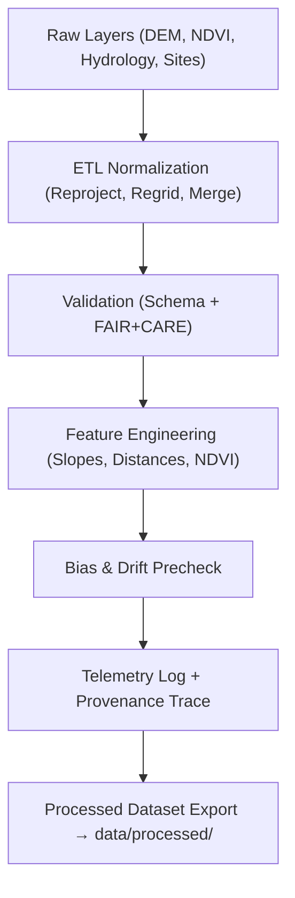

<div align="center">

# ⚙️ **Kansas Frontier Matrix — Staging Data for Archaeology Predictive Zones**  
`src/ai/models/archaeology/predictive-zones/data/staging/README.md`

**Purpose:**  
Provide detailed documentation of the **staging-level datasets, intermediate outputs, and validation logs** used in the Archaeology Predictive Zones AI model workflows within the Kansas Frontier Matrix (KFM).  
This directory supports **reproducible ETL**, **FAIR+CARE audits**, and **ISO 19115 provenance validation** under the **Master Coder Protocol v6.3**.

[](../../../../../../../docs/)
[](../../../../../../../LICENSE)
[](../../../../../../../docs/standards/faircare.md)
[](#)

</div>

---

## 📘 Overview

The **staging workspace** serves as an **intermediate processing layer** between raw input and final processed datasets.  
It is a controlled, FAIR+CARE-certified area for **schema validation, ethical compliance checks, provenance recording**, and **drift/bias pre-analysis** prior to model training.

### Key Goals
- Normalize heterogeneous geospatial and tabular data before feature stacking.  
- Validate metadata consistency and checksum integrity.  
- Generate **governance and telemetry logs** for auditing and sustainability tracking.  
- Store intermediate data transformations for reproducibility.

---

## 🗂️ Directory Layout

```plaintext
src/ai/models/archaeology/predictive-zones/data/staging/
├── README.md                            # This file — staging data documentation
│
├── etl_log.json                         # Process execution log for ETL normalization
├── feature_importance.json              # Preliminary AI feature relevance report
├── provenance_trace.json                # Lineage and transformation history
├── faircare_validation.json             # FAIR+CARE validation results
├── schema_conformance.json              # Data contract schema compliance report
├── drift_precheck.json                  # Bias and data drift analysis summary
└── energy_metrics.json                  # ISO 50001 sustainability telemetry
```

---

## ⚙️ Staging Workflow



### Pipeline Scripts
- `src/pipelines/etl/archaeo_staging_etl.py`  
- `src/pipelines/validation/schema_validator.py`  
- `src/pipelines/validation/faircare_audit.py`  
- `src/pipelines/telemetry/export_telemetry.py`

---

## 🧩 Example: `etl_log.json`

```json
{
  "etl_run_id": "etl_2025_11_08_001",
  "datasets_ingested": ["lidar_dem_1m_kansas.tif", "soil_moisture_index_2025.tif"],
  "process_steps": [
    "Reprojection EPSG:5070",
    "Resample to 10m grid",
    "Clipping to state boundary"
  ],
  "duration_sec": 528,
  "energy_wh": 18.2,
  "carbon_gco2e": 8.5,
  "checksum_validated": true,
  "governance_ref": "../../../../../../../docs/standards/faircare.md"
}
```

---

## ⚖️ FAIR+CARE Governance Matrix

| Principle | Implementation | Verified By |
|------------|----------------|--------------|
| **Findable** | Metadata stored in `provenance_trace.json` with unique dataset IDs. | `@kfm-data` |
| **Accessible** | Access controlled by governance policies (restricted internal). | `@kfm-governance` |
| **Interoperable** | JSON + GeoTIFF + Parquet format compliance. | `@kfm-validation` |
| **Reusable** | Full ETL reproducibility; schema contracts applied. | `@kfm-core` |
| **CARE — Authority to Control** | Sensitive datasets masked pre-ETL export. | `@faircare-council` |
| **CARE — Responsibility** | Audit logs maintained for every processing stage. | `@kfm-audit` |
| **CARE — Ethics** | Environmental and cultural data usage verified for non-harm. | `@kfm-ethics` |

---

## 🧮 Telemetry Integration

Telemetry metrics recorded from staging-level processing are appended to the unified ledger.

| Metric | Description | Example |
|--------|--------------|---------|
| `etl_runtime_sec` | Duration of ETL processing. | 528 |
| `datasets_ingested` | Count of layers merged. | 5 |
| `checksum_passed` | Boolean — true if checksum validated. | true |
| `energy_wh` | Energy used in staging step. | 18.2 |
| `carbon_gco2e` | Carbon emission estimate. | 8.5 |
| `bias_precheck_flag` | True if preliminary bias found. | false |

Telemetry stored in `releases/v9.9.0/focus-telemetry.json`.

---

## 🧾 Citation

```text
Kansas Frontier Matrix (2025). Staging Data for Archaeology Predictive Zones (v9.9.0).
FAIR+CARE-governed staging workspace ensuring validated, ethical, and reproducible data processing for archaeology AI modeling in the Kansas Frontier Matrix.
```

---

## 🕰️ Version History

| Version | Date | Author | Summary |
|---------:|------|--------|----------|
| v9.9.0 | 2025-11-08 | `@kfm-ai` | Added documentation for archaeology predictive zone staging data; integrated FAIR+CARE and telemetry governance. |

---

<div align="center">

**Kansas Frontier Matrix**  
*Reproducible Workflows × FAIR+CARE Ethics × Sustainable Data Pipelines*  
© 2025 Kansas Frontier Matrix · Internal FAIR+CARE Certified · Master Coder Protocol v6.3 · Diamond⁹ Ω / Crown∞Ω Ultimate Certified  

[Back to Predictive Zones Data](../README.md) · [Governance Charter](../../../../../../../docs/standards/governance/ROOT-GOVERNANCE.md)

</div>

